# 使用深度学习综合生成数据集

> 原文：<https://medium.com/nerd-for-tech/synthetically-generate-datasets-using-deep-learning-c1f6ee7a0990?source=collection_archive---------4----------------------->

这个故事将探索如何使用[综合数据仓库(SDV)](https://sdv.dev/SDV/index.html) 综合生成相关的关系数据集。这篇文章的 Python 笔记本可以在 [Google Colab 这里](https://colab.research.google.com/drive/1QszDzp7vGSVleQdAGpVCyLUe4UlGrfvN?usp=sharing)找到。

# 介绍

如今，数据驱动型企业常常会发现自己陷入困境。虽然对创新和创建新的数据产品有巨大的需求，但同时他们必须限制/管理对生产数据的访问，以供数据科学家和工程师访问。数据科学家需要真实的数据集来验证他们的模型，测试工程师需要高质量的数据来进行系统测试，以交付高质量的产品。

像 [Faker](https://faker.readthedocs.io/) 这样的库对于生成简单的数据集非常方便，这些数据集对于单元级测试非常有用，但是对于系统测试一个相当复杂的现代企业应用程序来说，它们的局限性太大了。企业应用程序涉及来自多个[有界上下文](https://martinfowler.com/bliki/BoundedContext.html)的数据集，具有复杂的相互关系。此外，企业数据在本质上通常是多模态的，涉及关系、时间序列和基于文档的数据集。企业数据产品的数据生成将需要完全不同的策略。这就是像 SDV 这样的工具来拯救我们的地方。

SDV 是在 Kalyan Veeramachaneni 的监督下，麻省理工学院人工智能数据实验室[辛勤工作和数年研究的成果。](https://dai.lids.mit.edu/)

[SDV](https://sdv.dev/) 是一个 Python 库的集合，用于基于不同模态(时间序列、关系和表格)的深度学习模型生成合成数据。在引擎盖下，SDV 使用了几种概率建模和基于深度学习的技术来递归迭代表(数据和元数据)并生成模型。然后，生成的模型可用于综合生成新的数据集。

对于不同的模态，如关系、时间序列和表格，SDV 有其他几种算法。它还提供了对生成的数据进行基准测试的工具。在本文中，我们将探索使用 SDV 为多表关系模型综合生成数据。

我们将使用 Kaggle 竞赛的数据集—[dunhumby—完整旅程](https://www.kaggle.com/frtgnn/dunnhumby-the-complete-journey)。使用这个数据集，我们将使用 SDV 来训练一个多表模型。根据训练好的模型，我们将生成一个样本数据集，评估并比较生成的数据集和源数据集。

SDV 工作流程包括以下步骤，这些步骤将在此处进行。完整的 Python 笔记本可以在 [Google Colab 这里](https://colab.research.google.com/drive/1QszDzp7vGSVleQdAGpVCyLUe4UlGrfvN?usp=sharing)找到。

*SDV 工作流程(来源:***)**

# *组织*

*这一步包括下载 Kaggle 数据集，并为我们的实验做准备。该数据集包含来自 2500 个家庭的家庭级交易，这些交易与他们的人口统计信息有关。对于这个实验，我们将只涉及三个表——产品、交易和人口统计表*

*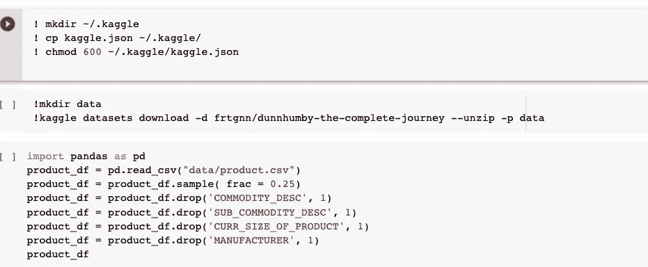*

*使用 Pandas 将三个表加载到 Dataframes 中，还删除了不属于实验的列。*

# *指定结构*

*下一步是确定表的结构和表之间的关系。按照 SDV 元数据[规范](https://sdv.dev/SDV/user_guides/relational/relational_metadata.html)以 JSON 格式捕获该结构。*

*查看数据，我们可以看到 Product 和 Transaction 表通过 PRODUCT_ID 关联，Demographics 和 Transaction 表通过 household_key 链接。其他字段和其他关系的数据类型如这里的[所示](https://colab.research.google.com/drive/1QszDzp7vGSVleQdAGpVCyLUe4UlGrfvN#scrollTo=_nuYOFksZgj8&line=1&uniqifier=1)。*

*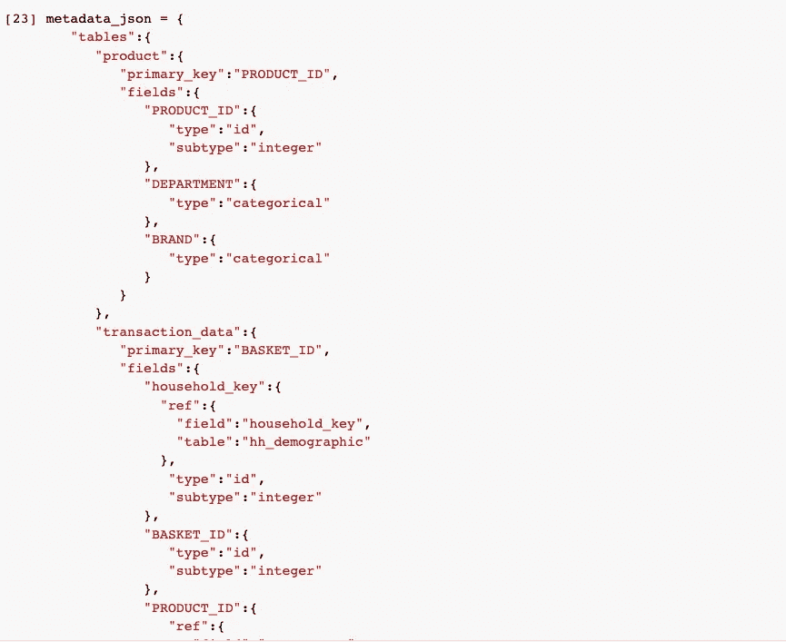*

*元数据库有一个很酷的可视化功能，可以直观地显示表和关系。*

*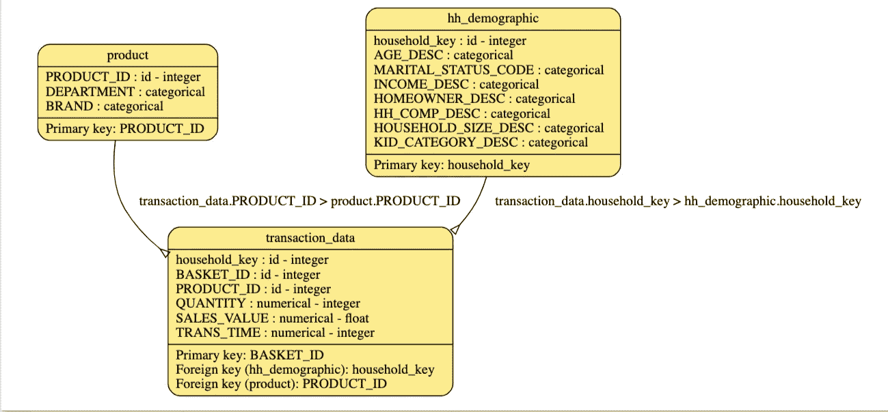*

*既然源数据集和元数据已经准备好，那么就进入下一步，从数据集训练模型。*

# *学习模型*

*对于这一步，我们将利用在 SDV 实现的称为 **HMA1** 的分层建模算法。*

*该算法递归遍历关系数据集中的所有表，并在所有表中应用表格模型，然后根据所有表中的所有字段的相关程度来训练模型。*

*培训 API 使用起来非常简单。*

*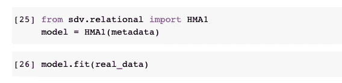*

*既然模型已经定型，我们就可以开始从模型中创建合成数据，这些数据应该在统计上与源数据集紧密一致。*

*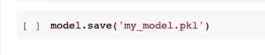*

*可以将模型保存到 pickle 文件中，这是生成合成数据集所需的全部内容。模型可以从 pickle 文件中加载回来，而不需要原始数据集。*

# *合成数据*

*既然 SDV 已经完成了所有的艰苦工作，从我们的源数据集训练一个模型，我们可以简单地从模型中创建一个样本，就像这样容易地生成一个样本数据集。*

*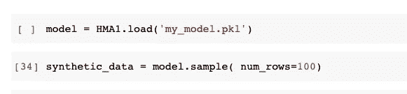*

# *评估生成的数据*

*我们将使用 [TableEvaluator](https://baukebrenninkmeijer.github.io/table-evaluator/) 库将生成的数据与我们开始使用的源数据集进行统计比较，并显示我们生成的假数据有多真实。*

*以下是一些关于比较的见解。*

***产品**表有两个分类列，这两列的分布比较如下所示。*

*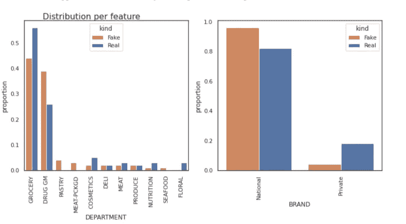*

*交易表有三个数值:销售额、交易时间和数量。虽然原始数据集和合成数据集之间的销售、交易时间列相似，但数量有所不同。*

*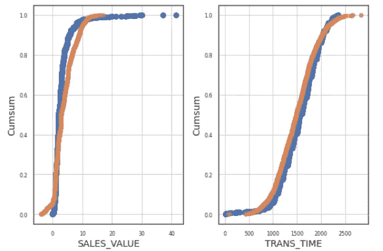**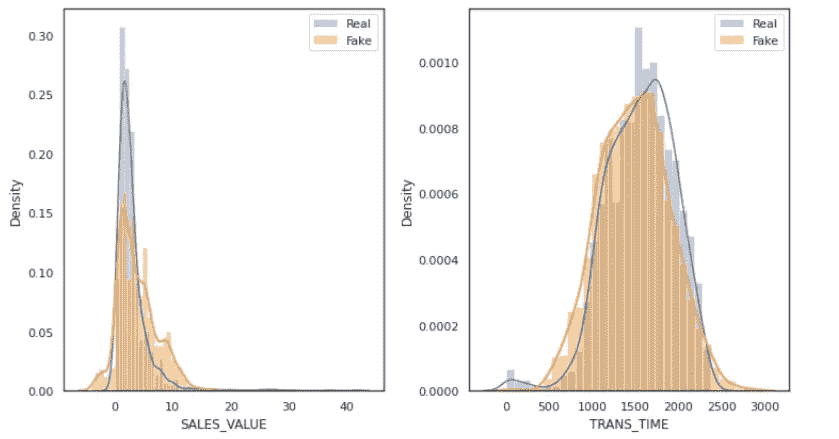**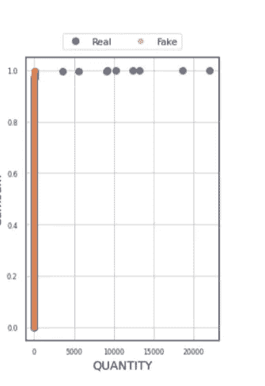*

*在**人口统计**表上生成的合成数据与源表上的分布非常相似。*

*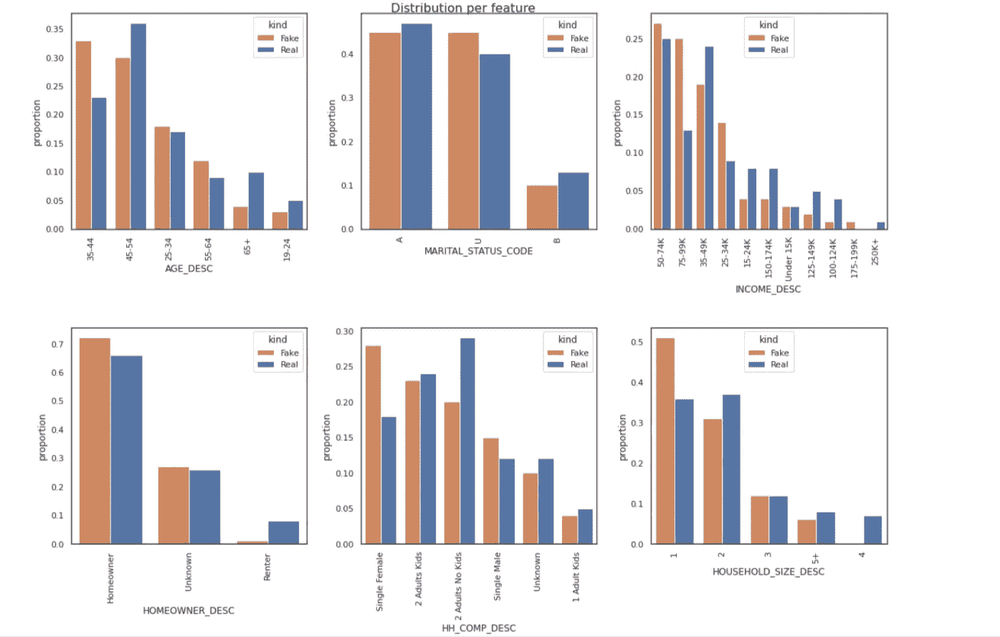*

# *结论*

*随着 GDPR、CCPA 和其他隐私法锁定和保护客户数据，组织如何创新并成为数据驱动型企业，实现以客户为中心的数字化转型？合成数据工具和框架使得生成与实际数据非常相似的具有高度代表性的数据成为可能。*

*SDV 为数据工程师和数据科学家提供了广泛的工具来生成真实的假数据。这些工具仍在发展和改进，但已经有一套很好的工具可以投入使用。*