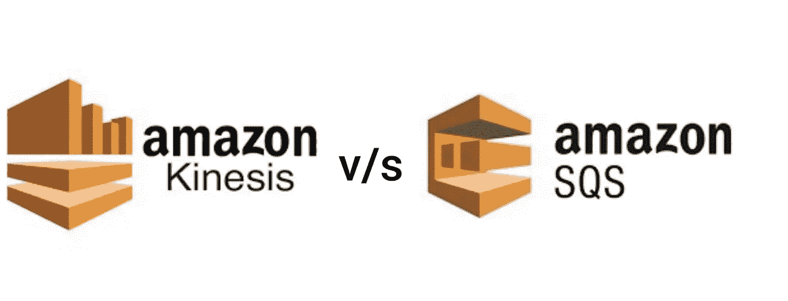

# 系统设计—在 AWS Kinesis 和 AWS SQS 之间选择

> 原文：<https://medium.com/nerd-for-tech/system-design-choosing-between-aws-kinesis-and-aws-sqs-2586c814be8d?source=collection_archive---------0----------------------->

在这篇博文中，我探讨了 AWS Kinesis 与 AWS SQS，展示了每种系统的优缺点，并根据您的系统设计要求选择哪种系统。它强调了数据流和队列之间的区别。

# **为什么 AWS Kinesis**

AWS Kinesis Streams 支持大规模数据摄取和流数据的实时处理。它提供了记录的排序，以及以相同顺序读取和/或重放记录的能力。

*   允许录制的[大小](http://docs.aws.amazon.com/streams/latest/dev/service-sizes-and-limits.html)最大 1 MB
*   在碎片级别而不是消息级别工作
*   没有自动缩放，开发者需要跟踪分片使用情况，并在必要时对 Kinesis 流进行重新分片
*   有限读取 t [hroughput](https://docs.aws.amazon.com/streams/latest/dev/service-sizes-and-limits.html) (每个碎片每秒 5 个事务)
*   流中的碎片数量决定了最大吞吐量
*   一个流可以连接多个消费者，每个消费者可以单独处理每个记录(多亏了分片迭代器)

# **为什么选择 AWS SQS**

AWS 简单队列服务(SQS)提供了一个可靠的、高度可伸缩的无服务器托管队列，用于存储消息和在分布式应用程序组件之间轻松移动数据。

*   允许相对较小的邮件大小，最大为 256 KB
*   每条消息都可以独立处理
*   自动扩展，通过扩展从队列中读取的任务数量来动态增加读取吞吐量
*   提供消息传递语义(例如消息级确认/失败)和消息可见性超时
*   120，000 个[限制](https://docs.aws.amazon.com/AWSSimpleQueueService/latest/SQSDeveloperGuide/sqs-limits.html)用于标准队列的进行中消息数量，20，000 个用于 FIFO 队列

# **AWS Kinesis v/s AWS SQS**

## 消息保留

*   Kinesis —默认情况下存储记录 24 小时，最多可保留流数据 7 天
*   SQS —可以配置从 1 分钟到 14 天的消息保留期，默认为 4 天

## 消息重试

*   Kinesis —没有交付保证，只要数据存在，使用数据的服务就可以重试，消费者不会删除数据，在重新驱动项目的情况下，订购也有保证
*   SQS —至少一次传递保证，继续重新发布未确认的消息，直到消息达到消息保留期规定的最大期限

## 故障处理

*   Kinesis — No [死信队列](https://en.wikipedia.org/wiki/Dead_letter_queue) (DLQ)开箱即用，每个使用流的应用程序都必须自己处理故障
*   SQS —如果消费者未能在可见性超时内处理消息，消息将被发送到已配置的 DLQ，并可在 SQS 再次接收

## 消费者数量

*   Kinesis —支持多消费者功能，相同的数据记录可以由多个消费者同时处理，也可以由同一消费者在不同时间处理
*   SQS —一次仅支持一个消费者，一旦消息被确认，它将从队列中删除

## 记录的排序

*   kine sis——支持碎片内的有序处理，但是不能保证碎片之间的排序
*   SQS——标准 SQS 队列不保证按序处理，但 FIFO 队列支持，但有局限性

## 记录的传送

*   Kinesis 相关记录可以发送到同一个记录处理器
*   SQS —不支持路由

## 其他 AWS 服务支持

*   Kinesis 可以将流记录直接发送到亚马逊 S3、亚马逊红移、亚马逊弹性搜索、Splunk、AWS Lambda 等服务
*   SQS —其他服务可以通过 AWS Lambda 集成

## **样本用例**

*   Kinesis —日志和事件数据收集、实时分析、移动数据捕获、物联网数据馈送
*   SQS——应用集成，分离微服务，将实时用户请求与密集的后台工作分离，批处理消息以供将来处理

> 希望你喜欢这篇文章，它可以帮助你决定在你的系统设计中使用哪种基于队列的 AWS 服务！
> 
> 以下是您可以采取的一些后续步骤:

1.  查看 [AWS 文档](https://aws.amazon.com/kinesis/data-streams/faqs/)获取他们关于何时使用 Kinesis vs SQS 的建议！
2.  给我点掌声！
3.  在 Medium & Twitter 上关注我，获取更多技术博客！