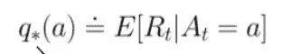
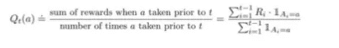
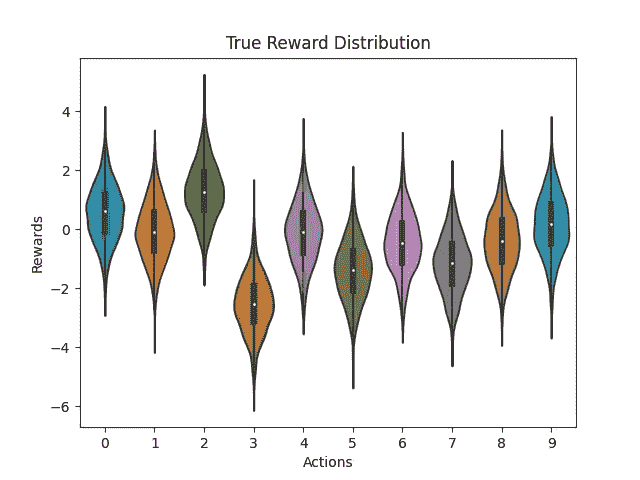
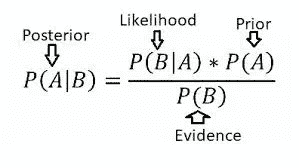
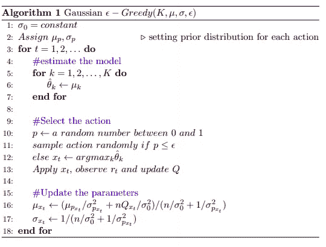
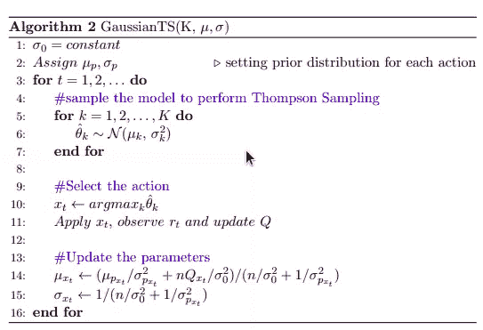
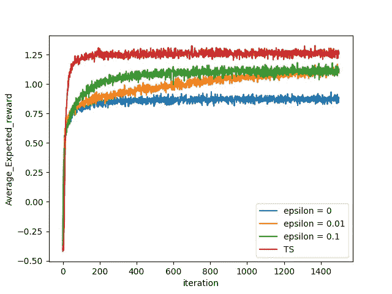
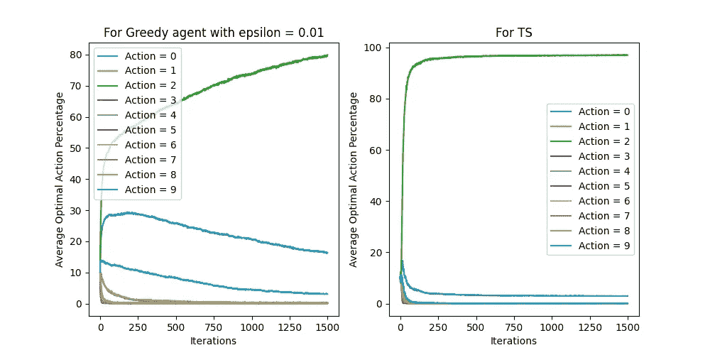

# 破解《K 武装匪徒》中的探索与开发困境

> 原文：<https://medium.com/nerd-for-tech/tackling-exploration-exploitation-dilemma-in-k-armed-bandits-598c0329cf88?source=collection_archive---------25----------------------->

## 简要介绍 Epsilon Greedies 和 Thompson 采样这两种方法，以及在 python 中的实现

来源:[https://lilian Weng . github . io/lil-log/2018/01/23/the-multi-armed-bandit-problem-and-its-solutions . html](https://lilianweng.github.io/lil-log/2018/01/23/the-multi-armed-bandit-problem-and-its-solutions.html)

在现实世界中，我们遇到了许多情况，我们面临着众所周知的**勘探和开发**的权衡。但是这些术语是什么意思呢？

> 开发是从我们已知的事物中获取利益的过程，而探索是获取我们未知的知识。

我将试着用一个例子来解释这些术语，假设你喜欢数学，并且总是优先考虑它的主题。现在在这种情况下，你总是喜欢(利用)数学，因为它在过去为你提供了巨大的回报。但是只选择数学不允许你探索其他学科。所以只是为了实验，你随机选了化学(探索)，发现了一些有趣的话题。因此，你的选择让你知道更多关于其他的事情。但代价是你不能同时学习数学和化学。这就是我们正在讨论的探索-开发的困境。

为了看到这一点，我们考虑强化学习中最简单的设置，即多臂强盗。这就像一个吃角子老虎机，每次你拉手臂，它都会产生一个奖励，描述特定的行动有多有利，并移动到一个终端状态。

在进入实际的方法之前，让我简要地讨论一些在 RL 和土匪的文献中广泛使用的术语。

# 定义

1.  **奖励-** 它可以定义为利益或舒适。
2.  **动作** -在土匪问题的情况下，拉手臂被定义为动作。
3.  **Action-Values** -它定义了代理在状态 **s** 中采取的动作 **a** 的质量。但是对于强盗来说，由于每一个动作都导致一个终结状态，所以它可以被认为是一个单一状态问题，并且只依赖于动作。数学上，

多臂土匪问题的 q 值

如果我们知道每个行动的最优 q 值，这是因祸得福。但实际上，我们对此并不知情，而是根据我们通过连续拉臂收集的经验来估计这些值。一种这样的方法是**样本平均**定义为:

样本平均估计

对于足够大的样本，它接近真正的 Q*(通过中心极限定理)。尽管如此，我们仍然需要平衡探索和开发，以保证每个动作收敛到其最佳值。我们将在下一节讨论两种方法。

# 为什么是这两种方法，而不是其他方法？

在进一步讨论之前，可能会出现一个问题，即有不同的其他方法来解决这一困境，如 Greedies、置信上限、乐观初始值，那么为什么选择这两种。答案是，我试图提供一个下限和上限，因为ε通常是处理这些权衡的起点，而 Thompson 采样最近被称为这方面的最新技术之一。

# 环境设置

为了比较这种解决方案，我模拟了与萨顿和巴尔托书中所述相同的 10 臂测试床，即通过从标准正态分布中采样 Q*,然后用平均值 Q*和方差 1 奖励高斯采样。真实的奖励分配如下所示:

真实报酬分配(最优行动=2)

# Greedies 类

Epsilon Greedies 是一类算法，仅改变参数 Epsilon 来解释探索。如果ε= 0 意味着纯粹的贪婪，任何介于 0 和 1 之间的ε都意味着一些探索。这些算法的主要思想是，不是每次都采取贪婪的行动，而是以概率ε从其他行动中均匀地随机选择一个行动。

# 汤普森取样

Thompson 抽样基于贝叶斯推理的概念，在这种推理中，我们用我们观察到的数据(称为**后验**概率)来更新我们对参数的信念(称为**先验**)。要了解更多关于这些术语的知识，请查看下面的博文。

 [## 最大似然估计、映射和贝叶斯推理

### 通过关注与最大似然法和映射的区别，掌握贝叶斯推理的思想

towardsdatascience.com](https://towardsdatascience.com/mle-map-and-bayesian-inference-3407b2d6d4d9) 

连接先验和后验的贝叶斯规则

现在，在知道后验分布之后，汤普森采样所做的就是从这些后验分布中对动作进行采样。因此，如果一个行为被探索的越少，它被选择的机会就越多。在足够的时间步长之后，即，当每个动作被采样足够多次时，它将分析最终分布以获得最佳动作，并在之后开始利用它。在这样做的时候，它利用了一种完美的方法[共轭先验](https://en.wikipedia.org/wiki/Conjugate_prior)来降低复杂度。我在这里关注核心实现，因此为了了解详细的理论，请访问 [TS](https://web.stanford.edu/~bvr/pubs/TS_Tutorial.pdf) 上的参考资料

# 算法和实现

为了比较 Eps-Greedy 和 TS，我修改了常规 epsilon greedy 的算法，以创建相同的条件集，这样整个焦点就集中在实际的核心部分，即从模型中采样(在 TS 中)到从模型中进行估计(Eps-Greedy 中的模式/平均值)之间的差异。我还在 latex 中自己制作了算法，用于假设(方差= 1)的更真实的高斯采样。

ε贪婪算法

汤普森取样

最后两行显示了利用共轭先验属性的参数更新。这些算法将从代码中清晰可见。

在上面的代码中，我创建了一个类 bandit 来模拟单个 Bandit 的属性，并创建了一个类来跟踪随时间收集的日志。现在让我们来看两种算法的实现。

在上面的代码中，我们使用了前面讨论过的相同的方法。除了 algos 中描述的 _choose_bandit 函数之外，这两种情况下的所有事情都是相同的。

# 结果

我们在 2500 次独立模拟运行中绘制了每种方法 1500 个时间步长的 Excepted_Rewards，并取其平均值。

超过 2500 次独立运行的平均预期回报

从上图可以推断出，在所有的 eps-Greedies 中，eps= 0.01 可以被认为是最好的，因为它在增加，而不是平稳，但即使是这样，它对 Thompson 采样来说也是非常低的。现在，为了进一步研究，我们绘制了 eps = 0.01 和 TS 的所有独立运行的最优操作的平均百分比，以查看 TS 的优越性。

最佳行动百分比的比较

不错！！从上面的图中，我们可以得出结论，即使两种方法都支持行动-2，但 eps = 0.01，即使在后期也很难达到 80%，但 TS 即使在早期也能达到 100 %的最佳行动。这表明 TS 迅速探索了所有的行动，然后利用了最佳的一个。

# 结论

通读这篇文章后，人们心中会有两个问题。首先，从高斯采样的真实回报和作为高斯的先验是好的吗？其次，考虑的方差是固定的。答案是，我使用了高斯 TS 的最小实现，方差是固定的，但这很容易做到，不需要知道任何关于方差的假设。假设高斯为先验并没有害处，因为我们知道大多数自然现象遵循它，并且对于大样本，每个分布都接近高斯(中心极限定理)，因此不缺乏一般性，并且我们可以看到 TS 优于 Greedies。**如果你喜欢我的文章，请随意投票支持这篇文章，你可以在这里找到我的回购协议的完整代码-**[https://github . com/am shra 267/Thompson-Greedy-Comparison-for-multi armed-Bandits](https://github.com/Amshra267/Thompson-Greedy-Comparison-for-MultiArmed-Bandits)

# 参考

1.  萨顿和巴尔托:强化学习
2.  [汤普森取样](https://web.stanford.edu/~bvr/pubs/TS_Tutorial.pdf)