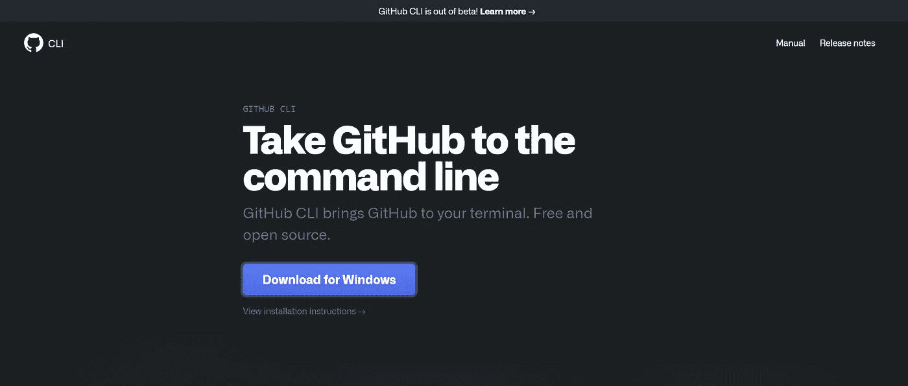
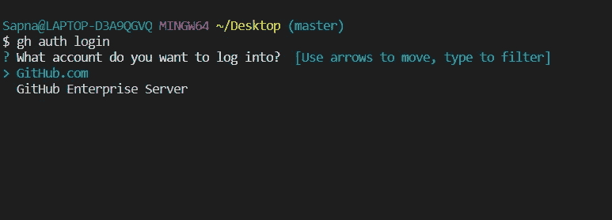
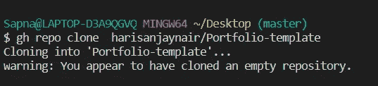
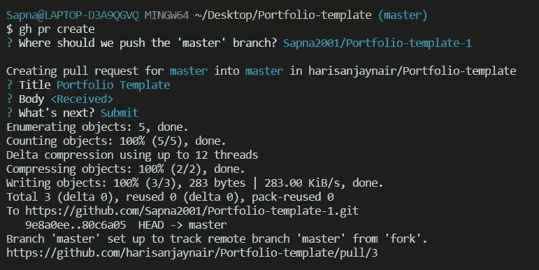

# 将 GitHub 带到命令行

> 原文：<https://medium.com/nerd-for-tech/take-github-to-the-command-line-a42ce97e467c?source=collection_archive---------1----------------------->


**新的 GitHub CLI Beta 允许您直接从终端**访问 GitHub

在本地使用 Git，每次退出终端都要在 GitHub web app 上查看状态，真的很麻烦。为了解决这个问题，GitHub 推出了一个命令行工具- **GitHub CLI** ，它将允许用户从他们的终端运行整个 GitHub 工作流。

我们可以使用***【GH】***命令行工具与 GitHub 上的托管项目进行交互，并执行各种其他操作，如查看问题列表、制作 PRs 等。

# 装置



GitHub CLI beta 版适用于 macOS、Windows 和 Linux。

[用于 windows](https://cli.github.com/)

[适用于 Linux 和 macOS](https://github.com/cli/cli#installation)

# 证明



运行此命令来验证您的 GitHub 帐户

```
$ gh auth login
```

选择适当的选项并开始。

# 克隆存储库



使用克隆您要使用的存储库

```
$ gh repo clone owner/repo
```

# 查看问题列表


要查看存储库使用的问题列表，

```
$ gh issue list
```

# 创建公关



添加新功能或纠正错误后，您可以使用此命令创建 PR

```
$ gh pr create
```

# PR 的其他命令

*   去看看公关

```
$ gh pr checkout #PRno
```

*   要查看差异

```
$ gh pr diff
```

*   回顾

```
# approve the pull request of the current branch
$ gh pr review --approve

# leave a review comment for the current branch
$ gh pr review --comment -b "interesting"

# add a review for a specific pull request
$ gh pr review 123
```

*   在请购单被批准后，检查所有测试是否通过

```
$ gh pr checks
```

*   要合并 PR

```
$ gh pr merge
```

> *我这边就这样。*我已经在这里介绍了一些基本的命令。您也可以参考[手册](https://cli.github.com/manual/)获取更多命令。我希望你喜欢阅读这篇文章😊。

> *如果你想让* ***与我*** *相连，请点击这些链接*
> 
> *Github-*[https://github.com/Sapna2001](https://github.com/Sapna2001)
> 
> *LinkedIn-*[*https://www.linkedin.com/in/sapna2001/*](https://www.linkedin.com/in/sapna2001/)
> 
> *网站-*[*https://sapna2001.github.io/Portfolio/*](https://sapna2001.github.io/Portfolio/)
> 
> 【Quora-】[*https://www.quora.com/profile/Sapna-191*](https://www.quora.com/profile/Sapna-191)

**如果你有任何建议，欢迎通过**[**LinkedIn**](https://www.linkedin.com/in/sapna2001/)**&联系我，评论区也是你的。**

如果你喜欢这个故事，点击鼓掌按钮，因为它激励我写更多更好的东西。

***感谢阅读！！！！***