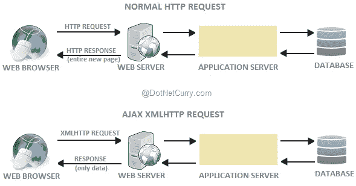
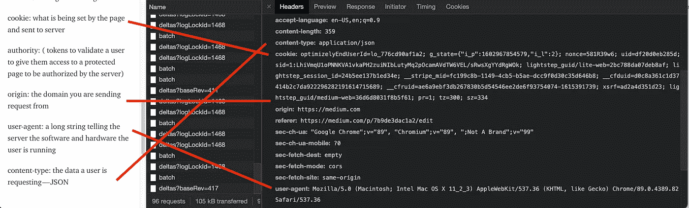
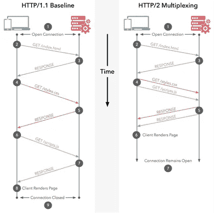

# 成形:// HTTP 请求和响应

> 原文：<https://medium.com/nerd-for-tech/take-shape-http-requests-and-responses-7b9de3dac1a2?source=collection_archive---------16----------------------->

我刚刚从训练营毕业，参加了 Ruby on Rails、Javascript 和 React 的速成班。虽然这些都是非常有价值和强大的工具，但“破颈消防水管”与 bootcamp 的“面对面”步伐(充其量)忽略了许多结构化编码概念。这是为了复习 HTTP 请求和响应这个非常重要的主题。HTTP 代表超文本传输协议，根据定义，HTTP 只是一个协议。协议是定义计算机内部或计算机之间如何交换数据的规则系统。为了使通信有效，设备需要就交换数据的格式达成一致。通过 HTTP 请求进行通信的最常见的设备组合是客户端设备和服务器设备。最常见的通信形式是网页加载、获取请求、表单提交和 AJAX 调用。AJAX 代表(异步 Javascript 和 XML(可扩展标记语言))，简而言之，它是一种封装通过 HTTP 请求发送的数据的特定方式。

如今，大多数常见的 AJAX 请求都是使用 JSON 而不是 XML 发送的。JSON(JavaScript Object Notation)是一种更轻量级的数据封装形式，更容易建模和映射到领域对象。JSON 成为在 HTTP 请求中传输数据的流行形式的另一个原因是因为 JSON 本身是独立于语言的。JSON 的解析可以在任何语言中实现，而 XML 需要 SAX 或 DOM 解析器，这对代码库和开发人员来说都是沉重的负担。XML 是一种标记语言，因此具有比静态 JSON 对象更多的功能，但是数据传输通常不需要额外的功能，所以 JSON 是最重要的。

无论如何…回到 HTTP 请求和响应的形式，我们真正开始看到互联网的形成。所有 HTTP 请求都由一个

和一个组成。两者都包含特定的数据集，并在请求或响应周期中执行特定的功能。让我们首先来看一个 HTTP 请求。

**HTTP 请求<头>** 包含了一个 Cookie:页面设置了什么并发送给服务器。Authority:验证用户的令牌，以授予他们访问服务器授权的受保护页面的权限。Origin:发送请求的域。User-Agent:一个长字符串，告诉服务器用户正在运行的软件和硬件。(想造一个机器人报废？密切注意这一点)。内容类型:用户请求的数据(JSON 或 XML)。

元:)

**HTTP Request < body >** 可以包含许多不同的数据，但其中最常见的是用户登录他们最喜欢的网站时发出的表单域信息。

一个 **HTTP 响应<报头>** 将包含关于发送响应的服务器的信息(Apache 或 EngineX)。出于安全原因，这些信息通常是隐藏的。响应头还包括 set set cookie、date 和一个内容类型，如 HTML、CSS、jpg 或 png。

一个 **HTTP 响应<主体>** 将包括初始的 HTML 文档，该文档将在初始化时构建给定的网页，以及将来的请求，这些请求将是用户从服务器请求的任何数据(所有的个人资料图片)。

HTTP 头包含许多不同的方法，但我们最熟悉的是 GET、POST、PUT/PATCH、DELETE。这完成了我们 CRUD 功能。

请求和响应经常发生，使用许多不同的方法，包含许多不同类型的数据。所有流量都记录在 HTTP 状态代码中。可怕的 404 代码是最熟悉的一个，因为它让用户知道他们正在寻找的端点或文件没有找到。最常见的代码是 200，这是一个成功的请求和响应状态。看他们带着狗[在这里](https://httpstatusdogs.com/)或者猫[在这里](https://http.cat/)。

虽然 HTTP 是在 1989 年左右开发的，并且实际上与万维网一样古老，但它在 1997 年被正式标准化，并且只在 2015 年出现过一次 HTTP 2 的更新。HTTP 2 是 HTTP 的一个更快更安全的版本。所有主流浏览器都支持它，但是在 W3TechSchools 进行的一项调查中显示，截至 2021 年 3 月，1000 万个顶级网站中只有 50%支持和实现 HTTP 2。HTTP 2 中的更新通过使用请求和响应压缩、优先级和多路复用，提高了效率/速度，减少了延迟。

结合脚本和 CSS 调用，减少加载时间和服务器请求

除了 HTTP 2 的发布，全球范围内还有一股巨大的推动力量，要求对所有请求和响应实现 HTTPS 并使之标准化。HTTPS 过去只负责电子商务和授权等任务，但随着 cookie 缓存和黑客活动的增加，隐私已经成为科技界的一个主要焦点。推动 HTTPS 标准化认识到这样一个事实，即任何通过万维网的数据传输本质上都是不安全的，除非通过加密来保护数据传输的通道。加密这些通道的过程涉及传输层安全性(TLS ),以前称为安全套接字层(SSL)。

加密和 HTTPS 的复杂性令人着迷，但需要另一篇博客文章，但你可以在这里阅读更多和[这里](https://en.wikipedia.org/wiki/Transport_Layer_Security#TLS_1.2)。希望这能让您更好地理解 HTTP 请求和响应周期。

资源:

【https://developer.mozilla.org/en-US/docs/Web/HTTP/Overview 

 [## 从 HTTP 转换到 HTTPS 的完全指南——棒极了杂志

### 如今，HTTPS 是每个网站**的必争之地:用户在提供个人信息时都在寻找挂锁；铬合金…

www.smashingmagazine.com](https://www.smashingmagazine.com/2017/06/guide-switching-http-https/) 

[https://hackr . io/blog/JSON-vs-XML #:~:text = JSON % 20 is % 20 said % 20 to % 20 be，完全% 20 agree % 20 with % 20 this % 20 though](https://hackr.io/blog/json-vs-xml#:~:text=JSON%20is%20said%20to%20be,completely%20agree%20with%20this%20though)！

[https://en . Wikipedia . org/wiki/HTTP/2 #:~:text = 5%20 支持% 20HTTP % 2F2 % 2C %已发布，9% 20 于% 20 二月%2020%2C%202018](https://en.wikipedia.org/wiki/HTTP/2#:~:text=5%20supports%20HTTP%2F2%2C%20released,9%20on%20February%2020%2C%202018) 。

[https://en . Wikipedia . org/wiki/HTTP/2 #:~:text = 5%20 支持% 20HTTP % 2F2 % 2C %已发布，9% 20 于% 20 二月%2020%2C%202018](https://en.wikipedia.org/wiki/HTTP/2#:~:text=5%20supports%20HTTP%2F2%2C%20released,9%20on%20February%2020%2C%202018) 。