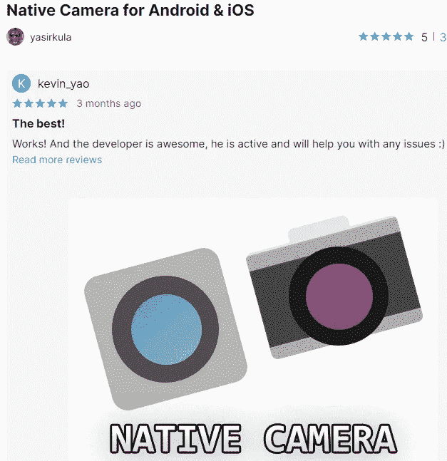
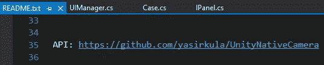
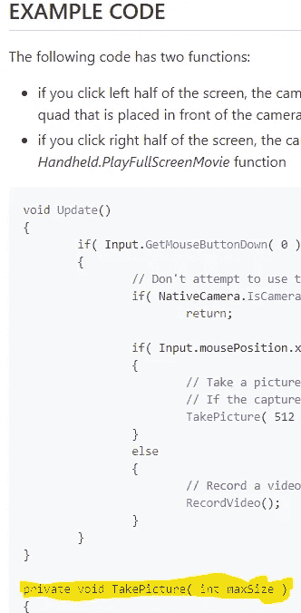
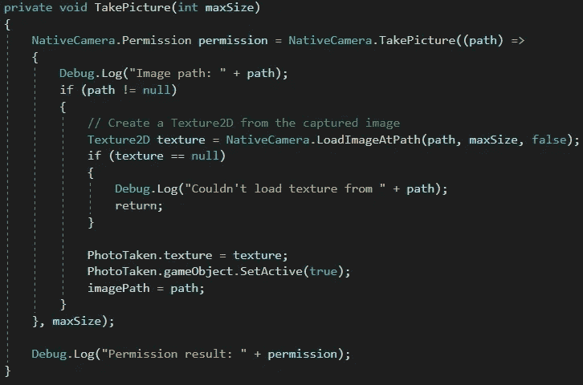

# 在 Unity 拍照

> 原文：<https://medium.com/nerd-for-tech/taking-a-photo-in-unity-e6e3f5328da6?source=collection_archive---------7----------------------->

**目标:**允许用户在他们的设备上拍照，以便在我们的程序中使用。

关于统一的一个伟大的事情是我们不必“重新发明轮子”我们可以在我们的项目中导入和使用许多很棒的——甚至免费的——资产。

*安卓& iOS* 的原生相机 *yasirkula* 这些伟大的免费资产之一。只需从*资产库*下载它，并将其导入到您的项目中。在 *README* 文件中，您会找到该项目的 Github 的链接。

该链接将引导您找到一些示例代码片段。我们感兴趣的是*拍照*方法。

我们将把它复制并粘贴到我们自己的脚本中，并根据我们的需要进行修改。代码将检查以确保我们的应用程序有权访问用户的摄像头。如果我们这样做了，我们将图片存储为一个 *Texture2D* 。我们将该纹理分配给我们的*摄影*对象(属于 *RawImage* 类型),并将其设置为活动以显示图片。我们还将存储图像所在位置的路径——我们将在明天的文章中用到它！

