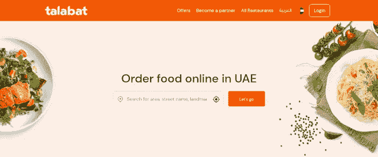
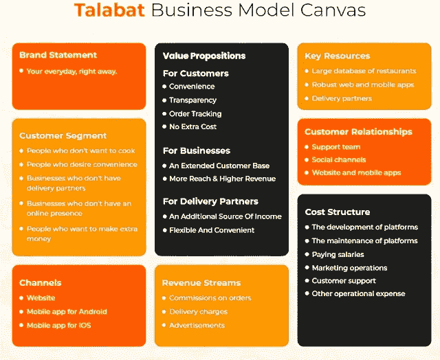

# 塔拉巴特食品配送应用程序—商业模式、功能和成本

> 原文：<https://medium.com/nerd-for-tech/talabat-food-delivery-app-business-model-features-cost-29ee417a9797?source=collection_archive---------1----------------------->

由于 Talabat 的出现，中东的在线食品交付市场发生了重大变化。这导致该解决方案的市场价值成倍增长。因此，投资食品交付应用程序开发并开发像 Talabat 这样的食品交付应用程序是一个很好的战略举措。

这是我们将在本文中详细解释的内容。当你阅读的时候，你会了解这个应用程序和它的本质，以及它受欢迎的原因。同时，你将深入了解其[食品配送业务模式](https://www.fooddeliveryclone.com/blog/food-delivery-business-models/)。这将为您简化食品交付应用程序的开发过程。

## 关于塔拉巴特

于 2012 年作为食品交付应用程序推出，并在沙特阿拉伯、阿曼、巴林、阿联酋、卡塔尔、约旦、埃及和塔拉巴特提供服务，简化了中东的食品交付方式。

通过与各种餐馆的合作，它帮助顾客快速获得送餐服务。这得益于其简单的操作。

顾客只需简单地添加他们的位置信息，就可以得到附近餐馆的列表。此后，他们可以选择自己喜欢的餐馆，同时付款订餐。一旦他们这样做了，餐馆就会收到订单并接受订单，让司机上车来取货。司机现在到达并选择订单以完成交货。

简而言之，由于其简单的功能，它已经取得了突出的性质。这帮助它赢得了一个有利可图的未来。

## 塔拉巴特应用商业模式

查看下图，观察 Talabat 应用程序的商业模式，并了解其简化送餐的不同媒介。

图片来源——apptunix.com

这张图片展示了 Talabat 应用程序如何为生活在阿联酋的客户简化食品配送服务。下面获取其详细了解。

*   遵循按需超本地交付模式，它利用技术实现无缝送餐服务。
*   这种运作是在双重伙伴关系的基础上进行的。因此，顾客和餐厅都从平台中获得了利益。这基本上是通过餐馆合作伙伴关系和客户登记。

这种简单的模式便于顾客和餐厅连接，从而实现无缝送餐服务。

如果您想详细了解 Talabat 开发步骤，请阅读本文:

 [## 构建类似 Talabat 的送餐应用程序，改变餐厅运营

### Ankit Patel 年 9 月 23 日 6 分钟阅读当饥饿渴望发生时，食品配送应用程序因祸得福…

www.fooddeliveryclone.com](https://www.fooddeliveryclone.com/blog/boost-profits-for-your-restaurant-setup-with-talabat-clone-app/) 

## 特征

该应用拥有一些独特的成分，因此客户、餐厅和送货司机之间的联系保持顺畅。下面来看看吧。

## 客户应用程序

*   用于支付的 QR 扫描仪
*   高级搜索过滤器增强了用餐搜索过程
*   多种支付方式
*   餐桌预订
*   定制膳食
*   GEM 查找不同餐厅提供的交易、优惠和折扣

## 驱动程序

*   发票生成
*   收入历史
*   更新交货状态
*   设置可用性状态
*   应用内通话/聊天
*   接受/拒绝送餐提货请求

## 餐厅平台

*   餐厅/顾客/送货司机档案管理
*   盈余管理
*   收入管理
*   报告和分析
*   评级和审查管理
*   指派送货司机从餐厅取餐

## 开发类似 Talabat 的食品交付克隆应用程序的成本

当你开发一个像 Talabat 这样的食品交付克隆应用程序时，你必须承担的估计成本将在 10，000 美元到 20，000 美元之间。然而，基于不相关特征的添加、非用户友好设计的使用等。成本会上升。

因此，保持功能相关性，实现用户友好的设计，最重要的是外包食品交付应用程序开发服务，同时利用克隆应用程序。这将使你能够控制你的财务状况。

## 包扎

Talabat 通过改变生活在阿联酋的客户接收食物的方式，在该国的在线食品交付业务中掀起了一场革命。这鼓励了初创公司关注开发类似于这个企业集团的解决方案。如果你计划开展这项活动，今天就与一家食品交付应用开发公司联系，开发一款类似 Talabat 的食品交付克隆应用。