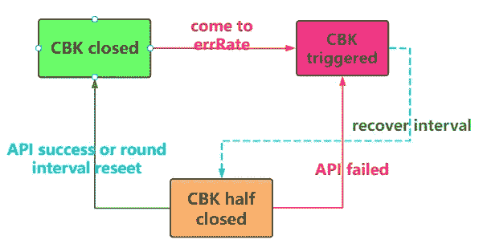
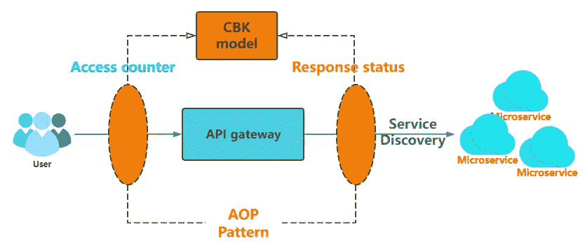
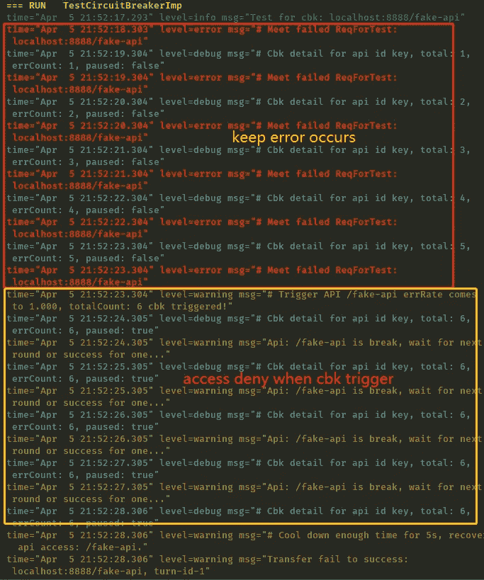

# 谈谈 Go:断路器的一种简单实现

> 原文：<https://medium.com/nerd-for-tech/talk-about-go-a-simple-implement-of-circuit-breaker-486c7bb58cda?source=collection_archive---------1----------------------->


断路器

一个简单的断路器实现，当你的 API(或接口)在一段时间内达到**高错误率时，触发快速失效并快速返回。**

# 序

断路器可以说是微服务通话中出现的高频词。它最早来源于老宅电路的保险丝(电源过载-跳闸)，后来被股市行业用来形容出现异常情况，暂时暂停交易，开始保护市场现场。

在微服务环节中，断路器在短时间内引用 API 上的**多次异常/超时**(**过度错误率**)

**动态调整**
保险丝的核心功能是“动态调整”，也就是说，在一定的时间窗口内，当 API 上的错误数，或者比值达到一个危险值时，保险丝必须**持有**请求，快速返回(失败)，并通知上游 API **n *eed 冷静下来。***

关于**动态调整，**主要有以下参数:

*   **阈值**:包括两个指标:统计的最小次数和出错的比例。最小数量的统计用于捕获高频请求，即请求量必须至少大于，断路器才开始关心差错率。否则，其他低频 API 上的少量故障会触发断路器。
*   **回合间隔:**熔断调度的时间窗口，可以类比为限流算法中的单位时间，即熔断周期内 API 的总次数和错误计数复位的时间。

**恢复间隔**

断路器触发后，多长时间的空闲期给予 API 的重试权限，并尝试纠正它，恢复到正常状态。

**round interval** 和 **recover interval** 的主要区别在于，熔丝复位计数后，API 必须再次达到错误率才能触发熔丝，而 recover interval 只是允许当前熔断的 API 请求，错误率还是很高的。如果在请求仍未恢复的情况下再次尝试，请保持熔断状态，并等待下一个恢复周期或复位周期。所以**恢复期** < **回合间隔**。

关于状态转换，这个示例图更清楚:



CBK 地位

**AOP 模式**
熟悉了 fuse 的基本用途，我们来分析一下它的组件在项目中的位置。相信你会明白切片导向的概念。许多常见的组件，如流量限制和断路器保护，都是面向切片的模块，通常用于收集和报告流量状况，并根据特定的规则保护下游。最常见的是将它们放在网关层。

**如下图所示:**



服务中控件的位置

# 代码工具

让我们看看代码实现部分。

# 接口定义

基于断路器的特性，先定义断路器接口`CircuitBraker`，这里的 key 是指断路器采集的 API，可以是链路上的请求标识符，用来区分不同的请求。

```
type CircuitBreaker interface {
    // check if your api(key) allow to access
    CanAccess(key string) bool
    // mark failed api result
    Failed(key string)
    // mark succeed api result
    Succeed(key string)
}
```

# 接口工具

基于以上商定的几个功能特征，创建`CircuitBreakerImp`作为实现主体

```
type CircuitBreakerImp struct {
    lock            sync.RWMutex
    apiMap          map[string]*apiSnapShop 
    minCheck        int64                   
    cbkErrRate      float64                 
    recoverInterval time.Duration           
    roundInterval   time.Duration           
}
```

断路器实现体的`apiMap`主要存储采集 API 的列表，用来表示当前阶段采集的每个 API 的整体快照。

```
type apiSnapShop struct {
    isPaused   bool 
    errCount   int64
    totalCount int64 accessLast int64 // The last access time of the api
    roundLast  int64 // fuse cycle time
}
```

**断路器状态**，基于每个失败的请求，请求快照会保存在当前`CircuitBreakerImp`实例的 apiMap 中，所以`IsBreak()`接口的实现相对简单，直接返回其状态即可:

```
func (c *CircuitBreakerImp) IsBreak(key string) bool {
    c.lock.RLock()
    defer c.lock.RUnlock() // Find out whether the current key (API) has reached a fuse
    if api, ok := c.apiMap[key]; ok {
        return api.isPaused
    }
    return false
}
```

**访问记录，**网关每收到一次请求，都会向请求发起地和请求返回地的断路器上报接口访问次数和返回是否成功的信息，如上图 AOP 图所示，每次请求 API 时都用`accessed()`函数上报。
此外，如前所述，断路器有一个**复位周期**，即该接口再接入多长时间后，其快照计数将被复位。因此，在每个`access`处，需要额外的判断。用于重置 API 计数。

```
// accessed record
func (c *CircuitBreakerImp) accessed(api *apiSnapShop) {
    /*
        whether now it is older than the cycle time?
        - yes: reset counter
        - no: update counter
    */
    now := time.Now().UnixNano()
    if util.Abs64(now-api.roundLast) > int64(c.roundInterval) {
        if api.roundLast != 0 {            
            log.Warnf("# Trigger circuit breaker windows，reset API counter!")
        }
        api.errCount = 0
        api.totalCount = 0
        api.roundLast = now
    }
    api.totalCount++
    api.accessLast = now
}
```

**报告成功，**网关收到成功响应码后，记录成功。还有一个细节就是为什么上面的`accessed()`函数不需要添加互斥体，实际上是需要的，但是在`accessed()`函数中是在调用的上层，也就是在后续的`Successd()`和`Failed()`函数体中添加的。我们先来看`Successd()`的实现，**如果断路器中记录了当前 api(已经失败)，那么成功后关闭断路器并给出请求**，即使 api 再次失败，也会基于请求错误率重新分配断路器。

```
/*
    Succeed record
    Only collect which api in global map,
    check whether is's paused:
    - yes, cancel the paused breaker state.
*/
func (c *CircuitBreakerImp) Succeed(key string) {
    c.lock.Lock()
    c.lock.Unlock() if api, ok := c.apiMap[key]; ok {
        c.accessed(api)
        if api.isPaused {
            log.Warnf("# Trigger API: %v access succeed.", key)
            api.isPaused = false
        }
    }
}
```

**上报访问失败**，统计失败的逻辑比较简单。对于首次失败的接口，将其添加到运行状况检查图中。对于已经记录的接口，要判断错误率，及时更新。
另外，触发断路器的前提是请求量必须达到一定的阈值。

```
/*
    Failed record
    whether exists in api map,
        - yes:
            - record access and error count
            - the percentage of failures reaches the threshold? yes, mark as paused
        - no:
            update in global map for access and error count
*/
func (c *CircuitBreakerImp) Failed(key string) {
    c.lock.Lock()
    defer c.lock.Unlock() if api, ok := c.apiMap[key]; ok {
        c.accessed(api)
        api.errCount++ errRate := float64(api.errCount) / float64(api.totalCount)
        // access count reaches the threshold && failures rate above the fuse limit
        if api.totalCount > c.minCheck && errRate > c.cbkErrRate {
            log.Warnf("# Trigger CBK！: %v, total: %v, "+
                "errRate: %.3f.", key, api.totalCount, errRate)
            api.isPaused = true
        }
    } else {
        api := &apiSnapShop{}
        c.accessed(api)
        api.errCount++
        c.apiMap[key] = api
    }
}
```

**访问权限查询**，基于上面实现的功能断路器的核心功能，需要向网关层提供一个断路器状态来获取当前接口。
以下是为呼叫者提供的**访问查询**。

这里有一个问题，上面不是已经实现了`IsBreak()`函数吗，我们为什么还需要`CanAccess()`函数？
嗯，因为`IsBreak()`返回的只是接口的熔断状态，但是不要忘了在熔断阶段有一个“半关状态”，即熔断时间过了恢复期(冷却期)，那么就可以释放访问权限，所以这部分逻辑在`CanAccess()`中处理，我们来看看代码。
其中，输入键表示网关层要访问的接口的标识，如`/get-hello`，函数返回值表示接口的可访问状态。

> 在熔断周期内，如果已经过了恢复期(冷却期)，可以释放访问，或者调用`Successd()`熔断状态暂时恢复，否则熔断状态会保持，接口会被限制，fast 失效的核心代码在这里。

```
func (c *CircuitBreakerImp) CanAccess(key string) bool {
    /*
        return the api's status of isPaused
        - not paused, return true
        - paused, return whether current time oldder then recovery period
    */
    c.lock.RLock()
    defer c.lock.RUnlock()
    log.Debugf("# Cbk check accessable for api id-%v key", reqType) if api, ok := c.apiMap[key]; ok {
        log.Debugf("# Cbk detail for api id-%v key, total: %v, "+
            "errCount: %v, paused: %v", reqType, api.totalCount,
            api.errCount, api.isPaused)

        if api.isPaused {            
            latency := util.Abs64(time.Now().UnixNano() - api.accessLast)
            if latency < int64(c.recoverInterval) {
                return false
            }
            log.Warnf("# Trigger: The CBK has passed the recovery period: %v, key: %v!", c.recoverInterval, key)
        }
    }    
    return true
}
```

# 单元测试

基于上面的实现，接下来编写测试代码来覆盖案例，演示并保持这两个过程在循环滚动:

*   **失败- >保持失败- >保险丝打开- >冷却时间过去**
*   **进入恢复期- >继续访问**

# 模拟 API 访问

```
const API_PREFIX = "/fake-api"
var (
    HasCbk = false
)func StartJob(cbk *CircuitBreakerImp) {
    for {
        // 1 failure per second, parameter 0 means failed, 1 means success
        ReqForTest(cbk, 0)
        time.Sleep(time.Second * 1)
    }
}// Build request scheduling, fuse to restore it and let it succeed 1 time
func ReqForTest(cbk *CircuitBreakerImp, req int) {
    // mock failed case
    mockAPI := API_PREFIX //+ strconv.Itoa(req)
    //log.Infof("Ready to reqForTest: %s, req-id-%v", HOST_PREFIX+mockAPI, req) if !cbk.CanAccess(mockAPI, req) {
        log.Warnf("Api: %v is break, req-id-%v, wait for next round or success for one...", mockAPI, req)
        HasCbk = true
        return
    } else {
        log.Infof("Request can access: %s, req-id-%v", HOST_PREFIX+mockAPI, req)
        // After the recovery period, after the circuit breaker is recovered, skip the error and let it succeed
        if HasCbk && req == 0 {
            HasCbk = false
            req = 1
            log.Warnf("Transfer fail to success: %s, req-id-%v", HOST_PREFIX+mockAPI, req)
        }
    } if req == 0 {
        log.Errorf("# Meet failed ReqForTest: %s", HOST_PREFIX+mockAPI)
        cbk.Failed(mockAPI)
    } else {
        log.Infof("# Meet success ReqForTest: %s", HOST_PREFIX+mockAPI)
        cbk.Succeed(mockAPI)
    }
}
```

# 初始化保险丝

初始化断路器并分配相关参数

```
cbk := &CircuitBreakerImp{}
cbk.apiMap = make(map[string]*apiSnapShop)
// 15s per round to reset the err rate
cbk.roundInterval = util.ToDuration(15 * time.Second)
// when breaker is triggered, recover for next try
cbk.recoverInterval = util.ToDuration(5 * time.Second)
// consider the api at least request for 5 time durning the round interval
cbk.minCheck = 5
// when error rate comes to 50%, circuit breaker triggered
cbk.cbkErrRate = 0.5
```

# 输出说明



正如我们所料，尽管界面上前 5 个请求的失败率为 100%，但请求量并未增加，因此断路器不会被触发，直到满足持续熔断条件，断路器才会被触发。

***触发的断路器持续 5 秒*** 后，进入空闲期，API 变为可访问，界面再次被访问。如果错误率仍然满足，熔丝状态将继续恢复。

***复位周期后，***API 计数复位，回到程序开始的状态，接口恢复**连续可访问**，直到达到错误率，保险丝打开。

# 摘要

至此，一个简单的断路器实现已经完成。刚开始的时候，很多概念都很容易绕过。后来结合场景模拟和代码调试，以及开头的状态转换画面，就很好理解了。尽管许多现成的组件都是现成的，但是只要你用心去想，它们的内部实现并不是那么深不可测。

# 项目链接

[https://github.com/pixeldin/cbk-s1mpl3](https://github.com/pixeldin/cbk-s1mpl3)

# 参考

**Circuit Breaker Pattern**
[https://docs.microsoft.com/en-us/previous-versions/msp-n-p/dn589784(v=pandp.10)](https://docs.microsoft.com/en-us/previous-versions/msp-n-p/dn589784(v=pandp.10))
**Sony’s implement of gobreaker**
[https://github.com/sony/gobreaker](https://github.com/sony/gobreaker)
**微服务架构中的熔断器设计与实现**
[https://mp.weixin.qq.com/s/DGRnUhyv6SS_E36ZQKGpPA](https://mp.weixin.qq.com/s/DGRnUhyv6SS_E36ZQKGpPA)