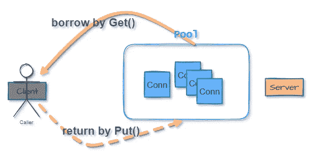
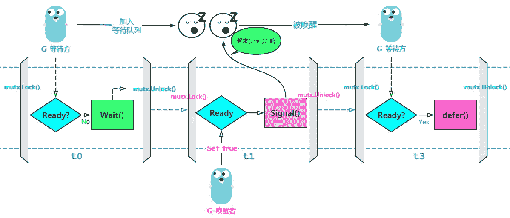

# 谈论 Go:网络编程— TCP 连接管理

> 原文：<https://medium.com/nerd-for-tech/talk-about-go-network-programming-tcp-connection-management-f7630a526e17?source=collection_archive---------0----------------------->

在上一篇文章中，我们谈到了如何在 Go、中[发起 TCP 连接，并列举了一个全双工演示。今天，我们将进一步讨论连接池管理。](/@pixelpig/talk-about-go-network-programming-tcp-communication-e579fe789626)


照片由[乔丹·哈里森](https://unsplash.com/@jordanharrison?utm_source=medium&utm_medium=referral)在 [Unsplash](https://unsplash.com?utm_source=medium&utm_medium=referral) 上拍摄

# 序

如前一节所述，计算机连接的每次 tcp 建立都需要三次握手。为了避免频繁的创建和销毁，保持连接的活性，引入了 keepalive api。但是，keepalive 仅在空闲时告知 tcp 链接。对于检测(不同于 HTTP)，如果我们想真正重用连接，可以使用连接池，如下例所示。



# 特征

一个**连接池**应该有什么特征？

1.  消费者可以从池中获得连接
2.  连接用完时可以返回
3.  连接数量有一个上限，以避免频繁创建和低连接重用率
4.  修复不正常的连接(关闭连接)并将活动连接的数量减一

# 边缘情况

除了满足连接池的常见操作，我们还需要考虑如果连接数达到上限，并且没有空闲连接时会怎样。在这里，我们可以使用 Go 自带的原生`sync`包`Mutex`。 **Yield** 函数，类似于 **Java** 的`yield()`方法，释放当前互斥体，等待其他连接返回触发条件和 **wake** 。

# 逐步地

让我们用一个例子来实现等待和唤醒。这里我们主要熟悉`wait()`和`Signal()`功能的用法。

当`wait()`执行时，它做两件事:

1.  释放当前绑定的互斥体。源代码执行`c.L.Unlock()`，所以不会阻塞长期占用的资源，会释放给其他协程唤醒。
2.  将当前函数所在的 goroutine 添加到等待唤醒的队列中

`Signal()`怎么样？有两个触发条件来唤醒一个等待的协程:

1.  同一个互斥 cond 实例执行`Signal()`函数
2.  在`wait()`功能被破坏之前等待的`for{}`条件

**代码示例**
这里我们使用两个协程，id 为的协程先执行，在条件不允许时释放互斥体，等待唤醒，在函数`ForWhileSignal()`中实现。

另一方面，id as 将唤醒等待方，这在`Condition()`函数中实现

## 主要功能

## 输出示例:

```
2021/05/15 23:25:54 G-waiting wait for notify......
2021/05/15 23:25:54 G-notify do something...
2021/05/15 23:25:57 G-notify Rotary switch to wake up waiting side...
2021/05/15 23:25:57 G-notify defer()
2021/05/15 23:25:57 G-waiting notify!
2021/05/15 23:25:57 G-waiting defer()
```

## 时间图

完整的流程图如下，wait()会将当前的协程添加到等待队列中，等待同一个 cond 实例持有者醒来。



# 弄脏我们的手

根据上面的原生 API，连接池的实现可以通过使用唤醒机制来启动。

## 规定

## 创建连接

## 建立联系

获取连接本质上是对空闲列表的分支判断，其中连接池共享成员 mtx 的`wait()`功能是重点。
结合前面的例子，当++连接池没有可用的连接数且连接数上限已满时，即 for 条件不成立时，程序会唤醒当前的函数栈。

这可以简单地理解为唤醒其他协程所需的前提:

1.  cond 实例`wait()`前面的 for 循环条件，即连接池空闲数大于 0 的条件，或者连接数小于上限的条件被打破。
2.  返回连接时，即`put()`函数的 cond 实例显示`Signal()`被调用。

**实施细节:**

## 返回连接

返回连接需要注意确定连接是否正常。如果不正常，连接池不能返回，活动连接数更新。

## 例子

让我们创建一个连接池，它初始化 5 个连接，并允许 10 个 goroutines 同时与连接交互。

可以看到程序输出符合预期，因为连接池大小只有 5，所以 10 个并发连接有很大概率需要 5 个连接排队，所以有 5 个协程在排队等待上面的输出(阻塞)。

以上是一个连接池的简单实现。有兴趣的话，**可以用这个项目了解更多:**
**链接:**[https://github.com/pixeldin/pool](https://github.com/pixeldin/pool)

# 此外

以上是一个维护 TCP 连接池的简单示例，以及 Redis/Kafka 等更常见的数据库连接，它们本质上都是 TCP 连接。虽然连接池的引入增加了维护成本，需要注意临界区的读写冲突，控制连接池的大小，但是可以有效减少频繁的连接创建。
另外，上面的例子使用了 Go 内置的双向队列来维护多个连接。其实还有一个更优雅的实现，就是利用 Go 的原生通道特性来“屏蔽唤醒”。有关详细信息，请参考“Go in action”代码中的连接池。

这里的缓冲区是任何更接近的实例，它更通用。部分代码如下:

## 定义池

用于通信的通道类型为`io.Closer`。你经常可以看到一种方法来检查接口实现类是否完全实现了框架中的接口。

```
// If Conn does not implement the io.Closer interface, 
// the compiler will prompt:
// Cannot use 'new(Conn)' (type *Conn) as type io.Closer 
// Type does not implement 'io.Closer'var _ io.Closer = new(Conn)
```

## 获得

## 释放并返回连接

## 他山之石

不知道大家能不能感觉到，利用 Go 通道自带的语言特性实现的阻塞和唤醒的通信模式，看起来更加简洁优雅。
对 Go 的并发哲学有了更深的理解: ***不通过共享内存进行通信，而是通过通信*** 共享内存。