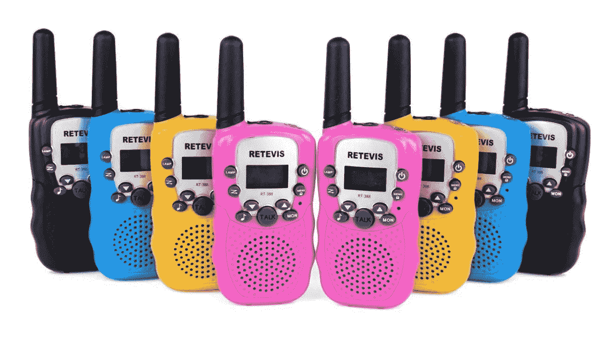
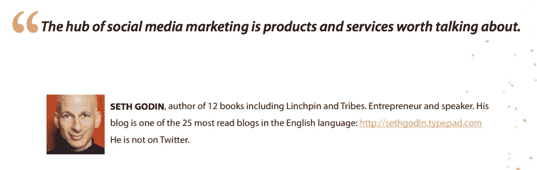
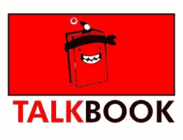
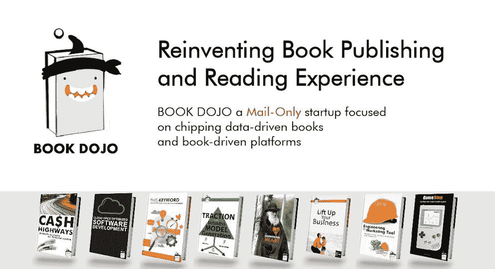

# 可谈论的产品和服务

> 原文：<https://medium.com/nerd-for-tech/talkable-products-and-services-9a2c659f0570?source=collection_archive---------24----------------------->

## 产品和服务值得谈论吗

像 Book Dojo 的 Talkbook 这样的可对话产品

值得谈论的产品、服务和事件不仅是社交媒体的中心，也是它们存在的理由，因为社交媒体所做的是免费的，让人们更容易与他人联系和交谈。在首先提供一个无摩擦的沟通和联系媒介之后，社交媒体平台的第二个目标是为愿意支付广告的公司和自我企业家带来值得谈论的产品、服务和事件，让他们找到值得谈论或不值得谈论的东西。

今天的社交媒体依赖于算法来发现什么值得谈论，并通过推荐系统来推广它，但当你的股票价格和收入取决于谁支付额外的广告价格时，它很容易推广价值不菲的东西。

读完这篇文章后，几个充满激情的博客作者谈到了公司博客，他们的观点引起了我的共鸣。尤其是这个

塞思·戈丁谈社交媒体

TalkBook 一个书籍驱动的平台

这提醒了我，选择让 TalkBook 成为一个没有广告的书籍驱动的空间，连接人们，让他们谈论可谈论的书籍和想法是一个很好的决定，但这将花费我们所有人一定的钱。

如果你想成为这样一个书籍驱动的空间的一部分，我强烈建议你使用[这种形式](http://clickmetertracking.com/4p80)，因为 TalkBook 是一个书籍驱动的社交平台，由 Book Dojo 运营，Book Dojo 是一家仅发布数据驱动书籍的邮件初创公司，为世界各地的书籍社区构建书籍驱动的平台。

预订 Dojo，一个只有邮件的创业公司