# 对话数据用户人口统计

> 原文：<https://medium.com/nerd-for-tech/talking-data-user-demographics-f97dea332bde?source=collection_archive---------0----------------------->

一个难题。

在瞬间的动力、冲动的决策和在 AI 上狂看电影的瞬间，我决定解决这个 Kaggle 问题。让我们开始吧。

## 问题:

简而言之，我们提供了用户移动使用数据，通过这些数据我们可以预测用户的年龄和性别。请在 Kaggle 网站上查看完整的[问题陈述](https://www.kaggle.com/c/talkingdata-mobile-user-demographics/data)。

所以，最终的预测应该是由性别和年龄范围组成的群体。

例如:M32–38，F24–26 等。

## 数据:

这里重点说一下“移动使用数据”。

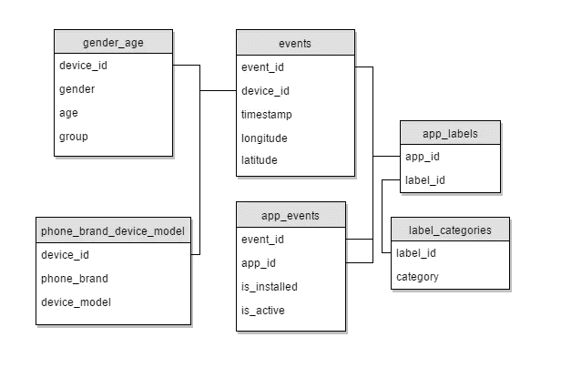

如上图所示，提供了 7 个文件，其中性别年龄是列车数据，其他 5 个文件是列车和测试设备的数据。第 7 个文件类似于 gender_age，只包含设备 id，跳过其余部分。

我们将 device_id 作为指示设备的主键，它与事件数据相链接。app_events、标签和标签类别通过 event_id、app_id 和 label_id 链接。

## 分析:

我在分析过程中的主要观察结果是:

*   有 12 组，男性用户比女性用户多。
*   男性年龄范围-> 22–39 岁以上
*   女性年龄范围-> 23–43 岁以上
*   在年龄方面，我们有更多的女性数据，男性数据也更多。
*   男性和女性的 25 和 75 百分位年龄值相似
*   MAD 对男性和女性都一样
*   尽管男性人数多于女性，但两者的数据分布是相似的。

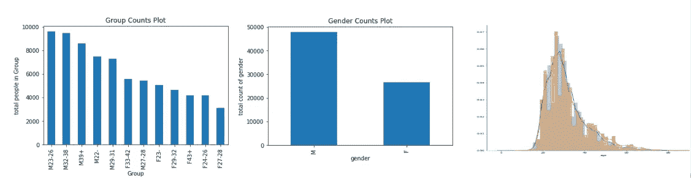

*   大多数(68.77%)训练数据都有事件
*   大多数(68.80%)测试数据都有事件

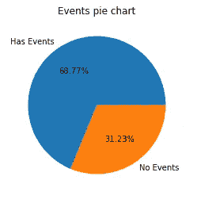

*   数据来自 2016 年 4 月 30 日晚上 11:52 到 5 月 8 日上午 12 点
*   m32–38 有很多人在晚上 11 点至凌晨 3 点之间打电话。

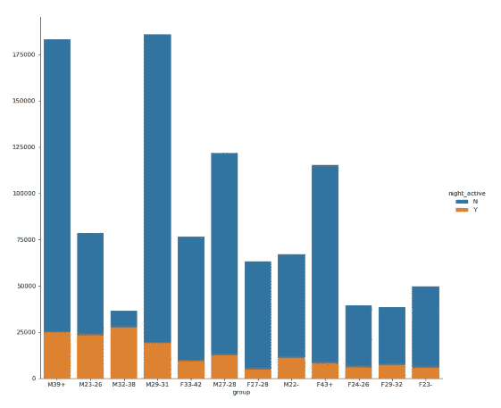

*   相比之下，男性在晚上使用手机的次数比女性多。
*   假设事件计数越多，意味着用户使用设备的次数越多。但在我们的数据集中，我们可以说，用户的年龄和性别与用户使用设备的时间量之间没有关系。
*   在每个事件中，用户使用了多个应用，并且这些应用属于多个类别。最常用的类别包括:

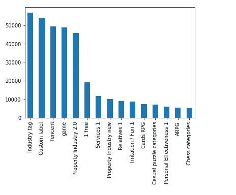

*   这里安装了所有注册的应用程序，但只有 39.21%的应用程序在使用(Train)。
*   电话数据中存在需要删除的重复项
*   前三大品牌拥有 58.78%的手机，因此它们主宰着手机行业。

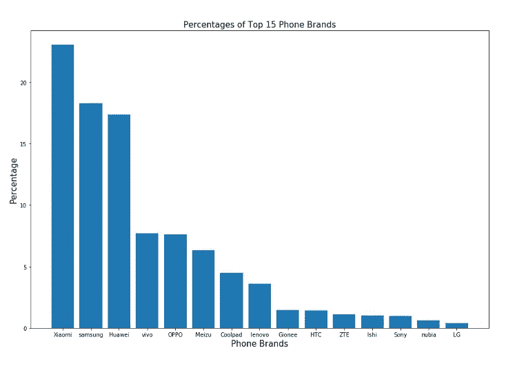

## 特点:

经过分析和一些参考，我想出了以下特点。

*   (所有事件和时间戳的)经度的模式/中值。
*   纬度(所有事件和时间戳)的模式/中值。
*   特定设备使用(活动)的应用程序的 TFIDF 方法。
*   特定设备使用(安装)的应用程序标签的 BOW 方法。
*   手机品牌的 BOW 方法(一键编码，因为这些包含不同的语言)。
*   电话模型的 BOW 方法(一键编码，因为这些由不同的语言组成)。
*   TFIDF 事件发生的工作日。
*   TFIDF 活动时间。
*   事件的小时箱。
*   活跃应用程序和已安装应用程序的比率。
*   使用纬度和经度将位置聚类为 10 个聚类。

## 预测:

由于 32%的数据没有事件数据，我将预测分为两部分:

*   有事件
*   没有事件

我们将为每个数据集建立单独的预测模型，最后将结果连接起来。

我尝试过逻辑回归、XGBoost 和神经网络，因此模型的基础是我尝试的方法的集合。我所做的是，在获得每个算法的预测后，根据它们的 CV_logloss(交叉验证)对结果进行加权。

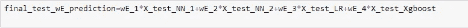

此外，由于神经网络中存在差异，即它们每次都有不同的预测(即使参数相同)，因此我对每个神经网络都进行了集成。更像是取了网络得到的所有结果的平均值。

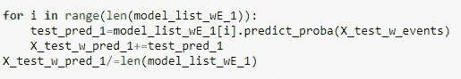

这样，我为每个数据集训练了 2 个神经网络 10 次，并取了结果的平均值，然后还应用了逻辑回归和 XGBoost。您必须找到想要应用的功能的正确组合，以获得最佳效果。

然后最终连接两个数据集的最终结果。

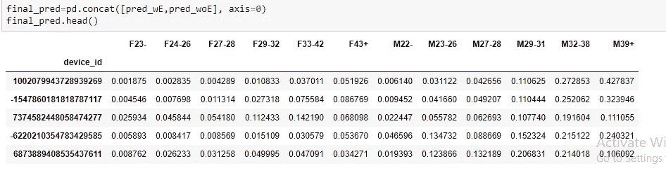

在我的最终模型中，我只使用了神经网络进行预测，并能够达到排行榜中前 10%的排名，私人得分为 2.24054，公共得分为 2.23523。

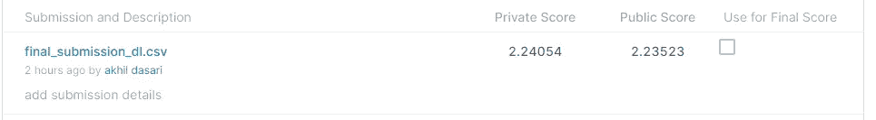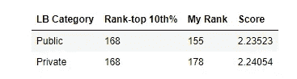

## 进一步改进:

我看到许多其他参与者通过给其他算法很低的权重得到更好的分数，如 LR 的 0.1，lightGBM 等。你也可以尝试一下，最终，这都是关于正确的特性和正确的方法来获得最好的结果。

请查看我在 GitHub 中的[代码，了解详细的实现，如果你有更好的结果或不同的方法，请告诉我。我们可以通过](https://github.com/akhildasari/talking_data_user_demographics) [LinkedIn](https://www.linkedin.com/in/akhil-dasari/) 联系。

## 参考资料:

*   【https://www.appliedaicourse.com/ 
*   [https://machine learning mastery . com/ensemble-methods-for-deep-learning-neural-networks/](https://machinelearningmastery.com/ensemble-methods-for-deep-learning-neural-networks/#:~:text=Ensemble%20learning%20combines%20the%20predictions,and%20how%20predictions%20are%20combined.)
*   [https://machine learning mastery . com/ensemble-methods-for-deep-learning-neural-networks/](https://machinelearningmastery.com/ensemble-methods-for-deep-learning-neural-networks/#:~:text=Ensemble%20learning%20combines%20the%20predictions,and%20how%20predictions%20are%20combined.)
*   [https://github.com/MahendharReddy16/Talking-data-](https://github.com/MahendharReddy16/Talking-data-)
*   [https://medium . com/ka ggle-blog/talking data-mobile-user-demographics-competition-winders-interview-季军-团队-utc-1-3-896fb3bfc79f](/kaggle-blog/talkingdata-mobile-user-demographics-competition-winners-interview-3rd-place-team-utc-1-3-896fb3bfc79f)