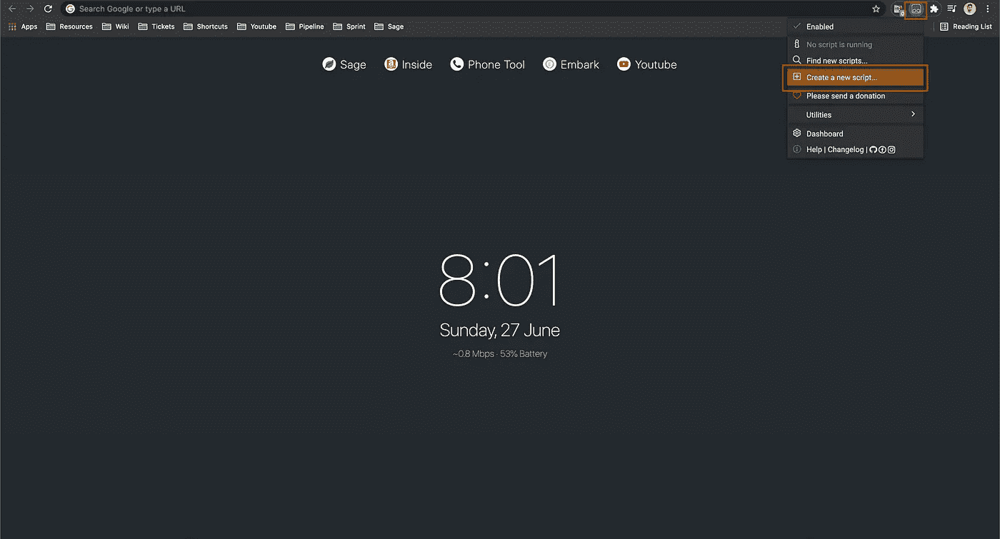
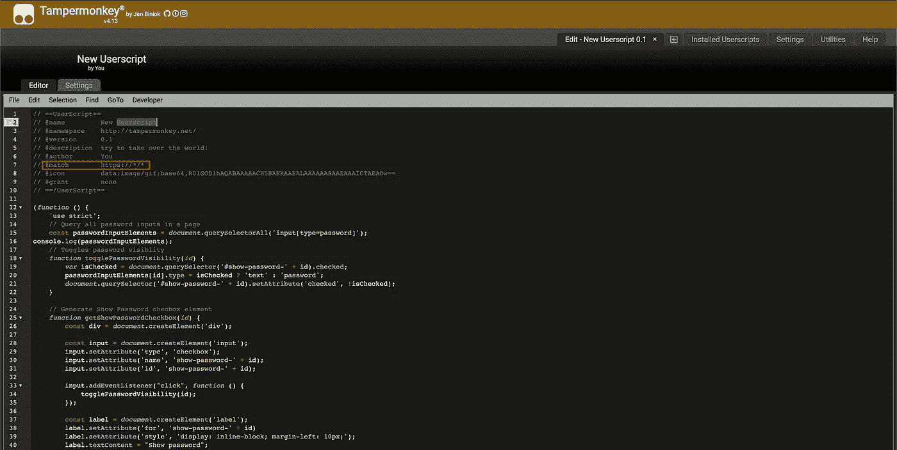
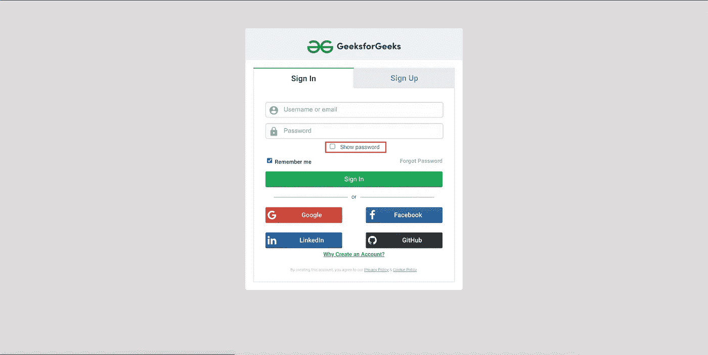

# 使用 Tampermonkey 篡改网页

> 原文：<https://medium.com/nerd-for-tech/tamper-web-pages-using-tampermonkey-bc027288bf96?source=collection_archive---------5----------------------->

## 编写自定义 javascript 来修改任何网页

照片由[乔希·布茨](https://unsplash.com/@joshboot?utm_source=medium&utm_medium=referral)在 [Unsplash](https://unsplash.com?utm_source=medium&utm_medium=referral) 拍摄

# 介绍

你好。在进入这篇文章之前，首先，我们需要知道一些事情**。**

## 1.什么是用户脚本？

> 用户脚本是一个程序，通常用 JavaScript 编写，用于修改网页
> - [维基百科](https://en.wikipedia.org/wiki/Userscript)

## 2.为什么我们需要一个用户脚本？

假设我们想要动态地修改网页，比如添加导出到 PDF 按钮，显示页面中的字数，等等。我们可以通过编写定制的 javascript 来实现这些功能。

## **3。如何在网页中添加用户脚本？**

Chrome 提供了一个名为 [**Snippets**](https://developer.chrome.com/docs/devtools/javascript/snippets/) 的内置功能，在这里我们可以在网页上运行自定义的 javascript。我写过一篇 [**文章**](https://codeburst.io/dark-theme-for-medium-in-chrome-326f8c905e3a?source=your_stories_page-------------------------------------&gi=f64351607cbc) 详细解释过。它有一个限制，即脚本不能自动触发。

## 4.什么是用户脚本管理器？

> 用户脚本管理器是一种浏览器扩展，它提供用户界面来管理用户脚本。
> - [维基百科](https://en.wikipedia.org/wiki/Userscript_manager)

其中一个流行的用户脚本管理器是[**Tampermonkey**](https://www.tampermonkey.net/)**。**本文将使用 Tampermonkey 添加一个**切换密码可见性**特性，为页面上的所有密码输入添加一个复选框。该复选框可用于显示和隐藏密码。

切换密码可见性

# 安装 Tampermonkey

Tampermonkey 扩展可用于几乎所有浏览器，如 Chrome、Firefox、Edge、Safari 等。你可以在这里 **下载 chrome 扩展 [**。**](https://chrome.google.com/webstore/detail/tampermonkey/dhdgffkkebhmkfjojejmpbldmpobfkfo?hl=en)**

# 添加显示密码复选框的用户脚本

用户脚本可以从下面的网站下载。

用户脚本要点

# 在 Tampermonkey 中运行 Userscript

1.  打开浏览器，点击 Tampermonkey 图标，然后点击**创建新脚本**

创建新脚本

2.它将重定向到一个新的页面。复制页面上的脚本，并确保将 **@match** 设置为[**https://*/***](/*/*)**，以便脚本可以在所有站点上运行。点击 **ctrl + s** 保存。**

****

**复制脚本**

**3.现在打开任何有密码框的网页。在这里我为极客们打开 Github 和 Geeks。**

****

**开源代码库**

****

**极客为极客**

# **结论**

**当我们需要修改任何网页的内容来添加自定义功能时，Tampermonkey 就派上了用场。我们可以添加任何功能，从修改 HTML DOM 到进行 Ajax 调用。**

# **谢谢你🤘**

**想了解我更多，请访问[**ganeshkumarm . me**](https://www.ganeshkumarm.me/)**

****