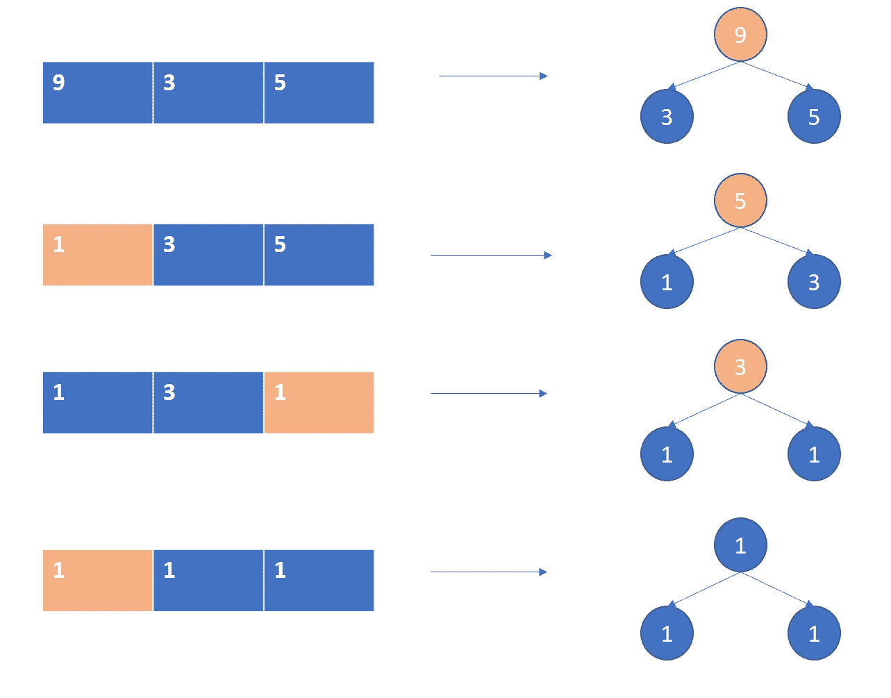

# 具有多个和的目标阵列—每日挑战可能

> 原文：<https://medium.com/nerd-for-tech/target-array-with-multiple-sums-daily-challenge-may-93d18fcaff2d?source=collection_archive---------17----------------------->


照片由 [Denes Kozma](https://unsplash.com/@deneskozma?utm_source=unsplash&utm_medium=referral&utm_content=creditCopyText) 在 [Unsplash](https://unsplash.com/s/photos/multiple-sum?utm_source=unsplash&utm_medium=referral&utm_content=creditCopyText) 上拍摄

今天的问题来自每日 Leetcode 编码挑战赛——五月版。这是一个难以回答的问题。让我们看看问题陈述。

## [1354 年。](https://leetcode.com/problems/construct-target-array-with-multiple-sums/)用多个和构造目标数组

给你一个 n 个整数的数组`target`。从由`n` 1 组成的起始数组`arr`中，您可以执行以下程序:

> 1.设`x`是当前数组中所有元素的总和。
> 2。选择索引`i`，使得`0 <= i < n`，并将索引`i`处的`arr`的值设置为`x`。
> 3。您可以根据需要多次重复此过程。

返回`true` *如果可以从* `arr` *构造* `target` *数组，否则返回* `false`。

## 示例:

```
**Input:** target = [9,3,5]
**Output:** true
```

## 理解问题:

让我们以[9，3，5]为例。如果我们从[1，1，1]开始，我们可以通过用 3(当前数组的和)替换中间的 1 来移动到[1，3，1]。类似地，我们移到[1，3，5](用更新后的数组(1，3，1)的和 5 替换最右边的 1) & [9，3，5](用更新后的数组(1，3，5)的和 9 替换最左边的 1)。

我们可以回溯到[1，1，1]。为此，我们移除 max 元素并用 1 替换它。[9, 3, 5] → [1, 3, 5] → [1, 3, 1] → [1, 1, 1].为此，我们使用最大堆。



关键是，`target`数组中最大的数字一定是最近更改的数字。因此，如果我们有当前的最大值`curr`，我们将它与其余的`sum_rest`之和进行比较，该数值的先前值必须是`curr-sum_rest`，只要`curr-sum_rest`仍然大于`sum_rest`，先前值将是`curr-sum_rest-sum_rest`，以此类推，直到`prev = curr-k*sum_rest`小于`sum_rest`。如此有效`prev = curr % sum_rest`。

## 代码实现:

```
def isPossible(target):
    heap = [-el for el in target]
    heapq.heapify(heap)

    sum_heap = sum(target)

    if len(target)==1: 
        return target[0] == 1

    while sum_heap > len(target): 
        curr = -1 * heapq.heappop(heap)
        sum_rest = sum_heap - curr
        if sum_rest > curr : 
            return False
        if sum_rest==1: 
            return True
        prev = curr % sum_rest 
        if prev < 1: 
            return False
        sum_heap = sum_rest + prev
        heapq.heappush(heap, -prev)

    return True
```

## **复杂性分析**

*   时间复杂度:创建 heapq 的 O(n)。log(max(array))* heapq 操作的 log n。
*   优先队列的空间复杂度为 O(n)。

编码快乐！！