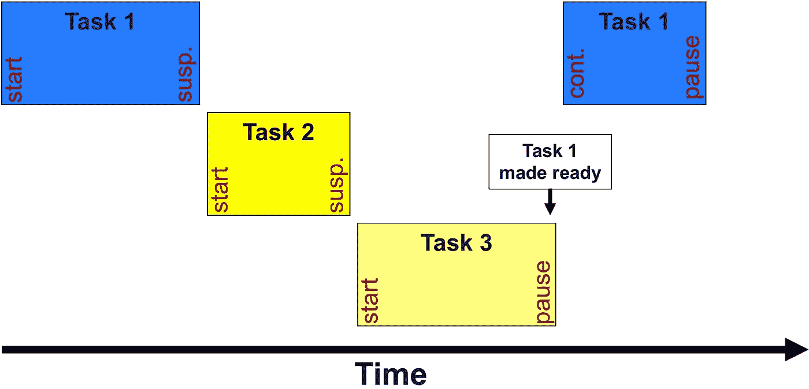
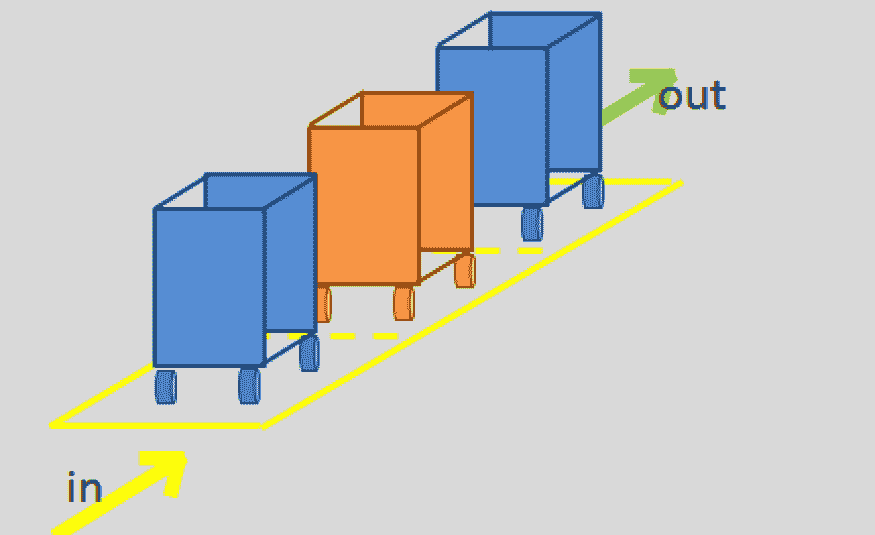
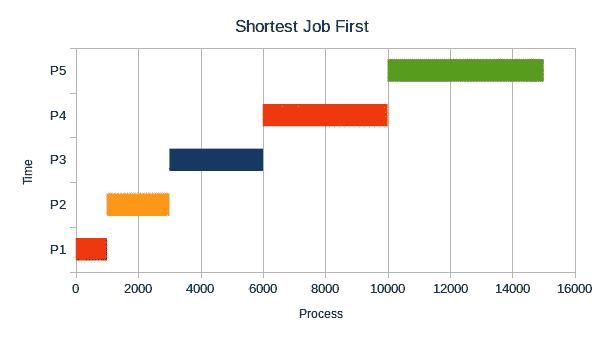
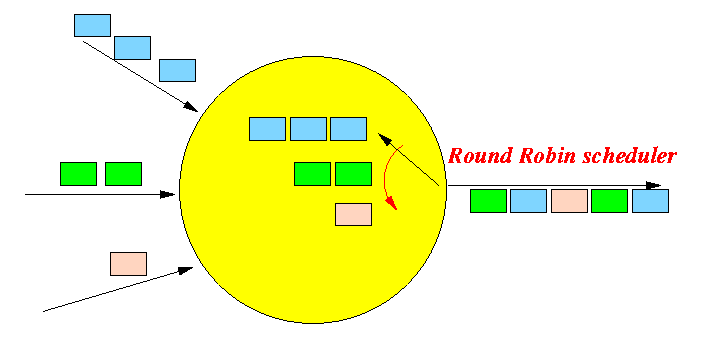
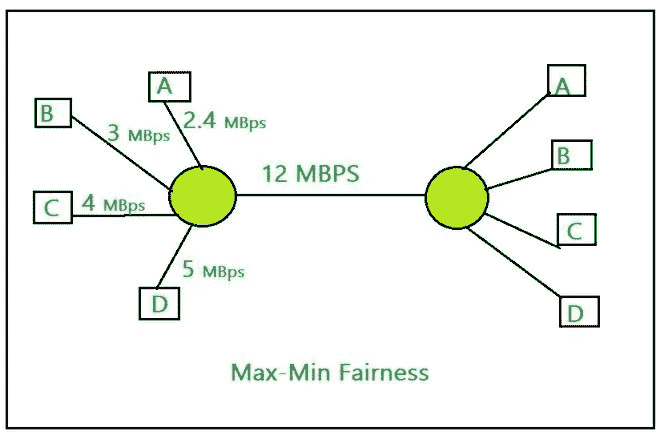
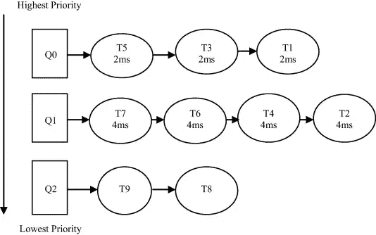

# 操作系统中的任务调度

> 原文：<https://medium.com/nerd-for-tech/tasks-scheduling-in-os-2c1f99e9dc05?source=collection_archive---------0----------------------->

## 什么是调度

当有多件事要做时，你如何选择先做哪一件
？在任何时间点，处理器上都有一些线程在运行。其他人正在等待处理器。尽管如此，其他线程仍被阻塞等待 I/O 完成，这是一个条件变量，当
有多个可运行线程时，处理器调度策略确定下一个运行哪个线程。你可能认为这个问题的答案很简单:按照工作到达的顺序来做。毕竟，这似乎是唯一公平的做法。因为明明是公平的，但那是不对的！尤其是服务器操作系统经常过载。并行应用程序会比处理器产生更多的工作，如果在设计调度策略时不小心，性能会严重下降，因此我们需要找到一种合适的算法来改进调度。

不同类型的调度程序:

*   **单处理器调度**。单处理器调度策略如何影响公平性、响应时间和吞吐量？
*   **多处理器调度**。当我们每台计算机拥有多个处理器内核时，调度策略会如何变化？

# 调度算法

## 先进先出

也许最简单的调度算法是先进先出(FIFO):
按照任务到达的顺序执行每项任务。当我们开始着手一项任务时，我们会一直运行它，直到完成为止。FIFO 最小化开销，当每个任务完成时在任务之间切换。因为它最小化了开销，如果我们有固定数量的任务，并且那些任务只需要处理器，FIFO 将有最好的吞吐量:它将以最快的速度完成最多的任务。正如我们提到的，FIFO 似乎是公平的定义，每个任务都耐心地等待轮到它。不幸的是，FIFO 有一个弱点。如果一个工作很少的任务碰巧排在一个需要很长时间的任务后面，那么如果队列中的第一个任务需要一秒钟，接下来的五个任务稍后到达，但每个任务只需要一毫秒的处理器，那么它们都需要等到第一个任务完成，那么系统就显得非常低效。平均响应时间将超过一秒，但最佳平均响应时间比这短得多。事实上，如果我们忽略交换开销，对于平均响应时间来说，在一些工作负载中，FIFO 实际上是最差的策略。

## 最短的工作优先(SJF)

如果 FIFO 对于平均响应时间来说不是一个好的选择，那么有没有一个最优的
策略来最小化平均响应时间呢？答案是肯定的:首先安排最短的任务。假设我们可以知道每个任务在处理器上需要多少时间。(一般情况下，我们不会知道。如果我们总是安排剩余工作最少的任务，这将最小化平均响应时间。要看到 SJF 是最优的，考虑一个假设的替代政策，它不是 SJF，但我们认为可能是最优的。在某些时候，这个替代方案将运行一个比队列中的其他任务更长的任务；毕竟，这里不是 SJF！如果我们现在改变任务的顺序，保持一切不变，但先做较短的任务，我们将减少平均响应时间。因此，SJF 必须是最优的。
如果一个长任务首先到达，它将被调度。当一个短任务稍晚到达时，调度器将抢占当前任务，并启动更短的任务。剩余的短任务将按照到达的顺序进行处理，然后完成长任务。被认为是“最短”的是任务剩余的时间，而不是它最初的长度。如果我们离完成一个小时的任务只有一纳秒的时间，我们将通过继续执行该任务来最小化平均响应时间，而不是抢占刚刚到达就绪队列的一分钟的任务。

## 一系列

解决饥饿的策略是以循环方式调度任务。使用循环调度，任务轮流在处理器上运行一段有限的时间。调度程序通过设置一个定时器中断来将处理器分配给第一个任务，这个定时器中断有一段延迟，称为时间量。
在量程结束时，如果任务尚未完成，则该任务被抢占，处理器被交给就绪队列中的下一个任务。被抢占的任务被放回就绪队列，等待下一次轮到它。有了循环调度，任务就不可能挨饿，它最终会到达队列的前面并得到它的时间量。
当然，我们需要谨慎选择时间段。一个需要考虑的因素是开销:如果我们的时间量太短，处理器将会把所有的时间都花在切换上，完成很少的有用工作。但是如果我们选择太长的时间段，任务将不得不等待很长时间，直到他们得到一个好的类比，因为循环赛是一个特别活跃的学生，同时为多个期末考试学习。如果你读了一本教科书中的一段，然后转而读下一本教科书中的一段，再转而读第三本教科书，你不会有多少收获。但是如果你从不改变，你可能永远也不会有时间去学习你的一些课程

## 最大最小公平性

在许多设置中，资源的公平分配对于调度器的设计来说，与响应性和低开销一样重要。在多用户机器或服务器上的
中，我们不希望单个用户能够独占机器的
资源，从而降低其他用户的服务质量。虽然在单用户机器中公平似乎没有什么价值，但是各个应用程序通常是由不同的公司编写的，每个公司都有兴趣使自己的应用程序性能看起来不错，即使这是以降低其他应用程序的响应速度为代价。此外，一些应用程序可能在单个进程内运行，而其他应用程序可能创建许多进程，并且每个进程可能涉及多个线程。如果只有一个线程的应用程序与有数百个线程的应用程序竞争，线程间的循环调度会导致资源匮乏。我们可以关注任何粒度级别的公平分配:特定用户的进程中的线程，以及共享物理机的用户。为简单起见，我们的讨论将假设我们对提供进程间的公平性感兴趣，如果接收资源的单元是用户、应用程序或线程，则同样的原则适用。如果所有进程都是计算受限的，那么公平就很容易实现:循环调度会给每个进程一个相等的处理器份额。然而，在实践中，不同的进程以不同的速率消耗资源。受 I/O 限制的进程可能只需要处理器的一小部分，而受计算限制的进程则愿意消耗所有可用的处理器时间。当需求多样化时，什么是公平分配？
一个可能的答案是，无论循环法做什么都是公平的，每个进程在处理器上都有平等的机会。然而，正如我们在上面看到的，循环调度会导致 I/O 绑定进程的运行速度比处理器独占时慢得多，而计算绑定进程几乎不受影响。这似乎不公平！

# 多级反馈

大多数商业操作系统，如 Windows、macOS 和 Linux，都使用一种叫做多级反馈队列(MFQ)的调度算法。MFQ 的设计是为了同时实现几个目标:
**响应能力**。像在 SJF 一样，快速完成短期任务。
**低开销**。最大限度地减少抢占次数，如在 FIFO 中，并且
最大限度地减少做出调度决策所花费的时间。
**饥饿-自由**。所有任务都应取得进展，如第
轮循环。
**后台任务**。推迟系统维护任务，如磁盘碎片整理，这样它们就不会干扰用户工作。
**公平。给**(非后台)进程分配大约其最大-
最小的处理器公平份额。
MFQ 是循环赛的延伸。MFQ
不是只有一个队列，而是有多个循环队列，每个队列都有不同的优先级和时间段。较高优先级的任务抢占较低优先级的任务，而相同级别的任务以循环方式调度。此外，较高的优先级比较低的优先级具有更短的时间量。任务在优先级之间移动，以支持短任务而不是长任务。新任务进入最高优先级。每当任务用完它的时间段，它就下降一级；每当任务因为等待 I/O 而让出处理器时，它就停留在同一级别(或者被提升一个级别)；如果任务完成，它将离开系统。一个新的计算绑定任务将以高优先级开始，但它会很快耗尽其时间量，并降至下一个较低的优先级，然后再下一个。因此，只需要少量计算的 I/O 绑定任务几乎总是被快速调度，使磁盘保持忙碌。计算相关任务以长时间量程运行，以最大限度地减少切换开销，同时仍然共享处理器。
到目前为止，我们描述的算法没有实现饥饿自由或
最大最小公平。如果有太多 I/O 绑定任务，则在混合运行 I/O 绑定任务和计算绑定任务时，计算绑定任务。任务在处理器上可能没有时间。为了解决这个问题，MFQ 调度程序监控每个进程，以确保它得到公平的资源份额。在每一级，Linux 实际上维护两个队列任务，它们的进程已经达到了它们的公平份额，并且只有在该级的所有其他进程也获得了它们的公平份额时才被调度。周期性地，任何接收少于其公平份额的进程将增加其任务的优先级；同样地，接收超过其公平份额的任务可以降低优先级。调整优先级也涉及战略行为。从一个纯粹自私的角度来看，一个任务可以通过在它的时间段即将到期之前发出一个短的 I/O 请求来试图保持它的高优先级。最终，系统会检测到这一点，并将其优先级降低到公平共享级别。

## 多级反馈队列调度的优点:

*   它更加灵活。
*   它允许不同的进程在不同的队列之间移动。
*   它通过将等待较低优先级队列太长时间的进程移动到较高优先级队列来防止饥饿。

## 多级反馈队列调度的缺点:

*   对于最佳调度器的选择，它需要一些其他方法来选择值。
*   它会产生更多的 CPU 开销。
*   这是最复杂的算法。

# 摘要

时间安排是一个很大的话题，背后有很多概念，但在本文的最后，我会放一些有助于获得更多知识的资源，我们可以改天再讨论作者资源

*   [操作系统注释](https://applied-programming.github.io/Operating-Systems-Notes/)
*   [操作系统原理](https://www.amazon.com/Operating-Systems-Principles-Thomas-Anderson/dp/0985673524)