# 带松露套装的以太坊 TDD

> 原文：<https://medium.com/nerd-for-tech/tdd-for-ethereum-with-truffle-suite-e5340032179d?source=collection_archive---------7----------------------->

[行政长官](https://unsplash.com/@executium?utm_source=medium&utm_medium=referral)在[广场](https://unsplash.com?utm_source=medium&utm_medium=referral)拍照

以太坊是一个公共区块链。它有自己的货币以太。区块链的概念很简单——它是一系列区块，其中的交易通过 hashcode 相互链接。更改链中的任何块都会导致所有后续块损坏。这些链有多个副本。因此，黑客或恶意攻击被阻止。

与区块链互动的应用程序被称为分散式应用程序或 **dApps** 。与以太坊区块链交互的 DApps 是用 Solidity 编程语言编写的，这是以太坊开发平台特有的。测试驱动开发或 TDD 是一种编写应用程序的方式，其中首先编写测试用例代码，然后编写实际功能的代码。本质上，有一组失败的测试用例，然后由满足测试用例中所有标准的相应功能代码传递。[阅读更多关于 TDD 的信息](https://en.wikipedia.org/wiki/Test-driven_development)

非区块链应用的 TDD 非常简单。然而，将同样的概念应用于区块链似乎很复杂。这个分步指南使用 Truffle 套件探索以太坊的 TDD。它使用 Mocha 和 Chai 库作为测试用例。

这里演示的应用程序是一个简单的 Greeter 应用程序，它打印设置好的问候语。这个应用程序的开发是在 Windows 上完成的，但是相同的命令集稍加修改就可以在 Unix 上工作。

注:这篇文章假设你已经掌握了以太坊，固体的基本知识。了解 Javascript 很好，但不是强制性的。

**第 0 步**

在系统上安装 Truffle 和 Node.js。有关块菌安装的说明，请参考此处的。

**第一步**

在系统上创建一个文件夹 *greeter* 。打开终端并导航到该文件夹。下面的 truffle 命令将创建 Truffle 项目所需的整个目录结构

*>松露初始*

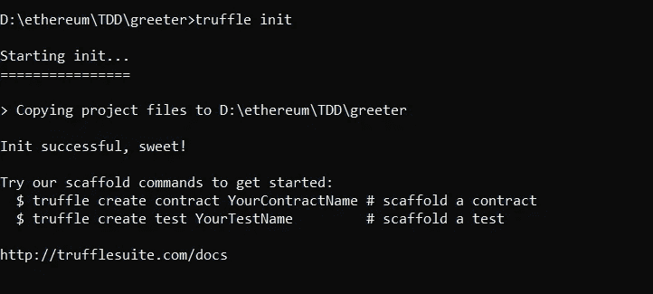

块菌初始化

**第二步**

因为这是 TDD，所以在 test 文件夹下创建测试文件，使用如下所示的任何测试编辑器

>*touch test/greeter _ test . js*

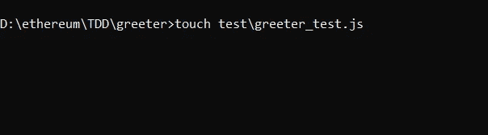

打开这个文件，添加下面一行并保存它—

*const Greeter contract = artifacts . require(" Greeter ")；*

这一行实际上是检查迎宾契约是否存在于工件中。

**第三步**

在终端中，执行以下命令—

*>松露开发*

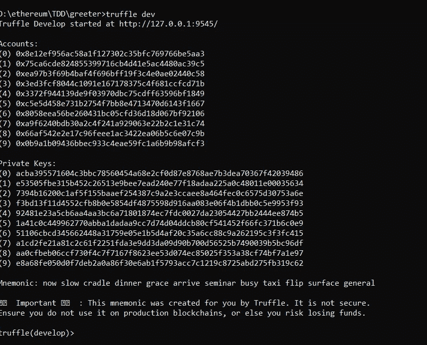

区块链——块菌开发

这是用块菌来激发区块链的发展。人们可以执行测试用例。在退出该链时，所有块和相应的数据都被删除和清除。这有点像模拟区块链。

键入命令

*测试>测试*

这将执行欢迎应用程序的测试用例，并将给出以下错误，因为欢迎契约还不存在。

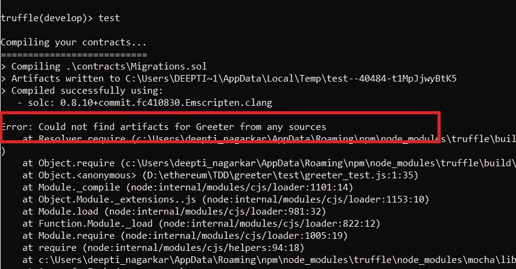

使用以下命令退出区块链开发控制台。

>.出口

**第四步**

创建 Greeter.sol 文件，并向其中添加以下代码行。这是一份空合同。

> pragma 实度> = 0.4.0 < 0.7.0;
> 
> contract Greeter {
> 
> }

Follow the directions from Step 3

The test will pass.

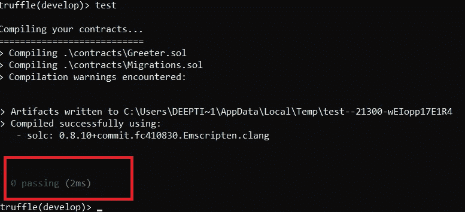

**步骤 5**

让我们检查是否部署了欢迎契约。再次打开 greeter_test.js 并向其中添加以下代码行。

> contract("Greeter "，()=> {
> 
> it("部署成功"，async () => {
> 
> const greeter = await greeter contract . deployed()；
> 
> assert(greeter，“合同未部署”)；
> 
> });
> 
> });

上面那行是做什么的，检查一下合同迎宾员是否已经部署到了区块链。遵循步骤 3，应该可以看到以下错误。

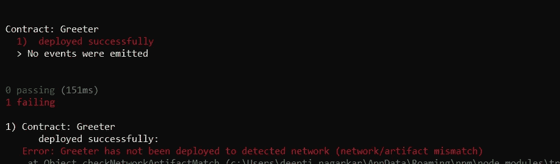

迎宾合同未部署

为了让这个测试用例通过，需要将 2_deploy_greeter.js 文件添加到 greeter 应用程序目录下的 migrations 文件夹中。

创建文件→欢迎/迁移/2_deploy_greeter.js。

添加以下行并重复步骤 3。

> const Greeter contract = artifacts . require(" Greeter ")；
> 
> module . exports = function(deployer){
> deployer . deploy(greeter contract)；
> }

测试用例将成功通过，如下所示。

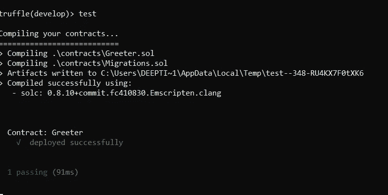

迎宾合同已部署

**第六步**

现在有了一个欢迎契约，让我们为 greet()功能添加另一个测试用例。将以下代码添加到 greeter_test.js 文件的 Greeter 契约循环中——

> describe("greet()"，()=> {
> 
> 它("返回' Hello World！'"，async () => {
> 
> const greeter = await greeter contract . deployed()；
> 
> const expected = "Hello World！"；
> 
> const actual = await greeter . greet()；
> 
> assert.equal(实际，预期，“Hello World！”);
> 
> });
> 
> });

再次执行第 3 步，将会看到以下错误

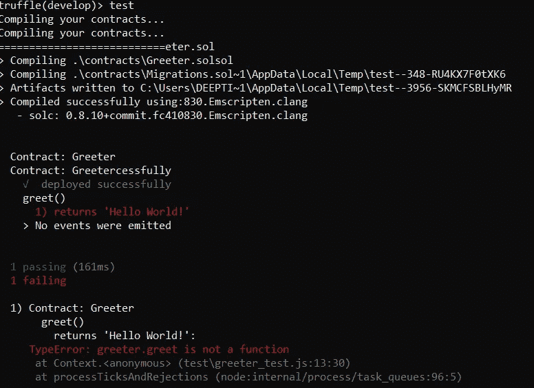

greeter.greet()不是函数

现在将以下代码添加到 Greeter.sol 合同文件中，重复步骤 3。

> pragma solidity >=0.4.22 <0.9.0;
> 
> contract Greeter {
> 
> function greet() view external returns(string memory){
> 返回“Hello World！”；
> }
> 
> }

测试用例将通过，输出如下。

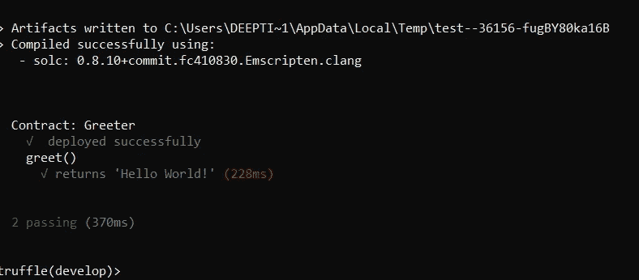

欢迎测试用例通过

**第七步**

到目前为止，TDD 的基本方法可能已经很清楚了。让我们再添加一个设置问候语的测试函数。

> *contract(" Greeter:set greeting "，()=>{
> describe(" set greeting(string)"，()= > {
> it("sets greeting "，async()=>{
> const Greeter = await Greeter contract . deployed()
> const expected = " Hello！你好吗？”；
> 
> await greeter . set greeting(预期)；
> const actual = await greeter . greet()；
> 
> assert.equal(实际，预期，“未设置问候语”)；
> })；
> })；
> })*

创建新契约的原因是为了使区块链的状态不会因较早的测试而影响下一个测试用例。本质上，测试执行的顺序不应该影响输出。这是非常重要和关键的一点。

重复步骤 3，将会看到以下错误。

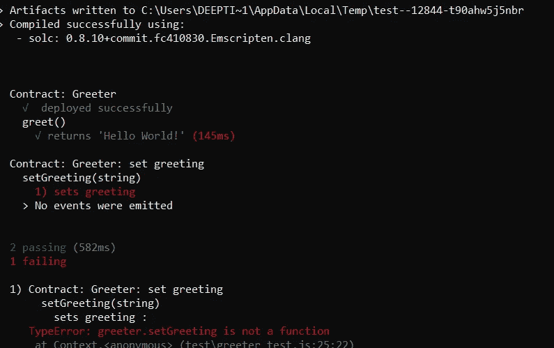

greete.setGreeting 不是一个函数

现在，将以下代码添加到 Greeter.sol 中。

> 合同迎宾员
> 
> string private _ greeting
> 
> 函数 greet()查看外部返回(字符串内存){
> 返回“Hello World！”；
> }
> 
> 函数 set greeting(string calldata greeting)external {
> _ greeting = greeting；
> }
> 
> }

测试用例仍然会失败，因为 greet()函数仍然返回静态问候语“Hello World！”。

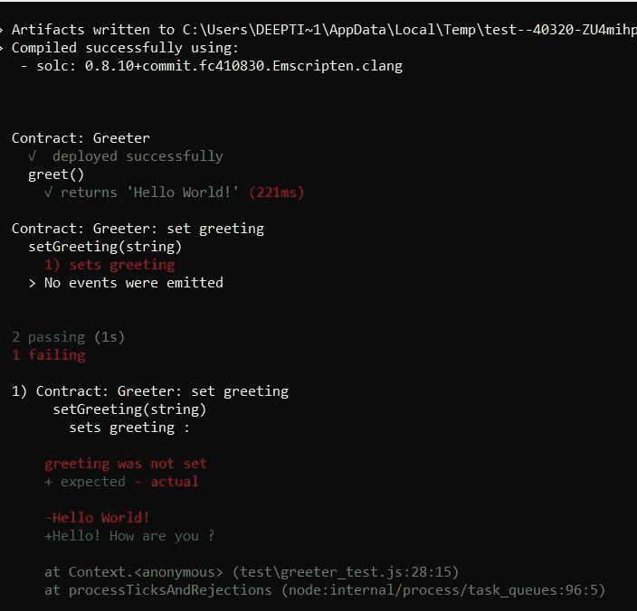

设置问候语的测试用例仍然失败

修改 greet()方法，如下所示

> 函数 greet()查看外部返回(字符串内存){
> return _ greeting；
> }

第三步，哇！

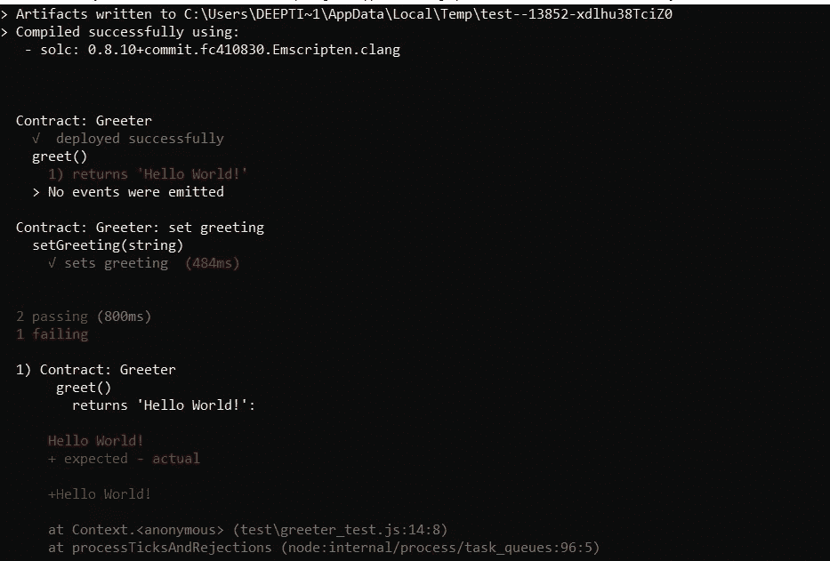

早期测试用例失败！

为什么早期的测试用例失败了？那是因为现在，greet()默认没有什么可返回的。要解决这个问题，请编辑协定并将 initialize _greeting 设置为静态字符串。最终的合同应该如下所示—

> 合同迎宾员
> 
> string private _ greeting = " Hello World！"；
> 
> 函数 greet()查看外部返回(字符串内存){
> 返回“Hello World！”；
> }
> 
> 函数 set greeting(string calldata greeting)external {
> _ greeting = greeting；
> }
> 
> }

运行测试用例，它们应该都通过了，如下所示—

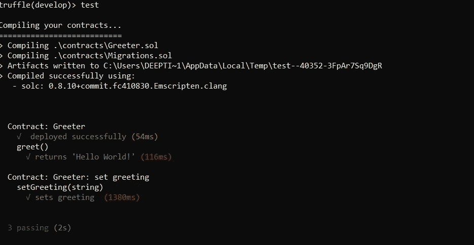

所有测试用例通过

这是以太坊 TDD 的基础。推荐的方法是将测试功能分成不同的测试文件。一个用于契约结构，一个用于业务逻辑等等。Truffle 也有每个测试文件 100 kb 的限制。最好按照功能将测试用例分成多个文件。

希望这篇文章对你有用！留下你的想法吧！