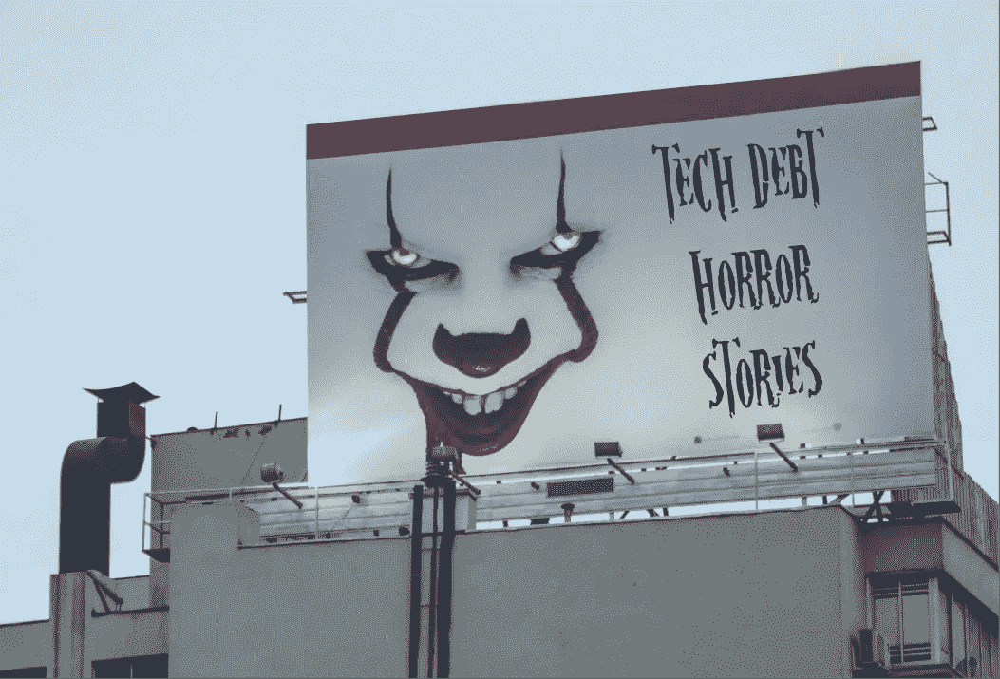

# 技术债务恐怖故事

> 原文：<https://medium.com/nerd-for-tech/technical-debt-horror-stories-69d66e23c9dc?source=collection_archive---------3----------------------->

如果您的组织有很多技术债务，那么机会就是一些东西(或者一切！)总有一天会出问题。这里是我们收集的最可怕和最有趣的科技债务故事！

*最初发表于*【https://www.stepsize.com】

*到目前为止，大多数人都遇到过沉默的公司杀手(科技债务)，对我们来说幸运的是，他们一直在分享他们的个人失败，对最糟糕的数据库的抱怨，以及让公司损失数百万美元的事故。*

*每次你把一个新功能放在技术债务问题之前，你都在冒巨大的风险。你准备好看看有多大了吗？让我们开始吧！*

# *如何在 45 分钟内损失 4.62 亿美元*

## *发生了什么事？*

*骑士资本因为[复活死码](http://www.theregister.co.uk/2013/10/23/lone_sysadmin_caused_462_meeellion_wall_street_crash/)在 45 分钟内损失 4.62 亿美元。*

*2012 年 6 月，纽约证券交易所(NYSE)获得美国证券交易委员会(SEC)的许可，启动其零售流动性计划。旨在为个人投资者提供尽可能好的价格，它将于 8 月 1 日上线。因此，交易公司大约有一个半月的时间来编写代码和利用新功能。*

*该特性旨在替换以前用于不连续功能的未使用代码。他们打算删除旧代码。*

## *什么时候出问题了？*

*“然而，在部署新代码的过程中，Knight 的一名技术人员没有将新代码复制到 8 台 SMARS 计算机服务器中的任何一台。Knight 没有另一名技术人员审查这一部署，Knight 的任何人都没有意识到电源挂钩代码没有从第八台服务器上删除，也没有添加新的 RLP 代码。Knight 没有要求进行此类审查的书面程序。*

*在软件上线新功能的那一天，“奈特收到了来自经纪自营商的订单，这些经纪自营商的客户有资格参与 RLP。收到新代码的七个服务器正确地处理了这些订单。但是，向第八台服务器发送的带有重新调整用途标志的订单触发了仍存在于该服务器上的有缺陷的电源锁定代码。”*

## *结局如何？*

*因此，未打补丁的服务器不断发出“子”订单，获得比 Knight 或其客户想要的更多的份额。事实上，订单如此之多，以至于一些股票价格大幅波动，Knight 不得不持有没人想要的股票，这些股票是它以没人愿意支付的价格收购的。当市场继续前进时，它已经损失了 4 . 62 亿美元。*

# *一件小事就能毁掉一家银行的声誉，毁掉一个团队*

**由* [*姜宁*](/serious-scrum/how-ignoring-technical-debt-nearly-destroyed-a-banks-reputation-62efdc3fd968) *联合创始人/主编认真争抢**

## *发生了什么事？*

*Tidal Wave 团队正在为一个重要的日子做准备——在这个冲刺阶段，他们将为银行的完整国际内部支付流程提供该产品，支付总额达数十亿美元。但是事情并没有按计划进行。*

## *什么时候出问题了？*

*开发团队的克莱尔担心一件小事:*

*”普内特认为他在生产中找到了问题的原因。这与我们选择应用的捷径有关，而不是一个严格耗时的替代方案。它不能正常工作。修复它将占用我们目前 Sprint 大约一半的容量。”*

*产品负责人杰西不同意:*

*“我们真的不该克莱尔。我不想花这么多时间在这上面。第一个分析告诉我们，我们可以很容易地解决它。我建议我们确保大家都知道解决办法，然后再解决问题。我们积压了一些非常重要的新东西，需要我们全力关注。”*

*“这只是杰西的第一次评估。我们不能 100%确定我们找到了原因。”*

*“嗯，普内特做了分析，他知道代码。他很确定。在这一点上我完全信任他。我也会把它放在产品 Backlog 上。”*

*在支付路由器大规模发布的当天，一切都很顺利。*

*晚上 11 点 30 分，当聚会结束，团队准备好好睡一觉时，他们接到了服务台的电话:监控屏幕上有一个水平直线，看起来处理已经停止。*

*Puneet 和 Claire 试图解决这个问题，但是问题比他们最初想的要复杂。*

*在付款的处理过程中有很长一段时间的延迟。一切都堆积起来。Claire 和 Puneet 对代码研究得越多，他们就越不知道是什么导致了这个问题。除此之外，他们真的累了。*

*到上午 11 点，该团队设法用创可贴让支付路由器重新启动并运行。*

*一方面，他们很高兴这个系统又开始工作了，但是这个解决方案看起来相当不稳定。*

*他们决定在创可贴的基础上再创造一个创可贴。现在他们也决定轮班工作。约翰、卡洛斯和爱丽丝将从早上 8 点工作到晚上 9 点。普内特、卡蒂克和克莱尔将值晚上 8 点到早上 9 点的班。有了这个，他们应该能挺过第一周，足以解决问题。*

## *结局如何？*

*启动 3 个月后，情况有了很大改善。在发布的第一周，该团队每 24 小时发生大约 20 起“优先级 1”事件(其中 6 起发生在半夜)。现在减少到每天 1 起“1 级”事故。*

*这个团队设法挽救了银行的声誉。但是忽视技术债务让银行损失了数百万美元。为挽回局面所做的巨大努力挽救了该银行，使其免受数亿美元的损失。*

*这个团队厌倦了一周工作 90 个小时。普内特报告说自己有倦怠症状。Claire 威胁说，如果她必须继续在支付路由器团队工作，她将离开公司。她转到了另一个团队。*

*其余四个国家尽最大努力继续提高系统的稳定性。他们留在队里的唯一原因是他们的责任感。*

# *Instagram 数据库灾难*

## *发生了什么事？*

*Instagram [在早期几乎成为这些成长烦恼的牺牲品。当 Instagram 团队在 2010 年 10 月推出其 iPhone 应用时，他们在洛杉矶的一台服务器上运行该应用。但是在大量的流量几乎使服务器崩溃后，Instagram 在三天内转向了 EC2 托管的数据库。](http://mashable.com/2011/03/30/scaling-instagram/#qiwEHmufGOqW)*

## *什么时候出问题了？*

*2010 年 10 月 6 日，Instagram 推出了 iPhone 手机照片分享服务。6 个小时，后端操作彻底不堪重负。*

*2010 年 10 月 9 日周六凌晨，Instagram 正式从本地服务器运营转为 EC2 托管商店。联合创始人迈克·克里格(Mike Krieger)将转移比作心脏直视手术，现在他致力于在技术债务导致灾难之前先发制人地解决它。*

*“这真是一个难熬的夜晚，”克里格说。“最困难的部分是数据库传输——数据库是应用程序的心脏和灵魂。”*

*自从切换以来，Instagram 通过在需要时向亚马逊云添加机器，并先发制人地对应用程序和系统活动进行故障排除，来跟上服务活动的步伐。*

*“亚马逊会让你变懒，”克里格说。“我们早期犯了很多愚蠢的错误。现在，科学正在研究和分析个人行为，深入研究到底发生了什么。”*

## *结局如何？*

*克里格谈到不再投入更多的机器来解决规模问题。相反，Instagram 团队学会了提高应用程序活动效率，以最大限度地利用已在使用的机器。*

**由* [*迈克尔·V·范恩*](https://qr.ae/pNVlIr) *担任，静态虚空学院|软件工程师**

*Instagram 使用开源包 [RRDtool](http://www.mrtg.org/rrdtool/) 为几乎每个应用内活动或系统进程设置了数据记录图表。这些图表跟踪了从动作之间的网络速度、CPU 活动和内存状态到 Instagram 用户“喜欢”一张照片需要多长时间的一切。*

# *“想成为技术型”经理的噩梦*

## *发生了什么事？*

*“我们在一个项目上工作的一群人都是年轻的初级工程师。如果你有强有力的监督和管理，这本身不是问题，但我们也缺乏这一点。*

*我们当时的经理是你所谓的“想要成为技术型”经理。作为经理，你的工作不再是编码，而是管理。但是他们没有管理，他们总是只是编码，随后，我们其余的人没有任何监督，指导，任何人来审查 PRs，等等。*

*由于缺乏方向，每天都是交火。有时候，我们会花几天时间完成一项任务，然后放弃所有的工作，因为它并不是客户想要的。滑稽的灾难。*

*总之，你让所有这些初级开发人员在一个慢慢失控的应用程序中拼凑功能。因为我们只是匆匆忙忙地让事情运转起来，所以到处都出现了荒谬的代码和糟糕的实践:*

## *结局如何？*

*“以上的高潮是什么？在我在公司的时间快结束时，我试图重新整理这些代码。*

*我表现如何？彻底的失败。我发现了一个 500 行的函数，我试图把它拆分成多个函数。在试图重构这一功能时，其他大约 20 个地方的功能都崩溃了。*

*   *我很少重用(例如，我自己开发了大部分组件)。我认为我可以处理它，但是回想起来，我应该从一个 React 组件集开始，比如 semantic-ui 或 material-ui。*
*   *对后端的未分页请求(在页面加载时获取所有 1000 个左右的资源)*
*   *常量的糟糕使用(神奇的数字和神奇的单词)*
*   *大量的猴子补丁来修复错误。PMs 非常努力地训练，应该有更少的 bug 给我压力来修复它们。虽然我缺乏经验，但我不得不硬编码来修复它们。"*

*在拨弄了大约 4 天后，我放弃了那根树枝。"*

# *‍The“第一份工作”罪*

## *发生了什么事？*

*“作为一名付费开发人员，我的第一个大型项目是组装一个管理仪表板。不太复杂，大部分只是 CRUD 操作。然而，在这个过程中我犯了很多错误。*

## *什么时候出问题了？*

## *结局如何？*

*“在这一点上，这很烦人，因为我必须带着我的罪恶生活，或者慢慢解决它们。如果让我再做一次，我想通过良好的测试覆盖率，我可以节省大量的时间。*

*虽然我现在正在慢慢改进它，但它坚持了这么久，因为至少它是有效的。"*

# *👻你有自己的恐怖故事吗？[给我们发微博吧！](https://twitter.com/StepsizeHQ)*

# *你怎样才能避免出现在这个名单上？*

*您如何确保您的公司持续处理和减少其技术债务？*

*这正是我们开发 [Stepsize](https://www.stepsize.com/) 的目的，这是一个 SaaS 平台，通过让开发团队非常容易地报告和优先处理需要解决的最重要的技术债务，帮助您的公司管理技术债务。*

*这有助于软件工程师和经理处理技术债务，而不会彻底改变他们的工作流程。更重要的是，它使他们能够快速开发出优秀的软件，同时解决最重要的技术债务。你自己去看看吧！*

**最初发表于*[T5【https://www.stepsize.com】](https://www.stepsize.com/blog/technical-debt-horror-stories)*。**