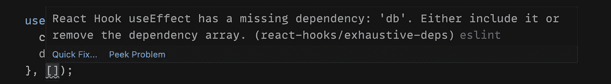

# 技术失败#1: React 挂钩依赖性

> 原文：<https://medium.com/nerd-for-tech/technical-failure-1-react-hooks-dependencies-f7d8e24effcf?source=collection_archive---------31----------------------->

[React 在 16.8](https://reactjs.org/blog/2019/02/06/react-v16.8.0.html) 引入了钩子，一切都变了。钩子提供了一个机会来制造具有状态和生命周期的功能组件。新方法需要重新定义如何在 React 中编写代码的心智模型。没有完全转换到新的方法会导致问题。

技术领导者的工作充满了决策。你需要在一开始就做出决定，即使在项目的最后阶段，它们也会对项目产生影响。这一系列文章是写给那些想从我的错误中吸取教训的人的:

1.  React 挂钩依赖关系

# 情况

假设我们有一个状态经常变化的根组件和一个连接到后端的组件。

这段代码每 3 秒更新一次组件状态。每次计数器增加时，组件被重新渲染。这导致每次计数器改变时调用`getArticles`方法。

# 为什么会这样？

React 在比较依赖关系时使用引用相等来决定是否应该运行`useEffect`回调。在这种情况下，以下赋值:

```
const db = DBConnection();
```

每次渲染`db`都会改变它的引用，即使这个变量的值和之前一样。

这就是为什么每次组件被渲染时`useEffect`回调都会运行:

```
useEffect(() => {
  console.count("get articles");
  db.getArticles().then(setArticles);
}, [db]);
```

# 糟糕的决定

我的决定似乎是最容易也是最简单的。当我将`db`与`useEffect`或任何挂钩一起使用时，我只是省略了这种依赖性。代码看起来是这样的，开始时一切都很好:

```
const db = DBConnection();useEffect(() => {
  console.count("get articles");
  db.getArticles().then(setArticles);
}, []);
```

# 最糟糕的决定

有一件事仍然困扰着我。我从 eslint 得到一个警告，即`db`依赖项应该包含在依赖数组中。



Eslint 规则警告

在糟糕的决定之后，还有一个更糟糕的决定。我用`eslint-disable-next-line`抑制了所有这些。这导致我在每个文件中多次使用它，代码失去了很多可读性。

# 正确的方式

我们需要做的一切就是记忆`db`并将其添加到依赖数组中。

为什么这是最好的方法？

*   `DBConnection`可以进行多个数据库实例的连接。我们希望保持尽可能少的联系。这就是我们创建数据库连接的一个实例的原因。
*   传递`db`实例确保当实例改变时，我们再次获取文章。

```
const db = useMemo(() => DBConnection(), []);useEffect(() => {
  console.count("get articles");
  db.getArticles().then(setArticles);
}, [db]);
```

# 结论

你可以在 [codesandbox](https://codesandbox.io/s/blue-shadow-72mhw?file=/src/App.js:556-690) 上查看正确的代码。犯错是我们学习的方式。发展是根据结果做出决策并得出结论。

如果你有任何问题，请在下面的评论中告诉我。[你可以在推特上找到我。](https://twitter.com/Perfect7M)