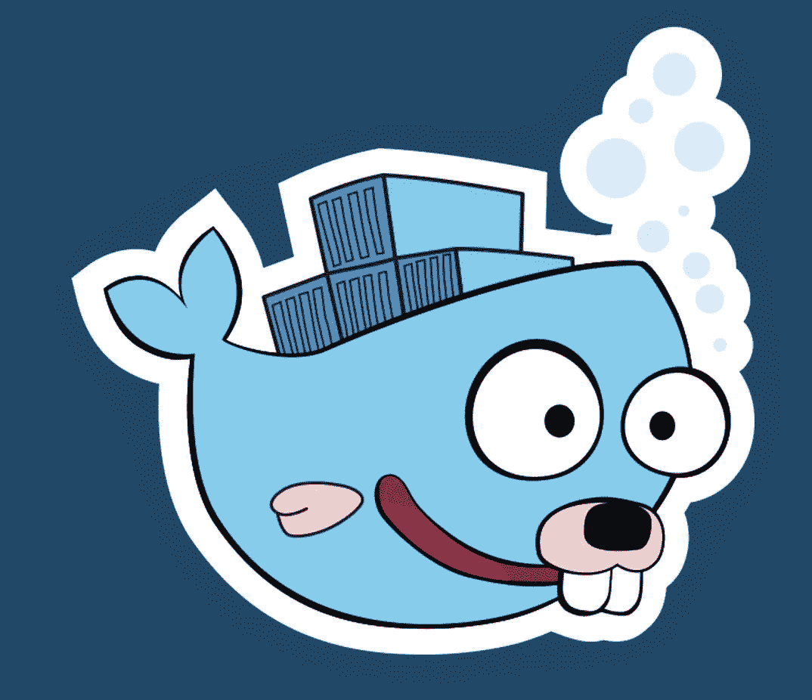
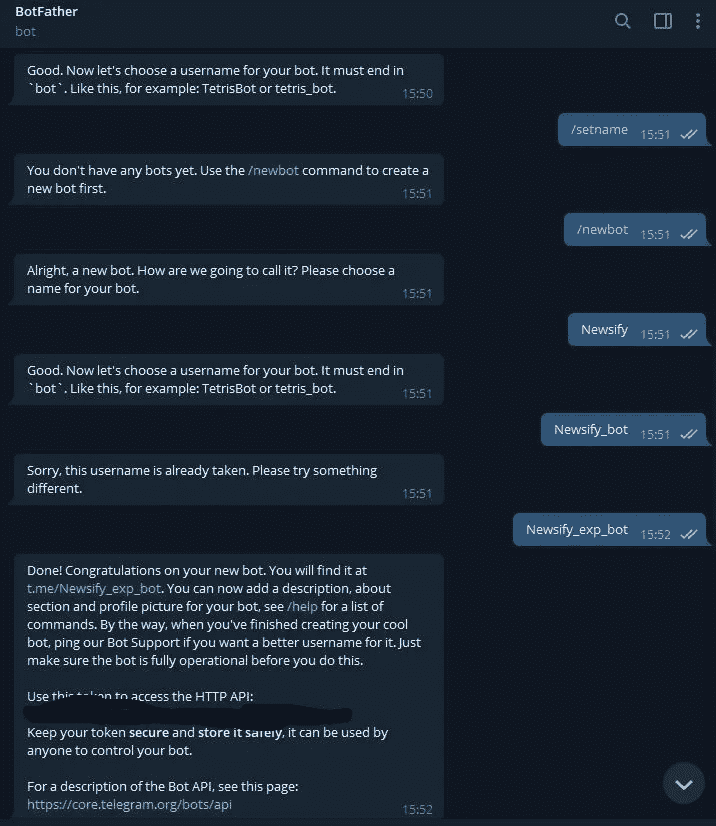
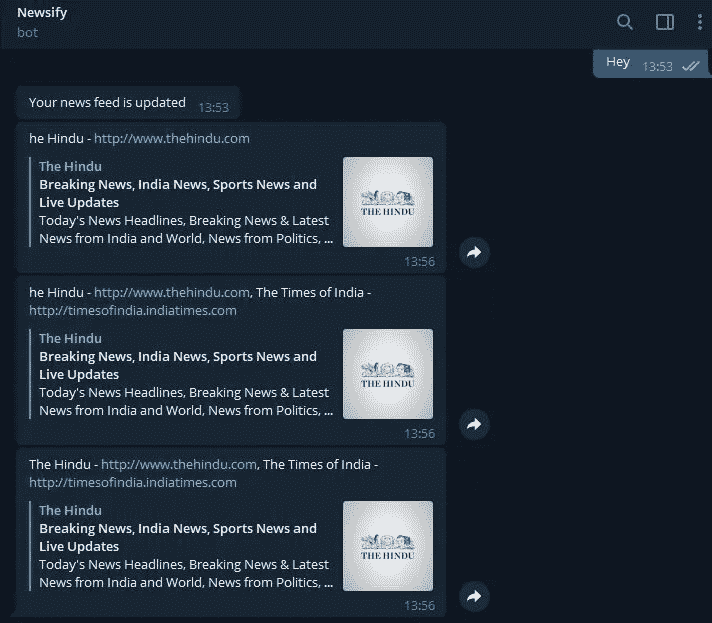
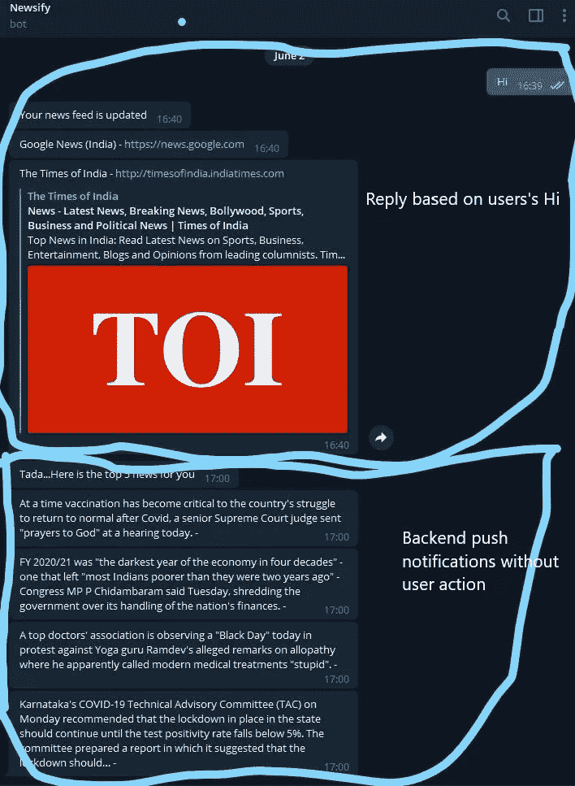

# Go 应用中的电报机器人

> 原文：<https://medium.com/nerd-for-tech/telegram-bot-in-go-app-911c92f8507d?source=collection_archive---------4----------------------->

通知是任何面向消费者的应用程序的重要组成部分。有各种各样的通知，向用户发送移动推送通知是一种主要机制。但是应用程序通知有一个警告，你需要有一个面向消费者的客户端或应用程序。

我是一个后端的家伙，并没有真正得到任何经验，建设面向用户的 UI 或仪表板。我喜欢尝试构建一些有用的东西，但懒得为它构建一个前端或应用程序。我有时甚至让我的同事为我建造它，但没有金钱上的激励，要么他们否认，要么一路上失去兴趣。最近，我想到了这个发送通知的电报机器人的概念，并有兴趣了解它。

> 我觉得它会有所帮助的主要用例有:
> 1。在 telegram 聊天应用程序上为用户建立通知机制。
> 2。通知可以通过 API 端点链接连接到您的后端，这可以用来在浏览器中打开一些 URL。
> 3。提醒或促销活动。

# **用例**

我试图解决的用例是:
1。我的新闻应用后端同步来自谷歌新闻的新闻。
2。telegram 上的用户订阅了这个机器人。
3。当用户键入“Hi”时，我需要将当天的前 5 个新闻链接发送给订阅者。重要的一点要注意的是，该网址是出版商的，而不是我的后端。
4。cron 也在后面运行，它收集当天的前 5 条新闻，并将通知推送给机器人的所有订户。

> PS:我不会讨论新闻应用后端，我会在之前的博文中提到。这篇文章只详细介绍了电报机器人以及它如何使用推送通知来传递新闻。

我们开始吧！首先，让我们在 telegram 中创建新的机器人。这个 [***链接***](https://core.telegram.org/bots/#3-how-do-i-create-a-bot) 用电报记录了 bot 世界的每一个方面。因为这是在应用程序本身上完成的，所以我将重点介绍项目符号中的步骤:

> 1.telegram 中所有机器人中最大的爸爸就是机器人爸爸。你需要找到这一点，并与它聊天，以创建一个机器人。聊天中所有的机器人对话都以“/start”开头。
> 2。高亮显示命令序列
> >>/开始
> >>/newbot
> >><bot _ name>
> 就是它了。一个机器人被创建。附上相同的截图

> 现在你可以访问 t.me/的网址***<机器人用户名>*** ，将你的机器人添加到你的聊天列表中。或者你可以在应用程序中搜索你的机器人。

机器人准备好了。现在您可以探索机器人提供的各种功能。

# **与 bot 的后端集成**

为了通过你的后端服务器与你的机器人交互，你需要

1.  一个身份验证令牌——在 botfather 中创建机器人时就可以获得
2.  了解电报聊天 API——参考上面分享的关于 API 文档的链接
3.  你自己的后台。

如前所述，可以有两种通知机制—拉和推。1.拉机制将轮询电报更新 API，以获取关于谁订阅了您的 bot 或您的订阅者发布了什么消息的信息。这必须定期运行。并基于接收到的更新做出响应。

> [https://api.telegram.org/bot<授权令牌>/获取更新](https://api.telegram.org/bot1853514787:AAHEi4brq8vXE39sYIqPTfFzfYNPvDDWmY0/getUpdates)

2.另一个机制是 push，其中我们的后端从 telegram 服务器实时接收任何使用 webhooks 的用户操作的更新。这是我选择的机制，因为这更现实，并提供更好的 UX。在我的终端创建 API，并将其注册为 webhook。

> https://api.telegram.org/bot<授权令牌> /setWebhook？url = {您的 API 服务器 url}

3.电报发送 API 用于将通知从我们的后端推送到电报机器人。

> https://api.telegram.org/bot<授权令牌>/发送消息？聊天标识= {聊天标识} &文本= {文本}

> 说够了！！！给我看看代码...

**实体/数据层**

**服务层**

**电报 HTTP 客户端**(认证密钥被移除)

这就是了。这段代码足以向 bot 订阅者发送通知。
*又提起这个。由于方法是使用 webhooks 的* ***实时更新*** *并从我们的服务器回复电报 bot 订户，所以可以从电报订户更新中提取并回复* ***发送 API*** *中所需的****chat _ id****信息。
另一种方法是将****chat _ id****保存在某个存储中(我使用 cassandra 表)。这可以在以后用于将消息推送给订阅者，而不需要任何订阅者动作，作为提醒通知机制。我用它来像 cron 一样定期通知。*

用新闻链接回复用户

后端启动对话作为通知