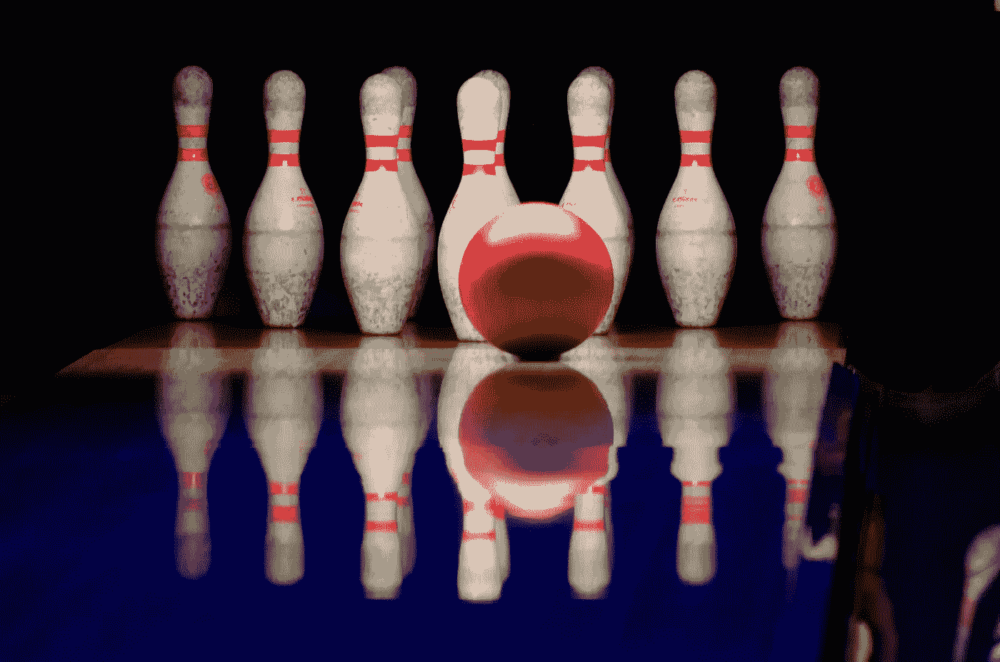
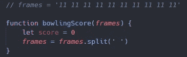
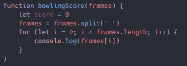
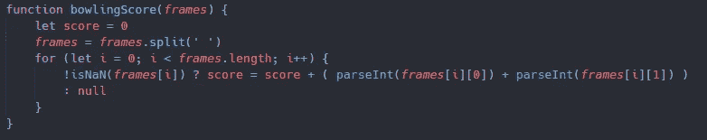
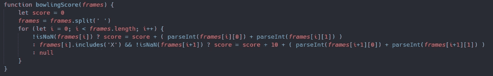
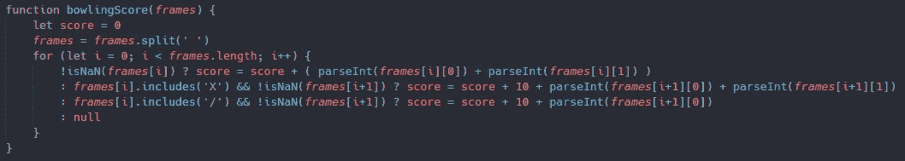
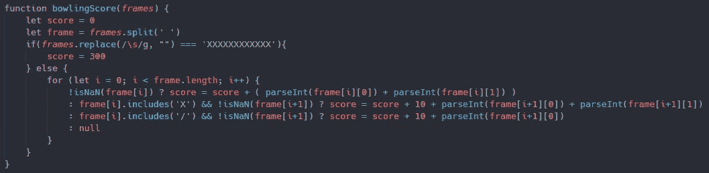
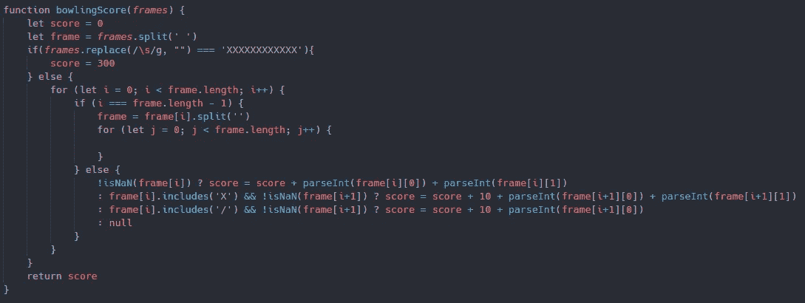
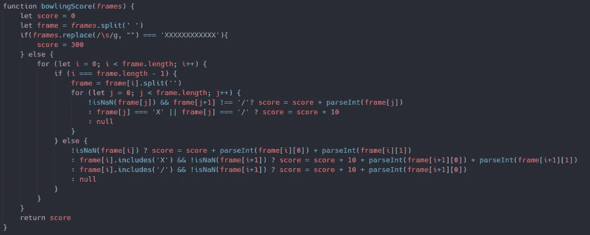

# 十瓶保龄球挑战赛 I

> 原文：<https://medium.com/nerd-for-tech/ten-pin-bowling-challenge-i-be1e6eed8813?source=collection_archive---------3----------------------->

## JavaScript 编码挑战

我相信你们大多数人都熟悉保龄球这个游戏，通常是用十个瓶来玩的。今天，当地的保龄球馆需要我们的帮助，并要求我们创建一个名为保龄球评分的功能。您可能已经猜到了，但是我们的保龄球得分函数需要返回保龄球手的数字得分。为了得到这个分数，我们将得到一个代表玩家 10 帧的数组。每一帧可以用三个值来表示，一个“X”代表一次打击，一个数字和一个“/”代表备用，或者最后是一个数字值，如果你不能拿起前一个。

系好安全带，我们先来看一下我们需要开始的背景信息，然后一步一步地看我的解决方案。这个代码挑战可以在[代码大战](https://www.codewars.com/kata/5531abe4855bcc8d1f00004c/train/javascript)中找到，但是我不会给出所有的答案。

**基础知识**

在我们开始之前，我们将会介绍一些游戏的基础知识，这样我们就知道应该如何构建这个函数。在前 9 局中，每个玩家最多有两次机会击倒所有的瓶子。如果他们能够一次完成，当前帧将结束。在第 10 帧，也是最后一帧，玩家每次都有机会获得一个额外的角色，最多三个。同样值得注意的是，罢工或备件不提供任何奖金在最后一帧。如果你熟悉如何记分，请跳过下一部分，否则我们就直接开始吧。

**得分**

知道如何破译我们每一帧的分数也很重要，但不要担心，因为这并不复杂。举个例子，我们的第一帧有一个 14 的数字分数。第一个数字代表我们第一次掷骰子击倒的瓶数，第二个数字是我们第二次掷骰子击倒的瓶数。(1 + 4) = 5，数值的简单转换但是罢工和备件呢？

如上所述，我们的罢工将用“X”表示。这是玩家在第一次扮演角色时击倒所有的瓶。在前九帧中，除了在前两个角色中获得的分数之外，这将是自动的十分。例如，假设我们为第一帧投了一个好球，为第二帧投了一个 72，表示为[ 'X '，72]。在这种情况下，我们的罢工将等于 19，因为(10 + 7 + 2) = 19。我们的第二帧通常会被评分为 9 分。

最后但同样重要的是，我们还有 spare，它也表示为“6/”或“/”，这取决于格式，但为了以防万一，请注意这两种情况。得分备件完全类似于罢工，但有一个区别。而不是抢分数，为未来两个角色只会抢一个，下一个滚动后。举个例子，我们在第一次掷骰子的时候能够捡起备用的，但是在第二次掷骰子的时候只能得到 52 分，表示为[ '4/'，' 52' ]。我们第一帧的分数是 15，因为(10 + 5) = 15。我们的第二帧通常也将被评分为 7 分。

唷！还有一些更多的术语和其他方式来获得多重打击，如一个双杀，一个火鸡，一个四袋以及连续的多个备用球，但我现在计划保持这个功能简单。如果有需要，觉得有必要让这个功能尽可能完整，我授权你这样做，并进一步研究这个游戏！如果你能等到 [***第二部***](https://real-kevbot.medium.com/ten-pin-bowling-challenge-ii-6b082796f07d) ，我们会让这个功能齐全，没有双关的意思。

**解决方案**

现在我们终于进入了它的肮脏部分，让我们通过抓取[***repo***](https://github.com/TheRealKevBot/TenPinStarter)*的副本来开始编码，并开始构建那个函数！*

*当我们开始时，有两件事我将从一开始就做。第一个是创建一个分数设置为零的变量，这将是我们总分数的容器。第二，我们的框架呈现给我们的是一个长字符串，每个分数之间有空格。因为我已经想到我将需要单独地循环通过每一帧，我可以从那些空间中分离出那串帧。通过将它重新分配给帧，我们现在有了一个数组，每个索引是一个单独的帧。*

**

*现在我们的框架格式更友好了，让我们从创建一个 for 循环开始，这样我们就可以访问我们的每个值了。然后，我们可以基于当前索引控制台记录我们的帧数组。下面我们来看看。*

**

*现在我们已经获得了每个值，让我们开始把这些分数加起来！如你所知，我们需要考虑到我们不仅仅是在处理数值，所以这是我们需要创建一些条件语句的地方。在我看来，第一个也是最简单的是，如果我们当前的框架是一个数字，那么我们将首先使我们的分数等于分数，这确保了我们继续保持当前的分数。然后，我们将需要解析当前帧索引的整数，然后将它们加在一起。虽然这听起来有点疯狂，但看一看它确实有助于理解正在发生的事情。*

**

*现在，我们的数值条件已经不存在了，让我们开始为罢工创建条件。条件的第一部分将检查 X 是否包含在当前帧中，其次，我们需要确保下一帧也是一个数字。然后，我们将需要重新分配分数到分数加 10 加上接下来的两次掷骰，因为这毕竟是一次全中。你会发现这和我们的第一个条件有一些相似之处。*

**

*正如你可能已经猜到的，我们还需要另一个条件声明来覆盖我们的付款人，如果他们得到一个备用的。我们将类似地检查以确保我们的当前帧包括一个斜线，并且下一帧是一个数字。如果这一切都检查过了，我们将再次重新分配分数，就像我们以前做的那样，但只会从下一帧中抓取第一卷。我们来看看加法。*

**

*对我来说，我们目前的测试似乎涵盖了大多数基础知识，除了少数几个，其中之一是如果有人应该得到一个完美的游戏。我们可以用很多方法做到这一点，但是因为我们让备用和攻击功能相对于它们本来的功能来说非常简单。我们将稍微改变一下我们的代码。*

*我们将在我们的循环之外创建一个条件，如果我们的框架等于一个完美的游戏，12 击，我们甚至不会进入我们的循环，因为我们没有太多。我们可以通过将它放在 else 语句中来做到这一点。我还想指出，在这个方法中对框架字符串使用 replace 将返回一个没有空格的字符串。让我们快速浏览一下我们所做的更改。*

**

*现在我们已经建立了处理一个完美游戏的条件，但是我们仍然忘记了一些事情，这很重要。你知道这是什么吗？我们刚刚在 for 循环中创建的所有这些条件，只有在前 9 帧时才成立。我们失去了罢工和备件的奖金，这反过来需要一个不同的方程，如果他们出现在最后一帧。为此，我们只需在循环中创建另一个 if else 语句。*

*到目前为止，我们在循环中完成的所有内容，所有的三元条件语句，都可以放在 else 语句中。我们的 if 语句只有在最后一个索引时才会执行，所以我们把它作为条件。从这里我们有几个选择，但我要做的几乎和我们对框架所做的一样，但规模要小得多。我们要做的第一件事是将最后一帧分割成单个值，因为这会有点复杂。让我们快速浏览一下下面的设置。*

**

*现在我们有了更小的二级循环来添加这些条件。我将遵循与其他三元条件句相似的结构。我将首先检查它是否是一个数字，以及它后面是否有另一个数字。这样做的原因是因为一个数字后跟一个斜杠，或者两者都是备用的，该数字无关紧要，因为备用的值将覆盖它。因此，如果是一个数字后面跟着另一个数字，它将被添加到我们的总得分中。如果我们的框架等于 X 或/，我们将在总分上加 10。让我们看看完整的代码。*

**

*这可能看起来像一个负载很重的函数，有许多事情在进行，这与事实相差不远。但是我们已经完成了保龄球评分函数的基础版本。我们能够通过所有提供的测试用例，但仍然缺少一些部分。如前所述，这主要与这样一个事实有关，即我们只设置了三元条件，以便在备用或罢工后面跟一个数字的情况下工作。在第二部分中，我们将添加条件来处理这样的事件以及一些重组。记住，先把它做好！*

*我要感谢你的阅读，并希望你学到了新的东西！看看 [***第二部***](https://real-kevbot.medium.com/ten-pin-bowling-challenge-ii-6b082796f07d) ！请关注未来的更多文章！*

*如果你想查看这些例子的副本，或者只是作为参考，你可以在这里找到 GitHub Repo [的链接](https://github.com/TheRealKevBot/TenPinBuild)。*