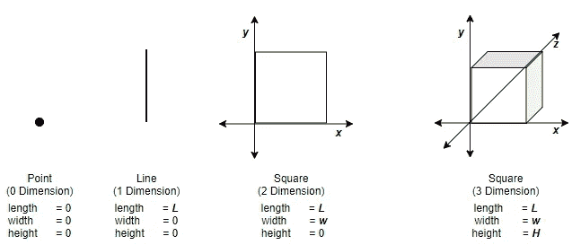
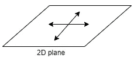
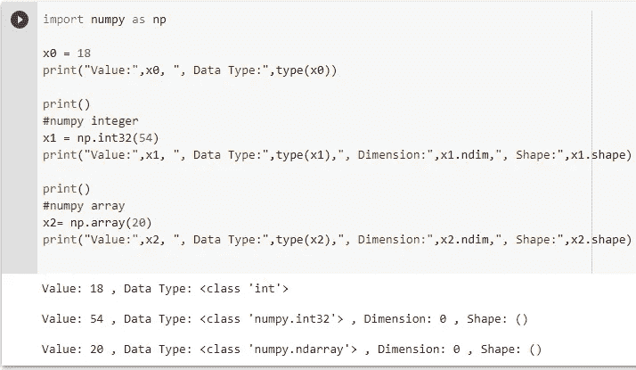
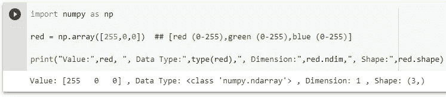
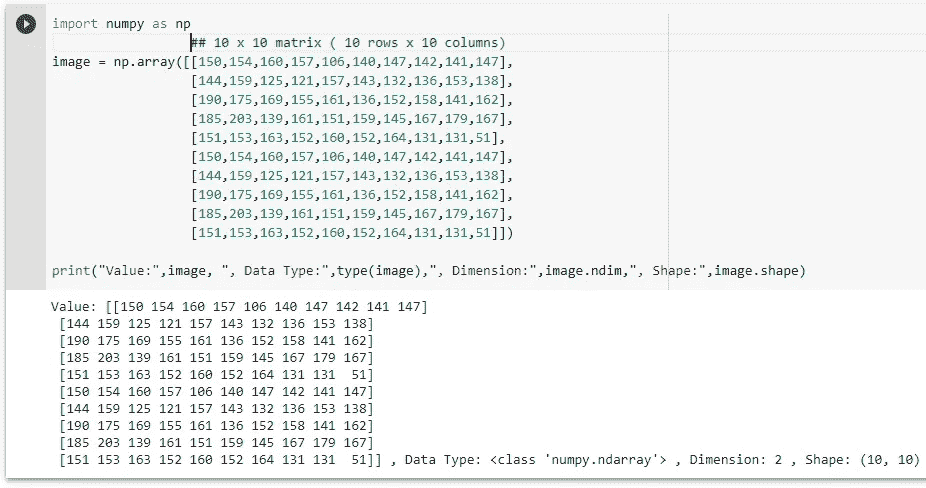
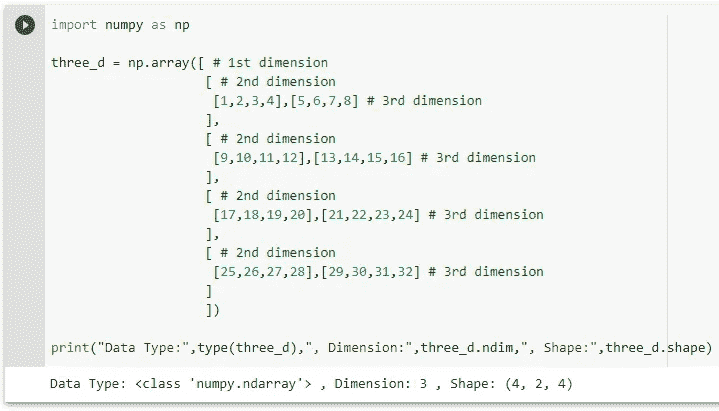

# 张量:深度学习的数据结构

> 原文：<https://medium.com/nerd-for-tech/tensor-data-structure-for-deep-learning-98726ade8c0a?source=collection_archive---------12----------------------->


艾莉娜·格鲁布尼亚克在 [Unsplash](https://unsplash.com/s/photos/neural-network?utm_source=unsplash&utm_medium=referral&utm_content=creditCopyText) 上的照片

*这是一篇关于什么是张量及其 3 个重要属性的短文。*

无论是卷积神经网络(CNN)、递归神经网络(RNN)、强化等，我们都必须为算法提供一些输入。这些很可能是数字输入。例如，图像分类的输入可能是像素数和 RGB 值。

在传统的编程语言中，我们通常初始化特定类型的输入变量，如字符串、布尔、整数、浮点、数组、映射、自定义数据类型等，并为这些变量赋值，这些变量将在程序的后面部分使用。在深度学习(或机器学习)的情况下，我们将使用复杂的大型数据集，以适当的结构呈现输入数据变得很重要，这种结构可以馈送到神经网络，同时也是可表示的。

## 在数学中，张量是线性代数中使用的数据结构，表示为 n 维数组。

让我们复习几个线性代数和几何的术语。

# 尺寸

它是物体的大小或物体在一个方向上的距离的度量。



# 飞机

```
In [mathematics](https://en.wikipedia.org/wiki/Mathematics), a **plane** is a [flat](https://en.wikipedia.org/wiki/Flatness_(mathematics)), two-[dimensional](https://en.wikipedia.org/wiki/Dimension) [surface](https://en.wikipedia.org/wiki/Surface_(mathematics)) that extends infinitely far. The 2 dimensions are denoted by x and y and are called as parameters.
```



# 标量(0 维张量)

任何可以用实数表示的量都叫做标量。这意味着一个人的高度，一块砖的重量，房间的温度等等都是标量。这个数字可以是正数，也可以是负数。例如，温度读数-18C 是一个有效的标量。你也可以说一个标量只是一个**点**，因为它只有大小，没有长度、宽度或高度，因此它没有维度。

在深度学习中，只包含 1 个数字的张量称为标量。如果你仔细注意，我们不称它为数字，而是说它是一个 0 维的张量，包含了许多整型或浮点型。这意味着，即使我们在这里处理实数，我们通常也不会将它作为原始输入(整数或浮点类型)使用，而是将其转换为张量类型并使用它。像 NumPy 这样的库可以帮助我们做到这一点。



**x0** 、 **x1** 和 **x2** 的值都是整数。唯一的区别在于数据类型。x0 属于 **int** 类型，而 x1 和 x2 分别属于 **numpy.int32** 和 **numpy.ndarray** 类型。由于 **numpy** 将 x1 和 x2 转换为张量，我们能够执行类似于 **ndim** (numpy 函数获得张量的维度)和 **shape** 的函数(我将在下面解释)。对于 x0 不能这样做，因为它不是张量，不包含维度和形状属性。

在这种情况下，由于 x1 和 x2 是标量，我们得到的维数为 0，形状为 0，但关键是这些变量是张量。

# 向量(一维张量)

一个用大小来描述的量，除此之外还需要一个叫做方向的参数来描述它自己，这个量叫做矢量。一个简单的例子就是**强制**。力有大小(施加在物体上的力的大小)和方向。如果我们可以在一个水平面上绘制这个量，我们将从一个点(有大小的标量)开始，一直延伸到另一个点，我们将得到一条描述这个量的线段。我们不得不画的拉伸量给了我们**长度/方向**，水平面被称为它的**轴**。因为我们只需要一个轴来描述它，所以它是一维的。

回到深度学习:一组数字称为一个向量。换句话说，要描述一个向量，你需要使用一个标量数组。让我们以颜色为例。在计算机图形学中，颜色是一个矢量。例如，RGB 颜色系统由三个标量红、绿和蓝组成。这三种成分的组合强度决定了输出颜色。



# 矩阵(二维张量)

矩阵由一组向量组成，有 2 个轴，通常称为行和列。

最简单的例子(也是最常用的例子)是显示单元，例如:计算机显示器、液晶显示屏、电视机等。屏幕是固定行数和列数(1920x1080，1024x768 等)的矩阵，称为分辨率。如果行和列可以分别表示为 x 和 y，那么在屏幕上(x，y)的每个交叉点，我们得到一个**图像元素或像素:屏幕上显示的任何图像的基本单位**。对于灰度图像，像素值(或其强度)的范围是 0-255 之间的任何值。

如果我们考虑一个非常小的 10x10 像素的图像，它可以表示为:



# 三维，4D 和 5D(高维张量)

如果我们有一个 2D 张量阵列，它将形成一个三维张量。类似地，如果我们有一个三维张量阵列，它将形成一个 4D 张量，一个 4D 张量阵列将形成一个 5D 张量。高维张量用于处理高度复杂的任务，如图像和视频处理。



# 等级、形状和数据类型

张量有 3 个属性:

1.  秩或维数:张量的轴数称为它的秩。对于标量，它是 0；对于向量，它是 1；对于矩阵，它是 2，依此类推。我们上面使用的 numpy 库的 **ndim** 函数显示了给定张量的秩或维数。
2.  形状:对于给定的特定秩的张量，其形状将是沿着其每个轴的元素的数量(或者也称为维度，但这不同于秩)。对于标量示例，我们看到形状为 0，因为它没有任何轴。对于 vector 示例，形状显示为 3，因为它有一个包含 3 个元素的轴。对于矩阵示例，形状是(10，10)，因为它有 2 个轴，每个轴包含 10 个元素。对于 3d 张量示例，形状是(4，2，4)，因为它具有 3 个轴，并且在第一轴上包含 4 个元素，在第二轴上包含 2 个元素，在第三轴上包含 4 个元素。
3.  数据类型:这是张量中包含的数据类型。

# 结束语

我刚刚开始研究深度学习，花了一些时间来理解张量的概念。这篇文章是为了记录我到目前为止对 tensors 的了解，并与社区分享。

在我的下一篇文章中，我将分享几个可以在张量上执行的数学运算的例子。

欢迎评论和意见。感谢你花时间阅读这篇文章！

# 参考

1.  用 Python 进行深度学习:Francois Chollet
2.  线性代数:维基百科