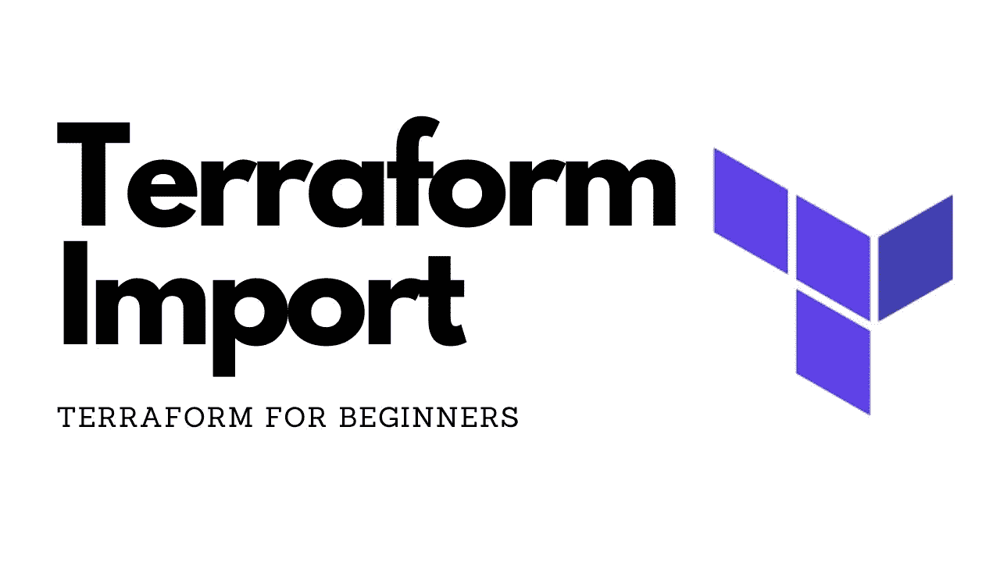
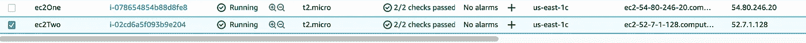
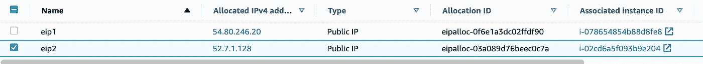

# Terraform 导入现有 AWS 资源

> 原文：<https://medium.com/nerd-for-tech/terraform-import-existing-aws-resources-c1f1b4b19f87?source=collection_archive---------0----------------------->



还有…也许是高级的😂

使用变量和条件语句

# 在我们开始之前…

确保您有一个 AWS 帐户，以便在您自己的环境中进行测试。你还需要知道如何编写一些基本的地形。在这篇文章中[大部分]我们不会写高级的地形。事实上，在这篇文章发表前几天，我自己从未在 terraform 内部编写过条件语句，直到工作中出现了某种情况。

*使用案例:*

您的工作场所最近(像大多数公司一样)采用基础设施作为代码(以云不可知的形式)工具 Terraform。最近，已经使用模块(可重用代码)在 terraform 中建立了基础设施，但是您现在需要将所有 ec2 实例、rds 数据库和弹性 IP 导入到您的存储库中。

令人欣慰的是，HashiCorp 有很好的文档，我们将参考这些文档。

# **调教**

在我的 AWS 帐户中，我已经手动启动了 2 个 ec2 实例(t2.micro —免费层)、一个免费层 MySQL rds 实例和 2 个弹性 IP。



ec2 实例



弹性 ips


rds MySQL 实例

# 地形模块

许多公司使用被称为可重用代码的模块。模块看起来更整洁，但是“子模块”也称为资源块配置是模块(父模块)的动力，我将简要地指出父模块和子模块的区别。让我们回顾一下我们的地形代码。导入后，当我们从 terraform 计划中获得更多详细信息时，我们可以对我们的 terraform 配置进行更改和添加。

```
# --- ec2 instance resources --- #resource "aws_instance" "tfimportec2" {
ami = var.ami[var.region]
#ami IS REGION SPECIFIC - please check which region you are in if you receive an error
instance_type = var.instance_override == false ? var.instance_type : var.no_instance_type_change
key_name = "tf-demo"
}resource "aws_eip" "tfeip1" {
vpc = true 
tags = {
  Name = "Tf-eip"
 }
}resource "aws_eip_association" "eip_assoc1" {
instance_id   = aws_instance.tfimportec2.id
allocation_id = aws_eip.tfeip1.id
}# --- Rds instance resource--- #resource "aws_db_instance" "tfdatabase" {
engine         = "mysql"
engine_version = "8.0.20"
instance_class = "db.t2.micro"
name           = "tf-import-mysql"
allocated_storage = 20
availability_zone = "us-east-1c"
skip_final_snapshot = true
backup_retention_period = 0
apply_immediately = true
username = var.username
```

现在我们已经有了一个基线代码(它可能会出错，但是我们会在出现错误时处理它)

# 地形条件句

[](https://www.terraform.io/docs/language/expressions/conditionals.html) [## 条件表达式-配置语言- Terraform

### 实践:尝试 HashiCorp Learn 上的创建动态表达式教程。条件表达式使用…的值

www.terraform.io](https://www.terraform.io/docs/language/expressions/conditionals.html) 

这是使用变量、值或 null 来完成不同导入情况的关键。

使用案例:

您的公司有一个使用旧实例类型的旧客户。您不想停止它们的 ec2 实例或强制重新创建，所以您需要一个值来覆盖它。Terraform conditional 使用简单的逻辑来实现这个目标。我们将涵盖条件的一个选项，以免混淆:

```
condition ? true_val : false_val
```

让我们将其与 aws_instance 资源的 instance_type 属性进行比较。

```
instance_type = var.instance_override == false ? var.instance_type : var.set_instance_type
```

解释:我们的 instance_type 的值将等于变量 instance_override 的值(这是一个布尔值类型—真/假)，它等于“假”然后(？)terraform 将评估并选择正确的陈述(位于:)。如果 instance_override 的值等于“true ”,则该语句将被呈现为 false，并为我们提供 var.set_instance_type 的值或 false 语句:var.set_instance_type 或(:)的 right

因此，如果我们想要覆盖当前的实例类型，将 var.instance_override 设置为 true，并将 set_instance_type 的变量更改为类似 t3.micro 的值。

```
# --- Partent Module Variables ---child module variables should be empty or default to false ---variable "instance_override" {
type = bool
default = true
}variable "instance_type" {
type = string
default = "t3.micro"
}
```

新地形图:

```
# module.instance.aws_instance.tfimportec2[0] will be updated in-place
  ~ resource "aws_instance" "tfimportec2" {
        id                           = "i-078654854b88d8fe8"
      ~ instance_type                = "t2.micro" -> "t3.micro"
        tags                         = {
            "Name"              = "ec2One"
            "Terraform Managed" = "False"
        }
        # (27 unchanged attributes hidden)# (6 unchanged blocks hidden)
    }
```

现在让我们开始将 ec2 实例导入到模块中…下面首先是父模块。

```
# --- PARENT MODULE --- this calls on the child module which contains the meat and potatoes of the config --- #module "instance" {
source = "../"#note: if you are using a git repo you can use the same link from the clone/download option for the source attribute above, but it will only read from master. Check terraform doucmentation on how to read from branches other than masterinstance_override = var.instance_override 
# or you can just enter the boolen value above true or falseset_instance_type = var.set_instance_type
# or you can enter the instance_type in "string" formatregion = var.region
#or you can enter the region in "string" format
}
```

注意:子模块变量取代父模块变量，除非它们在模块块中明确定义。最佳实践是让子模块变量为 null 或空" "，这样您就可以在父模块变量中设置它们。

导入我们的 AWS 资源的命令:

[https://www.terraform.io/docs/cli/commands/import.html](https://www.terraform.io/docs/cli/commands/import.html)

```
terraform init
```

Ec2 导入:

```
terraform import module.<module name>.aws_instance.<instance name from tf> <instance id from aws>terraform import module.instance.aws_instance.tfimportec2 i-078654854b88d8fe8Elastic ip assocaited with the instance:terraform import module.instance.aws_eip.tfeip1 eipalloc-0f6e1a3dc02ffdf90terraform import module.instance.aws_eip_association.eip_assoc1 eipassoc-098a46cff0b605ded
```

现在尝试导入上述 3 个资源…

在我们导入之前，您可以看到我目前在 terraform 状态下没有资源


现在导入 ec2 实例，然后运行:

```
terraform state list
```

嘣！我们进去了

```
~/Desktop/tfimporttest/modules -- terraform import module.instance.aws_instance.tfimportec2 i-078654854b88d8fe8
module.instance.aws_instance.tfimportec2: Importing from ID "i-078654854b88d8fe8"...
module.instance.aws_instance.tfimportec2: Import prepared!
  Prepared aws_instance for import
module.instance.aws_instance.tfimportec2: Refreshing state... [id=i-078654854b88d8fe8]Import successful!The resources that were imported are shown above. These resources are now in
your Terraform state and will henceforth be managed by Terraform.~/Desktop/tfimporttest/modules -- terraform state list
module.instance.aws_instance.tfimportec2 
```

现在运行 terraform 计划，然后您可以添加任何属性来满足该计划。你要看到更新到位不是 ***替换*** 或者**#部队替换。**

```
# module.instance.aws_instance.tfimportec2 will be updated in-place
  ~ resource "aws_instance" "tfimportec2" {
      - iam_instance_profile         = "Ec2Full" -> null
        id                           = "i-078654854b88d8fe8"
      ~ tags                         = {
          - "Name"              = "ec2One" -> null
          - "Terraform Managed" = "False" -> null
        }
        # (27 unchanged attributes hidden)# (6 unchanged blocks hidden)
    } 
```


您将在上面的资源计划中看到，我们需要在资源配置中添加一些东西，以防止删除一些属性(例如，标签，我是实例配置文件)

新配置:

```
# --- CHILD MODULE --- #
resource "aws_instance" "tfimportec2" {
iam_instance_profile  = "Ec2Full"
ami = var.ami[var.region]
#ami IS REGION SPECIFIC - please check which region you are in if you receive an errorinstance_type = var.instance_override == false ? var.instance_type : var.set_instance_typekey_name = "tf-demo"
tags = {
"Name"              = "ec2One"
"Terraform Managed" = "False"
 }
}
```

现在，导入您想要的以及我们在最终计划中想要的其余任何资源，然后最后讨论“count =”属性，该属性将改变您如何导入从多个相同资源中调配的每个资源。

快速查看导入 rds 资源:

```
terraform import module.<module name>.aws_db_instance.<db instance name from tf> <name of rds db>terraform import module.instance.aws_db_instance.tfdatabase tf-import-mysql
```

现在我们的资源应该都显示在 terraform 状态列表下:

```
~/Desktop/tfimporttest/modules  terraform state list
module.instance.aws_db_instance.tfdatabase
module.instance.aws_eip.tfeip1
module.instance.aws_eip_association.eip_assoc1
module.instance.aws_instance.tfimportec2
```

我仍然有几个更新，但非常小，没有替换:

```
# module.instance.aws_db_instance.tfdatabase will be updated in-place
  ~ resource "aws_db_instance" "tfdatabase" {
      + apply_immediately                     = true
      ~ backup_retention_period               = 7 -> 0
      ~ copy_tags_to_snapshot                 = true -> false
        id                                    = "tf-import-mysql"
      - max_allocated_storage                 = 21 -> null
        tags                                  = {}
        # (39 unchanged attributes hidden)# (1 unchanged block hidden)
    }# module.instance.aws_eip.tfeip1 will be updated in-place
  ~ resource "aws_eip" "tfeip1" {
        id                   = "eipalloc-0f6e1a3dc02ffdf90"
      ~ tags                 = {
          ~ "Name" = "eip1" -> "Tf-eip"
        }
        # (11 unchanged attributes hidden)# (1 unchanged block hidden)
    }Plan: 0 to add, 2 to change, 0 to destroy.
```

任何资源上的 Count 参数:
当导入带有如下 count 参数的资源时，您的 terraform 导入命令必须用单引号将资源的值(count)括起来。

```
# --- ec2 instance resources --- ## --- CHILD MODULE --- #resource "aws_instance" "tfimportec2" {
count = var.count_id
iam_instance_profile         = "Ec2Full"
ami = var.ami[var.region]
#ami IS REGION SPECIFIC - please check which region you are in if you receive an error
instance_type = var.instance_override == false ? var.instance_type : var.set_instance_type
key_name = "tf-demo"
tags = {
"Name"              = "ec2One"
"Terraform Managed" = "False"
 }
}# --- PARENT MODULE ---module "instance" {
source = "../" instance_override = true
set_instance_type = var.instance_type
region = var.region
count = var.count_id
}#---- add this variable in to both the child and parent module for consistency --- #variable "count_id" {
type = number
default = 2
}
```

导入计数为 2 的 aws_instance，我们将执行设置部分中显示的第二个实例:

```
terraform import 'module.instance.aws_instance.tfimportec2[1]' i-02cd6a5f093b9e204
```

[1]作为第二个实例，因为我们已经导入了第一个实例，它应该是具有正确 id 的[0]。对于 eip 和 eip_association，您必须在导入之前使用 count.index 值。

```
resource "aws_eip" "tfeip1" {
count = var.count_id
instance = aws_instance.tfimportec2[count.index].id
vpc = true
tags = {
Name = "Tf-eip"
 }
}resource "aws_eip_association" "eip_assoc1" {
count = var.count_id
instance_id   = aws_instance.tfimportec2[count.index].id
allocation_id = aws_eip.tfeip1[count.index].id
}~/Desktop/tfimporttest/modules  terraform import 'module.instance.aws_instance.tfimportec2[1]' i-02cd6a5f093b9e204
module.instance.aws_instance.tfimportec2[1]: Importing from ID "i-02cd6a5f093b9e204"...
module.instance.aws_instance.tfimportec2[1]: Import prepared!
  Prepared aws_instance for import
module.instance.aws_instance.tfimportec2[1]: Refreshing state... [id=i-02cd6a5f093b9e204]Import successful!The resources that were imported are shown above. These resources are now in
your Terraform state and will henceforth be managed by Terraform.~/Desktop/tfimporttest/modules  terraform import 'module.instance.aws_eip.tfeip1[1]' eipalloc-03a089d76beec0c7a                                module.instance.aws_eip.tfeip1[1]: Importing from ID "eipalloc-03a089d76beec0c7a"...
module.instance.aws_eip.tfeip1[1]: Import prepared!
  Prepared aws_eip for import
module.instance.aws_eip.tfeip1[1]: Refreshing state... [id=eipalloc-03a089d76beec0c7a]Import successful!The resources that were imported are shown above. These resources are now in
your Terraform state and will henceforth be managed by Terraform.~/Desktop/tfimporttest/modules  terraform import module.'instance.aws_eip_association.eip_assoc1[1]' eipassoc-03a089d76beec0c7a
module.instance.aws_eip_association.eip_assoc1[1]: Importing from ID "eipassoc-03a089d76beec0c7a"...
module.instance.aws_eip_association.eip_assoc1[1]: Import prepared!
  Prepared aws_eip_association for import
module.instance.aws_eip_association.eip_assoc1[1]: Refreshing state... [id=eipassoc-03a089d76beec0c7a]Import successful!The resources that were imported are shown above. These resources are now in
your Terraform state and will henceforth be managed by Terraform.
```

现在我们已经导入了所有的资源，我们可以运行下面的命令并将其全部删除。

```
terraform destroy --auto-approve 
```

感谢阅读！如果有任何不清楚的地方，请评论，如果我能帮忙的话，我会回复的！