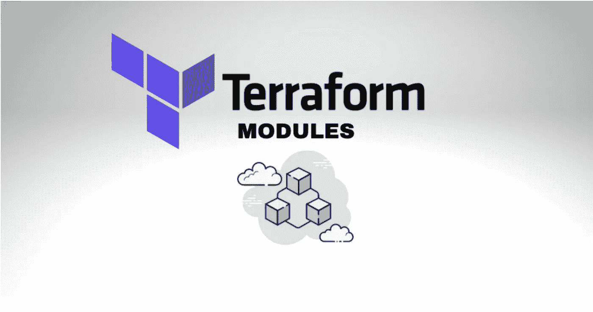
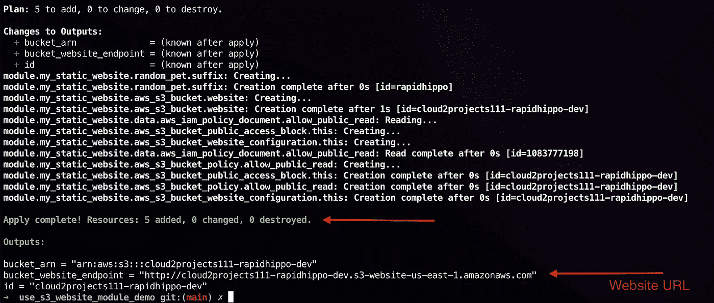
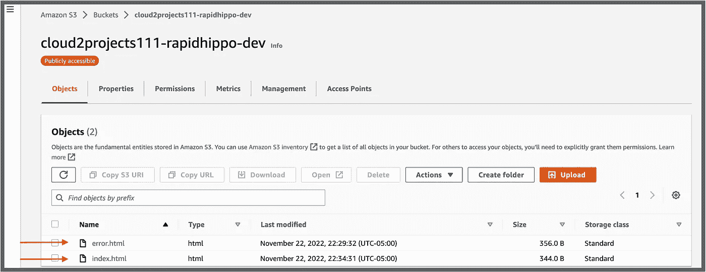
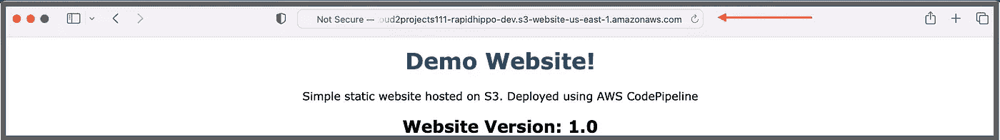

# Terraform 模块 101:在 GitHub 上创建、版本化和发布

> 原文：<https://medium.com/nerd-for-tech/terraform-modules-101-create-version-and-publish-on-github-4455f3673559?source=collection_archive---------0----------------------->

## 关于如何创建和使用自定义 terraform 模块并将其发布到 GitHub 的教程



在这篇文章中，我将使用 terraform 最佳实践演示如何从一个样本配置创建一个可重用的 terraform 模块，并在 GitHub 上发布一个版本，之后我们将创建一个根模块来使用它。尽管将使用一个场景来介绍这一点，但实际上相同的原理可以应用于大多数场景。

**什么是 Terraform 模块？** 一个 Terraform 模块是几个一起使用的资源的分组。Terraform 模块类似于编程中的函数，因为在创建之后，它们可以在代码中的任何地方重用。由一个或多个 terraform 配置文件组成的目录是一个模块。

就像编程中的函数一样，它使用输入变量接受输入参数，并可以使用输出变量返回值。运行`terraform apply`的目录也是一个模块，叫做根模块。您可以将模块发布到注册中心，如 Terraform 注册中心或版本控制系统。支持的信号源列表可在[这里](https://developer.hashicorp.com/terraform/language/modules/sources)找到。

**我为什么要创建版本化模块？当您在不同的环境中使用相同的模块时，版本化的模块特别有用。例如，在您的 prod 环境中，您可以使用一个模块的旧版本(*例如 v1.0.0* )并在您的 dev 环境中安全地测试同一个模块的新版本(*例如 v2.0.0* )。如果没有版本控制，测试新的模块版本会很困难。**

**场景** 您已经获得了下面的地形配置，该配置用于创建一个 AWS [S3 桶来托管一个静态网站](https://docs.aws.amazon.com/AmazonS3/latest/userguide/WebsiteHosting.html)。任务是使它成为一个可重用的模块，并将其发布到您组织内的一个新的 GitHub 存储库中。您还需要将环境名称作为后缀添加到创建的任何 S3 存储桶中。

**解决方案**
转换上述配置文件将遵循以下步骤:
- [创建标准模块目录结构](#acdc)-[编写 Testform 配置即版本、输入、输出变量等](#b212)-
-[创建 GitHub 库，推送文件并创建 GitHub 版本](#4484)
- [创建根模块以使用 GitHub 模块作为源](#f790)
- [测试并应用 terra](#40f0)

**要求**
——terra form、AWS IAM、S3 的基础知识。
- [安装 Terraform CLI](https://developer.hashicorp.com/terraform/tutorials/aws-get-started/install-cli) (1.1+)。
-一个 [AWS 帐户](https://aws.amazon.com/free/?all-free-tier.sort-by=item.additionalFields.SortRank&all-free-tier.sort-order=asc&awsf.Free%20Tier%20Types=*all&awsf.Free%20Tier%20Categories=*all)和一个具有管理权限的 IAM 用户。
- [安装 AWS CLI](https://docs.aws.amazon.com/cli/latest/userguide/getting-started-install.html) (2.0+)并配置访问键。
- [GitHub 账号](https://docs.github.com/en/get-started/signing-up-for-github/signing-up-for-a-new-github-account)

你可以在我的 GitHub 库[这里](https://github.com/yemisprojects/s3_website_module_demo)找到完整的演示模块。

*我们开始吧！*🍿

1.  [**创建一个标准的模块目录结构**](#d56a)一个要分布在单独存储库中的地形模块应该使用下面的[标准模块结构](https://developer.hashicorp.com/terraform/language/modules/develop/structure)。建议将可重用模块放在它们自己的存储库的根目录下。因此，在本地目录的根目录下创建以下文件。

```
$ tree module_directory/
.
├── README.md   
├── main.tf
├── variables.tf
├── outputs.tf
├── LICENSE         #optional
└── versions.tf 
```

文件应该描述模块的用途，包括模块的输入或输出，以及它可以创建什么资源。上面的`.tf`文件名是推荐的并被广泛使用，但不是强制性的。如果你要发布一个模块，建议你包含一个许可，即使是开源许可。

您可以添加一个`examples`子目录来展示如何使用该模块的示例。复杂的目录模块结构还可以包含一个`modules`文件夹，用于嵌套子模块，如下所示。

```
$ tree complete-module/
.
├── README.md
├── main.tf
├── variables.tf
├── outputs.tf
├── versions.tf
├── LICENSE.tf
├── ...
├── modules/
│   ├── nestedA/
│   │   ├── README.md
│   │   ├── variables.tf
│   │   ├── main.tf
│   │   ├── outputs.tf
│   ├── nestedB/
│   ├── .../
├── examples/
│   ├── exampleA/
│   │   ├── main.tf
│   ├── exampleB/
│   ├── .../
```

**2。** [**在`versions.tf`文件中为自定义模块**](#d56a)编写地形配置， ***删除任何提供者块*** ，因为这应该由模块用户进行配置。作为最佳实践，您应该使用`>=`版本约束语法 ***声明您的模块已知使用的最低提供者版本*** 。根模块是您应该使用`~>`或`=`版本约束来指定最高提供者版本的地方，以避免意外升级到不兼容的新版本。

子模块中的 versions.tf

您**添加输入变量以使模块可配置**和能够在调用模块中引用它们作为输入参数，稍后我将在中演示[。下面名为`environment`的变量被创建来接受环境名称作为输入，用作 bucket 名称的后缀。存储桶名称被参数化，因为存储桶名称必须是全局唯一的。](#0e58)

我在创建模块时的指导原则是，从同一个子模块创建的两个相同类型的资源不应该导致冲突错误。这就是为什么输入变量对于创建模块至关重要。

自定义模块中的 variables.tf

`local`变量被添加到`main.tf`文件中以创建表达式，从而有选择地创建唯一的桶名并添加一个环境名作为后缀。如果您不希望自定义模块的用户将输入传递给特定变量，请使用`locals`块。

自定义模块中的 main.tf

调用模块创建的资源被封装，因此如果不使用输出变量导出属性值，就不能从根模块直接访问其属性。例如，如果没有将`bucket_id`定义为下面的输出变量和表达式`aws_s3_bucket.website.id`，那么使用定制模块创建的 S3 存储桶的 *id* 就不能从根模块访问。于是，**创建一个***`output.tf`***文件来导出必需的资源属性值****。**

**自定义模块中的 outputs.tf**

****3。** [**将配置文件推送到 GitHub 仓库并创建发布版本**](#d56a)创建 GitHub 仓库(步骤如有需要此处可用[)。然后，使用下面的命令初始化您创建的本地目录，将文件提交到本地 repo，并将它们推送到新的远程 repo。](https://docs.github.com/en/get-started/quickstart/create-a-repo?tool=webui)**

```
**git init && git add -A
git commit -m "add all module files" && git branch -M main
git remote add origin https://github.com/<github_account_name>/<new_repo_name>.git
git push -u origin main**
```

**要创建新模块的版本，您可以[在 Github](https://docs.github.com/en/repositories/releasing-projects-on-github/managing-releases-in-a-repository?tool=webui) 上创建一个使用标签的版本，或者在本地创建标签，并将它们推送到远程 repo。运行下面的命令来创建我们模块的`v0.0.1`。**

```
**git tag -a "v0.0.1" -m "First release of s3-website module" 
git push --follow-tags**
```

****4。** [**创建一个根模块，并使用 GitHub 模块作为源**](#d56a)
来调用一个模块，即要在一个模块中包含另一个模块的内容，必须创建一个`module`块并使用`source`元参数。`source`值可以是模块目录或已发布模块的本地路径。根据源代码的不同，一个可选的`version`参数用于指定运行`terraform init`或`terraform get`时 terraform 应该下载的模块版本。**

**通常，对于 git 存储库，源参数值可以以`git::`为前缀，后跟协议(ssh 或 HTTPS)。无前缀的`github.com`URL 也被自动识别为 git 存储库。如果模块位于 repo 的子目录中，您将需要指定路径。注意路径前的双斜线`//`。**

```
**source = "git::https://example.com/demorepo.git"
source = "git::ssh://username@example.com/demorepo.git"

#For modules in subdirectories 
source = "github.com/example.com/demorepo//<PATH>?ref=v0.0.1" 
#Example
source = "github.com/yemisprojects/s3_website_module_demo//submodule/service?ref=v0.0.1"**
```

**为了从 GitHub 中选择一个模块的特定版本，使用了下面的`main.tf`文件中所示的`ref`参数。如果没有这个参数，terraform 将克隆存储库的默认分支。`ref`的值可以是标签名、分支或 SHA-1 散列。下面是我们在上一步中创建的标签。**

**根模块中的 main.tf**

**上面的`bucket_name`、`environment`、`tags`参数与之前在自定义模块中创建的[输入变量名完全相同。要访问模块的输出变量，使用`module.<MODULE_NAME>.<OUTPUT_NAME>`。](#3fb4)**

**例如，在名为`*bucket_id*` *的输出变量中，使用表达式`aws_s3_bucket.website.id`在子模块中公开 S3 桶`id`属性。*使用`module.my_static_website.bucket_id`表达式在下面的根模块中访问相同的`id`属性。**

**根模块中的 outputs.tf**

**`versions.tf`文件包括一个提供程序和一个带有更新版本约束的 terraform 块。**

**根模块中的 versions.tf**

**张贴`variables.tf`文件以确保完整性🙂。**

**根模块中的 variables.tf**

****5。** [**测试并应用 terraform 配置并访问网站**](#d56a)您可以克隆我的第二个 repo，它是一个根模块，使用我们创建的自定义模块并应用配置。您可以使用下面的命令来克隆 repo，并应用配置来验证我们的辛勤工作得到了回报。**

```
**git clone https://github.com/yemisprojects/use_s3_website_demo_module
terraform init && terraform plan
terraform apply --auto-approve** 
```

**运行`terraform init`后，远程模块将被克隆到您的工作目录下的`.terraform`文件夹中，如下所示。**

```
**$ tree .terraform 
.terraform
├── modules
│   ├── modules.json
│   └── my_static_website
│       ├── LICENSE
│       ├── README.md
│       ├── main.tf
│       ├── outputs.tf
│       ├── variables.tf
│       └── versions.tf
└── providers**
```

**在`terraform apply`之后，您应该会看到添加了 5 个资源。**

****

**成功的地形应用**

**将同一个 [repo](https://github.com/yemisprojects/use_s3_website_demo_module) 的`website-src`文件夹中的 HTML 文件上传到 S3 桶的根目录。**

****

**S3 桶中的 HTML 文件**

**在浏览器中访问网站 URL，如下所示。**

****

**部署了自定义模块的 S3 托管网站**

**当你完成`terraform destory --auto-approve`时，记得摧毁你的资源。**

****祝贺你！**🙌创建你自己的定制模块并在 GitHub 上发布一个版本。我们还成功测试了该模块，并访问了使用该模块部署的网站。伟大的工作🎉👏。**

**直到我的下一篇文章👋。**

> **“通往成功的电梯坏了。你得走楼梯，一步一步来。”魔鬼成交之乔·吉拉德的 76 条黄金法则**