# Terraform:双层架构

> 原文：<https://medium.com/nerd-for-tech/terraform-two-tier-architecture-f4fe80a95c27?source=collection_archive---------0----------------------->

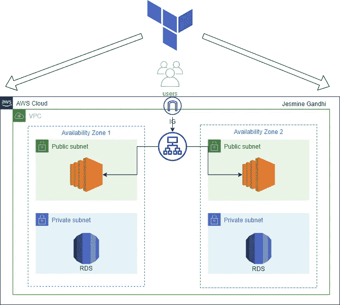

使用 Terraform 的双层架构

**目标:**

您的团队需要您为您的公司绘制和部署一个双层架构。

1.  使用 CIDR 10.0.0.0/16 部署一个 VPC，并使用 CIDR 10.0.1.0/24 和 10.0.2.0/24 部署两个公共子网。为了实现高可用性，每个公共子网应该位于不同的 AZ 中。
2.  使用 RDS MySQL 实例(微型)创建两个专用子网，分别为 CIDR 10 . 0 . 3 . 0/24 和 10.0.4.0/24。每个专用子网应该位于不同的 AZ 中。
3.  将流量导向公共子网的负载平衡器。

## 我们开始吧！

## 先决条件:

*   安装[地形](https://learn.hashicorp.com/tutorials/terraform/install-cli)和 [AWS CLI](https://docs.aws.amazon.com/cli/latest/userguide/getting-started-install.html)
*   GitHub 帐户
*   具有适当权限的 AWS IAM 用户帐户
*   首选 IDE(我使用 VS 代码)

**第一步:**

**将基础设施创建为代码的最佳实践之一是创建变量文件。**

我已经创建了几个变量，如 AWS 地区，VPC，数据库，负载平衡器。这些变量将在代码的不同部分使用。

**第二步:**

**创建具有 2 个公共子网和 2 个私有子网的 AWS VPC**

以下是创建 VPC 的 Terraform 代码要点，已使用变量引用了“ *cidr_block* ”:

下面是创建两个公共子网的要点:

以下是创建互联网网关的要点:

下面是使用 cidr 10.0.3.0/24 和 10.0.4.0/24 创建两个私有子网的要点

**第三步:**

**创建 AWS RDS MySQL 实例**

以下是创建 RDS 数据库(t2 微型)的代码要点:

**注意:**当您提供用户名或密码等任何敏感信息时，这些信息应设置为敏感，如上面的“ *variables.tf* ”文件所示。

像这样的敏感信息应该存储在一个名为“ *secret.tfvars* ”的单独文件中。更多信息可在[这里](https://learn.hashicorp.com/tutorials/terraform/sensitive-variables)找到。

**第四步:**

**创建负载平衡器**

**第五步:**

**创建一个 main.tf 文件，其中包含提供者列表(在我们的例子中是 AWS)**

**第六步:**

**运行 Terraform 命令创建基础设施**

创建所有必需的文件后，第一步是使用以下命令初始化 terraform 后端:

```
terraform init
```

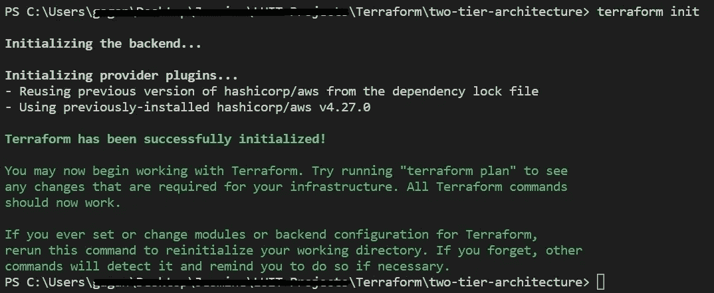

运行 terraform validate 以确保您的代码配置有效:

```
terraform validate
```

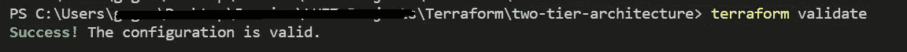

接下来，运行以下命令评估 Terraform 配置-

```
terraform plan
```

这是可选的，但是我建议运行下面的命令以确保您的格式整洁:

```
terraform fmt
```

接下来，运行以下命令来应用您的配置-

```
terraform apply -var-file="secret.tfvars"
```

我在这里使用标记的原因是，我希望代码使用存储在" *secret.tfvars* "文件中的我的数据库凭证。

如果一切运行顺利，没有错误，您应该在控制台中看到类似的结果。

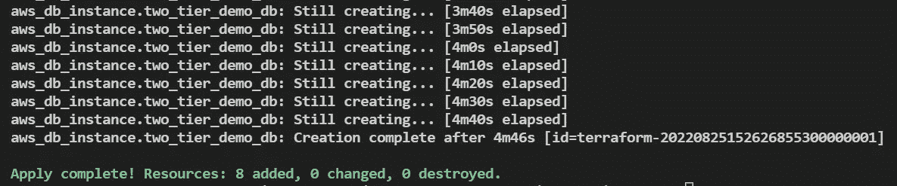

**第七步:**

**验证 AWS 控制台中的资源**

VPC:

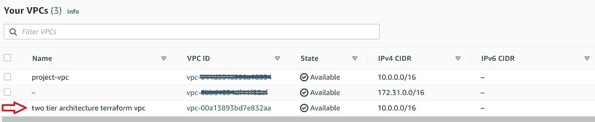

子网:

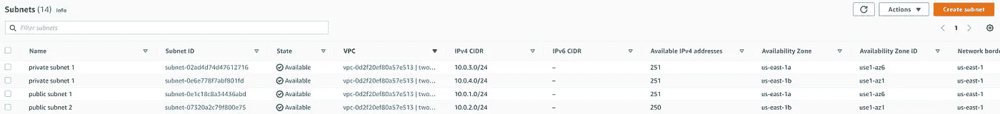

互联网网关:


负载平衡器:

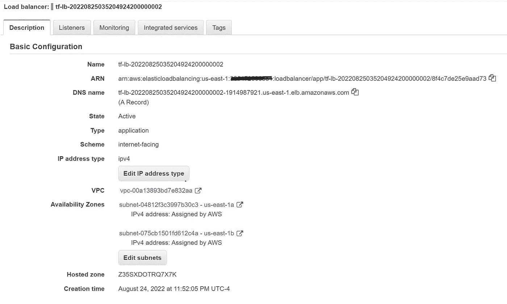

数据库:

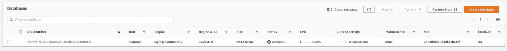

**第八步:**

**删除已创建的资源**

一旦您完成了资源的创建并验证了它，下一步就是销毁所有创建的资源，以避免 AWS 的任何不必要的费用。请小心使用此命令，因为这将删除您创建的整个基础结构。使用以下命令来执行此操作:

```
terraform destroy -var-file="secret.tfvars"
```

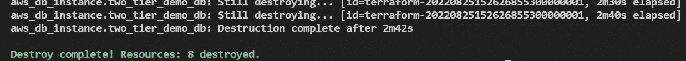

**注意:进行修改**

在生产环境中工作时，您不必删除整个基础结构。只需修改所需的文件(在这种情况下，我将数据库的存储值从 5 修改为 10)并运行“*terra form plan”*。这将显示必要的修改，如下所示:

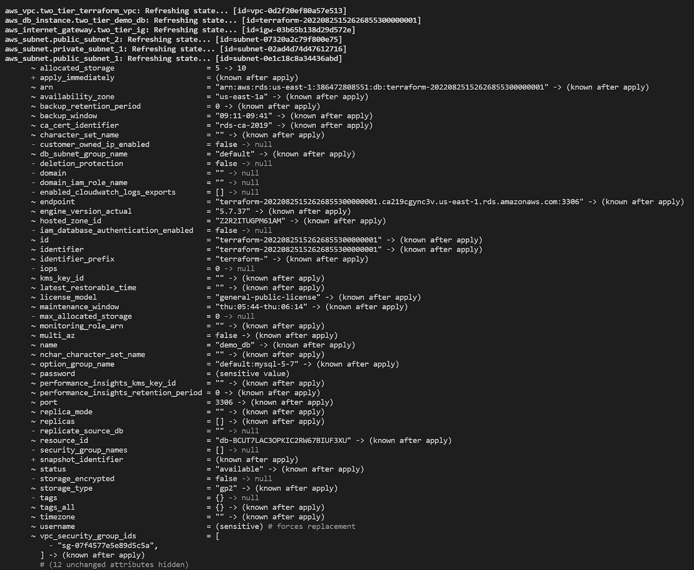

如果您对修改满意，运行*terra form apply-var-file = " secret . TF vars "*刷新状态文件。

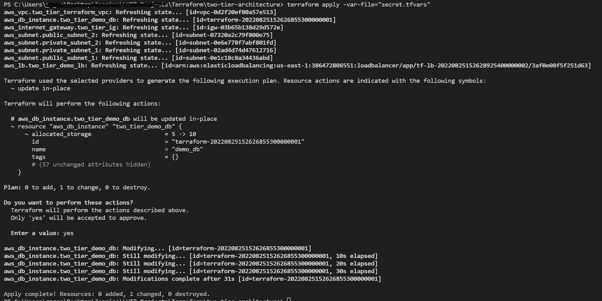

**祝贺您**，您已经使用 Terraform 成功创建并部署了一个 2 层架构。

谢谢你看我的文章！！