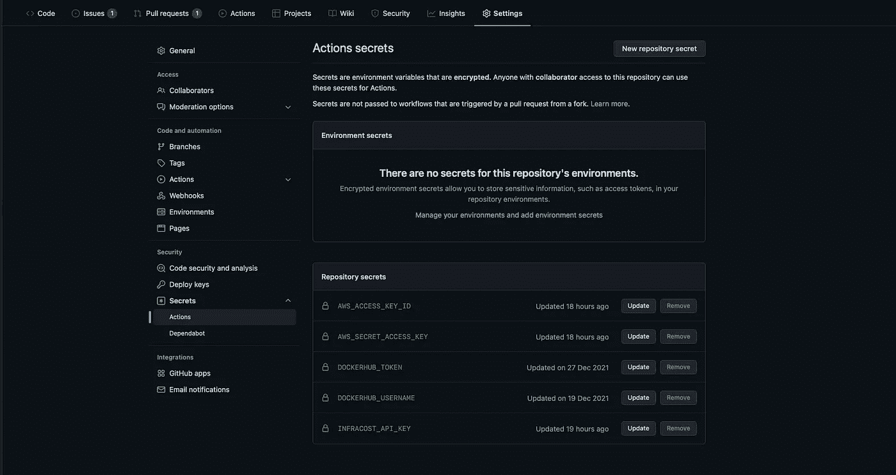
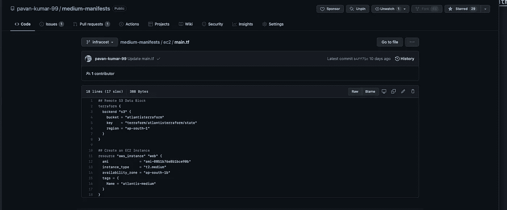
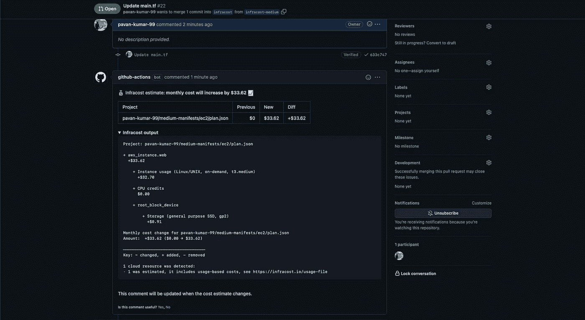

# 用 Infracost 分析地形成本(GitOps 方法)

> 原文：<https://medium.com/nerd-for-tech/terraforming-the-cost-with-infracost-c28dc6c981c9?source=collection_archive---------2----------------------->

用基础成本分析土地改造成本

Terraform 是各种组织使用的主要 IAC 工具之一。在我之前的文章中，我已经解释了 Atlantis 和 GitHub 操作如何被用来以 GitOps 的方式提供基础设施。但是成本呢？GitOps 方法显然使部署变得容易了。开发人员/运营工程师将开始轻松提高 PR，并不断合并它们。但是谁来记录成本呢？我们不能指派一名工程师一直记录成本。假设有 100 个拉动式请求，工程师无法从 AWS 计算器中真正计算出所有 PR 的成本。如果有一种工具可以根据基础设施的变化来评估增量/减量，那会怎么样？啊，太酷了，不是吗？接下来是 [**Infracost**](https://www.infracost.io/docs/) 进入画面。Infracost 显示 Terraform 的云成本估计。它可以让 DevOps、SRE 和工程师们在终端或拉式请求中做出更改之前，查看成本明细并了解成本。这为您的团队提供了一个安全网，因为人们可以在工作流程中讨论成本。使用众多集成中的一个，DevOps、SRE 和工程师们在做出改变之前在拉请求中看到成本估计。这为您的团队提供了一个安全网，因为人们可以提前了解云成本，并在您的工作流程中讨论它们。


基础成本

# 整个故事是关于什么的？(TLDR)

1.  用 GitOps 方法识别和分析成本。
2.  集成 Infracost 和 GitHub 动作。

# 先决条件

1.  GitHub 账户。
2.  AWS 账户。

# 故事资源

1.  GitHub 链接:【https://github.com/pavan-kumar-99/medium-manifests 
2.  GitHub 分支: [infracost](https://github.com/pavan-kumar-99/medium-manifests/tree/infracost)

# 设置基础成本

注册一个免费的 API 密钥，CLI 使用该密钥从我们的云定价 API 中检索价格，例如获取价格，例如类型。没有云凭证或秘密被[发送](https://www.infracost.io/docs/faq/#what-data-is-sent-to-the-cloud-pricing-api)到 API，你也可以[自托管](https://www.infracost.io/docs/cloud_pricing_api/self_hosted/)它。

```
$ brew install infracost$ infracost --version$ infracost register
```

# 设置 GitHub 操作

要了解更多关于 GitHub 动作以及如何将 terraform 与 GitHub 动作集成的信息，我之前的一篇文章 [**这里**](/nerd-for-tech/creating-a-gke-cluster-with-github-actions-dd34e2de50a6) 已经做了很好的解释。所以让我们看看作为本文一部分的实际 Github 工作流文件。

因此，作为这个例子的一部分，我将在 AWS 中创建一个 EC2 实例。因此，如果您看到工作流文件，您会注意到我们为 AWS 添加了几个秘密，还添加了我们之前生成的 InfraCost API 密钥。这个工作流程是这样设计的，一旦有一个 pull 请求提交给分支机构 infracost(第 4 行)，

1.  检查存储库。
2.  安装 terraform 二进制文件。
3.  初始化地形目录。
4.  地形图。
5.  Terraform 显示，保存计划输出。
6.  初始化 Infracost API。
7.  生成 Infracost JSON。
8.  分析成本并对拉动请求进行评论。

干得好。我们都准备好用 GitOps 方法分析成本了。但在此之前，让我们创建必要的 GitHub 秘密。



GitHub 秘密

作为本文的一部分，我们需要以下秘密。

1.  AWS_ACCESS_KEY_ID
2.  AWS_SECRET_ACCESS_KEY
3.  INFRACOST_API_KEY

完成了。现在让我们来看看 Infracost 的运行情况。我已经创建了一个 Terraform 脚本来创建 EC2 实例。



EC2 实例

现在让我们通过将实例类型从 t2.medium 更改为 t3.medium 来创建一个 pull 请求。！激动吗？我也是！！！！

现在让我们检查一下对我[提出的](https://github.com/pavan-kumar-99/medium-manifests/pull/22)拉动请求的评论。



关于成本的评论

因此，如果您仔细观察注释，您应该会看到一个表格，显示以前的成本、新的成本和差异(增量或减量)。以及资源配置及其规格和定价的精确输出。


我看着我所有的钱去了哪里

**清理**

```
$ Delete the worflow files from your Github
```

啊，这些是用 GitOps 方法分析成本所需的所有步骤。我希望你喜欢这篇文章。请随意分享您在成本分析和降低成本活动中的想法和经验。如果您在部署过程中遇到任何问题，请在此处提出问题或随时通过我的电子邮件(**pavan1999.kumar@gmail.com**)联系我。此外，如有任何疑问/咨询，请点击此处 联系 Kubernetes [**。**](https://linktr.ee/bettercallpavan)

以下是我的一些其他文章，你可能会感兴趣

直到下一次…..

# 被推荐的

[](/nerd-for-tech/terraforming-the-gitops-way-9417cf4abf58) [## 地球化吉托普斯之路！！！

### 使用 Atlantis(拉式请求自动化)通过 GitOps 建立 Terraform。

medium.com](/nerd-for-tech/terraforming-the-gitops-way-9417cf4abf58) [](/nerd-for-tech/using-hashicorp-vault-as-a-certificate-issuer-in-cert-manager-9e19d7239d3d) [## 在证书管理器中将 Hashicorp Vault 用作证书颁发者

### 在证书管理器中将 vault PKI 后端配置为证书提供商

medium.com](/nerd-for-tech/using-hashicorp-vault-as-a-certificate-issuer-in-cert-manager-9e19d7239d3d) [](/nerd-for-tech/deep-dive-into-thanos-part-i-f72ecba39f76) [## 深入灭霸——第一部分

### 使用灭霸和普罗米修斯操作员监控 Kubernetes 的工作负载

medium.com](/nerd-for-tech/deep-dive-into-thanos-part-i-f72ecba39f76) [](/nerd-for-tech/chaos-engineering-in-kubernetes-using-chaos-mesh-431c1587ef0a) [## 基于混沌网格的 Kubernetes 混沌工程

### 基于混沌网格的 Kubernetes 混沌工程

用混沌 Meshmedium.com 研究库伯内特的混沌工程](/nerd-for-tech/chaos-engineering-in-kubernetes-using-chaos-mesh-431c1587ef0a)