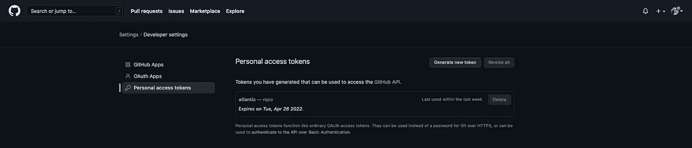
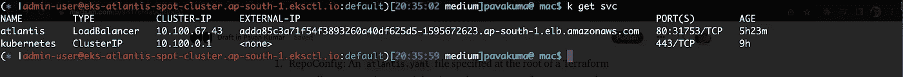
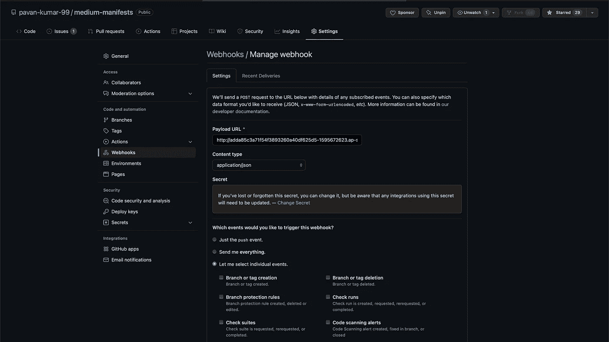
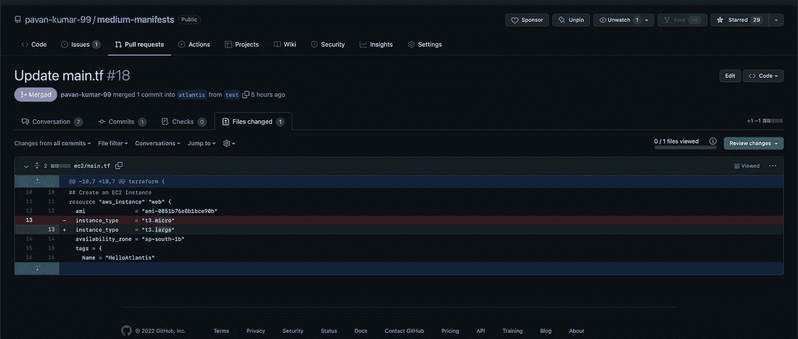
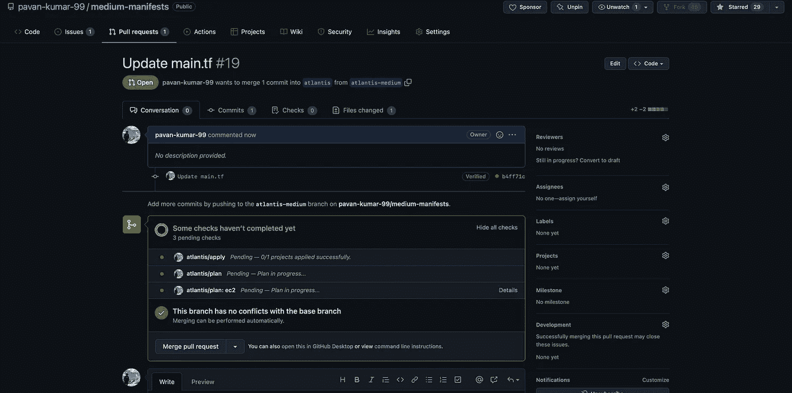
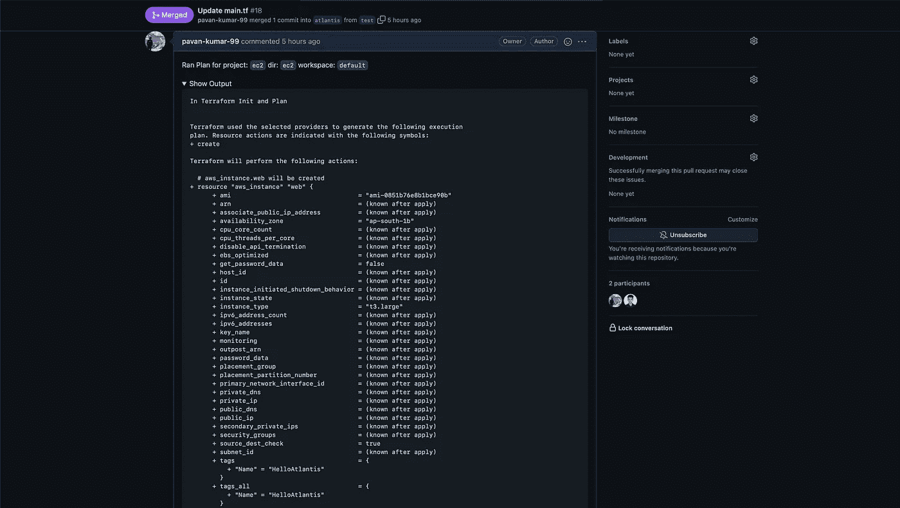
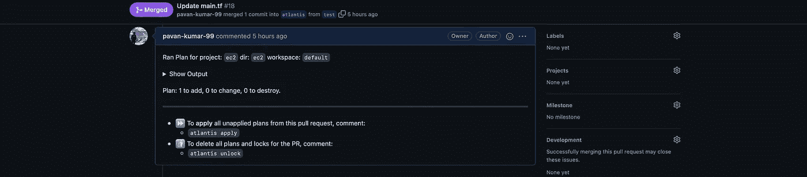
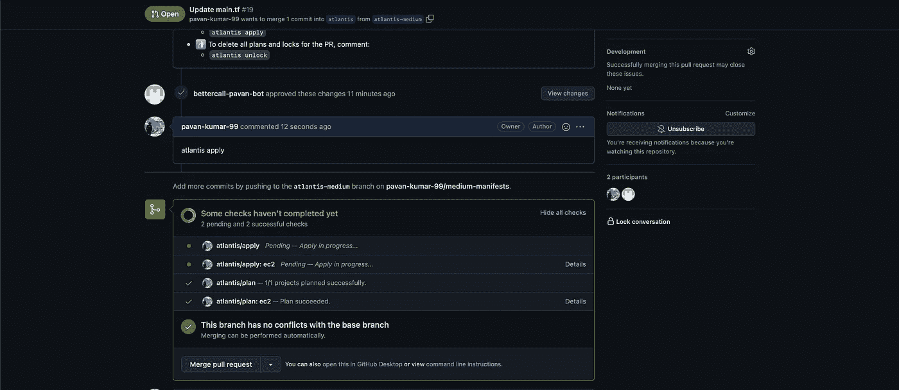
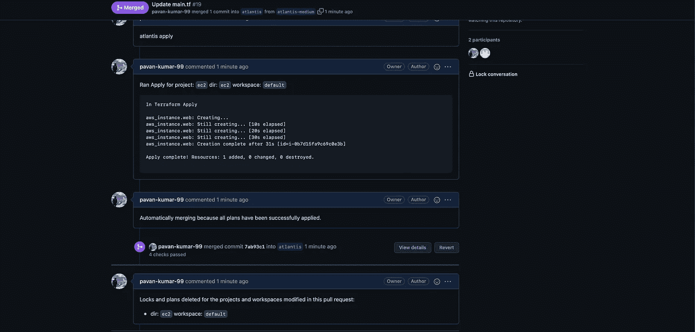
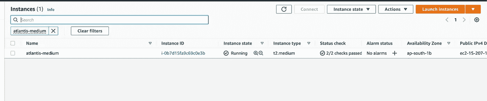

# 用亚特兰蒂斯改造地球！！！

> 原文：<https://medium.com/nerd-for-tech/terraforming-the-gitops-way-9417cf4abf58?source=collection_archive---------0----------------------->

使用 Atlantis(拉式请求自动化)通过 GitOps 建立 Terraform。

你在你的组织中使用 terraform 吗？或者甚至是你的个人项目？如果是，到本文结束时，您将改变管理和部署 terraform 资源的方式。假设你是最资深的初级开发人员，已经加入该组织并开始着手你的第一个 terraform 项目。您已经编写了模块、脚本，并确保代码运行良好。啊，下一步应该是什么？来部署基础设施，对吗？你会使用什么命令？

```
$ terraform init $ terraform plan$ terraform apply 
```

太棒了，当你看到用 terraform 代码创建的资源时，你应该会非常高兴。你的一位上司现在要求你修改代码中的一些配置。步骤是什么？

a)从任何 SCM 获取最新代码。

b)进行更改。

c)将代码签出到不同的分支，并提出一个拉请求。去检查一下。

d)启动、计划和应用。

e)合并请求。

**如果步骤是这样的会怎么样？**

a)获取最新代码。

b)进行更改。

c)将代码签出到不同的分支，并提出一个拉请求。去检查一下。(地形规划和合并自动发生)。

那不是很快吗？是的，确实是。如何实现这一点？来了 [*亚特兰蒂斯*](https://www.runatlantis.io/guide/#getting-started) 来帮我们了。Atlantis 是一个通过拉式请求实现地形自动化的应用程序。它作为独立的应用程序部署到您的基础架构中。没有第三方可以访问您的凭据。Atlantis 监听关于 Terraform pull 请求的 GitHub、GitLab 或 Bitbucket webhooks。然后，它运行`terraform plan`并对 pull 请求的输出进行注释。

当您想要应用时，在拉请求上注释`atlantis apply`，Atlantis 将运行`terraform apply`并返回注释输出。


Atlantis 拉动请求自动化

# 整个故事是关于什么的？(TLDR)

1.  以 GitOps 方式实现 Terraform。
2.  在 Kubernetes 集群上部署 Atlantis 并了解 Atlantis 的运行情况。

# 先决条件

1.  一个 Kubernetes 集群(阿克苏，GKE，EKS)。我们将在文章中使用 EKS。(我还在同一个 repo 中附加了 eksctl yaml 文件。您可以使用 eks CTL create cluster-f[eks CTL-Atlantis . YAML](https://github.com/pavan-kumar-99/medium-manifests/blob/atlantis/eksctl-atlantis.yaml)快速创建一个集群

# 故事资源

1.  GitHub 链接:[https://github.com/pavan-kumar-99/medium-manifests](https://github.com/pavan-kumar-99/medium-manifests)
2.  GitHub 分支: [***亚特兰蒂斯***](https://github.com/pavan-kumar-99/medium-manifests/tree/atlantis)

# 使用舵图安装亚特兰蒂斯

我们将使用官方的舵图在 AWS EKS 集群上安装 Atlantis。但是在安装之前，有一组先决条件需要使用 SCM(在本例中为 Github)来执行，以授权传入的 webhook(可选，非强制)和一个具有 repo 作用域的个人 GitHub 访问令牌。好吧，我们开始吧。

**a)创建访问令牌:**导航到 GitHub 控制台中的用户设置，然后创建个人访问令牌。你也可以点击 [*这里的*](https://docs.github.com/en/authentication/keeping-your-account-and-data-secure/creating-a-personal-access-token#creating-a-token) 链接进行详细描述。



**b) Webhook 秘密:** Atlantis 使用 Webhook 秘密来验证它从您的 Git 主机接收的 Webhook 是合法的。确认这一点的一种方法是只允许列表请求来自 Git 主机的 IP，但是更简单的方法是使用 Webhook Secret。Webhook 秘密实际上是可选的。然而，出于安全考虑，强烈推荐使用它们。您可以使用任何随机字符串生成器来创建您的 Webhook 秘密。应该是> 24 个字符。

例如:

*   用`ruby -rsecurerandom -e 'puts SecureRandom.hex(32)'`通过 Ruby 生成
*   用[https://www.browserling.com/tools/random-string](https://www.browserling.com/tools/random-string)在线生成

**c) Terraform 先决条件:** Atlantis 支持除本地后端之外的所有后端。在本文的范围内，我们将使用 s3 作为 terraform 后端。

**d)带舵安装:**我已经在 这里 [*配置了舵值*](https://github.com/pavan-kumar-99/medium-manifests/blob/atlantis/atlantis-helm-values.yaml)

让我们了解这个 Yaml 的主要组件。

1.  RepoConfig:在 Terraform repo 的根中指定的一个`atlantis.yaml`文件允许您指示 Atlantis repo 的结构并设置自定义工作流。在 repo config 部分定义的所有字段都可以在这里找到[https://www . run Atlantis . io/docs/repo-level-Atlantis-YAML . html # reference](https://www.runatlantis.io/docs/repo-level-atlantis-yaml.html#reference)
2.  AWS 凭证:对于 AWS ( Terraform Provider ),我使用了 AWS 访问密钥和秘密密钥。然而，对于其他云提供商来说，还有其他参数。您可以参考 helm 安装选项来配置其他云提供商。

```
$ helm repo add runatlantis https://runatlantis.github.io/helm-charts$ git clone [https://github.com/pavan-kumar-99/medium-manifests.git](https://github.com/pavan-kumar-99/medium-manifests.git) \
-b atlantis$ cd medium-manifests$ helm upgrade -i atlantis runatlantis/atlantis -f 
atlantis-values.yaml
```

作为 helm 安装的一部分，Atlantis 服务器作为负载平衡器公开

```
$ kubectl get svc --namespace default atlantis -o jsonpath='{.status.loadBalancer.ingress[0].hostname}'
```



e)配置 webhook:如何配置 webhook 的步骤在 [*这里*](https://www.runatlantis.io/docs/configuring-webhooks.html#github-github-enterprise) 有详细的记载。



啊，我们终于准备好让亚特兰蒂斯投入行动了。我已经在 ec2 文件夹中创建了一个 terraform 文件，这将创建一个 EC2 实例。我还将一个 atlantis.yaml 文件放在我的 repo 的根目录下，并使用我的自定义配置。所有这些字段的配置可以在 [***这里***](https://www.runatlantis.io/docs/repo-level-atlantis-yaml.html#do-i-need-an-atlantis-yaml-file) 找到。

我现在向亚特兰蒂斯分公司提出了一个拉取请求，并做了以下更改。



当我提出拉动请求时，我应该会看到带有 Terraform 计划输出的 PR 上的注释。



地形检查



地形图输出



地形图输出

现在，我将把这个发给我的一个队友批准。一旦 PR 得到审查和批准，我就可以通过在 Pull 请求上添加注释`atlantis apply`来应用配置更改。

一旦您进行了注释，您应该能够看到 terraform 应用于发生的情况，并且计划输出也在同一 PR 上进行了注释。



Atlantis 应用触发

terraform 应用输出也可以在同一 PR 的注释中看到。一旦配置被应用，分支将被自动合并，分支也将被自动删除。



地形图已成功应用

EC2 实例现在将在我的 AWS 帐户中创建。现在来验证一下。



哇哦。！实例现已创建。我还在此处附上拉取请求以供参考[。](https://github.com/pavan-kumar-99/medium-manifests/pull/19)


来源:谷歌图片

**清理**

```
$ helm delete atlantis ## Delete the EKS cluster and EC2 Instance created earlier
```

啊，这些都是用 Terraform 实现 GitOps 所需要的步骤。我希望你喜欢这篇文章。请随意分享您的想法和使用 Terraform automation 的经验。如果您在部署过程中遇到任何问题，请在此提出问题[或随时通过我的电子邮件联系我(pavan1999.kumar@gmail.com)。](https://github.com/pavan-kumar-99/medium-manifests/issues)

以下是我的一些其他文章，你可能会感兴趣

直到下一次…..

# 被推荐的

[](/nerd-for-tech/using-hashicorp-vault-as-a-certificate-issuer-in-cert-manager-9e19d7239d3d) [## 在证书管理器中将 Hashicorp Vault 用作证书颁发者

### 在证书管理器中将 vault PKI 后端配置为证书提供商

medium.com](/nerd-for-tech/using-hashicorp-vault-as-a-certificate-issuer-in-cert-manager-9e19d7239d3d) [](/nerd-for-tech/deep-dive-into-cortex-part-i-c228e01f8c58) [## 深入探究皮层指标—第一部分

### 深入探究 Cortex Metrics.io 第一部分

medium.com](/nerd-for-tech/deep-dive-into-cortex-part-i-c228e01f8c58) [](https://www.techmanyu.com/creating-self-hosted-github-runners-in-a-kubernetes-cluster-fd05560de34a) [## 在 Kubernetes 集群中创建自托管 GitHub 运行程序

### 在您自己的 Kubernetes 集群上运行 GitHub 操作

www.techmanyu.com](https://www.techmanyu.com/creating-self-hosted-github-runners-in-a-kubernetes-cluster-fd05560de34a) [](/nerd-for-tech/deep-dive-into-thanos-part-i-f72ecba39f76) [## 深入灭霸——第一部分

### 使用灭霸和普罗米修斯操作员监控 Kubernetes 的工作负载

medium.com](/nerd-for-tech/deep-dive-into-thanos-part-i-f72ecba39f76)