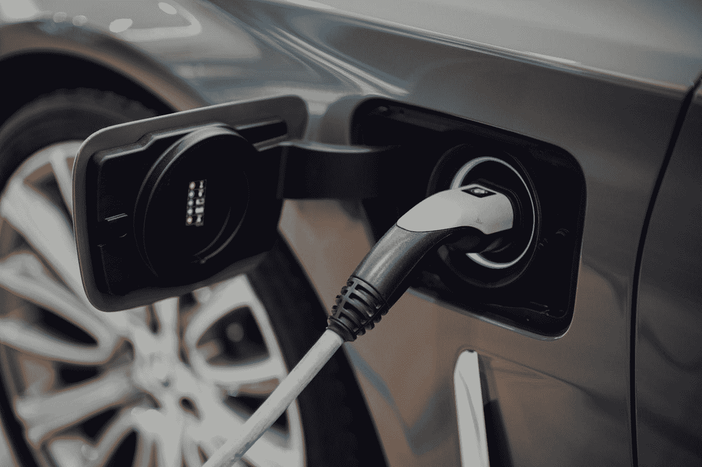

# 特斯拉——为什么是锂离子电池而不是固态电池

> 原文：<https://medium.com/nerd-for-tech/tesla-why-lithium-ion-over-solid-state-batteries-4f295bb3557d?source=collection_archive---------1----------------------->

## 固态电池真的没有宣传的那么坚固吗？

电池——多年来，在电池制造过程中只有少数突破和重大发展。

十多年来，人类一直受困于锂离子电池。

虽然研究人员正在努力寻找突破性的电池成分/技术，但我们距离使用它们还有很长的路要走。

因为世界正变得越来越关注我们的环境，转向环保，努力使用回收产品并依靠回收产品生活，并打算有一天依靠可再生能源生活。

我们中的许多人已经开始转向这种清洁能源的想法——因此寻找像特斯拉这样的产品和产品制造商，以及其他许多努力创造可再生能源产品的人。

但问题是，我们到了吗？技术如此完美，以至于我们可以在未来几年内停止使用化石燃料吗？

为什么特斯拉在有这么多限制和安全问题的情况下还在追逐锂离子电池？为什么不研究一种新的电池技术？

# 特斯拉的 4680 LiOn 电池

埃隆·马斯克就是这样一个人，他间接控制或有能力操纵密码价格或现在的任何事情。埃隆·马斯克仍然坚持使用十年前的标准电池解决方案，这确实微妙地说明了一些问题。

Vlad Tchompalov 在 [Unsplash](https://unsplash.com?utm_source=medium&utm_medium=referral) 上拍摄的照片

固态电池和石墨烯电池是最受追捧的，并被大肆宣传为未来能源解决方案的解决方案，从用于个人通信设备、家用电器到车辆，以及为我们的家庭供电。

但是埃隆·马斯克没有疯！

虽然锂离子电池是一种成熟的电池解决方案，但他能够尽可能地挖掘它的潜力。这意味着他正在通过消除导致锂离子电池声名狼藉的所有缺陷，使这项技术更加高效、经济和安全。

在特斯拉电池日活动中，埃隆·马斯克推出了一种新的突破性制造解决方案，用于制造现有的电池技术，即锂离子电池。

不涉及具体的技术细节。特斯拉及其团队移除了一个多年来被认为是电池制造中至关重要的组件。

特斯拉去掉了制造电池时使用的标签，因此他们称这些电池为无标签电池。

这种电池不使用隔膜，而是使用沿电极延伸的导电部分。

# 固态电池及其前景

尽管对各种电池技术和组成进行了多种研究。与其他电池(石墨烯等)相比，固态电池几乎已经准备好迈出第一步。)

商业上使用的锂离子电池，有一个分隔阴极和阳极的隔板，用**液体**电解质溶液。

另一方面，固态电池使用**固体**电解质，并且固体电解质也起到隔板的作用。

照片由[达尼洛·阿尔维斯](https://unsplash.com/@daniloalvesd?utm_source=medium&utm_medium=referral)在 [Unsplash](https://unsplash.com?utm_source=medium&utm_medium=referral) 上拍摄

目前的锂离子电池有因温度变化、外力泄漏或着火而膨胀的历史。

然而，由于固态电池使用具有固体结构的固体电解质，由于电解质为固体形式，因此显著更安全。

# 范围——智慧和时间的较量

## 特斯拉的电池

虽然特斯拉在过去几年里大幅提高了续航里程。特斯拉的 4680 电池只会极大地提高现有的里程。

特斯拉 Model S 目前提供的范围已经从 390mi-412mi(格子模型-远程模型)开始。特斯拉的 4680 电池将使能量密度增加 6 倍，功率增加 6 倍，续航里程增加 16%。

照片由[布莱希特·丹尼尔](https://unsplash.com/@brechtdenil?utm_source=medium&utm_medium=referral)在 [Unsplash](https://unsplash.com?utm_source=medium&utm_medium=referral) 上拍摄

新的 4680 电池将能够储存 380 瓦时/千克的电量，比特斯拉 Model 3 目前使用的松下 2170 电池提高了 54%。每千瓦时的成本将下降约 56%。

这已经转化为与固态电池的平等竞争。同样值得注意的是，QuantumScape 仍然预计在 2026 年前商业化生产他们的固态电池。到 2026 年，特斯拉可以制造出更高效、可持续、高能量存储密度的电池。

## QuantumScape 的固态电池

丰田和大众是 QuantumScape 的共同投资者。QuantumScape 的固态电池能够以 500 瓦时/千克的功率提供 375 英里的电量，对于一项估计将于 2026 年开始大规模生产的技术，特斯拉已经在 2021 年实现了这一壮举

虽然固态电池是电池技术中的一项全新发明，但分析师和技术爱好者正在就这项技术在全球范围内的生产成本和适应性进行争论。

丰田和大众对未来和这种电池技术持乐观态度，因为它在第一代产品中提供了一个竞争范围，即 375 英里。

# 充电持续时间

由 [Unsplash](https://unsplash.com?utm_source=medium&utm_medium=referral) 上的 [CHUTTERSNAP](https://unsplash.com/@chuttersnap?utm_source=medium&utm_medium=referral) 拍摄

QuantumScape 承诺在大约 12 分钟内完成 10%-80%的充电。

另一方面，特斯拉从 10%-80%快速充电已经需要 20-30 分钟。

未来使用特斯拉的 4680 电池，充电时间会快很多，因为阳极增加了额外的硅胶。一般来说，当电池中加入更多的硅胶时，充电时间会更快。

# 电池生产成本

锂离子电池和固态电池都有自己的挑战。

然而，锂离子电池是一个非常成熟的市场，并在世界各地广泛建立——与固态电池相比，它的成本效益不是很高。

另一方面，虽然固态电池非常容易制造。规模化是这个行业大规模生产电池的瓶颈。

目前，只有少数公司在研究固态电池，不像锂离子电池——它已经存在了十多年，是目前任何行业制造自己的锂离子电池的一种理解和易于制造的电池选择。

因此，从锂离子迁移到固态电池将是一个非常缓慢的过程。

# 电池退化

电池退化是不可避免的，特斯拉目前可以充电 1500 次，可以行驶 30 万到 50 万英里。这是埃隆·马斯克本人在 2019 年 4 月 13 日发的推文。

这是毫无疑问的，特斯拉的 4680 电池将有一个缓慢的电池退化，电池的寿命将大幅增加。

另一方面，固态电池，即使在起步阶段，也有望提供 800 次循环，直到 300 英里里程的汽车电池健康下降到 80%。

如果有人选择更换电池，特斯拉还会以 5-7 万美元的价格更换电池。使用固态电池的汽车制造商将收取多少电池更换费，这有待观察。

# 电池世界的未来

当每个人都在努力生产一种持久、强大、高效的电池时。固态电池是第一个与锂离子电池竞争的电池。

许多汽车制造商正在研究固态电池，例如，三星和现代投资了位于科罗拉多州的 Solid Power。

总部位于马萨诸塞州的 Ionic Materials 已经获得了由日产、三菱和雷诺支持的基金的投资。

事实上，特斯拉的 CTO JB Straubel 是 QuantumScape 的董事会成员。

很明显，固态电池是下一个大事件，但在它出现之前，特斯拉仍然具有竞争力——这要归功于它的早期采用和多年来在电动汽车锂离子电池制造方面的研究。

但是，这是否意味着特斯拉永远不会使用固态电池？不，他们只是在等待它像它的名字一样变得坚固。