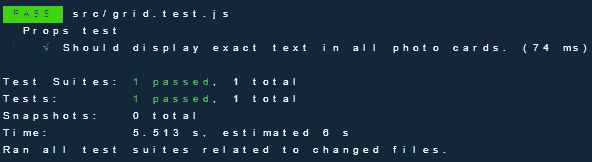
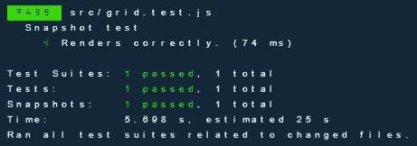
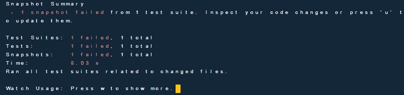

# React 中的测试驱动开发与 React 测试库和 Jest

> 原文：<https://medium.com/nerd-for-tech/test-driven-development-in-react-with-react-testing-library-and-jest-8f85430441fb?source=collection_archive---------5----------------------->


> 测试驱动开发是在编程过程中管理恐惧的一种方式。恐惧让你犹豫不决。恐惧让你更不想交流。恐惧让你回避反馈。恐惧让你脾气暴躁。— TDD 示例

# 什么是测试驱动开发(TDD)？

测试驱动开发(TDD)是一个软件开发过程，在这个过程中开发测试用例来指定和验证代码将做什么。简而言之，首先为每个功能创建测试用例并进行测试，如果测试失败，则编写新代码以通过该特定测试，从而使代码简单且无错误。

## 反应测试库

React testing library 是一个非常轻量级的测试库，用于测试 React 组件，它在 react-dom 和 react-dom/test-utils 之上提供了轻量级的实用函数，它还鼓励良好的测试实践。

## 装置

```
npm install --save-dev @testing-library/reactoryarn add --dev @testing-library/react
```

## 玩笑

Jest 是由脸书创建和维护的 javascript 测试框架。如果您正在使用`create-react-app` Jest 构建您的 React 应用程序，Jest 将开箱即用，无需任何配置，Jest 希望找到我们的测试文件，这些文件具有以下任何流行的命名约定:

*   `__tests__`文件夹中带有`.js`后缀的文件
*   后缀为`.test.js`的文件
*   带有`.spec.js`后缀的文件。

## 装置

让我们假设您的应用程序是通过`create-react-app`创建的。

```
npm install --save-dev react-test-renderer

npm install --save-dev @testing-library/react
```

您的`package.json`中的测试命令应该看起来像这样来运行您的测试。

```
{
  "scripts": {
    "test": "react-scripts test"
  }
}
```

对于不是用`create-react-app`创建的应用程序，你可以按照下面的步骤添加 Jest。

1.  添加依赖关系

```
npm install --save-dev jest babel-jest @babel/preset-env @babel/preset-react react-test-renderer
```

2.通过将以下内容添加到您的`babel.config.js`来配置您的 babel

```
module.exports = {
 presets: ['@babel/preset-env', '@babel/preset-react'],
}
```

3.在您的`package.json`中添加测试命令

```
{
  "scripts": {
    "test": "jest"
  }
}
```


这个计划。

我们将使用下面的`create-react-app`创建的这个简单的 react 应用程序进行演示，这个应用程序也是用样式化组件构建的，有关这方面的更多信息，您可以查看这里的[https://styled-components.com](https://styled-components.com/)。


让我们在名为`grid.js`的组件文件夹的 src 文件夹中创建一个网格组件。

我们想测试网格组件中的文本属性是否完全按照我们的预期呈现，现在让我们在 src 文件夹中创建一个名为 grid.test.js 的文件，这是我们将执行测试的位置。

让我解释一下这是怎么回事。


这都是计划的一部分。

## '渲染'

这将呈现我们的 react 组件，并返回有用的查询，允许我们在视图层次结构中找到某些元素。

## '每次(清理)后'

这基本上是在每次测试后清理所有东西，以避免内存泄漏。

## '描述'

这个命令允许我们对相关的测试进行分组，以产生更清晰的输出。

## 测试

这运行我们的测试，如果你不想用`test()`你可以用`it()`代替。

## ' getAllByText '

这将为文本查询返回一个包含所有匹配节点的数组，在我们的例子中是`‘New text’`，如果没有找到任何元素，将抛出一个错误。

```
const elements = getAllByText('New text')
```

## “期待”

在我们的例子中，我们使用这个函数和一个“匹配器”来测试值`toBe()`。

## 托比

我们使用这个匹配器函数来比较从`expect`函数得到的值，然后对该值做出断言。

请注意，当我们运行测试用例时，我们编写的测试通过了。



很好，现在让我们来试试快照测试，我猜你想知道什么是快照测试？

> 快照测试
> 
> 每当您希望确保您的 UI 不会发生意外更改时，快照测试都非常有用，典型的快照测试案例会呈现 UI 组件，拍摄快照，然后将其与测试中存储的参考快照文件进行比较。如果两个快照不匹配，测试将失败:要么是意外的更改，要么是引用快照需要更新到 UI 组件的新版本。

请注意，当我们运行快照测试用例时，我们编写的测试通过了。



注意，在运行我们的测试之后，在我们的 src 文件夹中创建了一个 _ _ snapshots _ _ 文件夹，这是我们所有快照的存储位置，所有快照测试文件都有一个`.snap`后缀。

好的，现在让我们改变快照测试中的一两个参数。

现在让我们再次运行我们的测试。



它检测到了我们的变化，这意味着它按预期工作。


## 结论

我相信在开发应用程序时实现测试驱动的方法是减少代码库中的错误并提高代码质量的好方法，代码库越大，就越难进一步移动或更改代码，但是如果你有自动化测试，它们就成为你的安全网，允许你在短时间内识别错误及其位置，它如何影响系统。

我希望你在这篇文章中发现了一些有趣的东西，如果你有任何问题或评论，请随时在评论区提问。

您可以从这里获得本文中使用的完整示例:

[](https://github.com/ECJ222/react-tdd-tutorial) [## ecj 222/react-TDD-教程

### 这个项目是用 Create React App 引导的。在项目目录中，您可以运行:在…中运行应用程序

github.com](https://github.com/ECJ222/react-tdd-tutorial) 

## 参考

[](https://jestjs.io/) [## 笑话🃏愉快的 JavaScript 测试

### Jest 是一个 JavaScript 测试框架，旨在确保任何 JavaScript 代码库的正确性。它允许您…

jet js . io](https://jestjs.io/) [](https://blog.logrocket.com/comparing-react-testing-libraries/) [## 比较 React 测试库

### 如果你创造了某样东西，不管它是什么，你都应该在提供给其他人之前测试它。这样，你就可以…

blog.logrocket.com](https://blog.logrocket.com/comparing-react-testing-libraries/) [](https://www.sitepoint.com/test-react-components-jest/) [## 如何使用 Jest - SitePoint 测试 React 组件

### 本文由客座作者杰克·富兰克林撰写。SitePoint 客座博文旨在为您带来引人入胜的内容

www.sitepoint.com](https://www.sitepoint.com/test-react-components-jest/) [](https://create-react-app.dev/docs/running-tests/) [## 运行测试|创建 React 应用程序

### 注意:此功能适用于[电子邮件保护]和更高版本。阅读迁移指南，了解如何启用它…

创建-反应-应用程序.开发](https://create-react-app.dev/docs/running-tests/) [](https://dl.acm.org/doi/book/10.5555/579193) [## 测试驱动开发|指南书籍

### 来自《有效的干净代码》一书，这是 Ron Jeffries 的口头禅。目标是工作的干净的代码，并且对于整个…

dl.acm.org](https://dl.acm.org/doi/book/10.5555/579193)