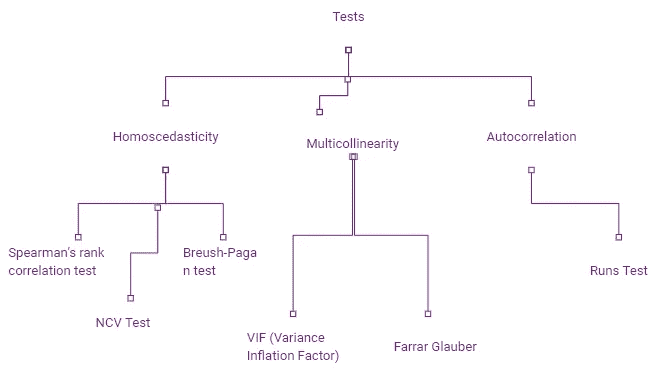
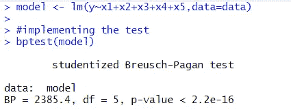
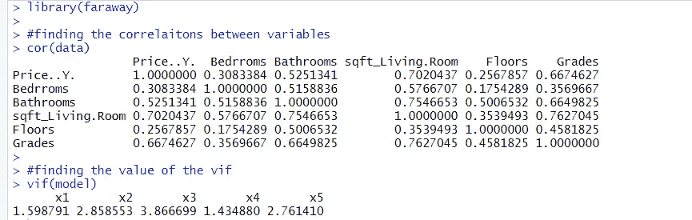
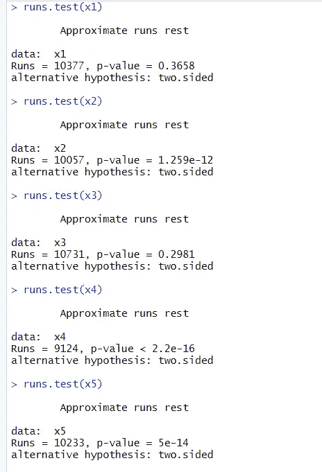
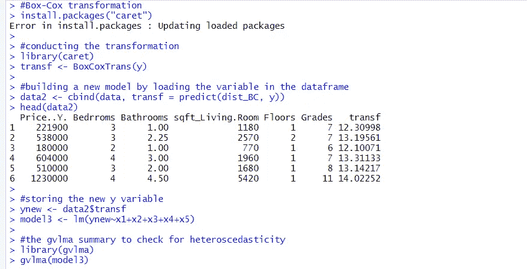
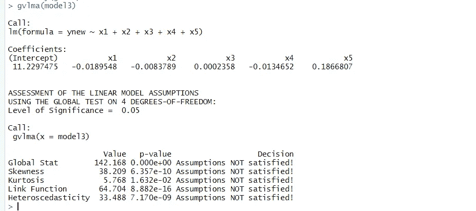

# 异方差、多重共线性和自相关测试

> 原文：<https://medium.com/nerd-for-tech/test-of-homoscedasticity-multicollinearity-and-autocorrelation-5be194f5f338?source=collection_archive---------6----------------------->

在前面的文章中，我们了解了观察模型中三种行为的重要性:同异方差、多重共线性和自相关。

我们将回顾多元回归建模中最常用的测试的概念和应用。该列表如下:

作者图片

1.  布鲁什-帕甘试验
2.  VIF(差异通货膨胀系数)
3.  连续测验
4.  解决异方差的 Box-Cox 变换。

# 布鲁什-帕甘试验

让我们通过使用前一篇文章中构建的模型并在模型中应用异方差测试来理解这一点。这里我们为测试设定了以下假设。
H0:模型中存在常数变化，即模型中存在同方差。

我们可以找到这个测试命令的库是 R 编程中的 *lmtest* 库。

*R 代码:
>* 型号< - lm(y~x1+x2+x3+x4+x5，data = data)
>#实现测试
> bptest(型号)

测试的输出屏幕快照，图片由作者提供

在这里，我们可以观察到 breush-pagan 测试的 p 值是 R 编程的*远程库*中可用的< 2.2e^-16 < 0.05 (alpha). Hence, we reject H0 at 5% level of significance. Therefore, we conclude that the model, in fact, has heteroscedasticity. Therefore, we would have to apply some other transformations to increase homoscedasticity and remove heteroscedasticity. One such transformation is Box-Cox transformation.

# VIF

In order to get the idea of multicollinearity in the model, we use the *vif* 函数。现在，从理论上证明，当这个值低于 10 时，代表一个好的模型。变量的任何 vif 值，大约 10 设置警报。

*R 代码:
> vif(型号)*

每个变量的 *vif* 值的输出快照，图片由作者提供

这里，我们看到所有变量的 vif 都是< 10, in fact, quite less than 10\. Therefore, we can safely conclude that the model doesn’t contain any multicollinearity.

# Runs test

This test is conducted to check if the observations in a given variable are contain some pattern to them or are the completely random in nature. This is to see if the observations in a single variable have any relation or trends to them. Here, we require the following package installed i.e., *snpar。*

我们的假设变成:
H0:变量本质上是随机的。H1:变量包含随机性。

*R 代码:
>*runs . test(x1)#卧室
> runs.test(x2) #浴室
>runs . test(x3)#生活区
>runs . test(x4)#楼层
> runs.test(x5) #等级

代码的输出屏幕

在这里，我们看到，我们拒绝了 H0 的变量运行测试:X2(浴室数量)，X3(平方英尺面积)和 X5(等级)在 5%的显著性水平。因此，我们得出结论，这些变量，有一些模式，而不是随机的。因此，我们可以安全地假设其他两个变量的随机性，并且变量中的观察值不相关或不遵循趋势。这有助于我们检查数据集中的自相关问题。

# 解决异方差性的 Box-Cox 变换

这里，我们使用名为 caret 的库。在整个测试过程中，我们还需要在 R 编程中安装以下库，即 gvlma 和 ggplot2。我们安装这些包并使用它来进行转换。

Box-Cox 变换变换因变量(Y)，即这里的公寓的*价格，使得异方差最小。*

*R 代码:* #Box-Cox 转换
install . packages(" caret ")
#进行转换
library(caret)
transf<-BoxCoxTrans(y)
#通过在 dataframe 中加载变量来构建新模型
data2 < - cbind(data，transf = predict(dist_BC，y))
head(data 2)
#存储新的 y 变量
ynew

转换的输出图像，按作者分类的图像

摘要的输出屏幕，按作者分类的图像

这里，我们可以看到没有变量满足线性假设。这意味着模式中的所有变量都存在异方差。该模型的残差具有可变方差。这与线性建模所基于的假设相矛盾。因此，即使其他统计数据可能很好(如回归的显著性检验和系数估计)，该模型的可靠性较低，预测能力也较低。

# 研究的局限性

该分析是在网上可用的数据集上进行的，因此，可能不适合多模型拟合。虽然，这篇文章的目的，是帮助大家理解一个多元回归模型优化背后的统计。