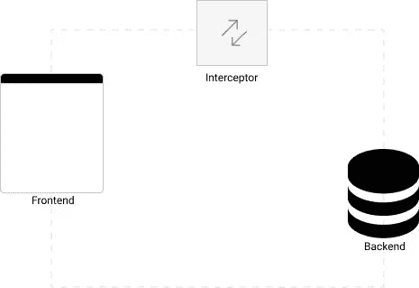

# 在 React 中测试 API 调用

> 原文：<https://medium.com/nerd-for-tech/testing-api-requests-600ef3c47481?source=collection_archive---------11----------------------->

你可以从这里得到这篇文章的第一部分。它专注于为前端开发人员模仿 API。

用肯特. c .多兹的话说。

> 你的测试越像你的软件被使用的方式，它们就越能给你信心。——肯特·c·多兹。

在编写测试时，最好将重点放在应用程序的用例上。通过这种方式，我们的测试模拟了我们的用户，并且我们不关注[实现细节](https://kentcdodds.com/blog/testing-implementation-details)。

因为我们正在测试我们的应用程序用例，所以测试与数据的交互(因此是 API 请求)是很重要的。

以前，为了测试 API 请求，我们可能不得不模拟 ***“窗口。fetch"*** 或 **"Axios "，**但是我们的用户不会这样做，不是吗？因此，应该有更好的方法。

## 用 msw 模拟 API 请求

考虑到模仿 fetch 或 Axios 的各种限制，使用像 msw 这样的工具，允许相同的模仿定义用于测试、开发和调试是一件幸事。

msw 在网络层拦截请求；因此，我们的应用程序或测试对模拟一无所知。

在之前的[文章中，我演示了如何使用 msw 模仿 API。好消息是，我们可以在测试中使用相同的模拟！](/nerd-for-tech/mocking-apis-for-frontend-developers-e8c1fadc8f58)

## 重构模拟 API

让我们从重构我们的设置工人开始，因为我们想要共享我们的模拟 API(API 处理程序)。

现在处理程序单独在一个新文件中，我们可以在开发服务器和测试服务器之间共享它们。让我们更新开发服务器。

我们的开发服务器现在短了很多，一切仍然正常，但是我们还没有准备好编写测试；我们需要建立一个测试服务器。就这么办吧。

## 安装测试服务器

如果您注意到，测试服务器不同于开发服务器，因为" *setupServer* "是从" *msw/node* "中获得的。

值得注意的是，你必须安装“ *whatwg-fetch* ”，因为如果你使用 fetch API，Node.js 不支持 fetch。对于我们的用例，我们用 create-react-app 引导我们的应用程序，它会自动处理这个问题。

我们将通过修改 setupTests.ts 文件(由 create-react-app 提供)在全局级别上建立 API 模拟，如下所示。

**NB:** 如果你没有使用 create-react-app，你可以按照[文档](https://mswjs.io/docs/getting-started/integrate/node#using-manual-setup)建立一个 API 模仿的全局级别。

## 测试 React API 调用。

让我们测试我们的 todos 呈现并添加一个新的 todo。

在上面的测试中，我们不用模拟出“ *fetch* 或者“ *Axios* ”我们正在测试我们的用户将如何使用该应用程序，提出了一个真正的 API 请求，我们得到了模拟响应，这非常好，给了我们更多的信心。

感谢您的阅读。