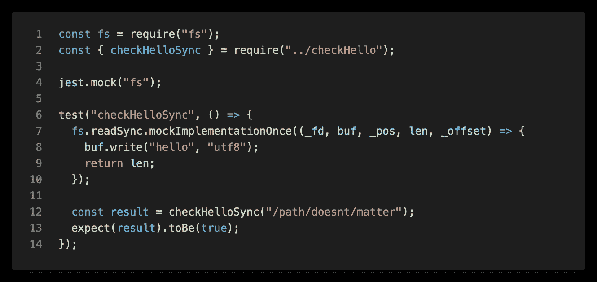
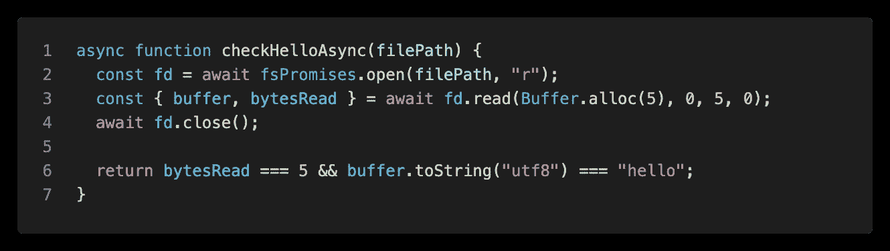
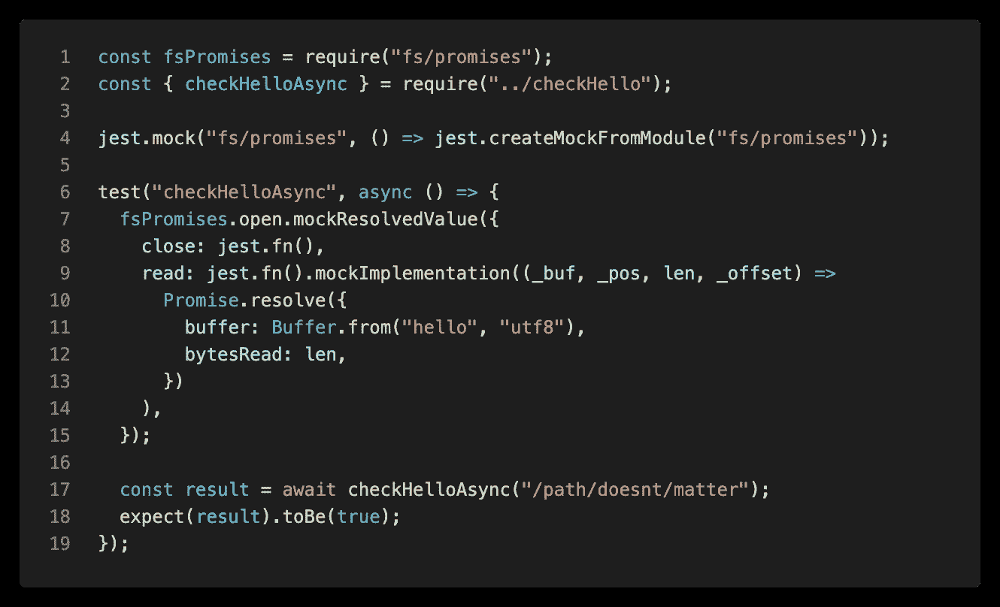
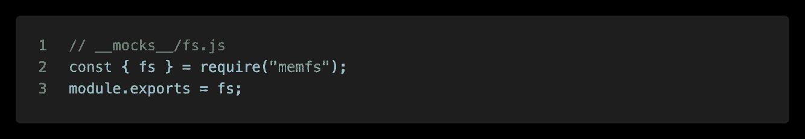
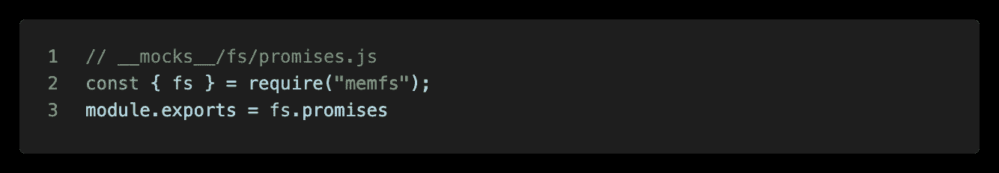
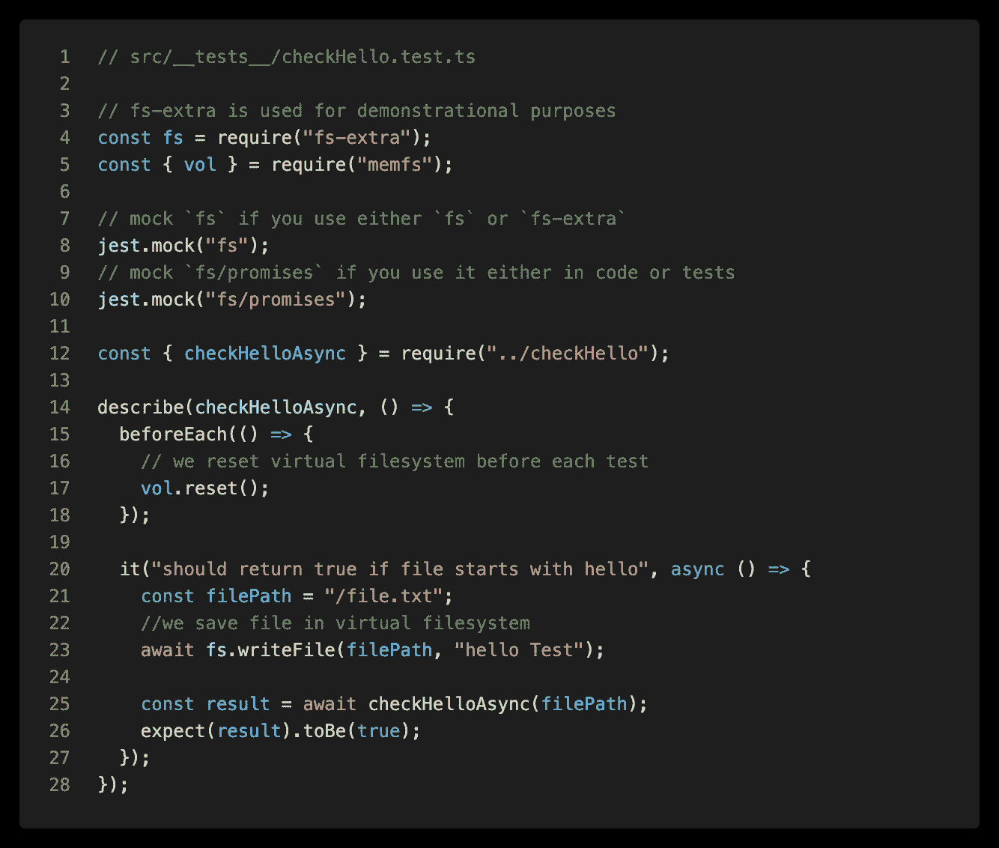

# 在 Node.js 中测试文件系统:简单的方法

> 原文：<https://medium.com/nerd-for-tech/testing-in-node-js-easy-way-to-mock-filesystem-883b9f822ea4?source=collection_archive---------0----------------------->

在 Node 中编写应用程序时，经常需要写入或读取文件的内容。Node.js 提供了一个专门用于此目的的`[fs](https://nodejs.org/api/fs.html)`库。但是当测试我们的代码时，我们如何处理文件系统呢？

我将介绍解决这个问题的两种方法——模拟单个文件系统方法和使用虚拟文件内存文件系统。我还将解释为什么后者是比前者更好的选择。

# 嘲笑个别方法

最简单的解决方案是直接模仿`fs`模块的单个方法。假设我们有一个方法，从文件中读取前 5 个字节，并检查其内容是否以正确的头开始，例如 *"hello"* :


测试函数—使用阻塞调用

> *当然，我们可以使用* `*fs.readFile()*` *来读取整个文件的内容，但是当我们处理大文件时，这真的不是一个好主意。*

我们可以很容易地通过模仿`fs.readSync()`来测试这个方法:



测试同步文件系统调用

测试看起来非常简单，但是我们测试的函数有一个缺点——它的实现使用了阻塞调用，这在执行文件系统 I/O 操作时阻塞了整个 JavaScript 线程。让我们重新设计我们的方法，使用异步、非阻塞调用。Node.js 附带了用于此目的的`[fs/promises](https://nodejs.org/api/fs.html#fs_promises_api)`库:



修改了函数以使用异步文件系统 API

让我们重写测试以使用异步`fs/Promises` API:



测试处理文件系统的异步方法

哎唷，我们的模拟函数变得越来越大，可读性也越来越差。我们想要模仿`read()`函数，但是为了获得正确的结果，我们还必须模仿`open()`和`close()`。而这只是一个简单的场景！

上述方法对于基本情况可能已经足够了，但是对于更高级的情况，它变得非常冗长并且容易出错。它还依赖于实现。为了克服这些问题，我们应该改变我们的测试方法。我们可以模拟整个文件系统，而不是模拟单个的 fs 函数。

# 使用虚拟文件系统作为模拟

在这种方法中，我们用内存中的文件系统替换真实的文件系统。有几个库解决了这个问题，一个流行的是`mock-fs`，但是我想让`memfs`试试。这是一个用于管理虚拟卷的简单但功能强大且文档完善的库。它一对一地重新实现了`fs` API，所以把它用作模拟再合适不过了。此外，它的实现是不可知的——它与普通的`fs`、`fs/promises`以及其他像`[fs-extra](https://www.npmjs.com/package/fs-extra)`这样的库配合得很好。

让我们重做我们的测试来使用虚拟文件系统。首先，我们需要添加`memfs`依赖关系:

```
yarn add -D memfs
# or using npm
npm i --save-dev memfs
```

我们还应该为`fs`和`fs/promises`模块添加[手动模拟](https://jestjs.io/docs/manual-mocks)。在我们的项目根目录*中创建一个`__mocks__`目录(或者使用* `*jest.config.js*` *根据您的意愿进行配置)*，并在那里创建一个`fs.js`文件:



fs 模块模拟

如果您使用的是`fs/promises` API，您还应该创建`__mocks__/fs/promises.js`文件:



fs/promises 模块模拟

现在让我们更新我们的测试，使用我们的内存文件系统模拟:



使用 memfs 作为虚拟文件系统的示例测试

我们的测试变得非常简单明了。我们编写文件内容，就像它是一个真实的文件，然后将它的路径传递给被测试的函数。我们不必关心`checkHelloAsync`中使用的文件系统实现。

在每次测试之前重置虚拟卷是一个很好的做法——如果有多个测试在同一个文件系统路径上操作，这可以避免测试相互干扰。

我们可以看到`fs`和`fs/promises`都被嘲讽了。这是因为`checkHelloAsync()`在其实现中使用了`fs/promises`，但是出于演示的目的，我在测试中使用了`fs-extra`。在现实生活中，你应该处处坚持其中的一条(我个人比较喜欢`fs-extra`)。

## 从 JSON 创建目录结构

模仿文件而不是方法非常方便，但是上面显示的方法有一个缺点。假设您的应用程序不是在单个文件上操作，而是在整个目录结构上操作。使用大量的`fs.mkdirp`和`fs.writeFile`手工创建它可能很麻烦。幸运的是，`memfs`还有另一个有用的特性:从 JSON 对象创建的目录结构。它的键是路径，值是指文件内容。让我们来看看这个例子:


使用 JSON 生成目录结构

现在我们可以使用一个`vol.fromJSON()`调用来创建更复杂的目录结构。我们甚至可以将它分成多个调用，并提取到辅助函数中——这在更复杂的测试套件中可能很有用。或者甚至混合使用`vol.fromJSON`和`fs`方法——它们不会互相覆盖(除非修改完全相同的路径),直到`vol.reset()`被调用。

## 混合真实和虚拟文件系统

还有一件事值得一提。您可能正在使用内存中的文件系统，但是需要到达一些真实的文件——例如一些测试设备，使用`fs`调用不容易准备好。有一个名为`unionfs`的库，可以让你加入两个文件系统。您可以在两个图书馆网站上找到文档和示例:

*   `[memfs](https://github.com/streamich/memfs)` [github 页面](https://github.com/streamich/memfs)
*   `[unionfs](https://github.com/streamich/unionfs)` [github 页面](https://github.com/streamich/unionfs)

# 结论

在测试任何涉及文件系统的代码时，虚拟文件系统绝对是一个值得使用的东西。这是比模仿单个方法更加灵活和直接的方法。

本文只是对这种方法的简单介绍。详情请参考图书馆的官方文件。

本文中的所有代码示例都可以在我的 GitHub 上获得[。](https://gist.github.com/barthap/e0a672e9000e72cdfbca73e4f2702f5e)