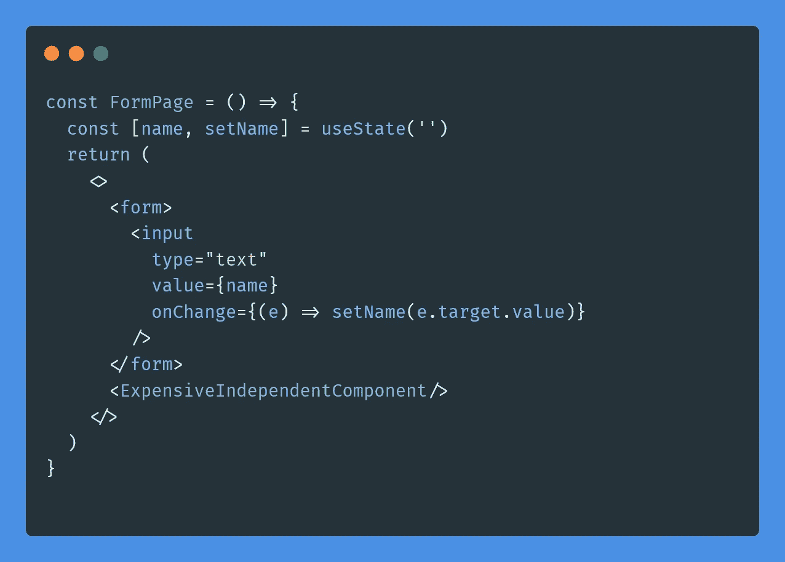
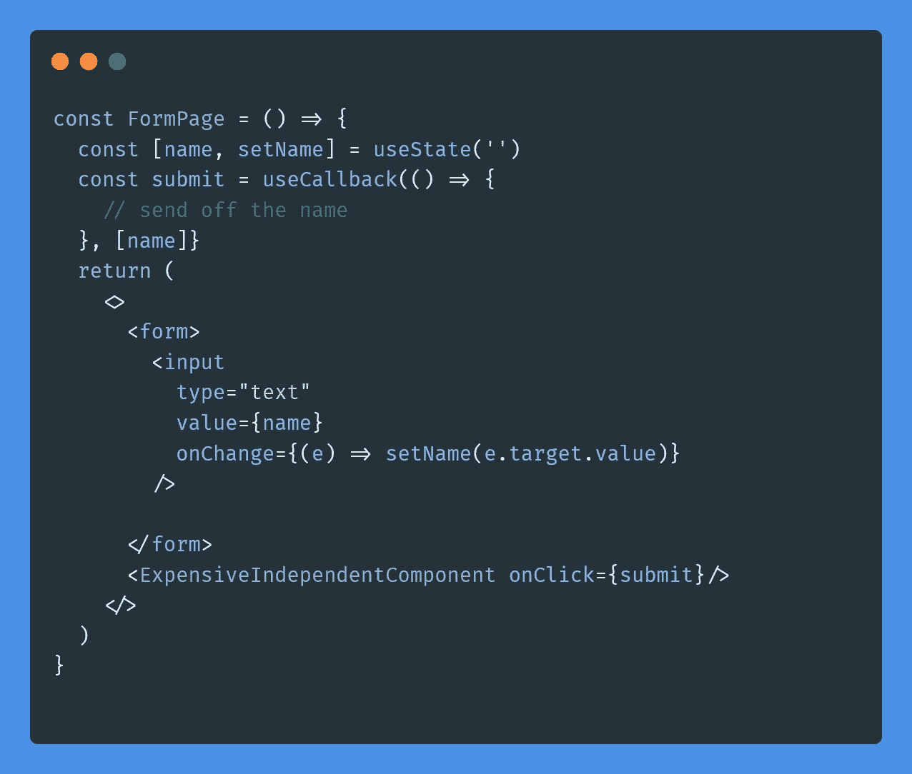
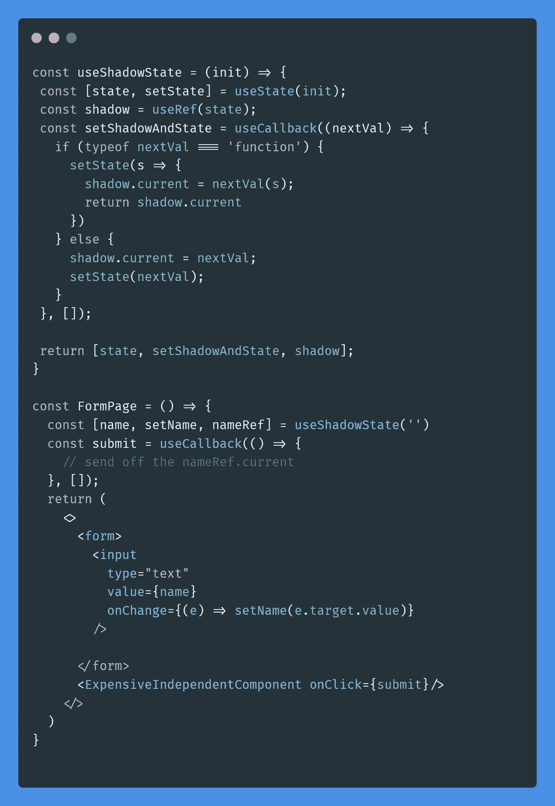
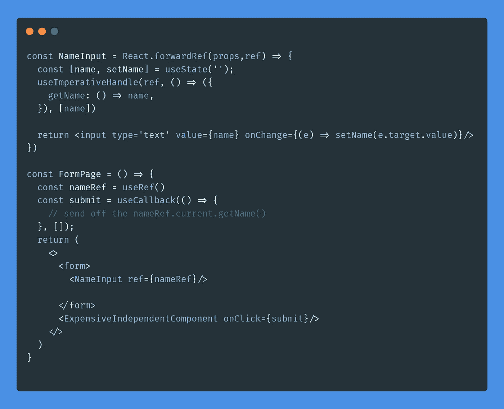
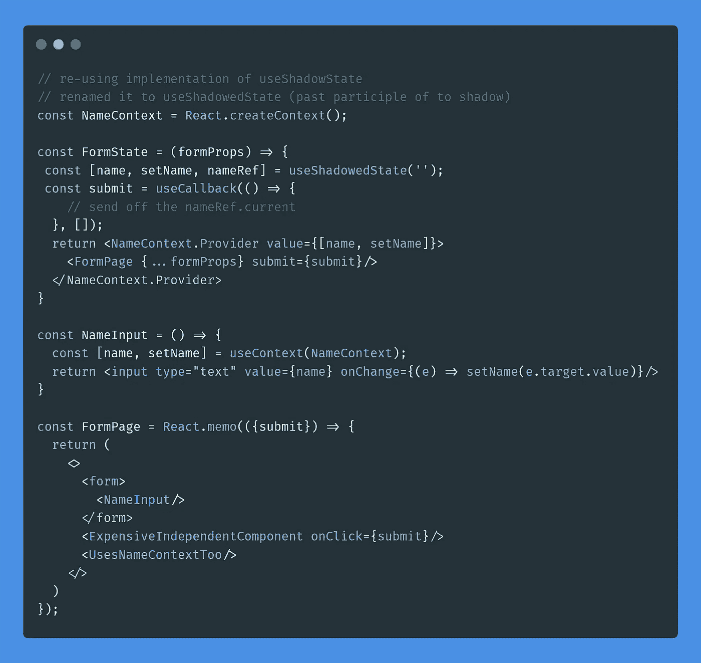
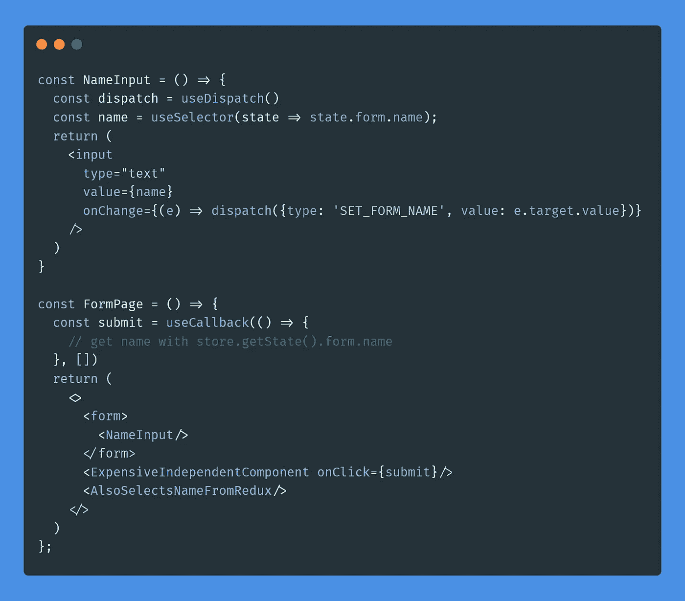
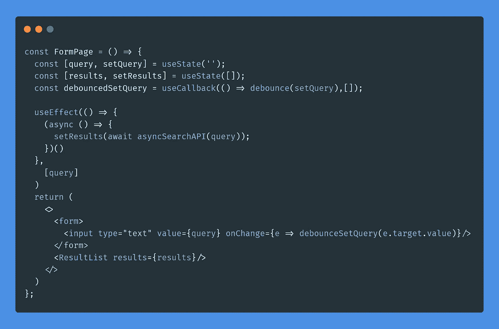

# React(和 React Native)中的文本输入和性能

> 原文：<https://medium.com/nerd-for-tech/text-inputs-and-performance-in-react-and-react-native-aa823a18a3da?source=collection_archive---------5----------------------->

在 UX，性能是功能性、摩擦和可达性中最重要的因素之一。在撰写本文时，React 应用程序在 React 状态更新时对 DOM 执行交互阻塞更新。随着并发模式的出现，这种情况将很快改变。目前，更多的状态更新意味着响应速度更慢。对于表单输入元素，输入类型更动态的元素的状态更新可能会更频繁。一方面，一个单选按钮可能只会被点击一次或两次，另一方面，一个基于文本的输入，比如我用来输入这篇文章的输入，可能会更新数百到数千次。那么当文本输入触发更新时会发生什么呢？

一个文本输入的例子可能会浪费地更新另一个组件

# 渲染基础

当 React 中的一个组件重新渲染时，它会尝试重新渲染它的所有子组件和子组件，直到 DOM 的叶子。唉，对于那些被告知要重新呈现自己的组件，有一个反驳。您可以直接在类组件中实现它，或者通过扩展`React.PureComponent`或者通过在`React.memo`中包装一个功能组件来隐式实现它(注意:为功能组件显式实现它是通过传递一个 props-are-equal 函数并将其作为第二个参数传递给`React.memo)`。当一个组件确定它不需要重新渲染时，它将阻止重新渲染它的子树的其余部分。所有这一切的例外是 React 上下文，当最近的父上下文提供者改变值时，React 上下文可以在使用上下文的任何节点触发重新呈现。

# 兄弟成分依赖原则

这意味着每当您在文本输入中按下一个键时，该组件中的所有其他内容都有可能重新呈现。在某些情况下，与文本输入相同的组件中的其他组件可能依赖于文本输入的值，例如当您有一个搜索栏和搜索结果列表时。每次您更改文本输入值时，都应该重新呈现该列表(实际上，如果搜索功能或列表呈现非常昂贵，您可以考虑另一个选项，我将在后面提到)。这使我们能够区分与文本输入相关的独立组件和非独立组件。

任何独立于文本输入值的组件都可以使用`React.memo` (和 kin)来避免不必要的重新呈现。这是第一个也是最简单的方法，它很好地解决了这个问题。通过将文本输入的独立兄弟提取到它们自己的组件中，我们利用了强大的组件，即封装和可重用性。这看起来更像 React 的“提升状态”和高阶组件最佳实践。我认为，这是一个最好的框架:性能激励组件架构中最佳实践的使用！让我们看看其他一些反应技巧如何让我们进一步减少渲染。但首先一些免责声明…

# 放弃

我在 React 中编写这些示例，但是我主要是一名 React 原生开发人员，与 React 原生中的组件集相比，我在这些 HTML 元素及其基础知识方面的经验要少得多。所以我可能不会按照惯例写`<form>s`。首先，我相信这里学到的经验适用于渲染最小化(见[丹·阿布拉莫夫的博客](https://overreacted.io/before-you-memo/))；文本输入只是这些想法的一个高度激励的例子。其次，我也是为 React 的本地读者写的，那里没有`form`标签，也没有浏览器为 HTML 提供的功能。我想说的另一个免责声明是，在这些情况下，有一些广为接受的书写表格的软件包可以让你的手保持干净。像 [Formik](https://formik.org/) 和 [React Hook Form](https://react-hook-form.com/) 这样的包可能会帮助你避免这些问题。此外，如果您将表单数据保存在一个状态管理存储中，比如 Redux，还有一些其他方法可以解决这个问题，我将在本文中介绍这些方法(提示:记住上下文？).

通过间接依赖文本输入重新呈现兄弟的例子

# 间接依赖…不是问题

继续，让我们注意到对文本输入值的间接依赖。在上面的例子中，`ExpensiveIndependentComponent`不需要`name`进行渲染(它从来没有被传递给组件，所以很明显组件不需要它)；然而，它依赖于在闭包中捕获`name`的回调，因此有一个与`name`同时更新的引用。对于所有意图和目的，`ExpensiveIndependentComponent`现在依赖于名称，即使它不需要值来呈现。那是不愉快的😑。这个例子特别相关，因为这个`submit`回调很可能依赖于表单中的所有东西，所以它有很多依赖项。现在甚至没有必要使用昂贵的组件。能做些什么？

有一些方法可以保存一个可变的值，在不同的呈现中保持不变，并且当发生变化时，不会触发 DOM 更新:Refs(对于函数组件)和 instance 变量(对于类组件)。如果我们用 ref(或实例变量)隐藏一些状态，我们就可以用更少的依赖来记忆非呈现回调。我称之为状态阴影模式，我们甚至可以用一个定制的钩子来设计。现在，useCallback 钩子可以删除对`name`的依赖(在依赖列表中你永远不需要 refs，因为它们的引用总是相同的，但是不要忘记访问`.current`！);参考现在是稳定的，所以它不会导致昂贵组件的重新渲染！

用状态隐藏模式和自定义钩子解决间接依赖问题。

# 推卸责任:势在必行的方法。

文本输入的出现迫使它的所有兄弟姐妹记住自己并孤立自己，这是否让你觉得不公平？在重构方面投入了大量的工作，而且记忆化在内存和输入比较计算方面也有一些开销。如果我们可以完全阻止文本输入在层次结构的这个级别上进行呈现，会怎么样呢？如果我们可以强制文本输入解决它自己的问题，而不是计算其他组件如何忽略文本输入，会怎么样？

让我们把状态推下来。当状态更新仅局限于文本输入时，只有文本输入本身被呈现，这是理想的。然而，现在当我们需要提交时，我们如何访问那个值呢？我们必须采取强制措施，使用裁判！在功能组件领域，我们有`useImperativeHandle`和`React.forwardRef()`来实现这一点。我会给州政府写一封信。

将状态向下推需要强制性地访问值

应该注意的是，这被认为不是很像 React。React 以广泛的声明性而不是命令性而闻名。但是作为开发人员，我们应该始终意识到我们的选择；这就是好的黑客技术。React 团队也给了我们这个工具作为逃生出口，所以他们意识到在某些情况下这是主要可行的选择。选择这种方法的主要标准可能是涉及到多少重构。

文本输入需要是一个受控组件吗？大多数时候是的，但让我们明确一点。如果一个组件需要在文本输入的值改变时呈现，那么我们必须控制这个组件。这扩展到文本输入本身，我们可能希望在每一步都验证它的值。否则，不要费心制作这个花哨包装组件；只需给`<input/>`一个 ref 本身，并在需要时用`inputRef.current.value`读取值。默认情况下，元素跟踪它的值！

然而，很多时候，压制政府是一种糟糕的方法。当兄弟需要声明这个组件的值时，这种方法就不行了。您可以将所有需要该值的组件声明性地放在该组件中，但是，由于 JSX 的组合性质，这仅在那些组件与输入组件相邻时才有效(在 UI 中没有组件在它们之间，并且处于相似的树深度)。如果向下不行，让我们试试向上！

# 超能力:反应上下文等(Redux)

如果我们在 React 上下文方面足够聪明，并愿意忍受一些冗长，我们就不必像在第一个解决方案中那样重构所有的兄弟节点，我们仍然可以享受声明依赖的兄弟节点，同时保持最小的呈现传播。让我们看看代码！

对救援做出反应。不过相当复杂。

好吧，那它是怎么工作的？我们在这里选择了一个控制器组件，它用提供名称及其设置器的上下文包装了`FormPage`。使用`setName` 将触发控制器组件中的更新，这将触发对所有上下文消费组件及其直接子组件的更新。通过在`React.memo`中包装它的单个子节点，渲染将立即停止传播，只在上下文消费者处恢复。这是 React 性能的一个重要的经典上下文模式。请注意，我们还取消了提交回调，并使用状态隐藏模式来继续避免因间接依赖而导致的渲染。这不是超级直观的，也需要相当多的代码。有没有一种方法可以让它变得更加可重用？

当项目扩展时，为每件事到处制造一堆上下文可能是一件痛苦的事。幸运的是，一些好的旧的 redux 可以帮助我们；让我们看看那是什么样子。

Redux 解决方案(缺少普通减速器)

哇，我们回到了只有两个组件，没有自定义挂钩，没有引用，也不需要备忘录！这就是一个好的图书馆所能做到的。我猜你用现代国家管理库完成了同样的壮举，例如反冲、Jotai、Zustand 等等..

# 昂贵的依赖兄弟姐妹

假设你的文本输入是一个搜索栏，你在它下面显示一个结果列表。呈现列表的成本很高，因为通常要一次呈现相当多的项目。即使您的列表是虚拟化的，您也在为虚拟化支付开销(尤其是如果您有动态大小的列表项)。此外，无论是过滤列表还是查询 API，搜索本身都会很昂贵。由于这些原因，对文本输入的更新可能是非常昂贵的，而且似乎是必要的。嗯，它们是必要的，但在接下来的 100 毫秒内它们是必要的吗？大概不会。尤其是当除了搜索查询的最后一个字符之外，用户不期望得到准确的结果时。

如果我在 YouTube 上搜索“foo fighters everlong music video ”,我不会关心弹出的“foo”或甚至“foo fighters”的结果，因为搜索太模糊了，直到用户完成他们的查询。现在，您可能想要搜索自动完成建议，但这与获取与这些查询相关的所有数据(缩略图、持续时间、描述、视图等)不同，而且更便宜。).所以我们希望尽量减少不必要的更新(假设更新对应于查询)。我给你的诀窍是去抖。去抖最终会延迟调用一个函数，直到过了一段时间。如果在此期间再次调用相同的函数，计时器将重新开始，计时器结束后执行的函数调用是第二次函数调用。如果你按顺序调用一个函数很多次，它只会运行最后一个。因此，只有当用户暂停输入(或缓慢输入)时，更新才会发生。

去抖动昂贵的更新

我会推荐使用洛达什的[去抖。有许多参数可以定制它的感觉。你也可以考虑去抖动你的搜索函数，而不是文本输入设置器，这样做的好处是在完成同样的 API 调用最小化的同时，让文本输入感觉更灵敏。如果查询可以改变，而结果不会因为异步而改变，那么`ResultList` 就变得独立于文本输入，您可以记住它以进一步减少呈现。](https://lodash.com/docs/4.17.15#debounce)

**奖励**:通过`redux-batched-subscribe`和去抖，你可以去抖 redux 对订阅组件的通知，这可以在一次进行许多操作时，将一些 N-render 过程减少到 1-2 次渲染。不过，我建议同时使用跟踪电话和引导电话，以获得适当的反应。

# 结论

我不喜欢写结论。无论如何，我在不同的重构尺度上提出了许多选项，这些选项允许您通过输入文本来提高渲染质量。在很多情况下，如果你已经知道如何使用状态管理库，并且已经在你的应用程序中设置好了，那么状态管理库可能是最好的选择。显然，文本输入只是任何有状态组件的一个很好的例子。祝你的重构好运！