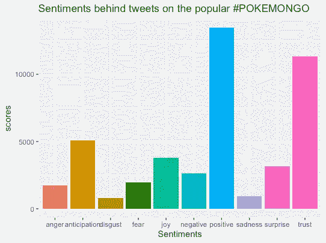
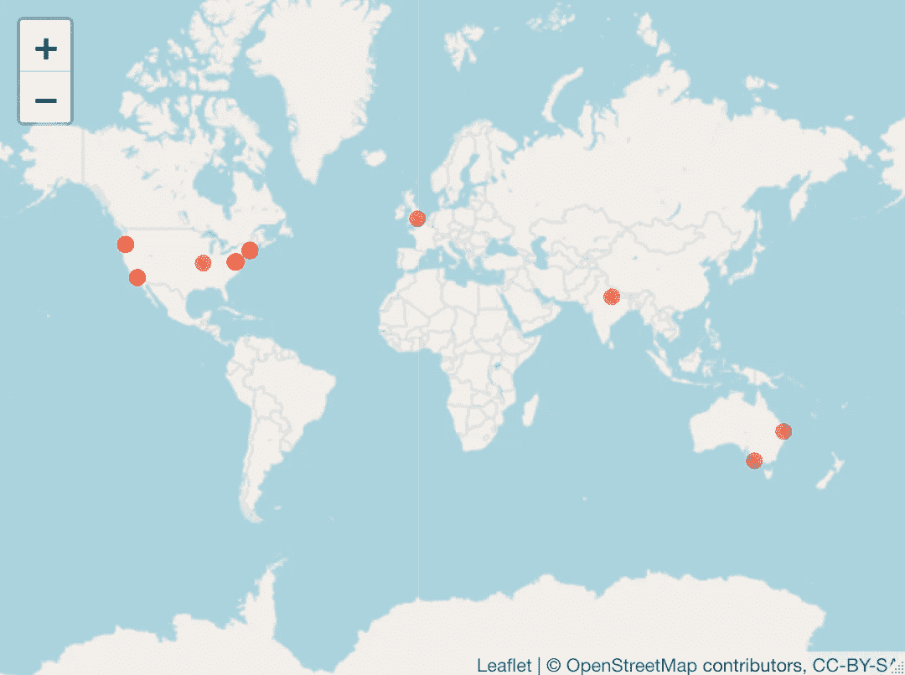
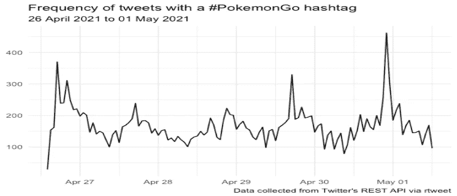

# 使用 R 在 Twitter 上进行文本挖掘和情感分析:电子竞技商业案例研究。

> 原文：<https://medium.com/nerd-for-tech/text-mining-and-sentiment-analysis-on-twitter-using-r-case-study-business-of-esports-f4ff62ee1e42?source=collection_archive---------13----------------------->

# 所用数据的描述— TWITTER API

出于分析的目的，某些因素使 twitter 比其他社交媒体平台更具优势。首先，每天都有数百万条推文发布，这给了我们一个更大的数据池。其次，这些推文对公众开放，可以通过 API 访问和检索。Twitter 给了我们一个前所未有的途径来获取各种行业和个人的大量信息，它的可访问性使得收集和分享信息变得很容易。

# 访问 TWITTER API。

为了检索 tweets，需要一个 Twitter API。第一步是创建一个 twitter 账户，然后申请一个开发者账户。twitter 开发者账户的申请需要填写一份表格，该表格需要明确说明数据(tweets)将用于什么目的。数据的用途也决定了你可以访问的推文数量。

一旦 twitter 开发者账户的申请被批准，你将被发给一些凭证，这些凭证对每个用户来说都是独一无二的，并且应该被安全保存:访问秘密、访问令牌、消费者密钥和消费者秘密。

# 采矿推特

使用 R，通过下载“rtweet”包来提取 tweets。然后继续设置一个身份验证，使用设置 twitter API 后收到的凭证连接到 twitter。然后使用以下命令将我们的 twitter 连接到 R:

```
twitter_token <- create_token(
app = ****,
consumer_key = ****,
consumer_secret = ****,
set_renv = TRUE)
```

# 搜索推文

对于这个分析，我们将关注#PokemonGo tweets。出于分析的目的，Twitter API 允许在 6 到 9 天内访问 20，000 条推文。使用了 **search_tweets** 功能来访问我使用的这些 tweets

```
PokemonGotweets <- search_tweets(“#PokemonGO”, n=20000, include_rts=FALSE, lang=”en”)
```

这个功能为#PokemonGo 总共拉了 20，000 条推文。这些推文将用于这一分析。

# 情感分析

情感分析需要使用自然语言处理和文本分析技术来从文本中识别和提取信息，这些信息通常涉及对某个主题的观点和感受，而不一定是事实。情感分析帮助我们了解用户(在这种情况下是游戏玩家)对 PokemonGo 的态度。这些意见可以是积极的、消极的或中立的。

```
***#calculating total score for each sentiment***
Sentimentscores_pokemonGo<-data.frame(colSums(mysentiment_pokemonGO[,]))
View(Sentimentscores_pokemonGo)names(Sentimentscores_pokemonGo)<-"Score"
TheSentimentscores_pokemonGo<-cbind("sentiment"=rownames(Sentimentscores_pokemonGo),Sentimentscores_pokemonGo)
rownames(Sentimentscores_pokemonGo)<-NULL
```

情感分析可以洞察客户的行为和需求。它为企业主和投资者提供了关于可能改进的商业见解，并有助于客户满意度的决策过程。

```
**#plotting the sentiments with scores** ggplot(data=TheSentimentscores_pokemonGo,aes(x=sentiment,y=Score))+geom_bar(aes(fill=sentiment),stat = "identity")+
theme(legend.position="none")+
xlab("Sentiments")+ylab("scores")+ggtitle("Sentiments behind tweets on the popular #POKEMONGO")
```

## 结果。



*图 1:对#PokemonGo 推文的情感分析*

# 映射推文

使用 R 包“传单”提取的数据制作地图，显示#PokemonGo 推文的来源位置。然而，地图上只显示了少量推文。这是因为只有少量的推文被地理编码，因为大多数用户通过隐私设置关闭了他们的位置。

```
library(leaflet)
library(maps)

***#giving leaflet access to the data***
PokemonGomaps <- read.csv("C:\\Users\\Documents\\PokemonGotweets.csv", stringsAsFactors = FALSE)
mapPokemonGO <- leaflet(PokemonGomaps) %>% addTiles()
mapPokemonGO %>% addCircles(lng = ~longitude, lat = ~latitude, popup = PokemonGomaps$type, weight = 8, radius = 40, color = "#fb3004", stroke = TRUE, fillOpacity = 0.8)
```

地图上的点可以让营销人员和内容创作者了解哪些区域与产品互动最多，哪些区域可以被标记为潜在市场。



*图 2:显示关于#PokemonGO 的推特最多的国家的地图*

# 推文时间线

分析#PokemonGo 标签的使用频率可以对该主题的活动有一个总体的想法，让我们知道哪些天与该产品的标签互动最多和最少。使用 R 中的“ggplot2”包，绘制出标签#PokemonGo 在发布推文的时间段内的使用频率。我们注意到，在 4 月 27 日，hashtag 的参与度有所增加，大约有。370 条推文，5 月 1 日的参与度最高，约为。450 条推特。



**缺点和局限。**

*   **推特 API** 。

-标准帐户最多只允许推送 7 天的推文。

-由于有限的地理编码推文，无法基于人口统计提供足够的用户洞察。

# **总结。**

我们可以使用像 Twitter 这样的开放数据源，从社交媒体平台(Twitter)收集关于公众对各种话题的反应的宝贵见解。由此产生的见解可用于营销和交流目的。这也可以用来创建基于这些推文的反应的内容。

有关此主题的更多信息，请参考:

1.  [https://www . r-bloggers . com/2018/06/awesome-Twitter-word-clouds-in-r/](https://www.r-bloggers.com/2018/06/awesome-twitter-word-clouds-in-r/?source=post_page---------------------------)
2.  [https://www . earth data science . org/courses/earth-analytics/get-data-using-APIs/text-mining-Twitter-data-intro-r](https://www.earthdatascience.org/courses/earth-analytics/get-data-using-apis/text-mining-twitter-data-intro-r/?source=post_page---------------------------)/
3.  [https://rww.science/post/trump-s-tweets-part-ii/](https://rww.science/post/trump-s-tweets-part-ii/?source=post_page---------------------------)