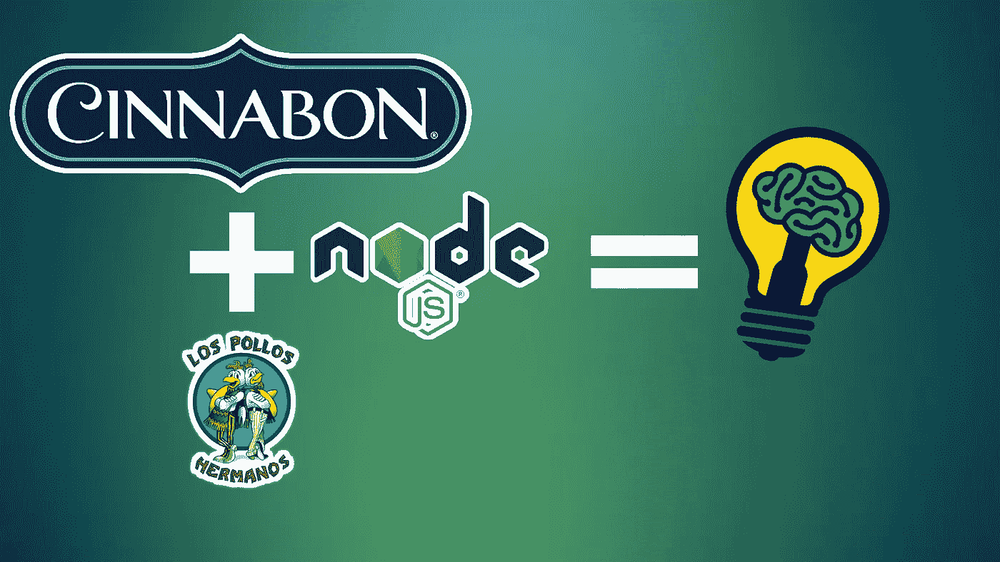

# 持续你整个编码生涯的关于 Node 的类比。Js 与非阻塞和事件驱动架构

> 原文：<https://medium.com/nerd-for-tech/the-1-analogy-lasting-your-entire-coding-career-about-node-js-514076e1ee?source=collection_archive---------12----------------------->

## 关于 Node.js 核心架构的一个小而强大的可视化

图片由[作者](http://www.arnoldcode.com)、 [Cinnabon Logo](https://www.cinnabon.com/) (版权所有)和 Logo [Los Pollos Hermanos](https://en.wikipedia.org/wiki/Los_Pollos_Hermanos) (版权所有)

嘿，从 Node JS 开始可能会令人沮丧和毁灭性的。我完全明白你的意思。尤其是像*异步*、*非阻塞*、*事件驱动*这样的术语…