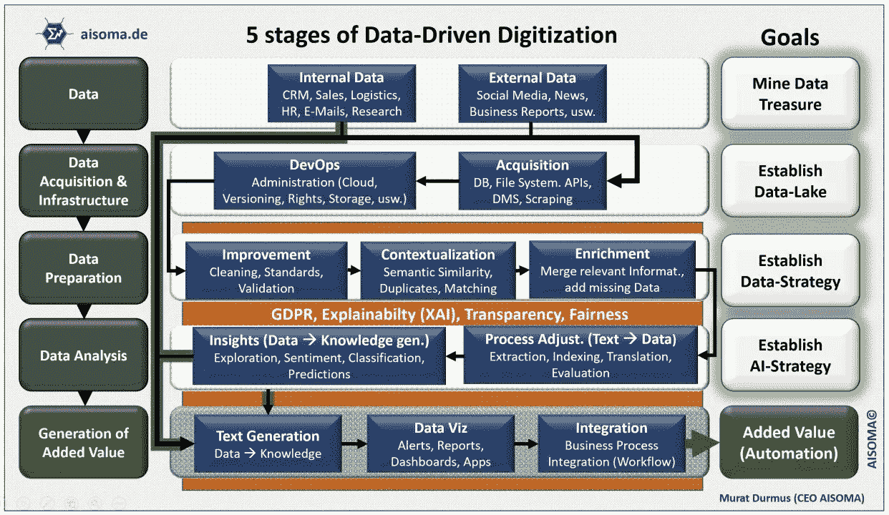
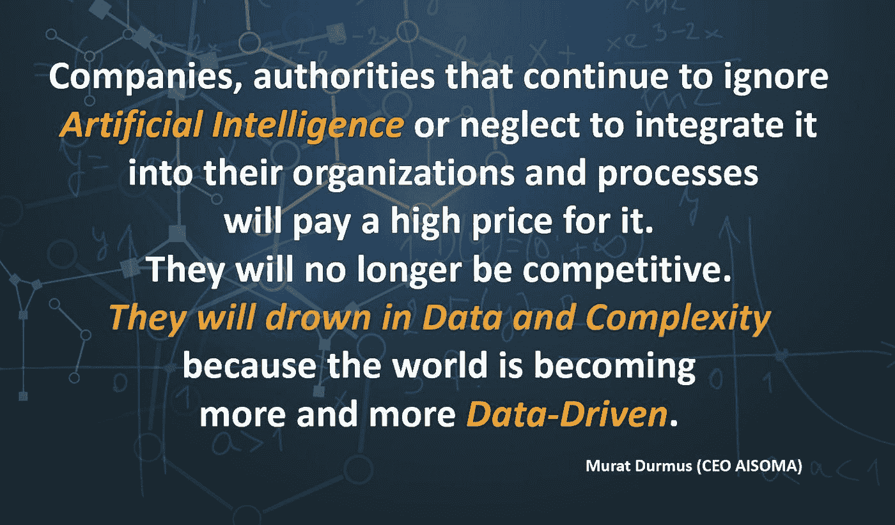
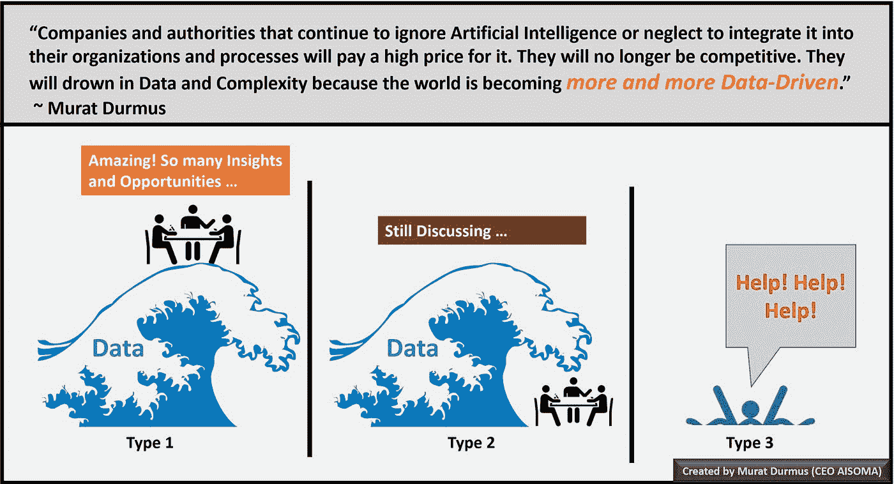
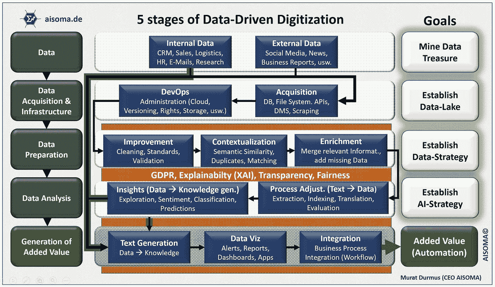
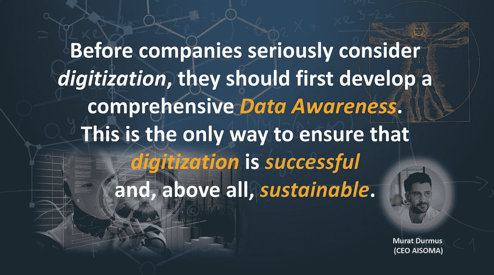

# 数据驱动的数字化的 5 个阶段

> 原文：<https://medium.com/nerd-for-tech/the-5-stages-of-data-driven-digitization-5bde219a57d3?source=collection_archive---------1----------------------->

数据驱动的数字化的 5 个阶段——Murat dur mus(首席执行官 AISOMA)

数字化成熟度较低的公司尤其受到当前危机的影响。这些是世界各地许多专家的陈述。当前的形势确实令人痛苦地凸显了这种不满，但是，即使没有当前的形势，许多公司和机构在数字化方面的失败被公之于众也只是时间问题。这个世界正变得越来越由数据驱动或数字化。时间流逝得越多，这个过程发生得越快。

穆拉特·杜尔穆斯

> 使用数据推动数字化转型的公司在最高层蓬勃发展。

个人假设、经验、个人观点和风险评估通常是许多管理者的行为特征。这些也经常反映在公司流程中。由于方面的不同，每个经理为自己和他所负责的团队设定其他优先事项。这往往导致筒仓思维。数据驱动的数字化应该完全抵消这种“筒仓式思维和决策”，因为决策和战略是由数据而不是个人假设和经验强烈驱动的。

来源:缪拉·杜马斯([艾思想书](https://www.amazon.com/dp/B08Z4BWN1X))

首席执行官们首先应该做的最重要的事情是对转型形成一种平衡的观点。这种顺畅的视图应该基于对公司内部数据和相应细分市场的洞察。

数据创造了最接近现实的事实和透明度，因此提供了评估公司地位的最佳机会和未来高效业务活动的基础。通过数据驱动的数字化，您的公司可以充分利用数据的潜力，在数字时代成功运营。

> *主要根据数据制定战略或决策的首席执行官未来会更加成功。*

我已经形成了一个如何逐步实现数据驱动的数字化的概念。重要的是，每个阶段的目标都应该在每种情况下制定或实现。这是确保可持续数据驱动数字化的唯一途径。所描述的模型旨在作为一个方向。

数据驱动的数字化的 5 个阶段——Murat dur mus(首席执行官 AISOMA)

# 数据驱动时代的原则:

*   **数据胜过假设**
*   **数据胜过直觉**
*   **数据胜过个人偏见**
*   **数据创造了确凿的事实和透明度。**

来源:缪拉·杜马斯([艾思想书](https://www.amazon.com/dp/B08Z4BWN1X))

穆拉特·杜尔穆斯(著有:《艾思想书》[)](https://www.amazon.com/dp/B08Z4BWN1X)

这本书的节选(pdf)可以在这里下载:【https://www.aisoma.de/the-ai-thought-book/