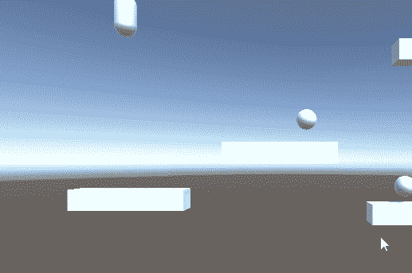
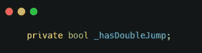
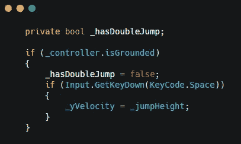
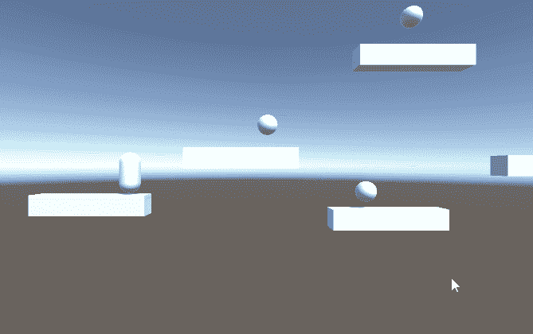

# 双人跳跃的能力-游戏开发系列 79

> 原文：<https://medium.com/nerd-for-tech/the-ability-of-double-jump-game-dev-series-79-cf0335418255?source=collection_archive---------26----------------------->

创造双跳快速指南。

双跳是游戏中常见的一种能力。作为一款平台游戏，拥有双人跳跃的能力会对玩家有所帮助。

在本文中，我们将创建双跳转函数。

## 双跳开关

为了实现这个功能，我们需要一个 bool 来检查玩家是否已经跳了两次。

下面是这个 bool 的双跳概念:
1。当玩家触地时，这个 bool 应该切换到 false。
2。如果玩家在空中还没有双跳，它应该允许玩家再跳一次。
3。双跳后，bool 应该切换到 true 以防止再次空中跳跃。

现在我们可以把这个概念做成代码。

## 更新更新()

让我们将布尔值添加到**被忽略的** if 语句中。

这将确保球员不能再次跳触地面。

现在再加一个 if 语句跳起来。

有了这个球，运动员应该能够再次在空中跳跃。

哎呀…