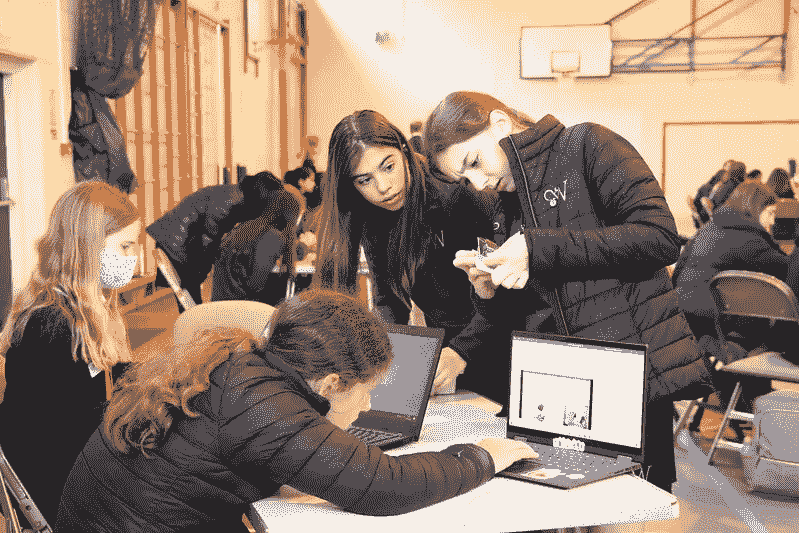
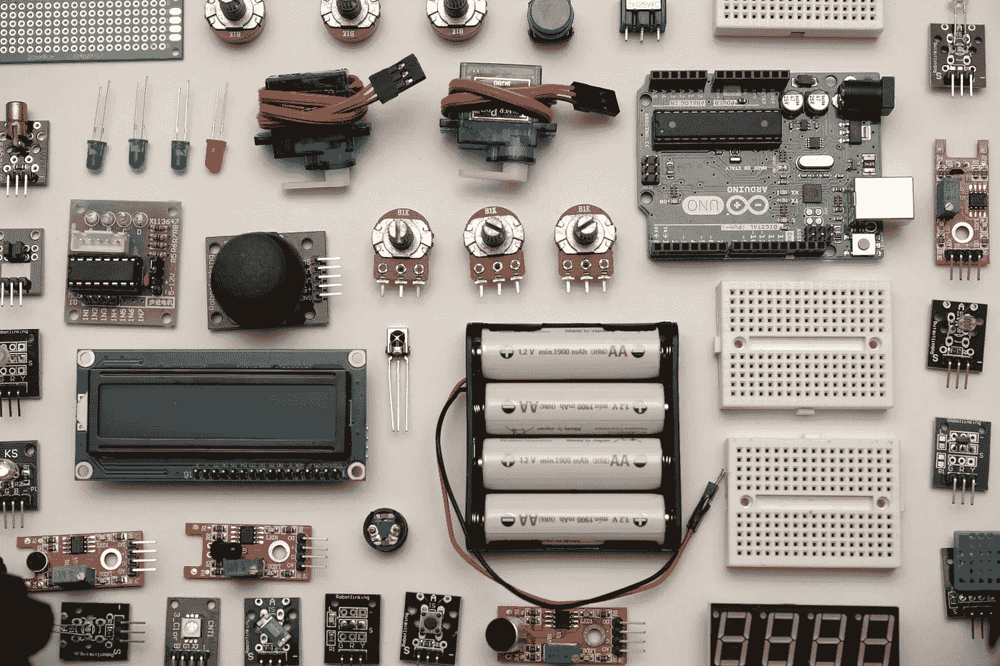
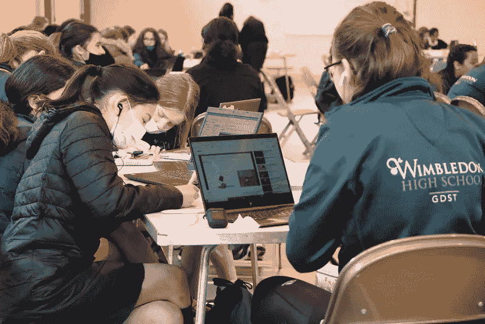
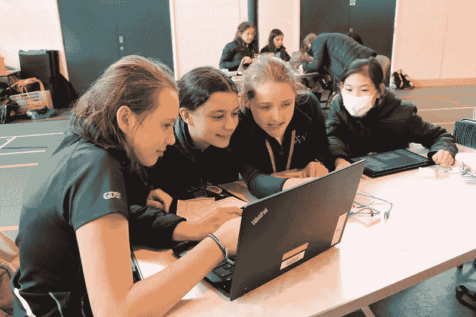
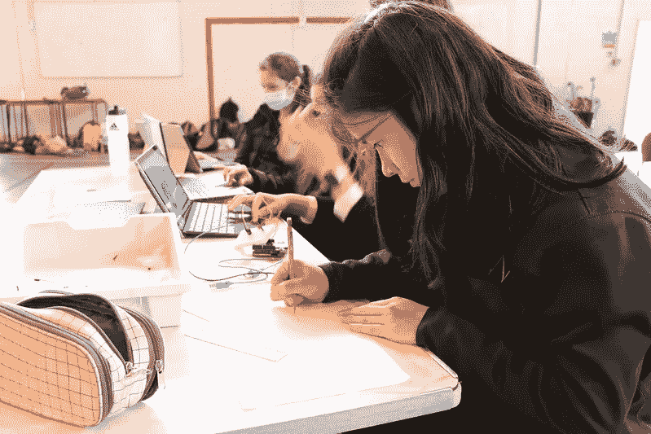

# 学校中的人工智能项目

> 原文：<https://medium.com/nerd-for-tech/the-ai-in-schools-program-896f7000f31f?source=collection_archive---------6----------------------->

图片:温布尔登高中

## 向高中生介绍编程、数据科学和人工智能

去年，我与伦敦温布尔登高中的老师合作开发了一个新项目，向八年级学生传授更多关于数据科学和机器学习的知识。今年，我们交付了我们开发的人工智能在学校项目的第一次迭代。在这篇博文中，我将概述该项目涉及的内容、我学到的知识以及我计划在下一次交付中改进的地方。[点击这里](https://www.wimbledonhigh.gdst.net/news/2021-06-18/a-fantastic-year-8-ai-code-day)阅读当天学校的报告。

 [## 为什么要教学生 AI？

### 小学生应该学习人工智能，即使他们不把它作为职业

nwheeler443.medium.com](https://nwheeler443.medium.com/why-teach-students-about-ai-1c03b13c9694) 

这个项目持续了几个星期，女孩们以小组为单位进行项目。

[罗宾·格劳泽](https://unsplash.com/@nahakiole?utm_source=unsplash&utm_medium=referral&utm_content=creditCopyText)在 [Unsplash](https://unsplash.com/s/photos/arduino?utm_source=unsplash&utm_medium=referral&utm_content=creditCopyText) 上的照片

该计划以人工智能构建日开始，在这一天，女孩们组装并编程 Arduino 传感器，以收集整个学校的温度、光线和运动模式数据。每个小组负责一个设备中的一种数据类型。在建造日之后，这些设备被放置在学校周围的战略位置，并开始收集数据供以后分析。

接下来，女孩们在课堂上有三节时间序列数据建模课。这些课程将介绍他们在最后一天可视化和分析数据的主要方法，但使用的是伦敦自行车租赁的数据。

这个项目以人工智能代码日结束，我亲自参加了这个活动。这一天，所有收集到的数据和女孩们学到的编程技巧都将汇集在一起。以下是这一天所涉及内容的概要。

## 进入数据科学的职业旅程

在这一天的开始，我做了一个介绍性的演讲，描述了我从生物化学到编程的职业生涯。我最初没有选择学习编程，因为我从高中开始就没有任何编程经验，也不清楚 it 行业的工作会是什么样的。我选择在大学学习生物化学，并作为夏季研究项目的一部分被介绍给编程。

图片:温布尔登高中

我利用在线资源自学编程，并得到了我的博士生导师和我兼职工作的实验室的支持。当我在培训的时候，我所在的领域非常缺乏程序员，所以我最初进展缓慢是可以的。我选择攻读生物信息学博士学位，因为我喜欢计算研究带来的自由和灵活性，并希望分析一些开始产生的大基因组数据集。

举例说明真实的人如何进入编程领域，对于帮助学生描绘自己未来的职业轨迹是有价值的，但需要管理预期。今天，许多离校生希望在工作中或自学中学习编程，但更多的雇主希望新员工已经精通编码。因此，像我这样的职业旅程的故事，如果让学生对入门级编程工作的样子产生不切实际的期望，可能会适得其反。如果今天的学生能够在学校获得先进的数字技能，他们就有很大的优势，如果他们在职业生涯中依赖自学，他们就有可能落后于同龄人。

图片:温布尔登高中

## 人工智能代码日

这一天的主要任务是让女孩们分析学校收集的能源火花数据，并对能源使用进行时间序列预测。我们还想看看女孩们收集的额外数据对预测准确性的影响。我们用 Kaggle 笔记本带领女孩们经历了三个层次的数据建模:

**第一级:**使用脸书的 Prophet 软件包对能量火花数据进行可视化和建模。

**第 2 级:**将 Arduino 数据作为变量包含在模型中，并将预测的准确性与第 1 级中更简单的模型进行比较。

**第三级:**整合“大数据”来源——来自伦敦家庭的能源使用数据。

每一步都邀请学生批判性地思考他们正在使用的数据和模型的输出，目的不仅是展示大数据和人工智能的潜力，还强调他们的一些缺点。

图片:温布尔登高中

在一天结束时，每个团队都拍摄了一段 Flipgrid 视频，解释他们在调查中的发现，以及他们对学校如何减少能源消耗的建议。我在另一篇博文中概述了我们在这项工作中的一些发现:

 [## 用机器学习分析学校用电

### 人工智能在学校项目中的发现

nwheeler443.medium.com](https://nwheeler443.medium.com/analyzing-power-usage-in-schools-with-machine-learning-ba07f089d547) 

## 物流

因为我们是在 Covid 疫情期间交付项目的，所以我们需要解决如何在保持适当的社交距离的同时开展活动的问题。我们把活动安排在学校的大厅外，让每个队都坐在自己的桌子旁。白天，我坐在教室的前面，女孩们通过微软团队联系我，分享她们的屏幕，如果她们遇到编程难题，而她们的老师不能很快解决的话。

这是一整天的编码挑战，所以我们在这一天结束时谈论了数据科学、项目管理和气候变化方面的职业生涯，以及定期的 Mentimeter 投票，以检查女孩们的进展情况。

## 学生反馈

我们使用心理测量仪，对一些女孩的活动后采访和 Flipgrid 视频来评估该计划的效果，女孩们学到了什么以及她们对该计划的感受。

*   学生们学到了很多关于 Python 编程的知识，如何绘制数据，以及如何解释他们的图形。这个项目不仅仅教授编程技能。它还教会学生如何作为一个团队工作，管理时间和发挥团队成员的优势。
*   他们对人工智能的理解随着程序而改变。例如，一些受访的学生此前认为 AI 是计算机能够理解世界。课程结束后，他们现在将 AI 视为分析大量数据并从许多不同场景中学习的计算机，以尝试预测未来将发生的事情。
*   学生们意识到了人类在人工智能的设计、训练和评估中的重要性。人们在所有这些步骤中做出的选择会对人工智能可能做出的预测产生很大影响。
*   学生们对学校在不开放的时候消耗的能源感到惊讶
*   这些练习很难，但当学生们坚持下来并作为一个团队工作时，他们克服了这些挑战，并为他们所取得的成就感到自豪。他们更有动力去做这项工作，因为它处理的是真实的数据和现实世界的问题。

图片:温布尔登高中

## 什么效果好

*   将项目安排在几周内完成，可以给关键概念的理解留出时间。即使在最后的代码日之后，女孩们仍然在整合她们所学到的东西，几天后拍摄视频的小组对她们的结果有了更多的见解。
*   Kaggle 是一个很好的平台，可以与每个学生团体分享活动的数据和代码。它还为女孩们提供了自己的笔记本，用于在未来向潜在雇主展示她们所学到的东西。
*   让学生分组工作有助于他们自己解决问题，并创造机会培养更好的团队合作和项目管理技能。

## 下次需要改进的地方

根据这些调查结果，我推进此项目工作的重点是:

*   解释使用高级数字技能的职业的好处，以及是什么让这个职业变得很酷——能够在世界任何地方工作，良好的就业前景，能够将相同的技能应用到学生可能感兴趣的许多不同问题上
*   强调一下，我的一些职称在我高中的时候是不存在的或者是非常罕见的。我们很可能让学生为尚不存在的工作做准备，所以像编程这样的可转移技能可以让学生更好地追求自己的兴趣，并在未来找到好工作
*   描述并介绍更多女性在使用先进数字技术的职业中工作的例子，并给出这些工作所涉及的更多细节
*   包括调查学生在项目前后对数据科学职业的看法，看看我们是否已经转移了对涉及这些技能的主题或职业的兴趣
*   更清晰地划分笔记本，以突出女孩正在学习的技能以及这些技能可以应用的其他地方(例如，“在这一部分，你看到的是原始数据，通常称为探索性数据分析。这有助于在进行任何建模之前获得关于数据的初步见解”)

## 探索的事物

让四个学生组成的小组一起编写代码可能有点棘手。我正在探索如何使用 [**小故障**](https://blog.glitch.com/post/code-together-on-glitch) 让学生们在不同的笔记本电脑上同时编写代码，也让我可以直接进入他们的项目，与学生们一起阅读/编辑代码。

LinkedIn 也推出了 [**Greykite**](https://github.com/linkedin/greykite) ，这是他们自己版本的脸书先知包。看起来它可能在开箱即用的时间序列数据建模方面做得更好，所以我将考虑在下一次迭代中替换它。

## 后续步骤

该计划的第一次迭代收到了巨大的反馈，但我们的目标是在下一学年进一步改进该计划。我们还希望扩大该计划的规模，让其他程序员在英国各地的高中提供该计划，并开发无需程序员现场排除故障即可提供的教学材料。

还有其他想法吗？请在评论中留下他们！😊