# 以下是我在分析了我乘坐的出租车后的发现

> 原文：<https://medium.com/nerd-for-tech/the-analysis-of-my-taxi-rides-97ed4d43b010?source=collection_archive---------22----------------------->

每次我预订出租车时，我都会收到一封电子邮件，其中包含日期、时间、车型和司机姓名等识别信息。这里的想法是分析这些报告，并提取最大数量的有用和有趣的数据。我敢打赌，你也一直想知道你坐同一辆车的频率，或者有多少司机你见过至少两次。

# 数据挖掘技术

现在我要告诉你我是如何设法从我的邮箱中提取信息的。我将在本文末尾附上 python 笔记本的链接，供您查看代码。最简单的方法是将所有电子邮件导出为*。mbox 文件——这似乎比研究我的邮箱所在的 Gmail API 要容易得多。这种方法不允许在我导出*后自动输入有关游乐设施的信息。mbox 文件，但现在这并不重要。

我使用邮箱库来处理归档。它以 HTML 代码的形式提供对电子邮件所有属性的访问，如发件人和每封电子邮件的内容。

在挑选了出租车服务发送的电子邮件后，我面临一个紧迫的问题:出租车服务不时改变报告的形式，导致无法统一提取数据的方法。幸运的是，报告的格式只发生了一次剧烈的变化。在此之前，报告是纯文本形式的，但现在，所有信息都包含在一个表中。因此，我编写了两个函数:一个用正则表达式从文本中提取数据，另一个解析 HTML 表从中获取数据。一旦获得数据，我就把它以熊猫数据帧的形式存储起来，并加载到云数据库中，这样我就不必每次都解析我的邮箱了。

# 让我们看看游乐设施

获得结构化数据后，我们可以获得第一个洞察力:

随着时间的推移，游乐设施变得越来越贵。

在这里，你可以看到游乐设施开始时间的柱状图。很明显，我通常乘出租车去上班或回家。窄峰对应我上班，宽峰对应——回程。

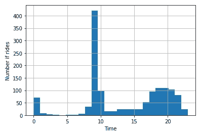

在下图中，你可以看到出租车乘坐频率是如何随时间变化的。夏天和一月的每个月都有水滴。

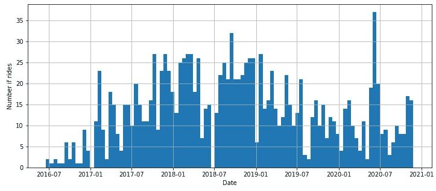

最受欢迎的出租车是起亚

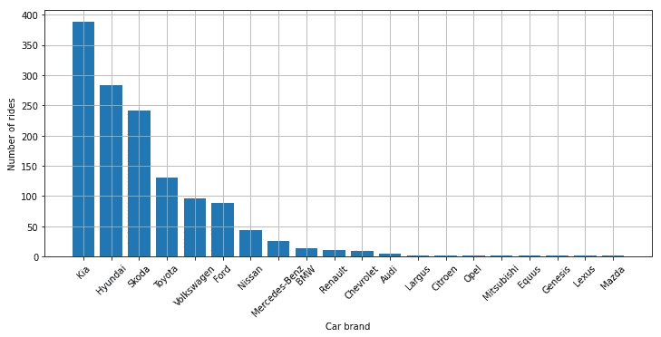

经济舱和舒适舱都很受欢迎。Optima 在经济舱，Cee'd 和 Rio 在经济舱。

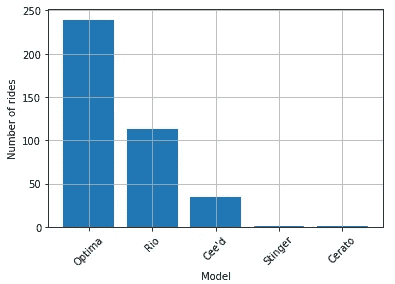

# **巧合？我觉得不是！**

所以，我决定弄清楚我坐同一辆车或同一个司机坐了多少次车。

首先，我们来看看驱动程序。分析显示，有 24 名司机不止一次驾驶过我。也就是说，大多数时候，同一个司机开着另一辆车来。很明显，汽车不是分配给司机的，即使他们中的一些人告诉我他们骑自己的车。我认为这种做法没有被广泛接受。

所以，我做了一些有趣的观察:

马木卡载了我 3 次，但我坐了他的车 4 次。

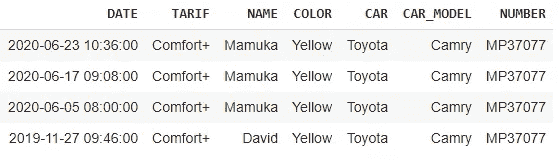

有两个司机让我坐经济舱，几年后我和他们一起坐了舒适舱。

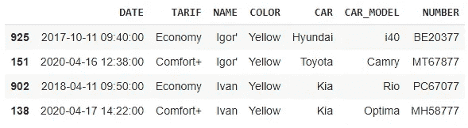

对同一个出租车司机的乘车间隔时间的分析表明，在 150-200 天后，几乎不可能再遇到某人。好像很久没人在出租车上工作了。

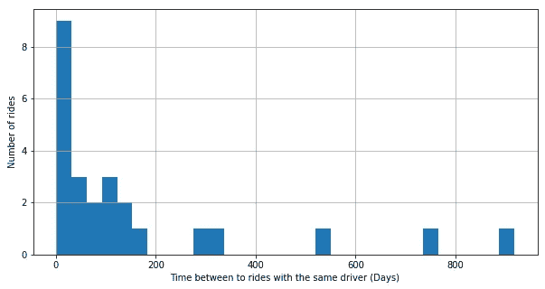

同样的分析应用于汽车，显示有 29 辆重复出现的汽车，并且乘坐之间的时间间隔分布减少得更慢。这可能意味着汽车比司机停留的时间更长。

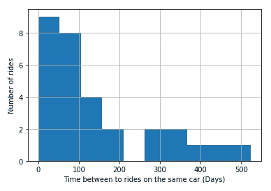

# 让我们试着获得更多的数据

设 p_c 为 1 天内分解的概率。那么在第一次乘坐后的第 m 天乘坐同一辆车的概率:

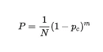

对数列求和后，可以得到在任何一天乘坐同一辆汽车的概率

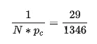

在从第 m 天到第 m+n 天的时间段内乘坐同一辆汽车的概率:

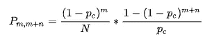

这使得我们可以使用这些公式来估计莫斯科的汽车数量及其运行周期。直方图的形状——代表同一辆车两次乘坐之间的时间——允许我们估计它们的使用时间，两次乘坐的次数告诉我们镇上的出租车数量。

让我们试着挑选这样的 p_c，使预测的直方图与真实数据相匹配。请记住，我通常在汽车运行周期的中间有第二次乘坐，我们需要相应地修正结果。

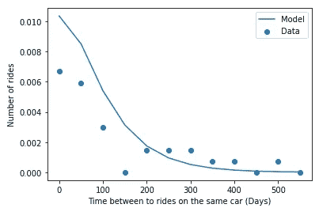

数据近似后，我们得到 p_c = 0.0062，得出以下结果:

*   莫斯科的汽车数量— 7194 辆
*   运营周期— 257 天

同样的道理也适用于出租车司机:

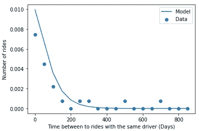

该曲线对应于给出的 p_c = 0.0076，这意味着:

*   莫斯科的司机数量— 7039 人
*   一名司机平均工作 209 天

不出所料，司机比汽车少。但是差别没那么大。此外，司机退休比汽车早。

有兴趣的，这里有一个 python 笔记本的链接:[https://colab . research . Google . com/drive/1 ACN 7 hofbwe _ sq8 qwd 8 gppkg 9 mnpv qxrh？usp =共享](https://colab.research.google.com/drive/1aCN7hOfBwe_sq8QwD8gPpKg9MNpvQxrH?usp=sharing)