# 《哈特里克》中令人惊讶的比赛分析

> 原文：<https://medium.com/nerd-for-tech/the-analytics-of-surprising-matches-in-hattrick-d999917ef6d?source=collection_archive---------2----------------------->

哈特里克是历史上最好的游戏吗？是的，它是！

但这不是我们今天要讨论的。

hattrick.org 是一个基于足球的模拟游戏

我们要讨论的是，在给定两队得分的情况下，如何计算赢得比赛的概率。但是首先，简单介绍一下这个游戏。

Hattrick 是一款基于足球的策略游戏，在这个游戏中，你将长期组建并管理你的团队，在一个竞争的环境中与其他人类玩家进行游戏。哈特里克于 1997 年(大约 24 年前)在瑞典成立。

毫无疑问，足球是世界上最受欢迎的运动。根据国际足联的调查，35 亿(3500 . 000 . 000)人至少观看了 2018 年俄罗斯世界杯的一部分，11.2 亿(1120 . 000 . 000)人至少观看了法国和克罗地亚之间的世界杯决赛 1 分钟。

这种现象在网上重复出现，数百万用户希望复制他们的偶像对这项运动的热情。

Hattrick 是 1997 年 8 月 30 日在瑞典创作的在线免费游戏，当时互联网还是个孩子。经过 24 年的历史，该平台翻译了 54 种语言，你可以在多达 144 个国家拥有一支球队，有 **13.726.848** 的用户和 **776.172.690** 的比赛已经进行到目前为止。

比赛是游戏的基石，是随机性和非随机性融合的地方，是人类管理者的技能和引擎的突发奇想决定结果的地方。这是我们模型的分析单位，匹配。

下面的文章将应用 CRISP-DM 方法的原则，这将允许我们对两种受众说一种共同的语言:技术和非技术 hattrick 用户。

# 商业理解

## **哈特里克的引擎**

哈特里克的比赛与现实生活中的比赛非常不同。当然，哈特里克比赛背后的逻辑思维与现实生活中的比赛相似:

*   它们持续 90 分钟
*   技术较高的队比技术较低的队更容易赢得比赛
*   随机性有影响，但不是决定性因素，一些比赛可以由随机因素决定，但它们不是大多数

看真人比赛和看哈特里克比赛的主要区别(是的，他们是有解说的，而且有直播可以看！)是 hattrick 匹配是由循环定义的。

在现实生活中，足球比赛是一场连续的运动，球员争球，最终进球得分。在哈特里克，一场比赛被定义为一系列离散的事件，这些事件可能会也可能不会导致进球。

## **发动机如何工作**

中场争夺战，两队决定(根据两队中场的比例)谁获得进球机会。在一名球员可以拥有的 11 项技能中，**组织进攻**是决定你球队中场水平最重要的一项吗？

当两个中场中的一个赢得了下一个进球机会时，进攻的区域就决定了，可以给右边，中间，左边，或者可以是任意球或点球。

然后将该区域的攻击与对手在同一区域的团队防御进行比较。如果被选一方的进攻明显好于防守，则得分。

与同一侧防守相比，攻击等级越高，分配给该侧时得分的机会就越高。

整个循环在一场比赛中重复几次，导致几次可能或不可能转化为进球的机会，以这种方式形成了游戏运行的引擎。

## 感兴趣的问题

从一个哈特里克经理的角度来看，重要的是事先知道他的团队赢得比赛的**赔率**，考虑到**评级**，他的团队能够得到他的实际球员。

为什么？因为一个 hattrick 用户每周日打联赛时想做的是最大化他战胜对手的可能性。

一个 hattrick 用户想要计算他的比赛的可能结果，这样他就可以知道该做什么决定。

作为数据科学家，我们渴望帮助他或她实现这一目标。在数据科学的帮助下，我们也许能够计算出他/她(也许是我们自己)获胜的概率。

正如在论坛上所说的以及之前与 hattrick 用户的交流,**中场评分**是一场比赛中最重要的单项指标。

我们将帮助阅读本文的 hattrick 经理解决这些问题:

*   哈特里克的用户是好人，但我们不应该就这样相信他们的话，所以…中场评分真的是一场比赛中最重要的单项指标吗？
*   数据科学能否帮助我们定义一个**惊人的匹配**？
*   根据我的团队和对手团队的评分，赢得的**概率有多大？(他们事先掌握的信息)**
*   竞争对手评分之间的比率比评分本身更好吗？
*   有多少几率完全取决于**中场评分对比(比)**？换句话说:我只控制**中场**就能控制多少比赛的胜算？
*   相反:除了**中场评分比较(比率)**之外，有多少胜算取决于别的？换句话说:如果我忽略中场，比赛的可预测性会有多高？
*   有时候，失去中场是不可避免的，如果他/她**在与对手的比赛中失去中场评分比**可以做些什么来增加他赢得比赛的几率？
*   我可以用**易于解释的**模型来回答前面的问题吗？或者我应该失去解释能力来得到**更好的度量**？

# 数据理解

## 数据

表示比赛中一场比赛实力的数字(右防守、中防守、左防守、中场、右进攻、中进攻、左进攻)称为**等级**。而且，由于对立等级之间的**比率**是 hattrick 比赛的基石，我们可以在比赛开始前使用这些数字作为比赛结果的预测。

值得注意的是，参加比赛的两个用户在比赛开始前都可以预览收视率，信息是对称的，这使得 hattrick 也成为一种心理游戏。

hattrick 经理将在他或她将要参加的任何比赛之前看到该布局，这将使他们能够根据之前的比赛粗略地了解他们和他们的对手将要达到的等级:

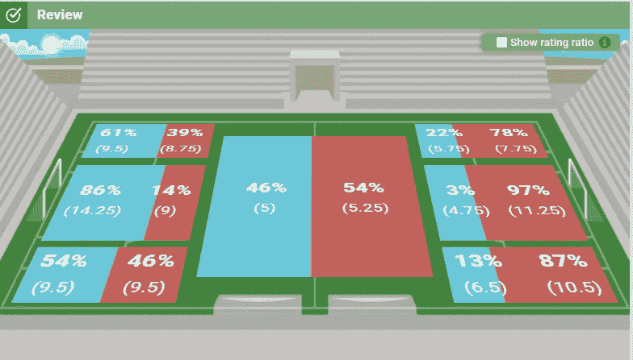

比赛前的预演

这取决于经理(人类用户)在他们的团队的战术和战略上引入足够的多样性，以在即将到来的比赛中给对手带来惊喜。

由于这些评分甚至在比赛前几天就可以得到，经理们可以利用这段时间来提高他们的球队:购买更好的球员，尝试不同的阵容，尝试不同的战术，当然，简单地说，希望一个令人惊讶的结果是一个有效的选择！

## 读取比赛结果

下图显示了显示评分的 hattrick 赛后布局。我们可以看到一个包含三列的表格，其中字段的名称在第一列，团队的名称在第二和第三列，在交叉点，字段的级别(以人类可以理解的方式)以数字的方式显示。

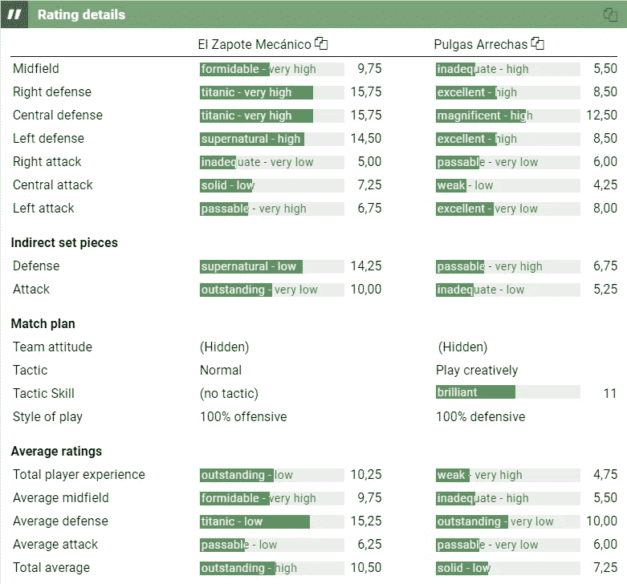

一场哈特里克比赛结束后的评分表

比赛前的比赛评级和比赛结束后的评级之间的关系是，比赛开始时的评级是对首发球员(开始比赛的虚构球员)的反映。但是，随着比赛时间的延长，许多其他因素也会改变收视率:

*   运动员受伤
*   比赛中运动员的疲劳
*   替换，提高或降低评级
*   被另一名队员盯人防守的队员
*   赞成或反对的特殊事件

不符合嵌入在 hattrick 引擎中的概率模型的表面逻辑的匹配比例被称为**意外匹配**，它们符合前一种原因，或者根本没有原因，而是纯粹的随机性。

如果你，这篇文章的读者，是一个哈特里克经理，当你意识到这场比赛以 LxDxSur FC 3-0 结束时，你会感到惊讶。

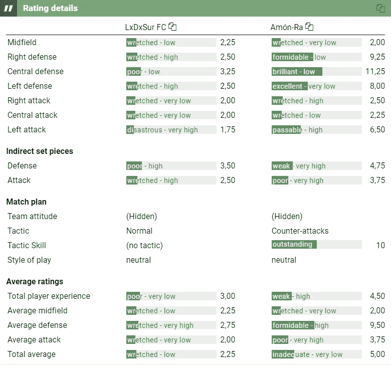

令人惊讶的比赛。

这篇文章是关于那些令人惊讶的比赛，我们将根据一个数学定义来分析哪些比赛是令人惊讶的，成为受害者或有一个受害者的概率是多少，以及在 hattrick 的比赛上计算其他应该很有趣的事情。

# 数据准备

如果你对比赛的样子很好奇:

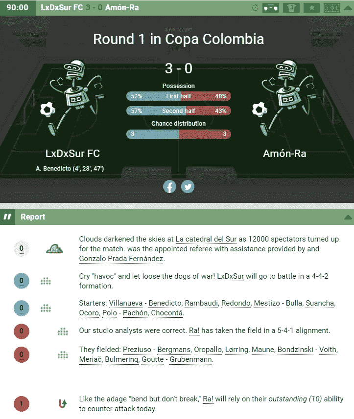

哈特里克的一场比赛

我们有一个手动检索信息的数据集。

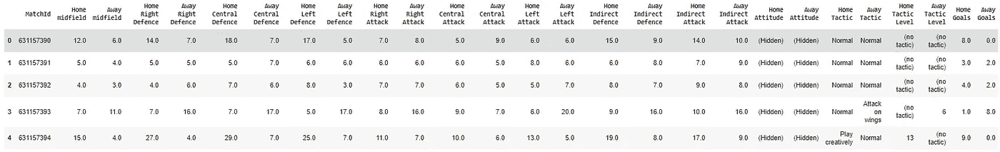

主场中场直方图如下:

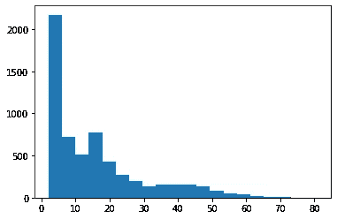

主场中场直方图

该信息对应于:

*   匹配 ID
*   主队中场评分:0 到 100[0，100+]或更高(大于 100 的值很难达到)
*   客队中场评分:[0，100+]
*   主队的右防守评分:[0，100+]
*   客队的右防守评分:[0，100+]
*   主队的中等防御等级:[0，100+]
*   客队的中等防御等级:[0，100+]
*   主队的左后卫得分:[0，100+]
*   客队的左后卫得分:[0，100+]
*   主队右攻评分:[0，100+]
*   客队的右攻评分:[0，100+]
*   主队的中攻评分:[0，100+]
*   客队的中攻评分:[0，100+]
*   主队的左攻得分:[0，100+]
*   客队左攻评分:[0，100+]
*   主队对间接任意球的防守:[0，100+]
*   客队对间接任意球的防守:[0，100+]
*   主队间接任意球进攻:[0，100+]
*   客队间接任意球进攻:[0，100+]
*   主队的态度(态度是经理告诉他的球员在比赛中必须付出的努力):“冷静点”，“正常点”或“赛季最佳比赛”，态度影响着一支球队中场的实力。该信息不可用，因为它是团队所有者的私有信息。
*   客队的态度:“发挥冷静”，“发挥正常”或“赛季的比赛”。该信息仅供团队所有者使用。
*   主队战术名称(战术被定义为球队进行比赛的方式):紧逼、边路进攻、中路进攻、远射、反击或创造性发挥。
*   客场战术名称:紧逼、边路进攻、中路进攻、远射、反击或创造性发挥。
*   主场战术等级:经理选择的战术等级(取决于球员的技术):[0，100+]
*   客场战术等级:[0，100+]
*   主场进球:主队的进球数
*   客场进球:客队的进球数
*   Home_is_winner(不包含在原始数据集中):这个变量决定主队是否赢了他的比赛。计算为
    **主场进球>客场进球**和结果为布尔型。

正如您所预见的，提议的目标变量是一个布尔值，如果主队赢了，则为真，否则为假。

*y = {1，如果主队赢了| 0，否则}*

## 数据清理

有 6017 个匹配手动检索的模型。

## 特征工程:获得新的基于知识的特征

有一个特征工程过程来获得竞争领域之间的比率，以便进行比较。例如，对于中场比例:

*中场 _ 比率=
主队中场/(主队中场+客场中场)*

中场比例的直方图如下所示:

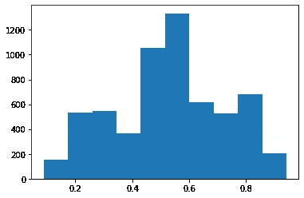

中场比率直方图(中场之间的比率)

# 建模

## 计算的指标

要建模，首先需要定义将用于此分析的一组指标。

在以下 GitHub 存储库中，您可以找到一组函数，它们的应用将允许我们计算以下指标来解决我们的问题:

## 混淆矩阵

混淆矩阵是将模型的输出与被分析个体的真实标签进行比较的表格。在类别之间的每个交叉中，矩阵包含符合该行和该列的个体数量，主对角线显示分类良好的个体，次对角线显示分类不良的个体。

行和列之间的每个交叉点都有一个名称，定义如下:

当真实标记和预测标记一致且都是阳性(1)时，这些个体被称为真阳性(TP)，当两者一致为阴性(0)时，它们被称为真阴性(TN)。

但是，当它们不一致时，真实标记为正，预测标记为负，它们被称为假阴性(FN)；另一方面，真正的标记阴性和预测的标记阳性，它们被称为假阳性(FP)。

预测的正面或负面结果的定义取决于二元分类模型的定义阈值。

*如果 Predicted _ probability≥threshold，则 Predicted_positive = 1，否则为 0*

因此，根据这个定义，FP、FN、TP 和 TN 的数量可以根据阈值而改变。

依赖于阈值可获得的一些度量是

*灵敏度= TP/(TP+FN):* 模型在阳性病例中检测真阳性的能力

*特异性= TN/(TN+FP)* :模型在阴性病例中检测真阴性的能力

*准确率= (TN+TP)/(TN+TP+FN+FP)* :模型检测真实案例的能力。这一指标对不平衡的数据集很敏感，这会导致琐碎的模型。

这两个指标是我们最感兴趣的。其他指标有 F1 得分、马修斯相关系数。

在某些情况下，误报和漏报的成本不同，因此在数据科学中通常会发现一个称为成本矩阵的概念，它可以帮助模型选择一个更好的阈值，该阈值与您提出的业务问题有关系。

这是我们所能找到的关于哈特里克意外配对的第一个定义:

> ***惊喜匹配:*** 在一个混淆矩阵中发现的误报和漏报。**先前预测为胜利的失败，反之亦然。**

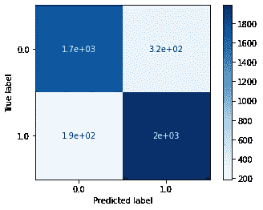

由于敏感性和特异性的值取决于阈值，它们可以绘制在称为 ROC 曲线的敏感性对特异性图中，这将在下面解释。

## ROC 曲线下面积

接收器工作特性曲线是一个曲线图，说明了阈值移动时二元分类的性能。绘制模型的 FPR 或 1-特异性与 TPR 或敏感性的关系图。

随着阈值的变化，获得了参数曲线，该曲线说明了模型的性能。

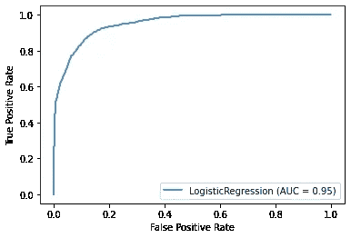

受试者工作特征曲线

但是，有一个度量标准缺失了:ROC 曲线是一个非常有用的图示，它显示了模型的表现，但是仍然需要将这个图总结成一个单一的、可比较的度量标准。您可能已经注意到，模型越好，点越靠近图的左上角。触及这一点的模型为分类个体提供了完美的性能，这在实践中(和现实生活中)是不可能获得的。

因此，图越靠近 *(0，1)* 角，ROC 曲线(积分)下的梯形面积越大，这一指标将为我们提供比较不同模型的可能性。被称为 AUC(曲线下面积)。

但是，由于阈值在图中变化，AUC 没有提供关于阈值应该具有的值的任何见解。这就是为什么 AUC 对于估计一个模型应该具有的概率的真实值是没有用的。

科学家对 AUC 的使用数据是为了确定哪些模型对不同的个体排序更好，它没有显示概率是否计算得很好。

由于我们正在定义意外匹配，AUC 不是使用的最佳指标，因为它无法判断概率计算是否正确，它仅计算它们是否从最高到最低正确排序。我们需要真实的概率，这样我们就能知道计算出的概率与真实结果有多大偏差。

## 原木损失

对数损失是估计正确的可能性，这些估计是根据概率进行的，这意味着当实际标签分别为 0 或 1 时，该度量奖励概率接近 0 或 1。

对数损失是一个独立于阈值的度量。

这个度量帮助我们得到一个意外匹配的真正定义:概率越接近实际标签，匹配就越不意外。

所以，我们正在寻找一个模型，它能最小化哈特里克引擎的不可预测性，那些逃过这一预测的比赛被认为是令人惊讶的比赛。

## 不准确

作为练习，我们开发了一个函数来获得该问题的最佳阈值。

ROC 曲线可以被视为双目标优化的帕累托曲线，其中 TPR 必须最大化，FPR 必须最小化。

存在许多选择特定非支配解的方法，但是我们可以选择最小化到 *(0，1)* 角的欧几里德距离。

在这种情况下，可以选择*阈值[argmin(distance)]* (最小化距离的阈值)作为解决方案。

因此，No_Accuracy 可计算如下:

> *accuracy_score(y_true，pred _ test<best _ threshold)*

这是准确性的常见定义，但定义是因为阈值是通过求解双目标问题的帕累托曲线获得的。

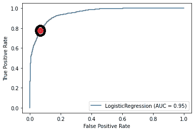

对于所有模型，计算 AUC、log_loss 和 No_Accuracy。

## 交互信息

互信息分数允许数据科学家在建模之前知道哪些变量对结果有更大的影响。

互信息可以测量线性和非线性关系，而相关系数只能测量线性关系。

MI 分数可用于确定特征的可变重要性，而无需将它们暴露给模型。

## 建模技术

下一步是选择一套允许我们对问题建模的技术。

选择这些技术是因为它们符合以下标准:

*   众所周知
*   有提供优秀解决方案的历史或非常容易解释

选择的算法有:

*   逻辑回归:易于解释，有可能获得一个相对简单的方程来计算概率。
*   决策树:最简单、最弱但最容易解释的模型。
*   随机森林:一组决策树，更难解释，但给出了非常好的结果(深度:2 & 3)
*   KNN 的 Bagging:将两个模型结合成一个模型:Bagging 是一种聚合模型的方法，K-Nearest Neighbors 是一种基于最近邻的 Y 值计算概率的算法。该模型聚合了 KNN 模型。不可解释。
*   神经网络:一个模仿人脑的不可解释模型。
*   XGBoost 的随机搜索:如果这是一场 Kaggle 竞赛，那么对 XGBoost 树的随机搜索将是每个数据科学家的武器库。它随机遍历 XGBoost 可能拥有的不同参数，寻找最佳组合。很难有一个解释。

# 模型问题/部署的答案

中场评分是比赛中最重要的单项指标吗？

在互信息分数的帮助下，我们可以计算特征重要性的特写。

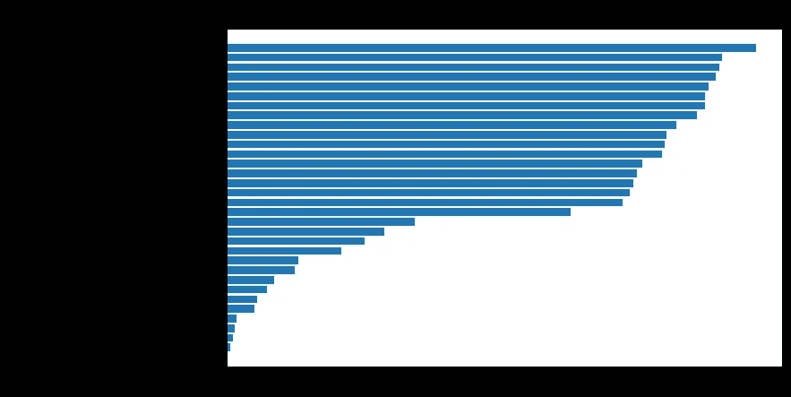

评分的互信息分数

看起来两个中场(主场和客场)都不是第一和第二特征！

让我们试试比率:

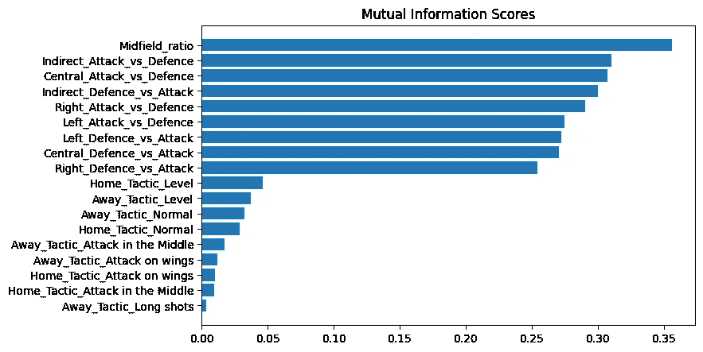

生成变量的互信息得分

Hattrick 用户不正确。在一场哈特里克比赛中，最重要的衡量标准是**而不是** **中场的收视率。**

**唯一最重要的指标是中场之间的比例**，这是有意义的，因为前面解释过的中场之争，这场战斗是相对的，而不是绝对的。

数据科学能帮助我们定义令人惊讶的匹配吗？

是的，我们有工具把这个定义变成数学定义。如前所述，

> ***惊喜匹配:*** 在一个混淆矩阵中发现的假阳性和假阴性。先前预测为胜利的失败，反之亦然。

但是，有多少比赛是令人惊讶的呢？

为了定义这一点，我们应该比较从可能的模型和可能的特征集之间的组合获得的模型:

*(逻辑回归、决策树、随机森林、KNN 装袋、神经网络、XGB 随机搜索)* **x** *(原始变量、生成特征)*

对 14 个模型进行了自动检查，并计算了它们的(之前讨论过的)指标，结果如下:

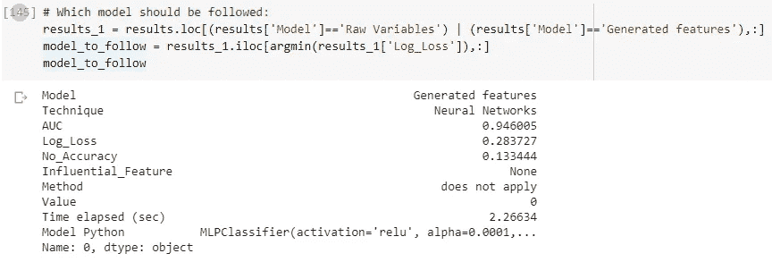

计算主队获胜概率的获胜模型

所以，惊喜匹配的比例是 13.34%。模型的整体质量很好，但模型的可解释性却很差。

对数损失是 0.2837。

根据我的团队和对手团队的评分，获胜的可能性有多大？(他们事先掌握的信息)

回答前一个问题的同一个模型可以给我们这个问题一个答案。

获得问题的封闭表达式是非常困难的，甚至对于获胜的技术是不可能的。

我们所能做的是迭代不同的中场比率值，为其他特征保存一个值(每列的平均值)，并绘制获胜概率，看看我们得到了什么。

这是结果:

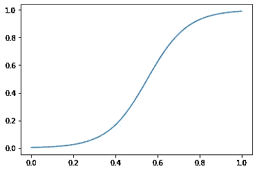

神经网络模型

在 *(0.5，0.5)* 附近有一个有趣的高得多的斜率，这意味着获胜的概率对中场争夺非常接近的情况非常敏感。

竞争对手评分之间的比率作为特征比评分本身更好吗？

好多了。

如前一个问题所示，MI max 得分从 0.14(左后卫)上升到 0.35(中场比例)

评分的互信息分数

生成变量的互信息得分

**有多少几率完全取决于中场评分对比(比)？换句话说:我只控制中场能在多大程度上控制比赛的胜算？**

对于这一分析，我们建议排除除中场评分之外的所有变量，并运行与之前问题相同的可用模型，并检查指标。模型会失去可预测性吗？会保持不变吗？

该模型失去了预测能力，对数损失为 0.3596 比 0.2837。
与具有所有生成特征的模型的 13.34%相比，该模型的无准确性为 16.89%。

将模型中的特征数量从 25 个减少到 1 个的想法应该会让数据科学家不寒而栗，但在这种情况下，没有失去太多的可预测性，因为只知道中场，所以比赛仍然相对容易预测。

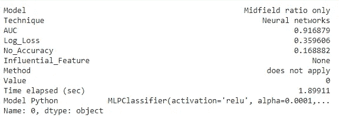

纯中场模式的衡量标准

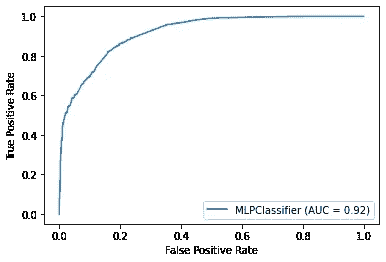

仅具有中场的模型的 ROC 曲线和 AUC

**除了中场评分比较(比率)之外，有多少几率取决于其他因素？换句话说:如果我忽略中场，比赛的可预测性会有多高？**

对于该模型，建议去掉中场评分，并使用生成的其余特征作为先前工作过的同一组模型的变量。

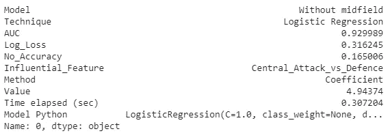

无中场模式

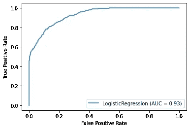

无中场模型的 ROC 曲线和 AUC

有希望！在哈特里克，并不是一切都取决于中场。

你仍然可以对抗拥有更好中场的球队，并希望有更好的结果。

甚至该模型也为我们提供了在中场比例未知的情况下如何正面面对球队的提示(在哈特里克的中场中有一种特殊的情况:如果经理以“赛季最佳比赛”为态度，一支球队可以获得更好的评级，这种顺序在比赛前后对其他经理是隐藏的，所以中场评级是非常可变的——换句话说:实际上是隐藏的——)。

模型中最有影响力的特征(在这种情况下是**逻辑回归**)具有 4.9437 的**主场中央进攻对客场中央防守**的β，这是绝对值最大的。结论是:当中场未知时，确保你的中路进攻足够强大，以便在引擎让你有机会得分后转换进球。

**有时候，失去中场是不可避免的，如果他/她失去了对对手的中场评分比率，hattrick 经理可以做些什么来增加他赢得比赛的几率？**

中场丢了怎么办？可以做些什么来避免失败？

对于此分析，使用一个条件过滤数据集:Midfield_ratio≤0.5。对这种情况的解释是，我们事先引入了对手拥有比我们更好的中场的可能性，包括踢“赛季最佳比赛”或只是在那个位置上有更好的球员。

在中场已经失守的情况下，我们可以使用哪个模型来计算并最大化获胜的概率？

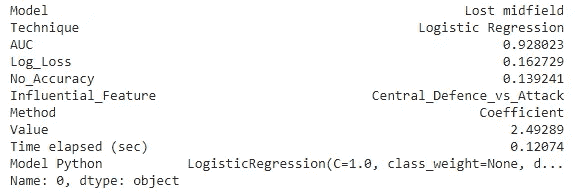

迷失中场的典范

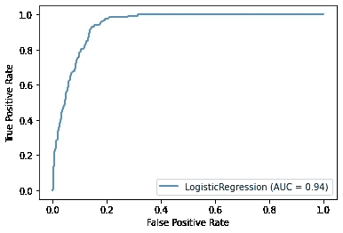

失去中场时模型的 ROC 曲线和 AUC

这个模型可以让我们知道在失去中场的情况下应该提高哪个评分:中后卫 vs 对手的中路进攻。满足了这个条件，你的团队就有了立足的可能。

这个问题就产生了:**即使失去了，中场还重要吗？**

让我们看看:我们能做的是迭代不同的**中场比例**的值，范围从 0%到 50%，为其他特征保留一个值(每列的平均值)，并绘制获胜概率，看看我们得到了什么。

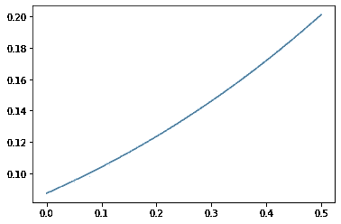

失去中场影响力时

我们可以观察到，当失去中场时，赢得比赛的几率很低(从 0 到 20%)。

但是如果确保我们在中卫和进攻的比例上有更好的比例呢？在这个分析中，我们将得到第 75 个百分位数来模拟一支赢得中心进攻与防守比率的球队，并迭代中场比率(0 到 50%)

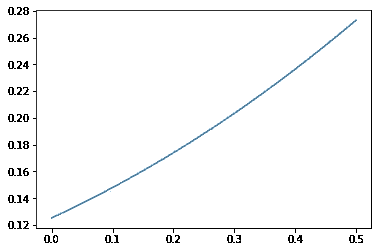

中场:输了。中后卫:以 75%的优势获胜

哈特里克仍然在很大程度上依赖中场评分来决定比赛的结果。

我是否可以用易于解释的模型来回答前面的问题，或者我是否应该失去可解释性以获得更好的指标？

对于前面的一些问题，逻辑回归是最佳模型，因此在这些情况下，具有最低对数损失的模型**和具有最低对数损失的**可解释模型**是相同的。**

对于其他一些问题/答案，我们依赖于用神经网络生成的模型，这种模型本身的可解释性几乎为零(除非通过 Shapley 值等间接测量来测量)，问题是是否有可能将神经网络作为最佳模型移除，而使用更可解释的模型作为实际计算的模型。

是一个悬而未决的问题，决定取决于不同的因素:

*   分析的目的是什么？
    是否要作为黑盒保存以用于自动化？考虑到游戏的手工性质，它会被人类用来计算赔率吗？是为了开会吗？
*   你愿意失去多少可预测性？
*   就感兴趣的度量标准而言，最佳模型与最佳可解释模型有多远？
*   假阳性和假阴性的代价
*   有一些模型，如 Random Forest 和 XGBoost，提供了可解释性的方法，如“特性重要性”，我们愿意接受这种方法吗？

对于我们的案例，这些问题可以用逻辑回归来回答，这是一个可解释但可靠的模型:

给定评级比率的最佳匹配概率模型(神经网络，对数损失:0.283727)可以由逻辑回归代替，对数损失:0.2834，度量中的损失是微不足道的，但我们获得了许多可解释性，甚至是在一个方程中表达概率的封闭形式！

几乎同样的情况恰好只回答了中场比例的问题:

*   神经网络的对数损失:0.359606
*   逻辑回归的对数损失:0.359658

# 结束语

为了便于使用，建议使用一个可解释的模型，该模型(逻辑回归)具有给定的用途和可解释性。

现在，你可以预测比赛的结果了！

 [## juanes 8400/ht _ matcMidfieldhes _ 2

### 令人惊讶的哈特里克比赛分析。在…上创建帐户，为 juanes8400/ht_matches_2 的开发做出贡献

github.com](https://github.com/juanes8400/ht_matches_2)