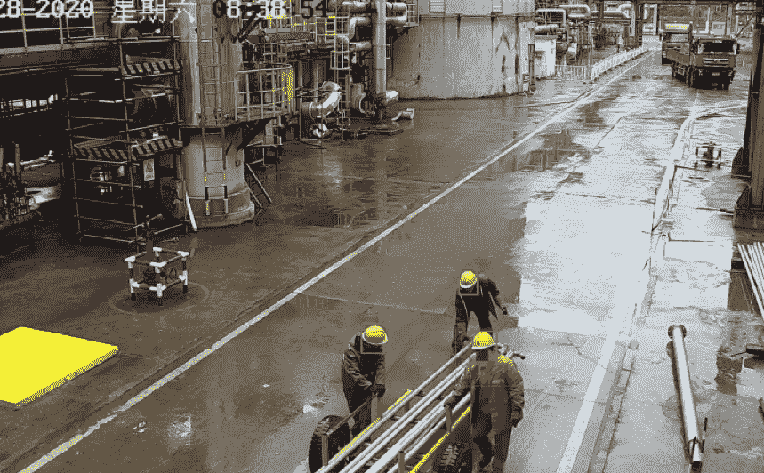

# 人工智能在安防行业的应用(一)

> 原文：<https://medium.com/nerd-for-tech/the-application-of-ai-in-the-security-industry-part1-7aee83252f46?source=collection_archive---------5----------------------->

# **“AI+安防”场景应用**

安防与 AI 技术的结合是大势所趋，“AI +安防”正向视频结构化、数据可视化、安防移动化、云防御等方向演进。但是，在开发过程中，软件和硬件问题仍然需要解决。只有妥善解决这些问题，才能满足市场需求，才能提高整个安防领域的智能化水平，从而促进安防行业的发展。

## **AI +安全使用技术**

**(一)视频结构化技术**

目标检测

从视频中提取前景目标，然后识别前景目标是否为有效目标(如人、车辆、人脸等。)或无效目标(如树叶、阴影、光线等。).在目标检测过程中，主要应用了运动目标检测、人脸检测、车辆检测等技术。

目标跟踪

实现对场景中特定目标的连续跟踪，并从整个过程中获取高质量的帧作为目标的快照。在跟踪过程中，主要应用于多目标跟踪、目标融合和目标计分技术。

对象属性提取

图像中目标属性的识别，以及视觉特征属性的分类，例如目标人的性别、年龄、服装、车辆型号、颜色和其他属性。目标属性提取过程主要基于 [**深度学习网络结构**](https://tinyurl.com/9cbbaap6) 的特征提取和分类技术。

**(二)情感计算技术**

情感计算在安全领域有着广阔的应用前景。计算机通过对人的面部表情、声音表情、姿势表情、生理表情、文字情绪的采集、分类、识别，及时获取目标对象的情绪变化，对异常危险行为进行预警，并实施相应的应对措施。

## 数据安全

许多敏感数据，如人脸数据、车牌数据等，会频繁暴露。因此，数据的存储和传输需要高度的安全性。

不同的国家都颁布了相应的数据安全法律法规。另一个安全问题是数据泄露。客户担心数据会被直接复制并出售给竞争对手。

**总之，除了法律规范，数据安全本质上是一个信任问题。**

## 人工智能系统的强度主要取决于两件事:

1.算法模型的质量

**2。培训数据的数量和质量**

目前的深度学习仍然依赖于基于统计显著性的大数据模型，这种模型需要可扩展的数据，满足真实且足够均衡的分布。

**换句话说，算法训练中使用的数据量和数据质量可以起到决定性的作用。**

# 结束

将您的数据标注任务外包给[字节桥](https://tinyurl.com/232e2742)，您可以更便宜、更快速地获得高质量的 ML 训练数据集！

*   无需信用卡的免费试用:您可以快速获得样品结果，检查输出，并直接向我们的项目经理反馈。
*   100%人工验证
*   透明和标准定价:[有明确的定价](https://www.bytebridge.io/#/?module=price)(包含人工成本)

为什么不试一试呢？

来源:https://www . eet-China . com/MP/a 82045 . html