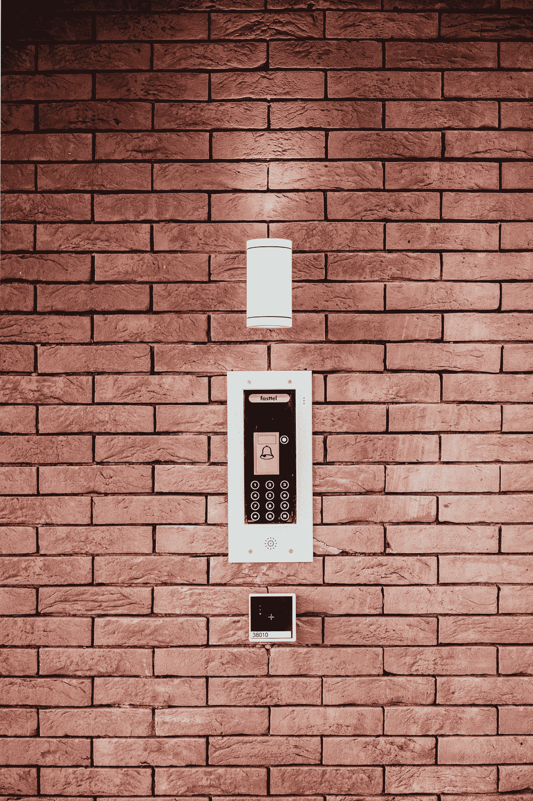

# 人工智能在安防行业的应用(二)

> 原文：<https://medium.com/nerd-for-tech/the-application-of-ai-in-the-security-industry-part2-bc5394fe515e?source=collection_archive---------12----------------------->

# “AI+安防”场景应用

**公安行业场景应用**

一般安防行业用户的迫切需求是在海量的视频信息中找到犯罪嫌疑人的线索。前端摄像头内置人工智能芯片，可以实时分析视频内容，检测移动物体，识别人和汽车信息。然后将数据传输到后端 AI 中央数据库进行存储，并通过强大的计算和智能分析能力进行评估。

对嫌疑人信息的实时分析，为侦查节省了时间。其强大的交互能力真正成为案件调查人员的专家助手。

**交通行业场景应用**

在交通领域，可以利用 AI 技术分析城市实时交通流量，调整红绿灯间隔，缩短车辆等待时间，提高城市道路交通效率。城市级 AI 大脑可以掌握城市道路上汽车的轨迹信息，停车区的实时停车情况。它可以在整个城市中分配资源和分流交通，特别是对于繁忙的地区，如机场、火车站、汽车站和商业区。大规模的交通联动调度提高了整个城市的运行效率，保障了居民的顺利出行。

**智能建筑场景应用**

在智能建筑领域，AI 是大脑，全面控制建筑的安全和能耗，实现人、车、物(进出建筑)的实时跟踪定位，区分上班族和外来人员。它优化了运行效率，延长了建筑物的使用寿命。

**工业园区场景应用**

在工厂园区内，使用移动巡视机器人进行定期巡视，读取仪表数值，分析潜在风险，确保全封闭无人工厂的可靠运行，推动“工业 4.0”的发展。

**民用安防场景应用**

在家庭安全方面，家庭安全摄像头可以在检测到家中没有人时自动进入警戒模式。当出现异常时，它会向入侵者发出声音警告，并远程通知房主。家人回家，可以自动解除武装，保护用户隐私。在夜间，通过一定时间的自学，家庭保安可以掌握家庭成员作息时间的作息规律，保证夜间安全。

## 人工智能系统的强度主要取决于两件事

1.算法模型的质量

**2。培训数据的数量和质量**

目前的深度学习仍然依赖于基于统计显著性的大数据模型，这种模型需要可扩展的数据，满足真实且足够均衡的分布。

**换句话说，算法训练中使用的数据量和数据质量可以起到决定性的作用。**

# 结束

将您的数据标注任务外包给[字节桥](https://tinyurl.com/3c4pnjtw)，您可以更便宜、更快速地获得高质量的 ML 训练数据集！

*   无需信用卡的免费试用:您可以快速获得样品结果，检查输出，并直接向我们的项目经理反馈。
*   100%人工验证
*   透明和标准定价:[有明确的定价](https://www.bytebridge.io/#/?module=price)(包含人工成本)

为什么不试一试呢？

来源:https://www . eet-China . com/MP/a 82045 . html