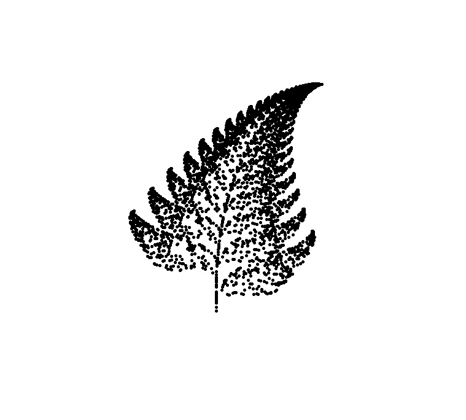
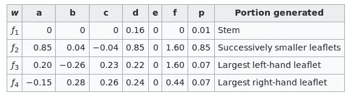
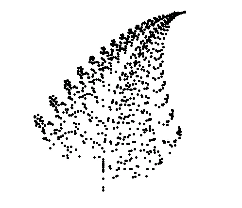
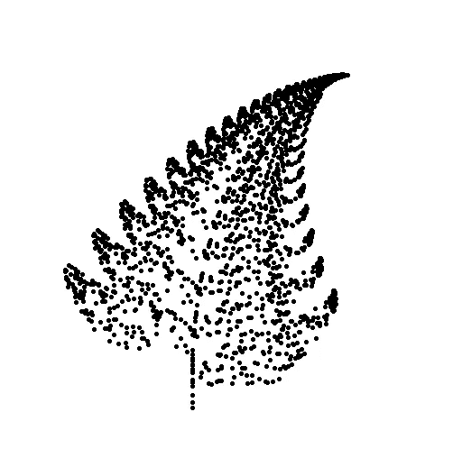
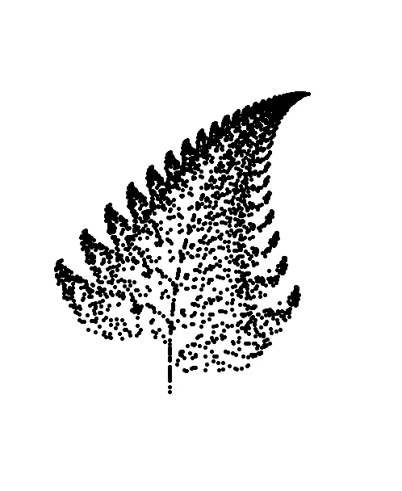

# 计算机和数学的艺术:巴恩斯利·弗恩

> 原文：<https://medium.com/nerd-for-tech/the-art-of-computer-and-mathematics-barnsley-fern-196182622241?source=collection_archive---------19----------------------->

看到艺术、计算机和数学在同一条线上，真是好笑！！但是一些奇怪的组合可以创造出惊人的结果。在这篇文章中，我们将看看如何编写一个绘制蕨类植物的算法。



[**巴恩斯莱蕨**](https://en.wikipedia.org/wiki/Barnsley_fern)

耶！！你没看错，我们要画一棵有数字的蕨树。我对这个想法非常着迷，我们可以用简单的数学算法创造一种艺术。我一直认为计算机科学中的数学很无聊。

如果你对使用数学算法还能创造出什么感兴趣，请点击此 [**链接**](https://books.google.com.np/books?id=oh7NoePgmOIC&printsec=frontcover&redir_esc=y#v=onepage&q&f=false)

所以这个算法有几个实现方法，更简单的方法可以在这里找到[](https://en.wikipedia.org/wiki/Barnsley_fern#Python)****。****

*因为我想灵活我的狗屎代码编写技能，我将遵循稍微复杂的方法，即只使用矩阵计算。我的实现版本的先决条件的快速背景。*

1.  *大蟒*
2.  *numpy*
3.  *龟*
4.  *py 截图*

*让我们开始吧*

*正如我前面提到的，我们将使用矩阵来实现它。*

**

*这些值负责绘制蕨类植物的各个部分。它更像是某些坐标上的仿射变换。我们所做的就是将坐标乘以一些预先定义的矩阵。*

*这种算法背后的直觉是，我们生成一个随机概率，在这种情况下，这是一个随机数，将负责绘制蕨类植物的不同部分。例如，如果随机生成的概率小于 0.01，则算法将绘制蒸汽，以此类推。*

*您可以在:[点击](https://github.com/dcostersabin/barnsley-fern)找到完整的源代码。在这里，我将逐行解释源代码。*

*解释:*

*与任何其他脚本不同，我们首先导入所需的库*

```
*import turtle
import numpy as np
import random
import pyscreenshot*
```

*因此，在我的实现版本中，我们将创建一个类，它可以是任何名称，但我选择了 DrawFern*

```
*class DrawFern:*
```

*在 __init__ 函数中，每个函数有 4 个参数，这使得我们的脚本更加可定制，我认为这是不言自明的。*

```
*self.stem = np.array([[0, 0], [0, 0.16]])self.stem_c = np.array([[0], [0]])self.smaller_leaflets = np.array([[0.85, 0.04], [-0.04, 0.85]])self.smaller_leaflets_c = np.array([[0], [1.60]])self.left_large_leaflets = np.array([[0.20, -0.26], [0.23, 0.22]])self.left_leaflets_c = np.array([[0], [1.6]])self.right_large_leaflets = np.array([[-0.15, 0.28], [0.26, 0.24]])self.right_large_leaf_c = np.array([[0], [0.44]])*
```

*这些行中的每一行代表一个矩阵，该矩阵包含上述表格中定义的值。***注***_ c***引用系数****

```
****def generate_points(self, matrix, coefficient):
    self.x_y = np.add(np.dot(matrix, self.x_y), coefficient)
    if self.show_points:
        print(f'Drawing Point At: {self.x_y}')****
```

****接下来，我们创建了一个名为 generate_points()的函数，它将一个矩阵和系数作为输入，然后对 x，y 坐标执行矩阵乘法，并添加系数。然后这些操作的输出被设置为我们新的 x 和 y 坐标。****

```
****for _ in range(self.loop_over):
    self.plot_point()**** 
```

****类似地，在我们的 start 函数中，我们迭代 self.loop_over 次。在每一次迭代中，我们从标绘先前计算的坐标开始，然后生成一个随机数。****

```
****random_number = random.random() * 100****
```

****你可以把它乘以 100，放大 100 倍，或者只是玩生成的数字。我更喜欢按比例放大。****

```
****if random_number < 1:
    self.generate_points(self.stem, self.stem_c)
elif random_number < 86:
    self.generate_points(self.smaller_leaflets, self.smaller_leaflets_c)
elif random_number < 93:
    self.generate_points(self.left_large_leaflets, self.left_leaflets_c)
else:
    self.generate_points(self.right_large_leaflets, self.right_large_leaf_c)****
```

****最后我们所做的就是调用各自的函数来绘制蕨类植物的不同部分。举例来说，如果概率小于 0.001，那么我们绘制蕨类植物的茎，类似地，根据生成的随机概率绘制各个部分。****

******输出******

************************

****1000、2000、3000 次迭代****