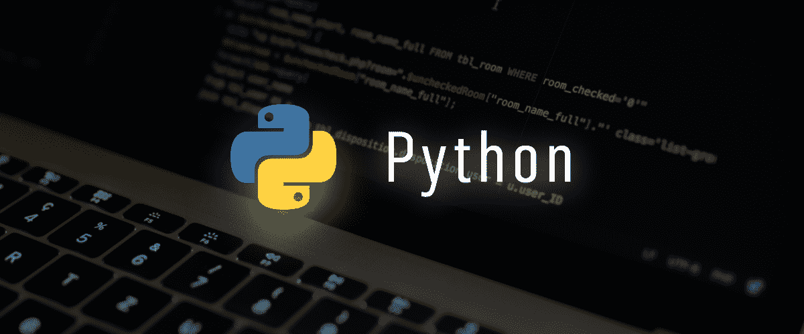
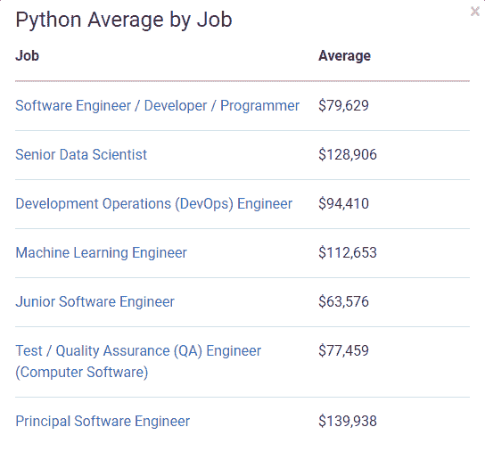
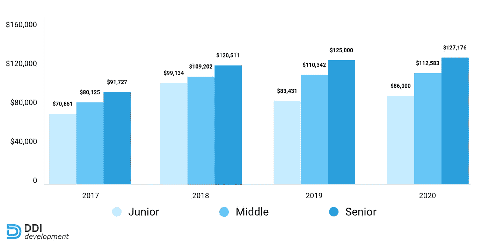
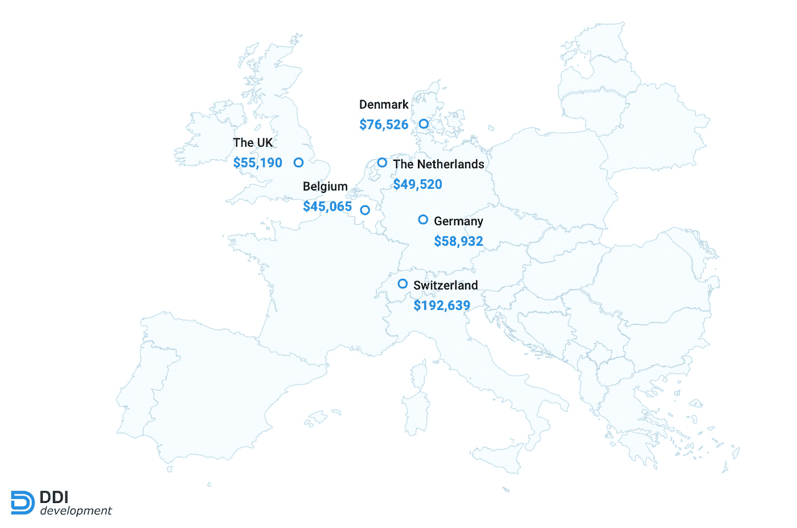
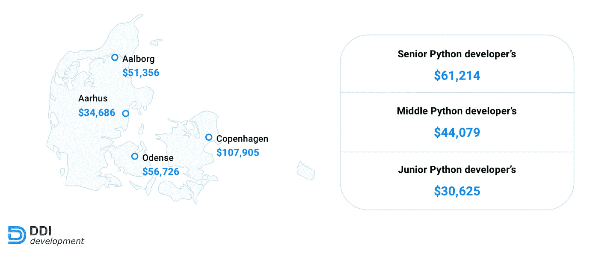
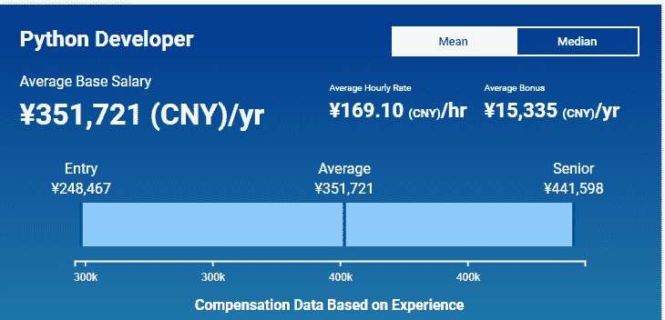
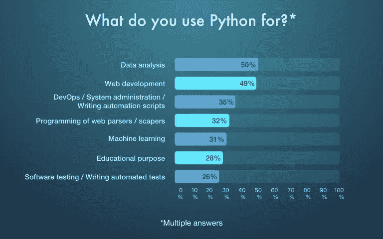

# 在美国、欧洲、印度和其他国家雇佣 Python 开发者的平均成本

> 原文：<https://medium.com/nerd-for-tech/the-average-cost-of-hiring-python-developer-in-usa-europe-india-other-countries-905e983b192b?source=collection_archive---------7----------------------->

[图像来源](https://www.winklix.com/blog/what-does-python-used-for/)

无论您目前在经营哪家企业，您都知道拥有一个用户友好的无缝系统对于每家企业来说都是至关重要的，因为企业和商家都在寻找能够为他们提供优秀商业解决方案的最佳软件开发团队。然而，从决定技术到雇佣开发人员，每件事都是一个大麻烦，当成本到来时，对大多数公司来说，每件事都是可疑的。

Python 开发就是这样一个过程，它总是需要一大笔预算，而且技术本身也是对等的。如果你正努力用 Python 技术开发一个应用软件，最大限度地降低成本将是一个主要的难题。虽然软件开发占据了软件开发和上市资金的 63%,但将成本降低 2–5%变得至关重要。

[图片来源](https://thepythonguru.com/python-developer-salary-overview-and-predictions/)

那么，如何降低 python 开发项目的成本呢？嗯！只有一种方法可以让你在雇佣开发人员上节省一些钱。是啊！您可以在雇佣开发人员的同时节省一些钱，并且保持项目开发的质量。

怎么会？我们来了解一下。

**世界各国的 Python 开发者有不同的时薪**

无论你查看世界各地开发人员的工资还是 python 开发人员的时薪，你都可以看到边际差异，这种差异可以降低你的软件开发成本。这种边际差异是由于世界各国劳动力成本的差异而产生的。

因此，我们将深入比较不同国家的平均 **python 开发人员**成本，这将有助于您在预算范围内寻求最佳的开发质量。

**美国 Python 开发者的平均成本**

影响 python 开发人员的成本和工资的因素很多，包括开发人员在 AR/ML 等概念方面的专业知识。为了帮助你，我们在这里解释了来自可靠来源的成本和工资数据差异，包括 Glassdoor、PayScale、Clutch 和 ZipRecruiter。

根据 ZipRecruiter 的说法，在美国，Python 开发人员的平均年薪在 113，880 美元到 120，511 美元之间。让我们收集一些统计数据，让你有一个清晰的认识。

**Python 开发者的时薪**:42-48 美元/小时

据统计，python 开发人员的工资在马萨诸塞州和纽约州最高，最高可达 14 万美元。仅在美国，成本最低的 **python 开发者**可见于内布拉斯加州 NE、印第安纳州(In)，分别为 8.5 万美元、8.7 万美元。

[图片来源](https://ddi-dev.com/uploads/salary-dynamics-experience-dou.jpg)

**(Python 开发者基于经验的价格)**

这里有更多关于 Python 开发者在美国不同州的平均成本的信息。

马萨诸塞州:60-70 美元/小时

纽约:60-70 美元/小时

加州:60-70 美元/小时

伊利诺伊州:60-70 美元/小时

弗吉尼亚:60-70 美元/小时

新泽西州:59 美元/小时

密歇根州:每小时 45-50 美元

阿拉巴马州:44-50 美元/小时

俄亥俄州:44-50 美元/小时

印第安纳州:每小时 40-45 美元

内布拉斯加州:每小时 40-45 美元

而美国其他州的 python 开发者每年的成本在 10 万到 12 万英镑之间。简而言之，你可以通过转换美国的州来为你的 [**python web 开发**](https://www.valuecoders.com/python-web-development-services-company) 项目雇佣开发人员，从而节省一点资金。

**欧洲 Python 开发者的平均成本**

欧洲是仅次于美国的企业为大型项目雇佣 python 开发人员的第二大选择，事实上在这里你可以找到可靠的开发人员。然而，在投资有限的情况下，成本可能是一个不利因素。

让我们不要强调，看看欧洲不同国家的 python 开发者价格分布。

欧洲 Python 开发者的每小时成本:25-95 美元/小时

[图像来源](https://ddi-dev.com/blog/programming/average-python-developer-salary-in-the-usa-europe-and-other-world-countries/)

成本分配取决于开发者的专业水平和国家。下面是欧洲一些顶级公司**聘请 python 程序员**以及他们的费用分配。

**#1。德国**

Python 开发者的平均成本:22-30 美元/小时

柏林一直是欧洲 IT 创业公司最多的两个城市之一，慕尼黑位居第 12 位。德国顶级城市 python 开发者的平均时薪是:

法兰克福:€26 英镑(28 美元)/小时

杜塞尔多夫:€26 美元/小时

慕尼黑:€25 英镑(27 美元)/小时

**#2。英国**

Python 开发人员的平均成本:每小时 27-40 美元(35-45 美元)

伦敦是欧洲 IT 创业公司最多的城市，也是最受海外开发者欢迎的城市。以下是英国顶级城市 python 开发者的平均成本:

伦敦:20 英镑(26 美元)

剑桥:19 英镑(24 美元)

牛津:17 英镑(22 美元)

**#3。丹麦**

平均开发者成本:29 美元(37 美元)/小时

哥本哈根在欧洲顶尖 IT 创业城市中排名第九。

[**图片来源**](https://ddi-dev.com/uploads/python-salary-denmark.jpg)

**#4。爱尔兰共和国**

开发人员的平均成本:25 英镑(32 美元)/小时

都柏林在欧洲 IT 创业城市中排名第八。以下是爱尔兰顶级城市 python 开发者的成本分布

戈尔韦:€26 美元/小时

利默里克:€25 英镑(27 美元)

都柏林:€24 英镑(25 美元)

除了这些国家，瑞士的 python 开发者平均成本最高，为 192，639 美元。而比利时的平均开发者成本最低，约为 45，065 美元，荷兰约为 49，530 美元。

让我们看看世界的另一部分。

**亚洲 Python 开发者的平均成本**

亚洲历来拥有最具成本效益的开发者时薪。甚至亚洲国家的软件开发成本也比西欧国家低。让我们看看主要的统计数据。

**#1。印度**

在印度，Python 开发者的平均入门费用是每年 5728 美元。而中等杠杆开发人员的平均年成本高达 12，198 美元。最后，Python 专家的平均成本约为 15，418 美元

这使得印度成为雇佣 python 程序员最划算的国家之一。此外，印度的软件开发质量也是达标的。

**#2。中国**

中国是发展最快的经济体，劳动力成本非常低，这使其成为硬件和软件生产的顶级公司。python 开发者在中国的费用从每月 2039 美元到每月 7045 美元不等。

[图像来源](https://www.salaryexpert.com/salary/job/python-developer/china/shanghai)

python 开发人员的平均年成本:24，468-84，540 美元

**非洲 Python 开发者的平均成本**

非洲还以劳动力成本低廉而闻名。让我们看看它如何影响 **python 开发者的雇佣成本**。

**#1。南非**

在南非，高级 python 开发人员的平均成本是每年 489，892 美元，而初级 python 开发人员的平均成本是每年 66，339 美元。

**#2。尼日利亚**

尼日利亚的 python 开发者成本相对较低，大约每月 815 美元(335，000 NGN)。还有！在尼日利亚，python 开发人员的工资在 375 美元到 1294 美元之间。

从上面，你会明白各国的经济是如何使软件开发成本在世界范围内不均衡的。由于远程工作文化正处于顶峰，现在开发人员没有必要为了完成项目而搬到不同的国家。

你可以**从世界上任何一个国家雇佣 python 开发者**,并利用这个机会获得一个无缝的&优秀的软件解决方案。然而，在你雇佣开发人员之前，你需要检查一些重要的方面，这些方面可能会成为开发人员招聘工作的基础。

**雇佣 Python 开发者前需要考虑的方面**

技术技能:对技术技能的检查是必不可少的，尤其是当你雇佣一个高级开发人员的时候。一个高级别的 python 开发人员必须具备 Django、Flask、多进程架构、RestFul APIs 和对象关系数据库等 web 框架方面的专业知识。因此，确保你充分评估他们的技能。

*   **人际交往技巧:**你需要确保你要雇佣的开发人员必须具备有效的沟通技巧，能够理解项目的需求，并很好地沟通开发的各个方面。他们应该抱着与同事/客户/顾客建立积极关系的态度。
*   **对业务的理解**:对行业和业务逻辑有一个基本的理解对于开发人员迎合想要的解决方案是必不可少的。所以，雇佣一个在开发应用程序代码时有全局思维的开发人员。

[图像来源](https://dzone.com/articles/software-developers-need-these-soft-skills)

**解决问题、好奇和逻辑思考者:**批判性思维总是一种额外津贴。因此，你应该雇佣一个具有批判性、解决问题能力和好奇心的开发人员来分析和管理这些部分。

*   语言:语言可能是从开发成本低的国家雇佣开发人员的最大障碍。因此，您需要确保开发人员精通通用英语来理解您的需求。

除了雇佣自由开发人员，你可以寻求外包那些提供 python 程序员的公司。它可以帮助你减少麻烦，也可以达到你降低开发成本的目的。

**Python 开发者的成本在上升……**

每年，python 开发者的成本都在显著增加，这也增加了 [**Python 开发公司**](https://www.valuecoders.com/blog/technology-and-apps/top-python-web-development-companies-that-deliver-staggering-assistance-to-enterprises/) 的成本。这股热潮的主要原因是 AI/ML、AR/VR、区块链、物联网、可穿戴设备等现代技术概念的到来。

[图像来源](https://www.botreetechnologies.com/blog/top-10-python-use-cases-and-applications/)

所有这些现代技术概念都可以用 Python 轻松实现，因为它为高级计算和科学计算提供了库和框架。这就是 python 开发人员花大力气提高技能的原因，很少有精通的人。累积起来，所有这些都增加了 python 开发人员的成本。

# **总结**

Python 是最强大的编程语言之一，这使得它在全世界广受好评。它目前正被用于人工智能、数据科学、[物联网开发](https://www.valuecoders.com/iot-development-company)和脚本领域开发。

正因为如此，随着企业希望获得健壮和复杂的解决方案，对 python 开发人员的需求也在增加。因此，如果你想使用 **Python 进行网站**或软件应用开发， [**雇佣专门的 Python 开发人员**](https://www.valuecoders.com/hire-developers/hire-python-developers) 团队，他们可以与你合作，提供实时通信、管理和更高水平的性能。