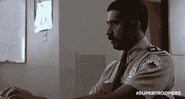
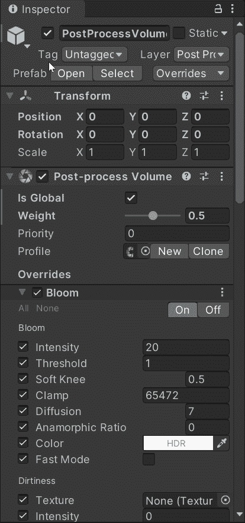
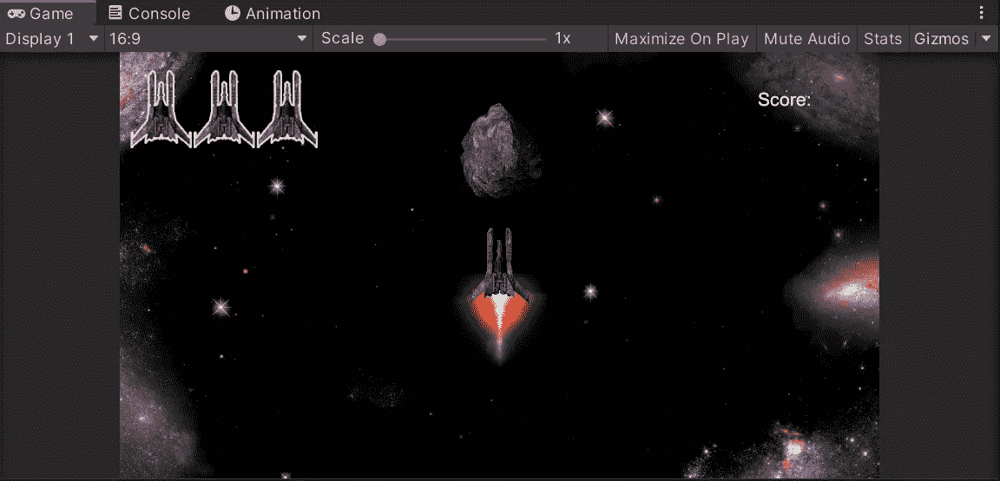
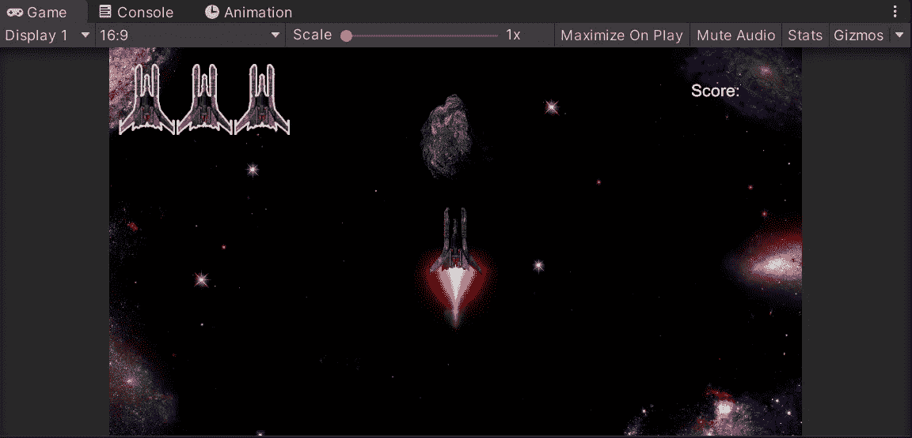

# Unity 中的后处理基础

> 原文：<https://medium.com/nerd-for-tech/the-basics-of-post-processing-in-unity-dcdbfcdf483b?source=collection_archive---------20----------------------->

很像 instagram 滤镜。我们可以将**后期处理**应用到我们的 Unity 项目中，以帮助我们的游戏在视觉上脱颖而出，甚至可能将它与 AAA 游戏相提并论。

为此，我们需要在**包管理器中安装我们的**后处理包**。**

接下来，我们需要创建一个空的**游戏对象**，我们可以将它标记为**后处理卷**，在此基础上我们可以添加一个**后处理卷组件。**这是我们应用**覆盖**来改变图像的地方。

为了将这些改变应用到我们的游戏中，我们首先需要创建一个**层**，我们可以将这个**游戏对象**分配给它。这个**层**将作为我们的**相机**读取我们希望做出的改变的一种方式。

在我们的**相机游戏对象上，**我们需要添加**后处理层组件。**接下来，选择我们刚刚创建的新**层**。现在，如果我们改变**后处理体积上的**覆盖**，**我们的游戏图像应该改变。

最容易看到的变化是使用**布卢姆。** **Bloom** 给出了极其明亮的光的错觉，这将有助于使我们的推进器、爆炸和星系背景流行起来！

另一个伟大的**替代**是**颜色分级**。**颜色分级**允许我们改变游戏图像的温度和色调，这有无限的可能性，我并不十分精通创造性成像方面的事情，所以我简单地使用**颜色分级**来影响饱和度和对比度。为了获得最佳效果，建议使用 ACES 色调映射模式，因为这与电影中使用的非常相似，因此我们的眼睛很熟悉。当我们选择 ACES 色调映射时。我们需要访问我们的**项目设置**，在**播放器设置中，**将我们的**色彩空间**更改为**线性。**

最后，我们可以使用**晕影**在屏幕边缘创建一个柔和的淡入淡出，将更多的注意力吸引到所有动作发生的中心。在我们的星系背景下，这非常有效。

当**覆盖**时，我们可以添加更多的**效果**，但是许多并不真正适合我们当前的游戏，我确信当我创建更多的时候，我会使用更多的**后期处理**的方面，但是现在，让我们只是转动**开花**并且完成它，耶？

我用的不仅仅是布鲁姆，这是之前和之后的。

以前

在...之后