# 邻里之战:在新城市开餐馆

> 原文：<https://medium.com/nerd-for-tech/the-battle-of-neighborhoods-opening-a-restaurant-in-a-new-city-e85a16985700?source=collection_archive---------3----------------------->

## 使用数据科学对多伦多的街区进行细分，以找到最适合开餐馆的地点。

多伦多

# 介绍

## 一.背景|业务问题

irch Masala(虚构)是一家以将令人垂涎的巴基斯坦和印度美食带到您的餐桌上而闻名的餐厅。在菜单上琳琅满目的菜肴中，他们的特色菜是 *Biryani、Karahi* 和 *Chicken Tikka。*

左起:提卡鸡、比亚尼鸡、卡拉希鸡

他们在纽约市的第一次郊游非常成功。纽约市被认为是文化多样性的缩影，因为它拥有来自世界各地的大量移民人口。这使它成为其他大都市和国际中心中最重要的城市之一。另一个有着相似特征和地位的城市位于边界的另一边——加拿大的多伦多市。多伦多拥有 620 万人口，是加拿大最大的城市，与纽约有着相似的多元文化特征。因此，这家餐馆着眼于在边境的多伦多市拓展业务。

我们项目的目标是找出城市中开设餐馆的理想地点。为了确保我们项目**的成功，团队需要深入了解人口统计数据和邻近业务**。例如:

*   每个街区的餐馆数量，
*   最受欢迎的餐馆(相似和不同的菜系)，
*   我们目标人群的流量，
*   以及我们目标受众的频率。

> 该项目为**数据科学家/分析师**提供了应用其数据科学知识的机会，并明确地经历不同的流程。定义业务问题、需求引出、从外部来源检索和利用数据、解析和清理数据，以及通过机器学习算法和工具进行分析评估。最终分析的评估得出一个结论，利益相关者可以利用这个结论。由于该项目有许多方面需要考虑，**它是公开讨论的**并针对**企业家**和**利益相关者。**

## 二。数据描述

所需数据将是为分析目的而准备的 **CSV 文件**的组合。

*   **第一组数据:**
    最近最新的交通信号记录——多伦多的车流量和人流量。该数据通常在上午 7:30 到下午 6:00 之间在有交通信号的十字路口收集。
*   **第二组数据:**
    用邮政编码和行政区表示的多伦多的街区列表。我们将使用**地理编码器** Python 包来检索邮政编码的坐标。
*   **第三组数据:**
    多伦多给定街区最常见的场馆。这些信息存储在 **Foursquare 位置数据**中，我们将使用 **Foursquare API** 来访问它。

概括地说，我们将使用第一组数据来分析行人/车辆数量。然后，我们加载第二组数据，根据每个街区各自的邮政编码获得它们的精确坐标，从而允许我们探索和绘制城市地图。通过使用这些坐标和 Foursquare 凭据，我们将通过 Foursquare API 访问第三组数据源，并检索受欢迎的地点及其详细信息，尤其是餐馆(不考虑其菜肴)。

# 方法学

## 一.分析方法

## **一键编码**

我们通过使用一种叫做 ***的技术来解决这个问题，开始我们的探索。*** 这项技术可以将数据从分类形式转换为数字形式，供机器学习算法使用。每一个场地都被转换成一个*频率*在每一个候选社区中有多少这样的场地。

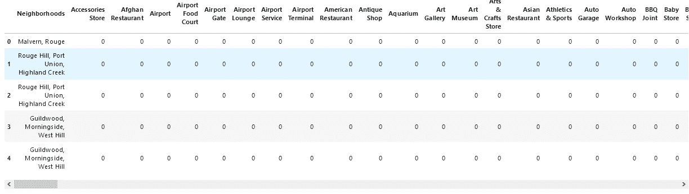

一键编码的一个片段

然后，我们通过 ***邻近*** 和每个场馆类别的**平均**出现频率对这些行进行分组。

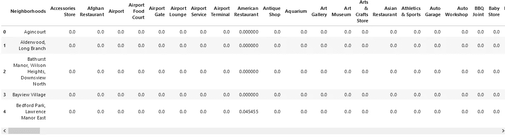

根据每个地点出现频率的平均值对邻近区域进行分组的片段

## k 均值聚类

为了查看相似社区的人口统计数据，并使分析在视觉上更有趣，我们使用了一种称为 ***k-means*** 的聚类技术。***k-means****是一种常用的机器学习算法，用于根据相似特征对数据点进行聚类。该算法对于中型和大型数据库是快速有效的，并且对于从未标记数据中快速发现洞察是有用的。通过观察和检查每一个集群，我们就可以确定将它们区分开来的类别。*

## *二。数据分析*

## ***车辆和行人交通***

*我们从分析行人和车辆的数据开始。*

*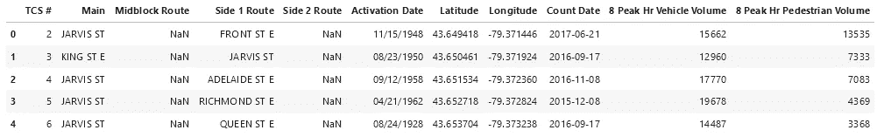*

*前五个行人和车辆流量的片段。*

*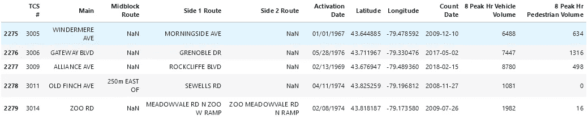*

*最近五次行人和车辆流量的片段。*

*列*包括*主要街道名称。*该列有一个与众不同的特点——**同一个名称出现多次**，说明它包含交集。我们可以根据街道名称进行分组，并通过对这些值求和或求平均值来进行汇总。为了简单起见，我们将选择将其平均。这返回 **248 条主干道**。**

**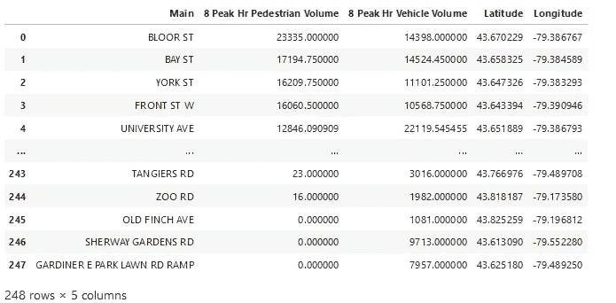**

**按主干道分组后的行人和车辆流量片段。**

**我们希望我们的目标社区候选人在企业的寿命期内保持活跃。因此，我们将过滤掉主要道路。在本例中，我们只显示高峰时段**(约 70%以上)**平均**人流量*超过 1200*** 或**车流量*超过 12000*** 的道路。这正好给了我们 139 条主干道。**

**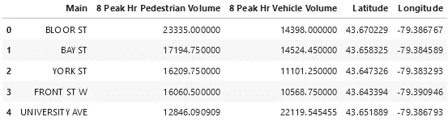**

**过滤后前 5 行的代码片段。**

**最后，我们可以从给定的坐标使用**flower Python**模块可视化道路。该地图显示了该市最繁忙的道路，其中许多位于市中心附近。**

**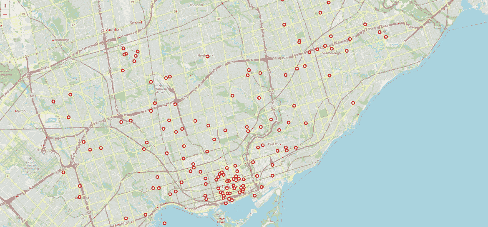**

**在下一节中，我们将探索多伦多市中心、东约克和约克区内的街区。**

## **邻域分析**

**我们已经建立了一个邻里数据框架，它包括 **103 个邮政编码**、 **10 个区**，每个区*内**个邻里名称**，以及**它们的坐标**。我们甚至使用我们的一键编码技术来获得位于每一个邻近地区的比赛场地出现的频率。由于我们只对**中多伦多**、**东约克**和**约克**内的街区特别感兴趣，因此我们继续过滤数据帧，得到 **3 个区**和 **19 个街区**。***

**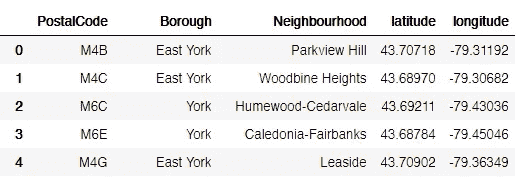**

**所选行政区的前五个街区的片段**

**当我们有了坐标信息，我们就可以使用 Foursquare API 来访问数据，分析和探索邻近区域，并获得每个的*在**半径 1 公里**内的**前 100 个场馆**。它返回一个过滤后的结果，905****场馆**和 172 个独特的场馆类别。*****

****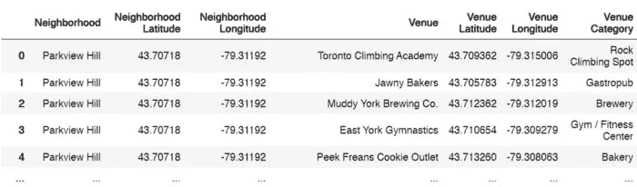****

****过滤后返回的前五个地点的片段****

****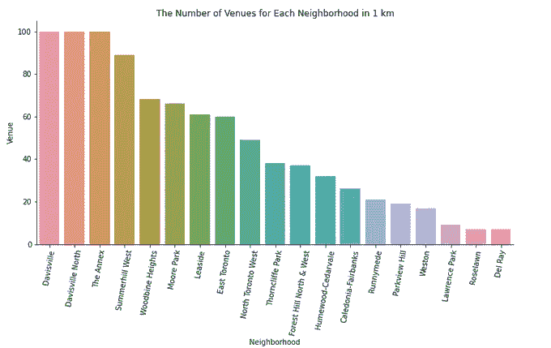****

****从上图可以明显看出，许多街区返回了超过 50 个场地的**，例如*戴维斯维尔*和*戴维斯维尔北*各有 100 个场地。然而，许多返回的**低于** 50 个场地，例如*索恩克利夫公园*有 38 个场地，而*帕克维尤山*有 19 个场地。对于每个社区，我们可以根据发生率创建前 10 个场馆，如下所示。******

****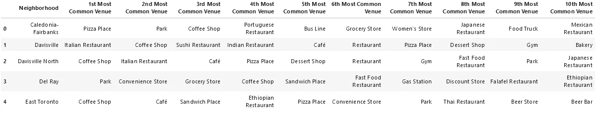****

****该社区前 10 大场馆的前 5 行片段。****

****上面的数据框表明，我们将相同的场馆类别返回到不同的社区。我们可以用这个想法来**根据代表服务和便利设施的场所**对社区进行聚类。****

## ****聚集社区****

****我们将运行 **k-Means** 算法来构建一个具有不同集群数量的集群模型( **k** )。这些特征将是**每个场馆类别出现频率的平均值。**使用**肘点**，我们可以得到我们的最佳 k 值。在这种技术中，我们使用不同数量的 k 值进行测试，测量精度，然后选择线具有最大转弯**的点处的 k 值**。最佳值是既不过度拟合也不欠拟合模型的值。****

****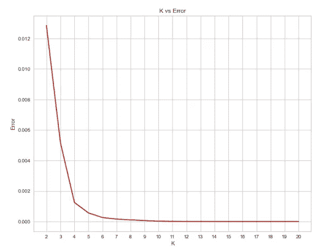****

****查找 K 与误差值****

****显然，我们的最佳值是 4。但是，为了技术上的保证，我们从***yellow brick*******包*** *中导入一个名为***KElbowVisualizer***的可视化器。*我们将上面的 *k 均值*模型与可视化工具进行拟合，以获得最佳值。*****

******

***运行中的代码片段***

***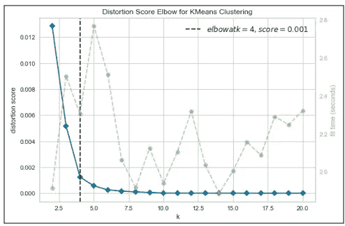***

***模型给了我们这个结果，我们得到了 k=4 的肘点。这表明我们最终将总共有 **4 个集群邻域**。***

> ***我们只是整合了一个模型来拟合误差并计算失真分数。而且在 ***k-means 聚类*** 中，基于某个变量相似的对象被放入同一个聚类中。***

***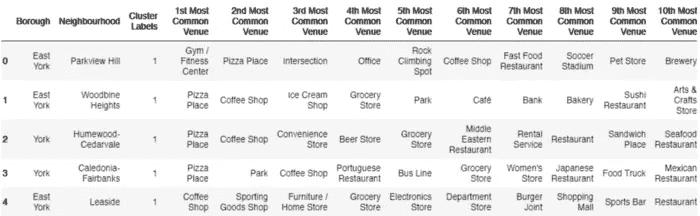***

***k=4 时每个邻域的聚类标签的表格片段***

# ***结果***

***最后，我们将使用**fluous Python 可视化生成的集群。*****

***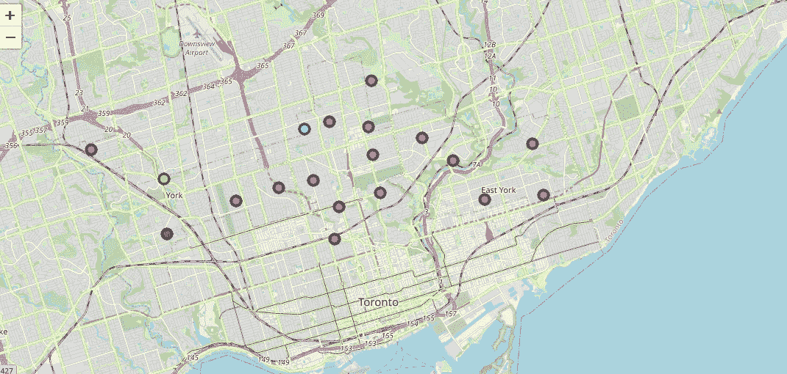***

***因此，我们可以检查每个集群中列出的场馆，并定义区分它们的不同场馆类别。***

***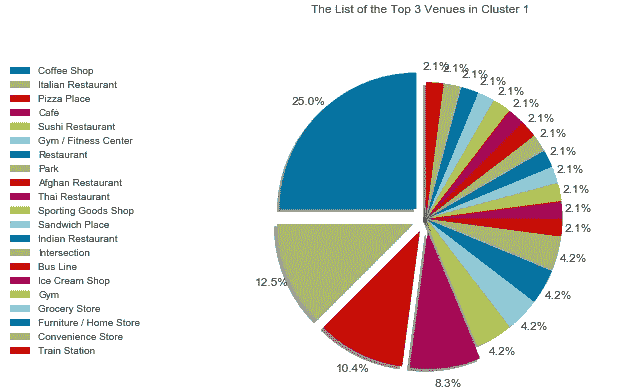******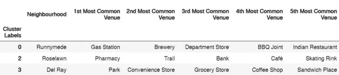***

1.  ******聚类 0:“加油站场馆”***
    第一个聚类只包含一个街区，加油站是第一个最常见的场馆。***
2.  ******聚类 1:“咖啡店和餐馆场所”*** 第二聚类包含 16 个街区，咖啡店、餐馆和咖啡馆场所似乎是最常见的。***
3.  ******聚类 2:“药房地点”*** 第三聚类包括药房作为最常出现地点类别的一个街区。***
4.  ******集群 3:“公园和商店场所”*** 第四集群具有一个以公园、便利店和杂货店为主要场所的街区。***

# ***讨论***

***该项目的主要目标是确定哪个位置最适合在多伦多开餐馆。我们可以通过以下标准来评估哪些位置是最有利的位置:***

## ***1.人口统计和无障碍***

*   *****车辆**和**步行交通**是选择任何商业场所(在我们的例子中是餐馆)的重要因素。人口统计显示了该市最繁忙、最活跃的主干道。其中许多位于市中心。然后，我们考虑先把重点放在多伦多市中心、约克和东约克。然而，如果这些人不是我们的目标人群，这将变得过度和无用。因此，需要更好地了解我们的目标受众，因此应该安排与团队的讨论。***
*   *****可达性**也是需要考虑的另一个重要因素。假设与团队进行了讨论，并且我们知道我们的目标人群，我们将挑选几个候选地点。了解你的客户将如何以及为什么到达你的位置是至关重要的——街道能见度、停车位和位置便利性等因素都是可达性的贡献者。因此，应与小组进行进一步讨论。***

## ***2.邻近的企业***

*   ***相邻业务会对盈利能力产生影响；积极的和消极的。***
*   *****Cluster 1** 在他们的社区里拥有最多的餐馆。这些业务可以属于不同的类别。然而，他们仍然可能是市场上的竞争者，与你提供的产品竞争。因此，**不推荐集群 1。*****
*   *****聚类 0、2 和 3 是推荐的邻域**以进行进一步检查。然而，考虑该地区周围的其他企业或设施来补充您的产品将是一个明智的选择。例如，如果我们的目标是早上或下午在户外度过的人，集群 3 可能会被认为是一个不错的选择，因为它将*“公园】*作为最常见的场所。***

# *****结论*****

***由于诸多不确定性，寻找创业的最佳地点具有挑战性，也是一项艰巨的任务。这个时代的数据丰富，这要归功于社会的数字化，现在许多人类活动都在数字领域，以及先进的机器学习算法，使我们更容易获得对我们选择的城市及其相关社区的有意义的见解。这对大家都有帮助；企业家、企业主和利益相关者根据研究和事实做出决策。***

***谢谢你，***

***乌斯曼·阿夫塔布·汗***