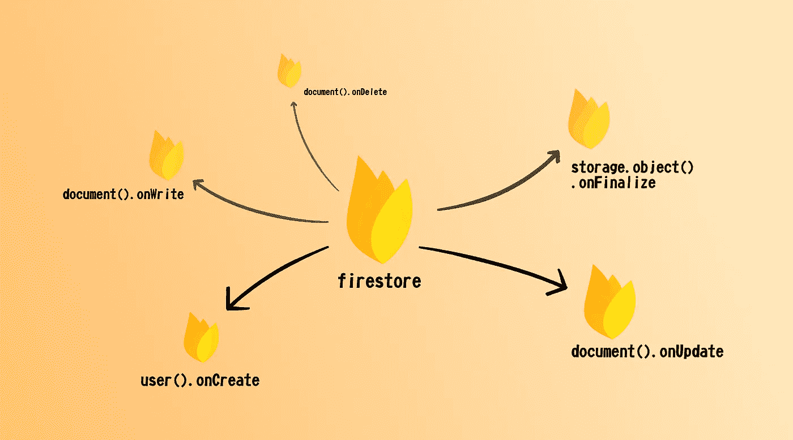
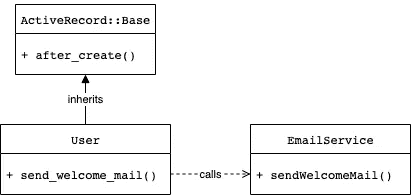

# 火基触发器的美丽

> 原文：<https://medium.com/nerd-for-tech/the-beauty-of-firebase-triggers-1a9a554da707?source=collection_archive---------15----------------------->



即使你没有使用 Firebase，请耐心听我说。

这仍然适用于任何微服务或使用 NoSQL 或其他类型的非规范化数据。

在我们开始之前，让我解释一下这些术语的含义:

*   对于[非规范化数据](/@katedoesdev/normalized-vs-denormalized-databases-210e1d67927d)，我指的是不符合第三范式的数据。跨存储条目复制的数据。例如，在文章和用户对象中保存作者姓名。
*   [微服务](https://martinfowler.com/articles/microservices.html)是一种将我们的应用拆分成可独立部署的独立可运行部分的方式。这有助于简化一些事情，例如更新、缩放和维护代码。然而，这也带来了复杂性的代价。
*   [monolith](/swlh/monolithic-vs-micro-services-and-all-in-between-7d496408ad02)是使用微服务的对立面。所有功能都在一个可部署的应用程序中运行。
*   与 SQL 数据库相比，NoSQL 数据库需要[不同的方法来进行多行更新](https://www.xplenty.com/blog/the-sql-vs-nosql-difference/#:~:text=multi-row%20transactions)，在 SQL 数据库中，我们只需运行`update`来更新大量条目

清楚了这一点，让我们来谈谈什么是触发因素。

# 传统触发器如何工作

我今天要讲的*触发器类型*是*当某些事情发生变化时，它会导致一些代码运行。*

首先，让我们看看常见的 [ORM](https://blog.bitsrc.io/what-is-an-orm-and-why-you-should-use-it-b2b6f75f5e2a) 框架是如何做到这一点的。例子可以是[微软的 EntityFramework](https://docs.microsoft.com/en-us/ef/) 、 [Hibernate](https://www.baeldung.com/spring-boot-hibernate) 或者我在这里使用的例子[Rails 的活动记录](https://guides.rubyonrails.org/active_record_basics.html)。尽管每个 ORM 的语法和特性不同，但它们通常具有相同的监听变化的核心能力。

特别是在活动记录中，我们使用[回调](https://guides.rubyonrails.org/active_record_callbacks.html)来对模型(也就是数据库表)中的变化做出反应。该模型继承了一个基类，该基类提供了我们可以用来注册回调的助手函数。在这些回调中，我们可以在模型改变时运行代码。



Rails 中常见活动记录事件模型的示意图

```
class User < ActiveRecord::Base after_create    :subscribe_mailing_list, :send_welcome_mail
```

ActiveRecord 触发器使得对数据更改做出反应变得非常简单。例如，当用户被保存时，它们需要很少的代码来触发电子邮件。

缺点是这个触发代码必须在模型内部。然后，该模型需要依赖于我们希望发生的任何功能。

这当然是可以避免的。例如，我们可以用 [Pub/Sub](https://niallburkley.com/blog/ruby-publish-subscribe/) 将其解耦，但是开箱即用，这种模式和类似的模式通常会导致庞大臃肿的模型，变得越来越难以测试和维护。

# 火基触发器如何工作

我不能保证 Firebase 触发器是如何工作的，但我认为它们建立在 [Google Pub/](https://cloud.google.com/pubsub/docs/overview) 子系统之上，这是一个异步消息系统，用于分离和扩展复杂系统。

它将消息系统包装在云功能 SDK 之后，因此您不必担心细节。它给你带来了两大好处:

1.  所有默认服务都提供了您可以监听的事件，而无需在您这边添加任何额外的逻辑
2.  它是自然分布的和可扩展的，函数将根据需要扩展运行，排队等

您实际上注册了云函数，以便在某些事件上调用，因此所有代码都有一个触发器作为它们的端点，例如:

```
exports = module.exports = functions.auth.user().onCreate(async (user) => { await initUser(user.uid);});
```

# 自然延伸

基于消息的架构的美妙之处在于它们自然解耦的方式，这使得它们非常具有可扩展性。

每个服务(Firestore、Auth 等)都公开了底层的关键事件，无论何时何地，只要您需要，您都可以挂钩到这些事件来执行一些代码，而不必修改源服务。

我们会在哪里使用这个？它实际上非常适合核心业务逻辑，例如:

*   当订单被取消时，进行退款
*   当用户完成特定的转换事件时，向他们发送电子邮件
*   当保存一个新项目时，保存非规范化的数据以便更好地阅读

# 不仅仅是燃烧基地

当然，使用基于消息的系统和引发事件并不是什么新鲜事。借助现代工具，您也可以轻松地在您的架构中使用它。还有 [Google Pub/Sub](https://cloud.google.com/pubsub/docs) 或者 [AWS Lamba](https://docs.aws.amazon.com/lambda/latest/dg/lambda-services.html) 。

但是，您需要做的是用一个框架来准备您的架构，该框架允许您简单地做两件事:

1.  为您的服务引发通用事件。这样，当您添加功能时，基本事件应该支持添加的新数据类型，而不必手动硬编码为这些类型引发事件。例如，不是在保存用户模型时引发事件，而是在保存任何模型时引发事件，将模型作为 JSON 对象传入。
2.  创建一个通用框架来轻松订阅这些事件。这样，通过订阅来扩展功能的摩擦将会比试图在事件发生的地方添加功能的摩擦要小

有了这两样东西，你就实现了 Firebase 的开箱即用。

# Firestore 触发器和非规范化模型的示例

下面是一个真实的例子，当作者更改姓名时，它会更新所有作者文章中的作者姓名。一个函数监听用户对象中的变化，如果名称发生了变化，则更新文章。

# 看看这些文件

作为总结，展示所有的 Firebase 事件，链接到文档，并请人们给出他们的想法。

*   [凡士多事件](https://firebase.google.com/docs/functions/firestore-events)
*   [实时数据库](https://firebase.google.com/docs/functions/database-events)
*   [远程配置](https://firebase.google.com/docs/functions/rc-events)
*   [认证](https://firebase.google.com/docs/functions/auth-events)
*   [分析](https://firebase.google.com/docs/functions/analytics-events)(仅转换事件)
*   [云存储](https://firebase.google.com/docs/functions/gcp-storage-events)
*   [发布/订阅](https://firebase.google.com/docs/functions/pubsub-events)
*   [测试实验室](https://firebase.google.com/docs/functions/test-lab-events)

完整列表和文档见 [Firebase 云函数文档](https://firebase.google.com/docs/functions)。