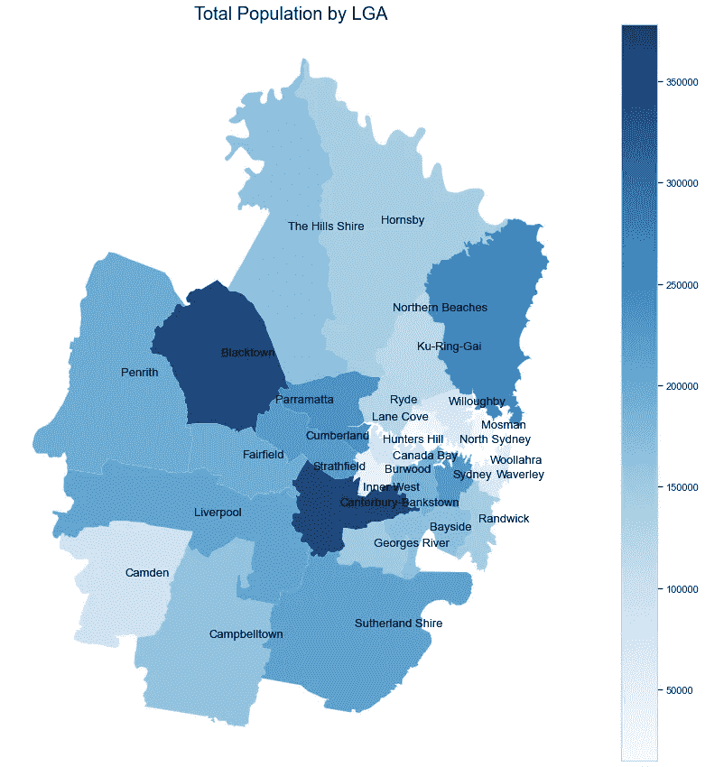
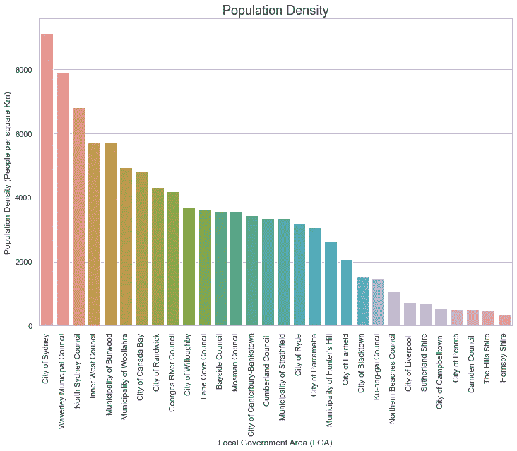
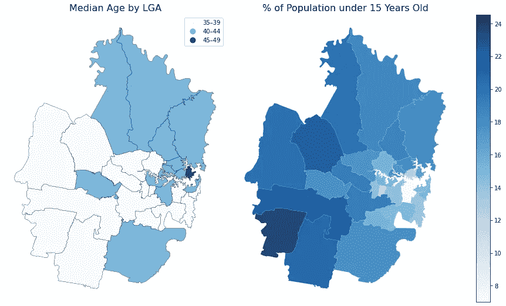
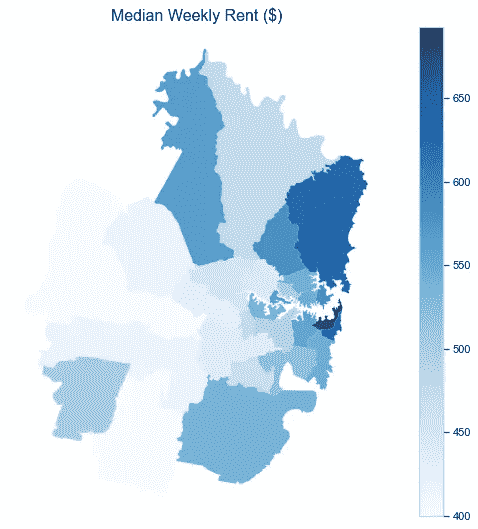
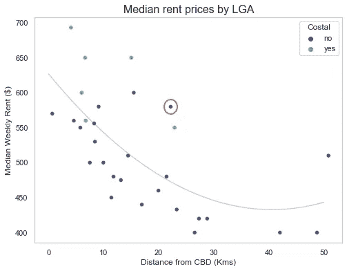
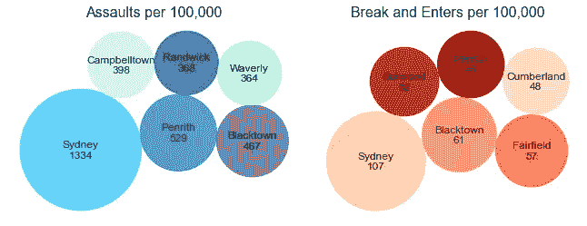
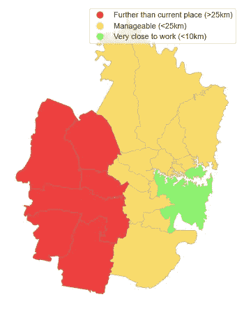
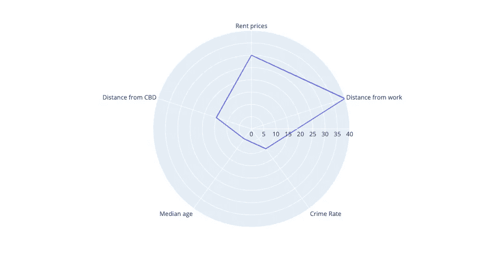
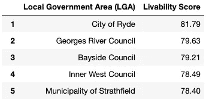

# 悉尼最好的郊区

> 原文：<https://medium.com/nerd-for-tech/the-best-suburb-in-sydney-967f8c46fa30?source=collection_archive---------6----------------------->

在过去的几个月里，我一直梦想着通过搬出家和租自己的房子来实现我作为一名年轻专业人士的独立。不幸的是，由于大量的可用信息，选择一个领域比我想象的要复杂和混乱。我花了很多时间浏览房地产网站、博客和互联网论坛，感觉并不比刚开始时聪明，这开始真正影响到我。

为了减少噪音并做出数据驱动的决策，我想创建并分析自己的数据集，根据几个重要因素找到最适合我的区域。我想住在离工作地点近的地方，这样我就不必花几个小时坐公共交通工具，我还想住在一个经济实惠但犯罪率低的地方。我还想住在一个人口相对年轻的地区，这样在接下来的五年里，我的社交生活就不仅仅是琐事和宾果游戏了…

**数据**

为了量化这些因素，我需要获得遍布网络的各种不同类型和格式的数据。为了收集和汇总数据，我结合使用了网络抓取和从网上导入数据，这些数据在我组合起来创建一个单一的、全面的数据集之前经过了清理和标准化。我使用的数据包括:

*   悉尼所有的地方政府区域及其坐标都是从维基百科上刮下来的
*   澳大利亚统计局的人口统计数据
*   来自新南威尔士州 FACS 的 LGA 平均租赁价格
*   新南威尔士州 Boscar 的犯罪统计数据
*   通过 FourSquare API 获得的每个 LGA 最受欢迎的场馆

我用来创建数据集和执行分析的数据集和代码可以在这里找到:【https://github.com/Alex-deL98/Coursera_Sydney_Project 

我决定使用地方政府区域(由州和地区定义的行政区划)对悉尼进行分组，因为这种分组拥有最好的数据。这个城市分为 30 个区。

有了完整的数据集，我首先通过一系列的可视化探索并试图理解悉尼的总体人口统计数据。然后，我定义了一组任意的偏好插入到我的数据集中，并使用它来确定最适合我居住的区域。

**第 1 部分:探索我的数据集**

**人口统计**

首先，我创建了一个基本的可视化图形，在一张 choropleth 地图上描绘每个 LGA 的人口:

我们可以看到悉尼人口最多的地方政府区是坎特伯雷-班克斯敦(377，917 人)、布莱克敦(374，451 人)和北部海滩(273，499 人)。亨特山是人口最少的 LGA，只有 14980 人。

这种可视化并不能完全清晰地描述人口密度，因为一些人口较多的地方政府在地理上更大。北部海滩 LGA 和布莱克敦至少有 240 平方公里，大大高于 least 平方公里的平均面积。为了得到一个完整的故事，我创建了一个图表显示每个 LGA 的人口密度。

人口最多的三个地方政府区接近或远低于每平方公里 3236 人的平均人口密度，这表明它们的高人口数量是由于相对较大的地理区域而不是拥挤的郊区。

直觉上，靠近中央商务区中心的地方政府区，如悉尼市、北悉尼和韦弗利，密度越来越大，而远离中央商务区的地方政府区，如霍恩斯比和希尔斯，密度就越来越小。人口密度与距中央商务区的距离呈-0.74 的强负相关，表明二者呈强负相关。

在计划分析时，我对探索悉尼不同地方政府区的年龄分布很感兴趣。使用我的数据集，我创建了计算每个 LGA 中值年龄以及儿童(15 岁以下)人口百分比的方法。这是悉尼的年龄分布在地图上的样子。

悉尼最老的 LGA 是莫斯曼，中值年龄范围在 45-49 岁之间，而有几个 LGA 在最低中值年龄范围内，倾向于进一步向西。ABS 将 Blacktown 列为悉尼最年轻的 LGA，中值年龄为 32.1 岁，但他们使用的人口普查数据是 2010 年的，而我们的 ABS 数据是 2019 年的。

有趣的是，我们发现 15 岁以下儿童的 LGAs 人口分布在卡姆登(24.55%)、布莱克敦(22.76%)和利物浦(22.5%)，它们也在更靠西的地方。这表明要么是靠近市中心的出生率较低，要么是年轻家庭向西迁移的趋势。在另一个项目中探索这种现象的原因会很有趣。

**租金价格**

研究的下一个因素是悉尼的租金价格。为了做到这一点，我在地图上显示了租金中值。

不出所料，沿海地方政府办公楼和靠近中央商务区的地方政府办公楼往往租金较高。我绘制这个图是为了更详细地考察离 CBD 的距离和租金价格之间的关系。

希尔斯郡(用红色圈起来的)可能是这里最有趣的异常之处，它的平均租金为 580 美元，大大高于悉尼 517 美元的平均租金，尽管它距离中央商务区超过 22 公里，而且不是沿海的 LGA。这与该地区的房价一致，该地区的房价高于悉尼的房价中位数。

正如我们在人口密度可视化上看到的，希尔斯郡是悉尼人口密度第二低的 LGA，这表明房屋、公寓和庭院的平均面积可能比悉尼的其他地方要大。

此外，新的 83 亿美元的自动化快速交通系统悉尼西北地铁可能是一个影响因素，因为更好的交通基础设施已被证明可以减少通勤时间并提高房价。 *(1)* 地铁沿线其他地区也出现了高于平均水平的房价涨幅。 *(2)* 在另一个项目中探索导致希尔斯郡高房价的因素会很有趣。

**犯罪率**

我也对探索和分析悉尼的犯罪率感兴趣。不幸的是，没有公开的数据集显示整个地方政府的犯罪率，所以我决定分别调查袭击率、抢劫和破门而入的犯罪，因为这些是我最想避免的犯罪。

这些图像清楚地表明，悉尼市占了悉尼市犯罪的很大一部分，每 100，000 人中拥有最高的袭击率、抢劫率和破门而入率。悉尼市占新南威尔士州所有非家庭暴力事件的 10.2%。高袭击率可归因于与酒精有关的暴力，因为该地区有许多酒吧、夜总会和酒店。悉尼市 48.1%的袭击与酒精有关，明显高于新南威尔士州 33.5%的平均水平。

**工作距离**

最后，我想象了每个 LGA 离我工作地点的距离。我现在的家离工作单位大概 25 公里，通勤需要一个多小时。我想确保我搬到的任何郊区都不会比我现在住的地方更远，理想情况下，我会住在工作地点 10 公里以内，因为短途通勤对我来说很重要。为了做到这一点，我创建了一个新的列，用来可视化地图上的工作距离。

这就排除了彭里斯、布莱克敦、费尔菲尔德、坎贝尔敦、卡姆登和利物浦。考虑到我更喜欢定期在办公室工作，每天走 25 公里去上班实在是太远了。

**第 2 部分:偏好**

既然我已经研究了悉尼的人口统计数据，我想将我的数据集付诸实践。首先，我决定在我的偏好中我想要代表哪些因素，或者在选择一个地区时对我来说最重要的因素。

我强烈反对上班距离。节省时间和省钱一样重要，如果没有必要，我不想再花更多的时间在通勤上。此外，我将消除任何超过 25 公里的 LGA 从我的工作，以防止我的通勤时间增加。

我也想强烈偏好较低的租金价格。刚从大学毕业，花 95%的工资在莫斯曼租一套顶层公寓(剩下的 5%花在 2 分钟面条上)可能是不负责的。

接下来，我把袭击率、抢劫和破门而入结合在一起，创造了自己的犯罪率指标，并加入了对犯罪的偏好。我还会选择距离中央商务区较远的地方，因为我大约每周一次在城里会见朋友或参加工作活动。用年龄中位数来衡量，我也代表了对老郊区的微弱偏好。以下是我将如何衡量自己偏好的直观描述:

现在我有了偏好，我可以把算法写成代码，并把它插入到数据集中，得到我最好和最差的郊区。大揭露的时间到了。

这是结果。紧随其后的是乔治河，海湾，内西和斯特拉斯菲尔德，但结果是我将搬到…

**赖德！**

莱德的租金中值为每周 450 美元，距离我的工作地点 12 公里，人口相对年轻，听起来是一个非常适合居住的地方。它位于人口密度分布的中间，莱德的前三大场所是咖啡馆、公园和酒类商店。听起来正合我的胃口！

**限制:**

*   租金中值不控制住宅类型。我不打算找有 4 间卧室的房子，所以回想起来，我应该更具体地找到包括住宅类型和大小的数据
*   欧几里得距离度量没有考虑到公共交通的困难。如果交通路线是直接的，住得远一点也没问题。
*   事后看来，许多编码效率低下的地方——例如，当 LGA 在另一个数据集中时，从维基百科中抓取 LGA 列表，可以使用 pd.read_html 以更少的时间和代码来抓取表
*   随着我添加更多的数据，我的代码库变得越来越复杂&越来越难以处理。我将更紧密地遵循最佳实践，并努力在未来建立更清晰的结构

**我学到的:**

*   网页抓取。在这个项目之前我没有使用过它，现在我相对有信心使用 BeautifulSoup & Requests 库
*   FourSquare API &使用地理坐标
*   大量的观想练习

**参考文献**

1.姚超群、黄树声(2005)。预期的交通改善对房价的影响。城市研究，42(1)，113–125 页。检索于 2021 年 2 月 22 日，来自[http://www.jstor.org/stable/43096216](http://www.jstor.org/stable/43096216)

[2。https://www . real estate . com . au/news/house-prices-boom-in-suburban-along-metro-north western-train-line/](https://www.realestate.com.au/news/house-prices-boom-in-suburbs-along-metro-northwest-train-line/)