# 2021 年必须参加的最佳 UX 设计会议

> 原文：<https://medium.com/nerd-for-tech/the-best-ux-design-conferences-that-must-attend-in-2021-e6809a70d2dc?source=collection_archive---------4----------------------->

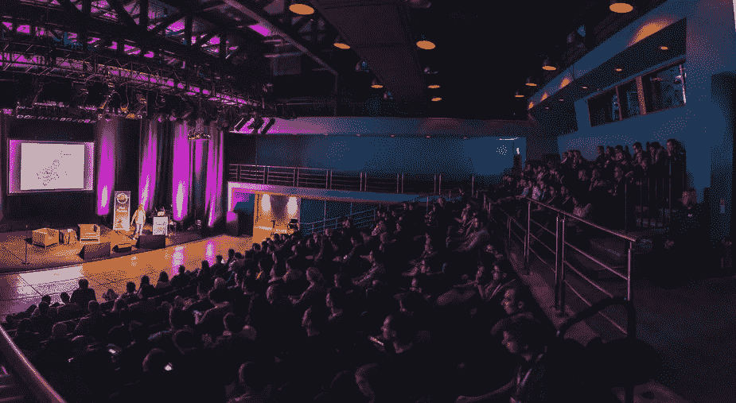

设计会议不仅是活动和研讨会，也是新的熟人、机会和积极的情绪。你可以看很长时间的视频，上很长时间的课程，但是现场交流不能代替任何东西。在任何 UX 会议上，最重要的是与会人员。你将能够找到志同道合的人，获得十几个有用的熟人，获得新知识，结识设计专家。在这篇博客中， [Wondershare Mockitt](https://bit.ly/3ewCXuz) 将告诉你 UX 最棒的活动。

# 2021 年最佳 UX 设计会议

***1。***[***Confab 2021***](https://www.confabevents.com/)

**日期:**虚拟 2021 年 5 月 5 日至 7 日

**地点:**美国明尼阿波利斯

“Confab 2021-内容战略会议”是为那些关心如何让内容更好地为他们的用户和组织服务的人举办的一次活动。不，你不必是一个内容战略家参加！如果您计划、设计、构建或管理内容，Confab 是您的归宿。

会议的主要组成部分是:

1.为期三天的现场直播，包括主题演讲、小组讨论、炉边聊天和各种虚拟滑稽表演

2.在整个活动过程中，由演讲者和与会者主持小组讨论和观看聚会

3.专属的 Confab Slack 工作区，您可以在这里参与关于该计划的持续对话；结识有共同兴趣的新朋友，重新联系老朋友

4.点播视频库，包含许多行业和专业的新声音和专家的几十个预先录制的演讲；活动结束后，你还可以获得现场直播的完整记录——365 天无限制观看

***2。***[***UXDX APAC 会议 2021***](https://uxdx.com/apac/2021)

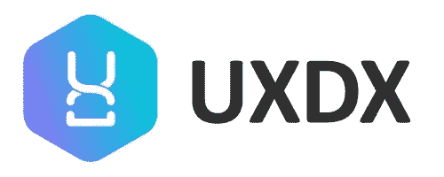

**日期:**2021 年 3 月 4 日至 5 日

UXDX APAC 会议 2021 是一个在线会议，将通过案例研究讲座、小组讨论和研讨会提供直播和点播内容。会议的任务是在团队中传递真正的变化，帮助他们对软件开发有一个完整的系统观点。UXDX 帮助团队从项目工作转变为自主产品团队，交付真正的业务和客户价值。它跨越了产品、UX、设计和开发之间的障碍，帮助组织创建成功的产品团队！

[***3。画布大会 2021***](https://canvasconference.co.uk/)

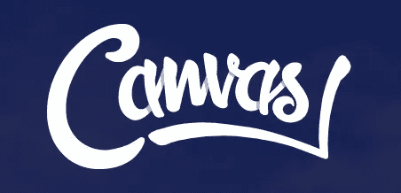

日期:【2021 年 3 月 18 日

**地点:**英国伯明翰市伯明翰大街电影世界

Canvas Conference 2021 是一个为期四天的数字产品和体验会议，分享来自制造商的切实可行的见解。你可以期待看到一个涉及所有数字和产品的合作时间表。工作中没有高层次的概述或品牌传播者，只有真实的人，分享他们的经验和学习。本次会议的发言人都在他们的特定学科或行业的前沿，并将分享他们对构建卓越的数字产品和体验的见解。

[***4。UX 哥本哈根 2021***](https://uxcopenhagen.com/)

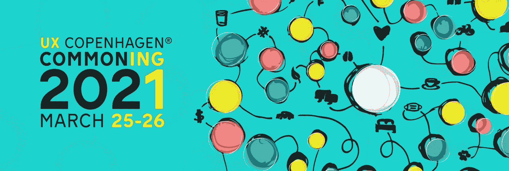

**日期:**2021 年 3 月 25 日至 26 日

UX 哥本哈根 2021——丹麦最鼓舞人心的人类体验会议，涵盖用户体验、内容、战略和研究等主题，每年都有一个新的主题。我们将为您呈现为期两天的精彩内容，来自 20 多位演讲人、实践研讨会、灵感、网络、新知识和新见解。

[***5。UX 伊斯坦布尔***](https://uxistanbul.org/)

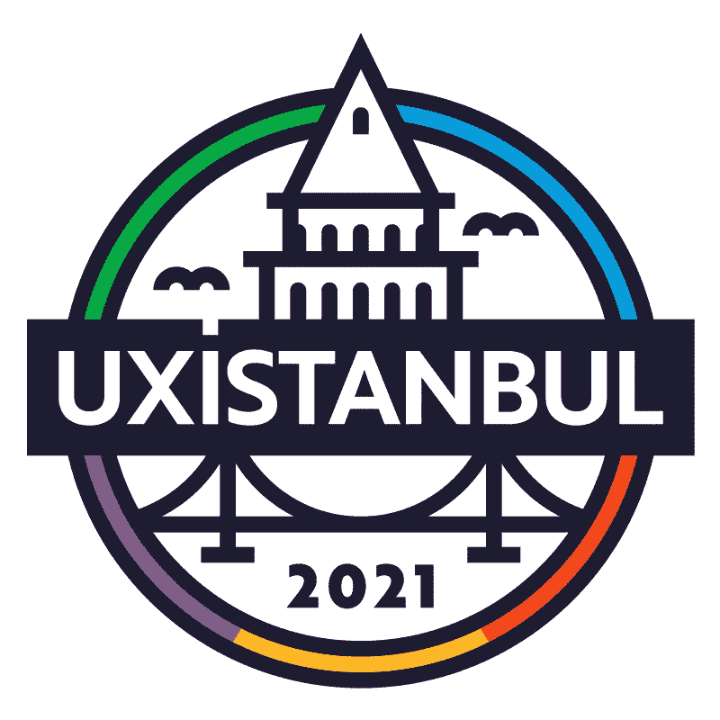

日期:2021 年 4 月 6 日至 8 日

**地点:**土耳其伊斯坦布尔

UX 伊斯坦布尔是土耳其和该地区的第一个国际用户体验和可用性会议。我们是第一次在土耳其举行 UX 会议，在过去的 6 年里，我们一直在聚集来自世界领先公司的 UX 专业人士。在 UX 伊斯坦布尔 2021，我们将在虚拟平台上见面，会议将持续 4 天。我们将听取行业专业人士的意见，并举办数字化研讨会。

[***6。伊利诺伊大学网络会议***](https://webcon.illinois.edu/)

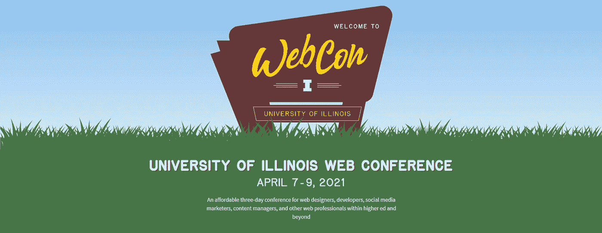

日期:2021 年 4 月 7 日至 9 日

**地点:**美国香槟

伊利诺伊大学网络会议将为网络设计师、开发人员、社交媒体营销人员、内容经理和其他高等教育及其他领域的网络专业人士举办为期三天的会议。你是网站程序员、设计师、内容战略家、网站管理员、UX 设计师、IT 专家、项目经理、社交媒体营销人员吗(你明白要点了吧！)与大家分享一个有趣的话题、项目或案例研究。

[***7。2021 年世界级设计师大会***](https://conf.wcd.school/)

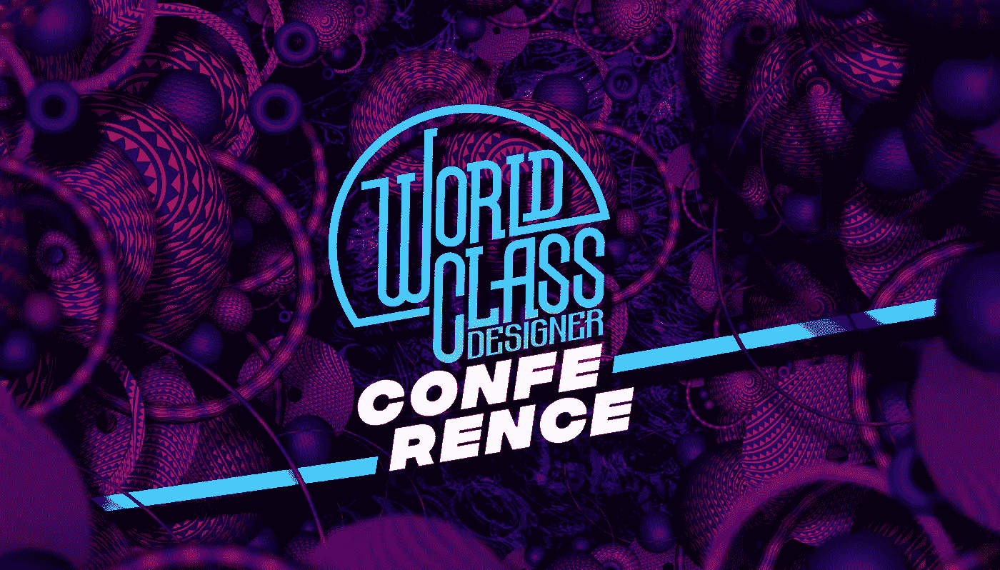

**日期:【2021 年 2 月 18 日至 19 日**

2021 年世界级设计师大会是一个 24 小时的洲际活动，将世界各地的设计师联系在一起，讨论和学习有影响力的设计故事和实践，激励和促进设计师的成长。WCD 会议 2021 不仅仅是一次会议；它有助于在非洲建立一个设计社区。与会者购买的每张门票都将为 1 名有抱负的非洲设计师提供为期 1 年的在线设计教育、指导和工作机会。

[***8。UX 澳洲 2021***](http://www.uxaustralia.com.au/conferences/ux-australia-2021)

**日期:**2021 年 8 月 24-27 日

**地点:**澳大利亚悉尼

澳大利亚 2021 是一个为期四天的会议，致力于用户体验、设计等所有事情！2021 年的活动计划将包括周二至周五每天上午的会议演示，随后是下午的实践研讨会。今年，我们将会议的焦点重新放在整体设计上。虽然会议仍将主要集中在 UX，我们希望也包括对邻近设计领域的介绍！

澳大利亚 2021 将作为混合风格的活动在悉尼举办，并通过 Zoom 网络研讨会在线直播。活动日程仍将包括本地和国际演讲者，涵盖与有经验的从业者、新手以及介于两者之间的所有人相关的主题和想法。

[***9。互动伦敦 2021***](https://interactconf.com/)

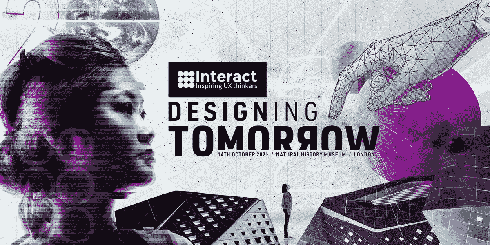

日期:2021 年 10 月 14 日

地点:英国伦敦

Interact London 2021 是一个领先的设计会议，探讨数字设计、用户体验、人工智能、战略以及二者之间的一切在当今社会中扮演的角色。主题——设计明天。演讲者和演讲代表了“哲学和实践”的混合，来自他们领域中一些最有成就的思想家和实践者。

[***10。CanUX 2021***](https://canux.io/canux-2021/)

日期:2021 年 11 月 4 日至 6 日

地点:加拿大渥太华

CanUX 2021 是一个为期四天的现代体验设计趋势展示，类似于加拿大首屈一指的年度 UX 活动，以实践研讨会和世界级的精彩演示组合为特色，有很多机会找到灵感、学习、交流想法和结交新朋友。就形式而言，CanUX 是一个周末全体会议，由来自世界各地的出色演讲者组成。会议之前是为期一天的实践研讨会。我们是加拿大持续时间最长、规模最大的年度体验设计活动，并一直在寻找方法在大北方创造一个最具包容性、最实惠、世界级的 UX 会议。

[***11。UXRConf Anywhere 2021***](https://uxrconf.com/)

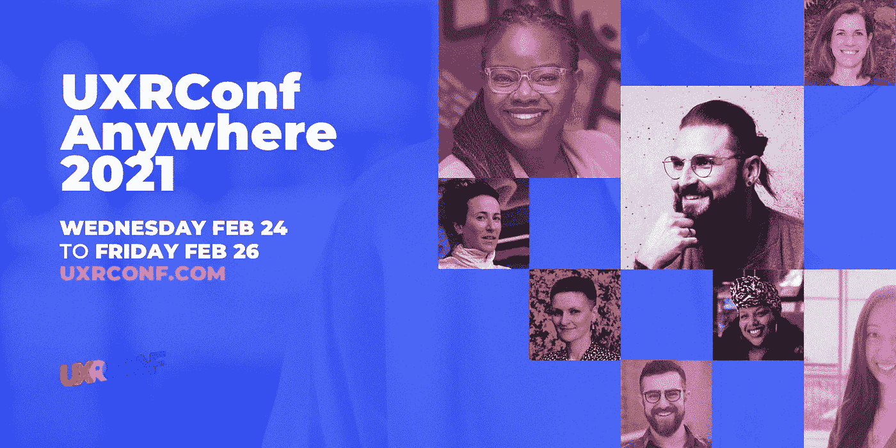

**日期:**2021 年 2 月 24 日至 26 日

**地点:**在线

UXRConf Anywhere 2021 是一年中我们可以作为一个社区关注自己的一次机会。这是一个我们可以一起学习、交流和超越自己技艺的地方。这是一个我们可以聚焦每天都在改变我们行业的新思想和人才的时刻。

[***12。设计思维虚拟体验 2021***](https://www.designinnovationglobal.com/events-design-thinking-virtual-experience/)

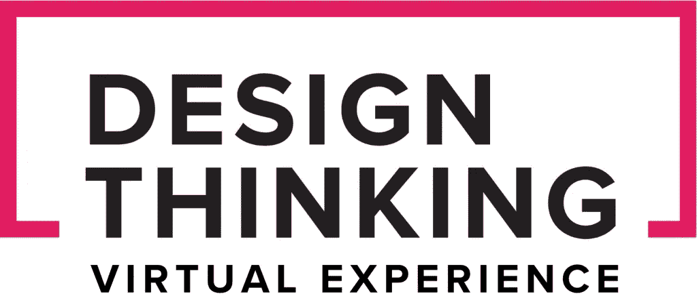

**日期:**2021 年 4 月 13 日至 14 日

**地点:**在线

设计思维虚拟体验 2021 不是典型的用户大会。该活动聚集了设计部门内外的许多从业者，他们认为设计思维是解决问题的有用工具。您将获得所需的洞察力和灵感，将设计思维从功能上和商业策略上付诸实施。通过参与“设计思维虚拟体验 2021，解决特定问题的步骤”,您能够释放出创新理念的力量，并为您的客户带来激动人心的体验，成功地将您与竞争对手区分开来。

[**T22【13】。2021 年光明节**](https://uxinsight.org/festival-2021/)

日期:2021 年 4 月 14 日至 16 日

**地点:**在线

2021 年视觉节是一个国际性的 UX 研究会议。该活动的目的是通过分享知识、经验和想法来推动 UX 研究领域和社区的发展。来自世界各地的研究人员将分享一些来自斗争的伟大想法。

*   让你微笑并提高技能的活动:
*   与相关关系建立自然而深刻的关系网
*   支持和创新的社区
*   时区友好开始时间
*   面向所有持票人的录音—随时观看！
*   所有演讲都有英文字幕

[***14。UX &产品发布会 2021***](https://conference.uxandproduct.com/)

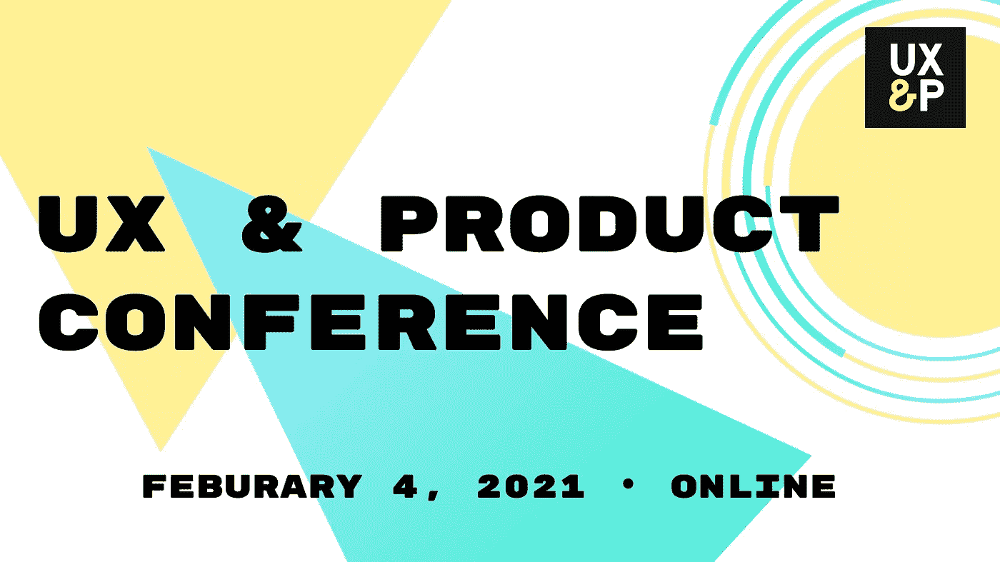

日期:【2021 年 2 月

**地点:**在线

UX 和产品会议 2021 是一个虚拟会议，在这里最聪明的 UX 和产品头脑讨论新的想法。当旧思想受到挑战和争论时，新思想就会产生。因此，UX 和产品大会围绕着一种新的形式展开，而不是让演讲者重复你可能在 Youtube 上找到的那些演讲。演讲者将成对出现。他们每个人都针对一个主题提出自己的观点，然后进行有主持的辩论和小组讨论。

[***15。UXLx 大师 2021***](https://masters.ux-lx.com/)

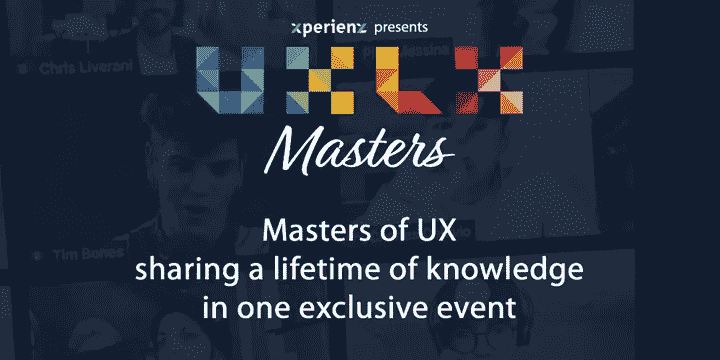

**日期:**2021 年 2 月 10 日至 12 日

**地点:**在线

UXLx 大师赛是一个为期 3 天的独家在线活动，UX 的大师们将分享一生的知识和经验。从来自业内最优秀专家的 12 个互动大师班中进行选择，这将帮助您磨练技能并学习最佳实践。

[**T22【16】。ADDC — App 设计&开发大会**](https://addconf.com/2020/)

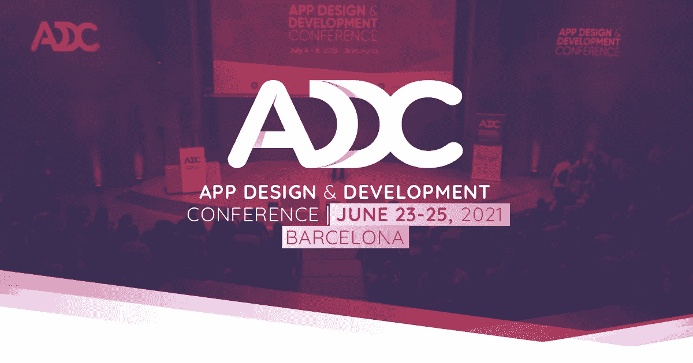

日期:2021 年 1 月 23 日至 25 日

地点:西班牙巴塞罗那

ADDC 是在西班牙巴塞罗纳为 iOS & Android 开发者和 UX/UI 设计师举办的单轨国际会议。ADDC 旨在为设计师和开发人员创造一个见面的机会，找到新的合作方式，并在一个开放、包容和协作的空间中获得灵感。

此事件是这些集合的一部分:

*   设计操作
*   设计工具
*   发展
*   装帧设计艺术
*   运动设计
*   视觉设计

[***17。UXD 医疗***](https://uxhealthcare.co/)

日期:2021 年 4 月 14 日

地点:英国伦敦

UXD 医疗保健有各种各样的主题专家，他们将分享他们对以用户为中心的设计和 UX 医疗保健的经验和见解。

[***18。丹佛***](https://aneventapart.com/)

日期:2021 年 10 月 11-13 日

**地点:**美国

丹佛之外的一个活动是一个为期三天的会议，重点关注数字设计、UX、内容、代码等，让您深入了解我们现在的状况和未来的发展方向。

[***19。旧金山事件***](https://aneventapart.com/event/san-francisco-2021)

**日期:**2021 年 12 月 13 日至 15 日

**地点:**旧金山

旧金山之外的活动是一个为期三天的会议，重点关注数字设计、UX、内容、代码等，让您深入了解我们的现状和未来发展方向。

[**20*。大设计***](https://bigdesignevents.com/)

**日期:**2021 年 12 月 13 日至 15 日

**地点:**美国达拉斯

Big Design 成立于 10 年前，它相信人们在一起会更好。因此，我们可以为人们创造学习、分享和成长的机会。经验、智慧和创造力解决问题，这在大设计得到充分展示。

# 结论

UX 会议和活动是了解您在 UX 行业中地位的最便捷方式。更新你对自己与竞争对手、领导者和年轻一代相比所处位置的认识。在 UX 设计大会上，来自产品或服务公司的 UX 专业人士和领导者将分享他们的经验并回答您的问题。通过参加这些 UX 会议和活动，您可以有机会与行业同行就工艺、UX 实践和日常设计进行交流。

感谢您花时间阅读这篇文章。了解更多关于摩奇特的信息

我们为 UX 初学者创建了一个[终极指南](https://bit.ly/2OLPPlW)，它收集了来自多个 UXers 的知识、经验和建议。

订阅我们的[YouTube](https://www.youtube.com/channel/UCESxamaRS8nOGpWYvP1VSqA)脸书 insta gram

*原载于*[*https://mockitt.wondershare.com*](https://mockitt.wondershare.com/ui-ux-design/design-conferences.html)*。*