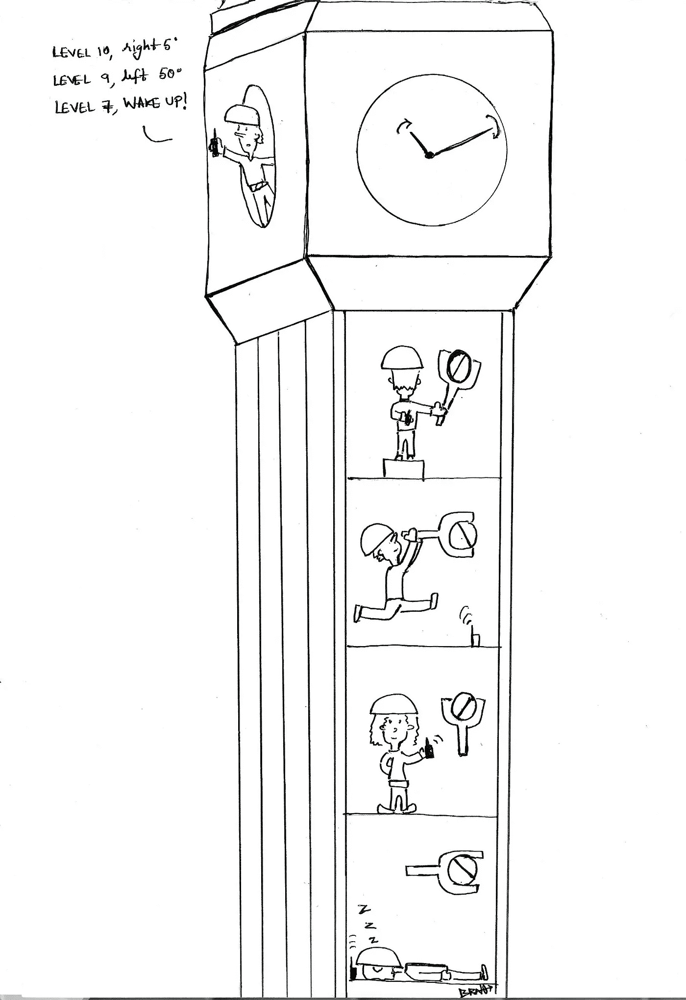

# 大本钟理论

> 原文：<https://medium.com/nerd-for-tech/the-big-ben-theory-701bb21fe560?source=collection_archive---------9----------------------->

## 一个有助于对神经网络有直观了解的小故事

对于任何开始学习神经网络之旅的人来说，理解神经网络的每个方面如何协同工作有时是具有挑战性的。这里有一个小故事可以帮助你。在我们继续这个故事之前，我想感谢[毗湿奴·普利帕卡](https://www.instagram.com/vishnupulipaka/)带来的这个美妙的艺术品。

作品由[毗湿奴·普利帕卡](https://www.instagram.com/vishnupulipaka/)

> 想象一下，大本钟突然开始显示错误的时间。女王亲自让你处理这件事(没有压力),因为她的一个秘密特工向她推荐你是最熟练的时钟大师。所以你召集你的一些朋友前往伦敦完成你的任务。
> 
> 当你到达那里时，你意识到没有一个旋钮你可以转动，这将固定时间，所以你告诉你的朋友走近每个旋钮，轻轻转动它，看看它如何影响时间。你继续给他们反馈每次转动如何影响时间，他们继续转动旋钮越来越接近想要的结果。
> 
> 好了，你已经把大本钟的时间调好了，女王很高兴。她授予你和你所有的朋友骑士身份，之后你就可以带着骑士的舒适和奢华回家了。干得好，先生！

回到现实，这个故事和神经网络有什么关系？

你提供给你朋友的数据最初是神经网络的 ***输入数据*** ，每个旋钮的初始状态是 ***权重*** ，随着我们调整每个旋钮，输出发生变化。输入后时钟上的时间是 ***预测值或输出*** 。输出和预期时间之间的差异是一个 ***错误*** 。最后，旋钮状态根据输出的变化是网络如何学习的，也称为 ***反向传播*** 。

我们可以想象每个神经元内部都有一个小人，他根据你给他们的指令转动旋钮。如果指示是好的，那么网络最终将开始返回接近准确的结果。

# 结论

如果你理解在引擎盖下发生了什么，那么实现神经网络是很有趣的。我希望这个小故事能激励你捡起胸膜网络并了解更多。在这种情况下，你可以查看我写的关于这个主题的故事列表。如果你对这篇文章或你希望我在下面的评论中写的任何未来的文章有任何反馈，请告诉我。快乐学习！