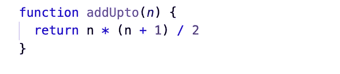
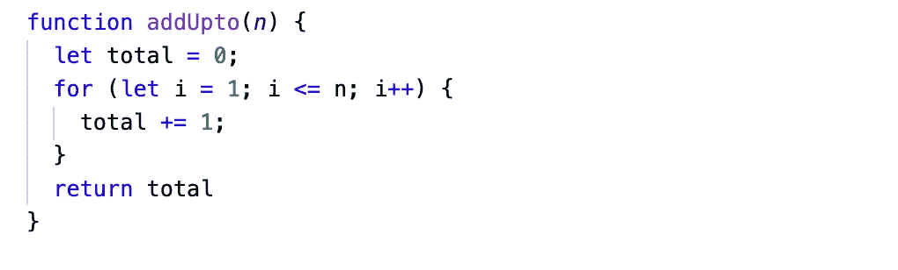
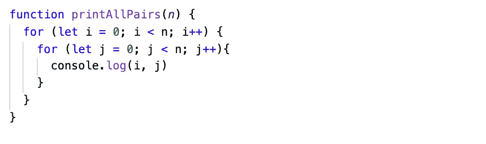

# 大 O

> 原文：<https://medium.com/nerd-for-tech/the-big-o-18fea712ae6b?source=collection_archive---------15----------------------->

理解 Big-O 符号的初学者指南

> 作为软件开发的初学者，有一系列的概念需要学习和理解。但是，有一个话题胜过一切。这个主题可能非常令人头疼，尤其是当您刚刚开始您的编码之旅时。那个题目就是，你猜对了，**大 O 批注**！(写的是 O，不是零)。在这篇博客中，我们将揭开 Big-O 的神秘面纱，希望能帮助你更好地理解它。那么什么是大 O 记数法呢？为什么在求解算法时对开发者很重要？

> Big-O，也称为朗道符号，是一种“在复杂性理论、计算机科学和数学中用于描述函数渐近行为的符号”。根据麻省理工学院的说法，基本上，它告诉你一个函数增长或衰退的速度。"用字母 O 是因为一个函数的增长率也叫做它的阶."埃德蒙·兰道是一位数论家，他发明了记数法。

简单来说，大 O 是用来描述一个算法的性能。假设我们有多种有效的做事方法(在这种情况下，有各种不同的方法来解决问题/编写函数)。我们如何确定哪一个是最好的？这就是大 O 出现的地方。这是一种将代码及其性能与其他代码进行比较的方式。

大 O 的时空复杂度

我们来讨论一下大 o 的不同记数法。

**O(1) —** 表示 ***常数*** 复杂度。
这仅仅意味着无论输入大小如何，操作将总是在恒定的时间内执行。

常数算法的示例:

*   检查一个数字是偶数还是奇数
*   打印列表中的第一个元素
*   从对象中移除项目

O(1)复杂度

**O(n) —** 表示 ***线性*** 时间复杂度
这仅仅意味着程序访问输入中的每个元素。换句话说，这意味着随着输入的增加，算法完成的时间相应地变长了。它执行的操作(步骤)数量与输入的*直接*成比例。随着***输入/数据数量*** *增加****运算数量*** *线性增加*。

线性算法的例子:

*   在集合中查找给定元素
*   获取最大/最小值
*   返回列表中的所有值
*   合计出给定的数字

O(n)用循环写出的给定数的和的复杂度

**O(n ) —** 表示 ***二次*** 时间复杂度
这意味着它执行的运算次数与输入的*平方*成比例。一个很好的例子就是检查条目列表中是否有重复的条目。这在涉及嵌套循环或迭代的算法中很常见。

二次算法的例子:

*   排序算法(冒泡、选择、插入)
*   检查重复值
*   打印数组中的所有有序对

嵌套循环算法的 O(n)复杂度

O(n)运算中的 O(n)运算→ O(n * n) ⇢ O(n)。简单来说，随着 n 的增长，运行时以 n 的平方的速度增长。

我们希望避免算法的时间复杂度达到 O(n)的情况，因为这表示算法的增长**随着输入的每次增加而加倍**。这使得在处理大数据集时运行时间非常慢。

还有一些其他的时间复杂性，如立方、阶乘、多项式和对数，但我们不会在这篇初学者的博客文章中涉及。就目前而言，要对大 o 有一个基本的了解，这就是你需要知道的全部。

**TL；DR —** 大 O 只是算法运行时的一种说法；代码运行需要多长时间。这就是我们如何比较一个问题的不同解决方案的效率。使用 Big O，我们用*表示运行时相对于输入的增长速度，因为输入(数据集)变得越来越大*。我们用来区分运行时间的术语是 O(1)或常数，O(n)或线性，O(n)或二次。O(1)是最高效的，O(n)是最常见的，O(n)是您希望尽可能避免的情况。

有些人可能会问，如果代码有效，谁会关心它的性能呢？谁在乎是不是最好的？这很重要，因为…

*   获取输入的数据集的大小。与另一种算法相比，一种算法每次运行可以节省一个小时。这就是问题所在。
*   即使您对自己的解决方案感到满意，了解它与其他解决方案相比如何也很重要。
*   它在讨论不同方法之间的权衡时也很有用。有时并不是哪个解决方案是最好的，但也许一个解决方案对于巨大的数据集是很好的，但另一个解决方案在运行时间上是一致的，即使它需要更长一点的运行时间。
*   面试——你会在面试中看到。

我希望这能帮助你对 Big-O 符号有更多的了解。

快乐学习！！