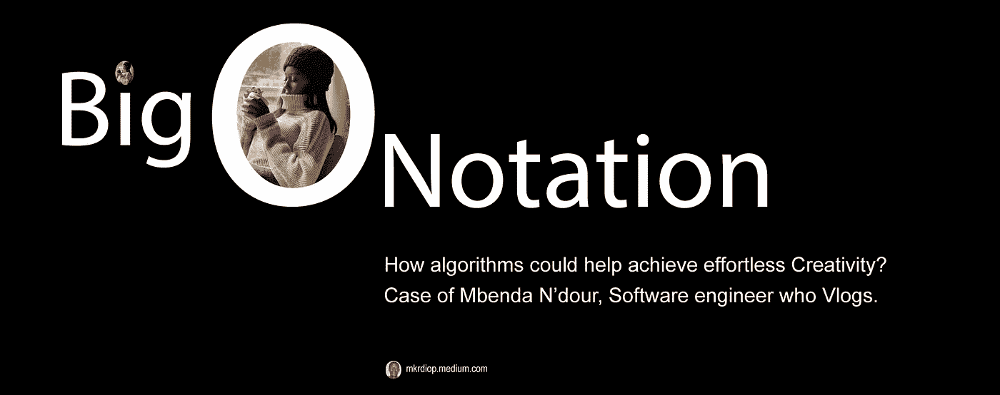
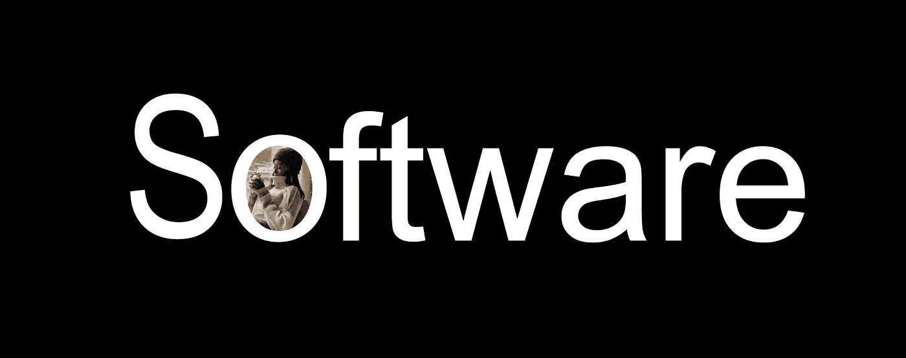
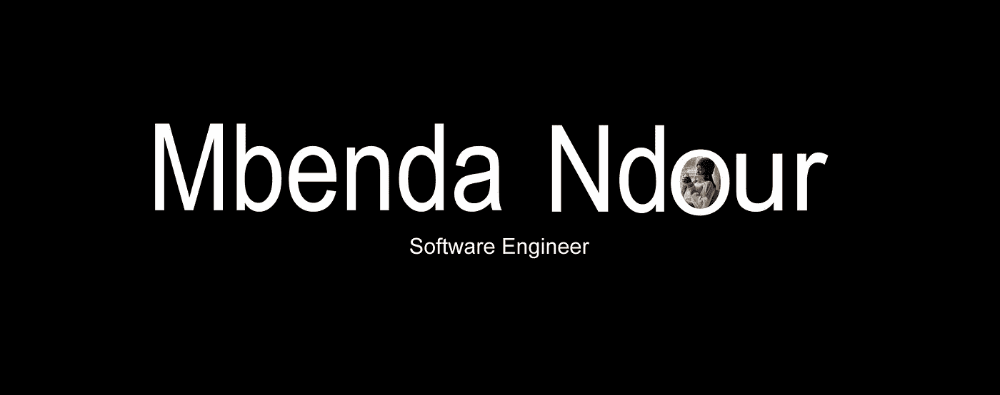

# 姆本达的重要建议

> 原文：<https://medium.com/nerd-for-tech/the-big-o-advice-of-mbenda-674fc60b1992?source=collection_archive---------13----------------------->

当 Mbenda 在她的软件工程师 vlog 提示中建议你掌握大 O 符号时，她去了她最喜欢的一部动漫，并找到了一个角色在说大 O 后说大 O 的场景，将其放入她的视频中。她可能很容易做到这一点，因为她非常了解这部动漫，但她肯定花了很多时间来寻找这段视频，可以说明她的 vlog，并使它变得更有趣。你可以看看一个例子，这种有趣的视频插图，是 Mbenda 创造性地做的，看下面这个剪辑过的视频

 [## 成为软件开发人员的最佳技巧(学习如何编码)

### 嗨朋友！已经有一段时间了，感谢观看！如果您想了解 Skillshare，前 1000 名用户…

www.youtube.com](https://www.youtube.com/watch?v=LbTQvdmzItY?start=136&amp;end=143) 

如果你对 Mbenda 感同身受，并愿意让她节省时间，并毫不费力地说明她的视频，她已经向你展示了她所关心的动漫。他们就在这里

 [## 发现 Mbenda 最喜欢的动漫

www.youtube.com](https://www.youtube.com/watch?v=LbTQvdmzItY?end=27) 

作为一名软件工程师或有抱负的软件工程师，你的目标是将这些动画的所有情节作为语音到文本算法的输入。采纳 Mbenda 的建议会很有用，他告诉你只学一种语言。对于为 Mbenda 和其他有创造力的人构建这个系统的练习，我会建议你把 python 作为第一手语言，因为使用 Python 你已经有了很多模块，比如

*   [阿皮亚](https://pypi.org/project/apiai/)
*   [assemblyai](https://pypi.org/project/assemblyai/)
*   [谷歌云语音](https://pypi.org/project/google-cloud-speech/)
*   [pocketsphinx](https://pypi.org/project/pocketsphinx/)
*   [演讲人识别](https://pypi.org/project/SpeechRecognition/)
*   [沃森-开发者-云](https://pypi.org/project/watson-developer-cloud/)
*   [机智](https://pypi.org/project/wit/)

一旦剧集的声音被转换为文本，第二步将是将生成的文本标记为单词和句子，并将它们存储到可搜索的数据库中，该数据库可以是简单的 SQL 数据库，如 MySQL，但您也可以使用为搜索引擎(如 elastic search)构建的高端数据库解决方案。关于建立你的数据库，你不应该忘记的是，为了对编辑 vlogs 有用，你应该引用和索引每个单词和句子的时间。我指的是每个单词和句子的开始和结束时间代码，以及它们所在的那一集。

这里是为 mbenda 建立这个[动画搜索引擎的前两个步骤，但最后一个步骤是建立一个视频修剪器，一旦她发现有趣的说明性单词或句子，它将允许 vlogs 创作者剪切她或他需要的视频部分](/predict/animes-search-engine-for-mbenda-8aeba1527933)

当然，所有这些子系统都是后端过程的一部分，但该解决方案需要一个前端，可以像在谷歌一样搜索内容，为了进一步开发这种系统，您可以考虑与 Adobe premiere、filmora 等视频编辑解决方案集成。

有很多创造性的方法来构建系统和平台，帮助轻松编辑视频，其中一些系统可以利用人工智能，正如我在下面的这篇文章中揭示的那样

 [## 视频发布平台中的人工智能

### 如果你可以建立人工智能算法来检测这种类型的图片，你将拥有一个可以过滤视频的系统…

medium.com](/codex/ai-in-video-publishing-platform-177a1b8d8003) 

但是请记住，要想成功构建这样的系统，你应该是一名优秀的软件工程师，并考虑 Mbenda 的建议，我可以用这些要点来总结

*   选择一种且只能选择一种语言
*   主数据结构
*   大的符号是非常重要的，你应该学会如何估计执行时间，内存空间，和你面前的每个算法的复杂性。
*   选择专业，后端或前端
*   编码真的很难，你应该记住这一点

PS:听起来我听到 Mbenda Ndour 说她可能会提供一个全新系列的 t 恤，标签为**编码很难**或**编程很难**。我想建立和提供给 Mbenda 一些创意 t 恤样机来展示这个概念，但直到现在，我没有足够的时间，也许没有设计高度创意 t 恤设计的技能。这是我能提供的

软件

软件工程师

Mbenda Ndour，软件工程师

这篇文章是 Greyio 热实验的一部分，但是特别为 Mbenda Ndour 定制的